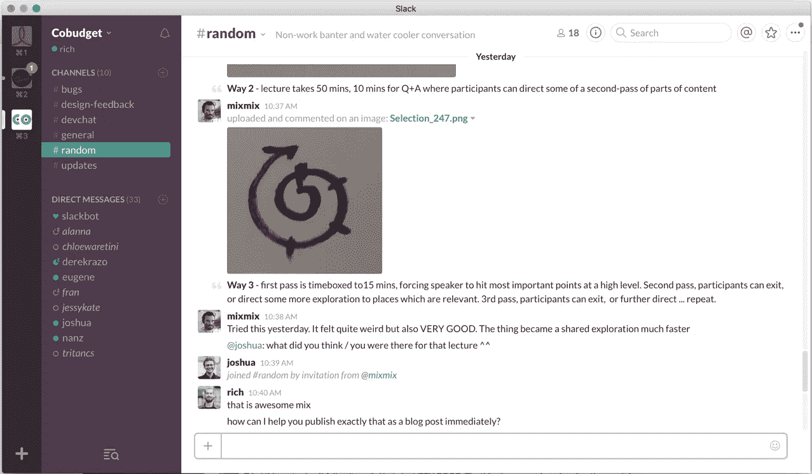

# 最低可行职位:写你的杰作的精益方法

> 原文：<https://medium.com/swlh/rich-s-general-theory-of-blogging-aa2cb502fbc>

写好博客和写好代码一样难。你需要练习。

贪多嚼不烂会让人士气低落。

你一觉醒来，想到了世界上最伟大的博客文章，一口气完成了前半部分，然后你筋疲力尽，再也没有回来写。感觉很臭。如果你这样做几次，你会开始说服自己，你只是不擅长写作。

然后你就放弃了。

# 另一种选择是写一篇最低限度可行的文章。

最近灵光一现？读一本好书？遇到了一些有趣的人？

拿着咖啡和耳机坐下来，写一个关于它的小故事。给自己最多 50 分钟的时间去**发表一些东西。**

不要太担心你的听众，只是练习用书面语言表达自己。

**你要一口气从*得到启发*到*发表*。**

如果你养成了这个习惯，我保证你的能力会随着时间的推移而增加。这是一块你需要像其他肌肉一样锻炼的肌肉。

当你开始写作时，你的写作肌肉将能够提出一个可能有几百个单词的想法。如果你每隔一两个星期提起其中一个，到年底你就能提起一千、两千或三千个单词的想法。值得分享的大创意。

我去年写的大部分东西都是这些小点子:比如《快乐的肠子》( Happy Guts )( T11 ),这是一个 2 分钟的故事，讲述了我遇到一位营养学家的经历。这不是开创性的东西，但它有利于伸展手指。

一旦我养成了一次从灵感到发表的习惯，我的容量就逐渐变大。

那个营养学家的故事一年后，我写了我感到最自豪的故事，[关于工作中的情感。从市区骑车回家的 10 分钟里，这 2300 个单词在我的想象中基本成型。因为我的写作肌肉已经热身，当我从自行车上下来时，我只是坐下来，一口气把整个故事吐出来。](/enspiral-tales/a-caring-organisation-5319f81c420f#.e40s72lkj)

实际上我并没有立即出版那本书，但是我在第一次会议上就把它完成了，所以我别无选择，只能完成它。通过一些编辑输入，甚至是我的朋友们提供的几幅插图，我开始润色一篇文章，它实际上感觉像是我对一个复杂主题的想法的准确表达。

感觉棒极了。

# 和一个伙伴一起做。

昨天，我的朋友 Mix 在 Slack 上发表了一篇精彩的评论。他草草画了几张简单的图表来说明他一直在尝试的一种新的授课方式。

我一看到这条评论，就猛扑过去:*“Mix 我能帮你马上把它作为博客文章发表吗？”*

那天晚些时候，我们聚在一起，不到一个小时，我们就发表了这个帖子[关于共同设计教育](/enspiral-tales/teaching-in-the-spiral-less-lecturing-more-co-creation-b56dba71a8c4#.alc3qvcw1)。它也不是开创性的，但我认为这是一个很酷的小故事。在它公开的 24 小时内，超过 100 人阅读了它。感觉真好。

# 告诉我你微小的真相。

你真的有杰作，真的。你独特的视角、经历和想法让你对这个世界上最复杂的挑战有了别人看不到的独特见解。但即使是你也不会在第一次坐着的时候写出杰作。

所以也许可以试着先掰下一小块，或者找个陪练？热身那些写作肌肉。给我讲个小故事。

我等不及要看了。

## 这篇文章发表在[《创业](https://medium.com/swlh)》上，这是 Medium 最大的创业刊物，有 284，454+人关注。

## 在这里订阅接收[我们的头条新闻](http://growthsupply.com/the-startup-newsletter/)。

