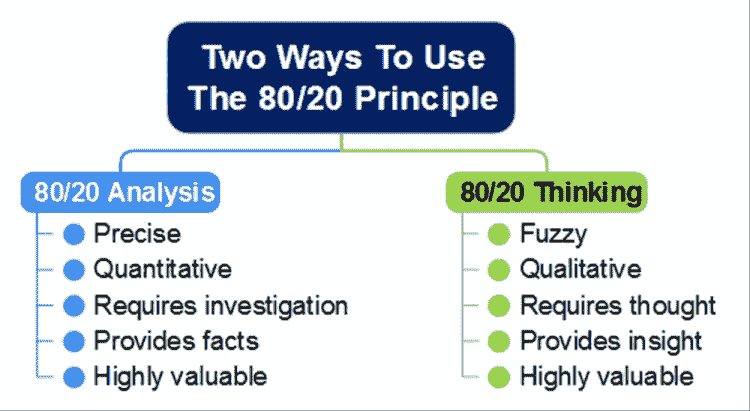
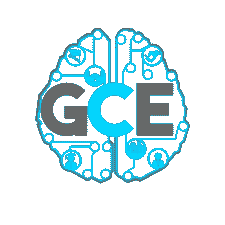

# 理查德·科赫的 80/20 原则的应用:一个实例

> 原文：<https://medium.com/swlh/richard-kochs-80-20-principle-applied-a-practical-example-8975b1200362>

*这篇文章旨在让你对理查德·科赫的****【80/20 原则事半功倍的成功秘诀】*** *有所了解，同时提供一个如何应用它的例子。将这一原则*应用到一个令人惊叹的团队*中，创造了* [*GCE-NIST*](https://github.com/GCE-NEIIST/) 🎓*，一个拥有开源项目的学生团体，旨在帮助学生*👨🏻‍🎓 *@* [*Técnico 葡京*](https://tecnico.ulisboa.pt/en) *。*

简而言之:

> 80/20 原则指出，你在工作中取得的 80%的成就来自于花费的 20%的时间。

但是首先，为什么意识到这个原则很重要？据提交人称:

> 80/20 原则帮助塑造了现代世界。然而，它仍然是我们这个时代最大的秘密之一——甚至那些知道并使用 80/20 原则的专家们也只利用了它的一小部分力量。
> 
> 理查德·科赫

在我看来，80/20 原则之所以有价值，是因为它可以帮助我们从不同的角度看待事物，并让你深入了解你周围的世界到底发生了什么。因此，一个人可以对下一步做什么做出明智的决定。

那么，你怎么能只投入 20%的时间，却获得 80%的回报呢？

这个原则可能看起来违反直觉，因为我们倾向于期望所有的原因都有大致相同的意义。例如，考虑一下，我们**经常假设所有的顾客都同样有价值**或者**每份友谊都同样重要**，或者我们度过的每一天、每一周或每一年都具有同样的意义。所有的机会都有大致相等的价值，所以我们要平等地对待它们。

**当然，现实世界不是这样的**。客户端没有相同的值。显然，你生活中的某些事件比其他事件更重要。友谊没有同样的意义。在你面对的情况下，你可以优先考虑并找到意义。这取决于你做些什么。

# **那么，GCE-NEIIST 是怎么诞生的呢？**

它是由失败引发的。我们在底部。

谢天谢地，我们拒绝接受失败。事实上，拒绝是进步的途径:进化的、科学的、社会的和个人的。因为我们想取得进展，解决混乱的局面，我们必须想出一个计划。在这句话中发现了改变的巨大动力:

> 通情达理的人使自己适应世界。不讲道理的人坚持要让世界适应自己。因此，所有的进步都取决于不讲道理的人。
> 
> 乔治·萧伯纳

这个也让我大开眼界:

> 你是在努力让别人变得富有，还是相反？
> 
> 理查德·科赫

是时候适应了。是停止抱怨的时候了。是时候开始做点什么了。

# 使用 80/20 简单框架

您可以应用一个两阶段过程，以便将该原则应用于您想要解决的任何问题。首先是**分析**阶段，在这个阶段，你收集关于问题的信息。其次，**思考**，你在那里推理它。按照这个思路，是时候**应用解决方案**了。

**分析:**

在这里，你必须将你所拥有的数据进行排序。[你有各种各样的数据可视化技术](https://en.wikipedia.org/wiki/Data_visualization)，可以帮助你分析你所掌握的关于特定情况的数据。思维导图也可以帮助你建立你试图解决的问题的模型。这将确保你不会忘记要点。有了这种信息，就有了做出明智决策的智能。

总结并介绍下一阶段:

Source: [https://www.biggerplate.com/mindmaps/Z3xrJfHU/two-ways-to-use-the-80-20-principle](https://www.biggerplate.com/mindmaps/Z3xrJfHU/two-ways-to-use-the-80-20-principle)

# 思考

作者将这一阶段命名为“思考 80/20”，以解释如何将这一原则应用到我们的生活中。

简单地说，在分析了你所有的信息后，你应该想出一个计划来实现这些改变。然后，行动才是关键。请记住，你的心态和视角将决定成败。

> 我的努力方向是简单。一般来说，人们拥有的如此之少，甚至购买最基本的必需品都要花费如此之多，因为我们制造的几乎所有东西都比它需要的要复杂得多。
> 
> 理查德·科赫

现在，就去做吧。应用你的计划。

# 实际例子

GCE 做得不是很好。当我加入 GCE 时，它还没有组织起来，几乎没有成员，遗留问题也很难处理。有一年半的时间，我们完全不在地图上。我们无法给大多数学生带来真正的价值。我们专注于一个非常特殊的领域，我们甚至无法直接触及它。我们在黑暗中盲目行动。缺乏数据，加上缺乏效率的视野，以及没有深入关心学生的关注，导致了非常弱的输出。

# 解决方案

动机是重建一个有吸引力的团队，吸引并服务于学生。

为了解决这个问题，我们采取了一个分几步走的方法，基于对现状的拒绝。

***注*** *:如果你对开源和协作感兴趣*🙌 👏 🤝*，查看我们组织的 GitHub 页面，旨在帮助同学们*🎓 *@ Técnico 里斯本，*[*GCE-nei ist*](https://github.com/GCE-NEIIST/)*。我们欢迎合作者*😀

www.gce-neiist.org

**第 0 步:愿景。**我们非常明确地表示，在 GCE 中，我们希望人们在学习和娱乐的同时，通过真实世界的项目和责任获得真实世界的经验。最棒的是:我们的目标是帮助大学社区。

**第一步:招聘。因为我们只有两个人，没有预算，不为人知，我们必须吸引一些和我们有共同愿景的潜在成员。**

第二步:打招呼。为了在地图上出现，我们策划了一场大型活动，从而提高了一些品牌知名度。

第三步:再次打招呼。与此同时，我们通过社交媒体建立了更多的品牌认知度。

**第四步:** **服务。我们即将发布我们的第一个 MVP，这是一个针对计算机科学学生的服务。有了这项服务，我们可以产生影响。**

在我写作的时候，下一步正在发生:

第五步:拓展我们的思维。我们正在寻找具有强烈心态的优秀人才，帮助我们成长和扩展。

**第六步:扩大我们的服务基础**。我们的目标是在壮大我们的技术团队的同时，推出更多服务，为学生和教授提供更多功能。

第七步:更多的活动和品牌知名度。

一个分享友谊、尊重、分享经验和信任等价值观的团队过去是，现在也是事情发生的坚实基础。

请记住，抵制变革和人们贬低你的想法是不可避免的。我相信，如果你想追求什么，不管有什么障碍，你都不应该放弃。挑战是巨大的，但是我们让它变得非常简单。简单是美丽的，复杂是丑陋的。

# 第五步之前发生了什么？

我们只是按照计划努力工作，在仅仅一个学期的时间里，这个小组从 2 名成员发展到 11 名成员。现在，我们的目标是欢迎更多的成员！我们与公司建立了伙伴关系，与教授和大学教职员工进行了交谈。在一个学期中，由于我们开展的活动，我们获得了一个舒适的预算。我们致力于开发我们的开源项目，让新的贡献者更容易。此后不久，我们开始使用高效的工作流程，这使我们能够开始为学生服务，这是我们的最初目标。

有了你和你的团队所相信的愿景，你可以去任何地方。谢谢大家。你真棒。

# [项目开始了！](http://www.gce-neiist.org)

# 后续步骤:

**如果您喜欢这篇文章，请点击👏左边的按钮。如果你不喜欢，那就太遗憾了。开玩笑，我会❤️听听你的意见！**

***不停摇摆*** 💪

☄️

 [## DevOps101 —改进您的工作流程！流浪的第一步

### 让客户和开发者更开心。

hackernoon.com](https://hackernoon.com/devops101-vagrant-6737c8c29904)  [## devo PS 101——基础设施作为带有流浪者的代码

### 并部署一个简单的 IT 基础设施(两台 LAMP web 服务器和一台客户机)。

hackernoon.com](https://hackernoon.com/devops101-itinfrastructure-54337d6a148b) 

⛓️学生区块链

 [## 面向学生的区块链 101-基础知识(第 1 部分)

### 你准备好深入挖掘这项改变生活的技术了吗？

hackernoon.com](https://hackernoon.com/blockchain-for-students-101-the-basics-part-1-f39b8201a7d5) 

创业精神[🔥](https://emojipedia.org/fire/)

 [## 我在 2017 年欧洲创新学院学到的前 8 课

### 想象你看到了在每个层面提升自己的机会。你会接受吗？

blog.startuppulse.net](https://blog.startuppulse.net/top-8-lessons-ive-learned-in-european-innovation-academy-2017-50eeb82d74b4) 

## 这篇文章发表在 [The Startup](https://medium.com/swlh) 上，这是 Medium 最大的创业刊物，拥有+ 376，592 名读者。

## 在这里订阅接收[我们的头条新闻](http://growthsupply.com/the-startup-newsletter/)。

