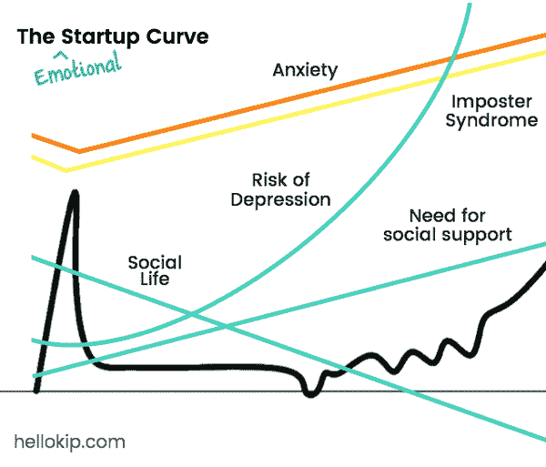

# 我们孤独地共同与精神健康作斗争

> 原文：<https://medium.com/swlh/riding-the-emotional-startup-curve-ded888ece42d>

## 创始人经历情感启动曲线

大多数创始人都知道保罗·格拉厄姆的创业曲线及其可怕的悲伤低谷。然而，很少有创始人预料到接下来的情感过山车。他们没有做好准备，因为我们在创业社区不会公开谈论心理健康问题，尽管几乎 50%的创始人都有心理健康问题。*

Modified from Paul Graham’s Startup Curve: [http://avc.com/2012/03/the-startup-curve/](http://avc.com/2012/03/the-startup-curve/)

然而，这种情况正在改变，因为创始人通过故事揭示了他们个人遭遇的焦虑、抑郁和自杀。包括布拉德·菲尔德、T2、本·哈、T4、兰德·菲什金和蒂姆·费里斯在内的企业家们的博客将心理健康带入了公众话题。他们的承认鼓励我们与其他创始人谈论我们的精神健康问题。很多时候，我们的朋友和同事通过分享他们自己的个人故事来回应。脆弱有一种奇怪的多米诺骨牌效应:我们分享的秘密越多，就越容易分享——我们也越想知道当初为什么要保密。

我们倾向于在小型私人团体中谈论心理健康。两位创始人喝着咖啡发泄，意识到他们都在管理严重的焦虑。一个创始人指导一个朋友的朋友度过他们自己经历的危机。同龄人聚集在像 [Innerspace](https://www.helloinnerspace.org/) 这样的教练组织举办的秘密支持小组中，谈论挫折、共同创始人分手和公司倒闭。然而，我们大多数人都在独自奋斗。

我们正试图在[奇普](http://hellokip.com)改变这一点。我们的使命是让心理健康治疗更有效、更容易获得——这从在我们自己的社区创造谈论心理健康问题的机会开始。我们分享得越多，我们就越会意识到我们的挣扎是多么正常——也是可以治疗的。我们希望生活在一个像对待流感一样随意谈论心理健康问题，并像对待流感一样激烈对待心理健康问题的世界里。我们应该这样做；自杀和流感每年杀死的美国人数量大致相同。

本着这种精神，我们推出了一个采访系列，介绍创始人和他们经历创业生活的起起落落。这些采访揭示了处于消极状态的感觉，这样，如果你处于这种状态，你就会知道你并不孤单，认识到这是完全正常的，并了解你可以获得帮助的许多方式。

阅读第一次采访:

> [**惊恐发作:杰伦第一部**](/@hellokip/the-panic-attack-4a1faa18000e#.567yunl22)

在采访创始人时，我们发现了他们如何经历焦虑和抑郁的模式:

## #1.创始人认为焦虑和抑郁会降低他们的工作效率

精神健康问题很难识别。变化逐渐显现；我们很少一觉醒来开心，第二天却临床抑郁。我们被教导用语言来描述儿童时期的骨折，而不是焦虑或抑郁。对大多数人来说，我们只有在认识到失眠、食欲不振或极度疲劳等身体症状后，才发现自己在处理心理健康问题。对于创始人来说，他们注意到的第一件事是生产率的下降——他们赖以生存的货币。他们不再能够像过去那样完成工作；他们不能很快地编写代码，需要更长的时间来做决定。这让公司停滞不前，助长了焦虑和抑郁的循环，只会让事情变得更糟。

## #2.创始人为一切事情做预算和计划*，除了他们的情感健康*

我记得我在开公司之前采取的步骤。我削减了预算，办理了无息信用卡，安排了理发(投资者推销！)，并加入了一家健身房。我为自己的财务和身体健康做计划，关心自己的外表，但我忘了练习自我保健。我没有重新开始我的冥想习惯，没有为朋友腾出时间，也没有休假。缺乏自我保健是焦虑和抑郁的温床。当我们没有心理空间来处理压力并找到健康的应对方式时，即使是最小的压力源也会让我们不知所措。

## #3.创始人的焦虑和抑郁是可以预测的，因此也是可以控制的

想象一根橡皮筋，稳定而缓慢地被拉开。压力随着每一个动作而增加，永远不会释放，直到压力大到带子断裂。这就是多少创始人陷入临床焦虑和抑郁的原因。跑道缩短，压力增加。它会逐渐让你疲惫不堪，并且很容易被忽视，直到为时已晚。有时，一个意想不到的事件会引发心理健康危机——共同创始人的分手或投资者退出交易——但更多时候，这是一个可预见的必然。

模式很重要，因为它们是我们可以警惕自己和他人的警告信号。通过分享更多的故事，会出现更多的模式。

阅读第一次采访:

> 恐慌症发作:周杰伦，第一部

## 资源

**寻找治疗方法？** [在](http://hellokip.com) [Kip](http://hellokip.com) 预约循证治疗师。promo code FOUNDERS 免费为您的第一次会议提供 50%的优惠。

**现在需要帮助吗？你并不孤单。拨打国家自杀预防生命线 1-800-273-TALK。它每周 7 天、每天 24 小时提供服务，并配备了危机应对专业人员。**

*这篇文章是由*[*Kip*](http://hellokip.com)*撰写的关于焦虑和抑郁的采访系列的一部分。我们的目标是通过分享我们的共同经历——从创始人开始——与耻辱作斗争，并使心理健康斗争正常化。如果你想被采访，请联系***。**