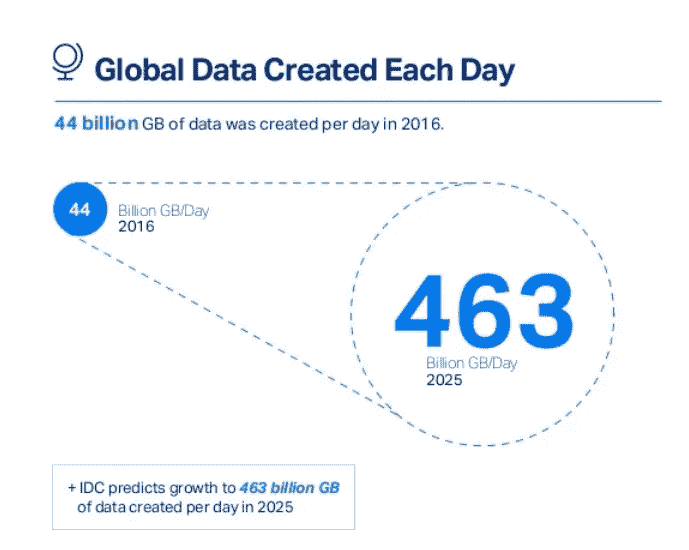

# 驾驭技术的浪潮

> 原文：<https://medium.com/swlh/riding-the-wave-of-technology-15828953357c>

Photo by [Aleks Dahlberg](https://unsplash.com/photos/WMWF9WcDBOw?utm_source=unsplash&utm_medium=referral&utm_content=creditCopyText) on [Unsplash](https://unsplash.com/search/photos/wave?utm_source=unsplash&utm_medium=referral&utm_content=creditCopyText)

在过去的几个月里，我一直痴迷于阅读和收听关于加密货币和区块链的播客。有太多的东西需要学习，太多的宣传，很难通过噪音获得信号。

似乎有一个陡峭的学习曲线。忽略这一点——这是一个陡峭的学习曲线，如此多信息的涌入增加了 FOMO 和气馁的因素。你发现风险回报比并不真正对你有利。

你想要视频？这里有一万个视频。你想要文章？10 万篇。你想听意见吗？那是无限的。

更广泛地说，人们每天看到的信息正以惊人的速度发生。我的意思是看看下面这张疯狂的信息图。(我只取了整个信息图的一小部分，因为它给了我太多的信息，让我不知所措。哈哈)

From [MicroFocus](https://blog.microfocus.com/how-much-data-is-created-on-the-internet-each-day/)

那个。是。疯狂。想想我们现在的处境，我们的孩子每次摘下谷歌眼镜都会焦虑地哭出来。

同样有趣和强大的是学习的欲望。当然，科技用定向广告、100 篇文章阅读清单和大量家庭假日照片轰炸我们。然而，如果我们教授、训练和重复某些好的行为，我们也许能够得出部分未修补的结果。

# 退后一步

我认为筛选这些信息的一个好方法是*后退*。这个方法可以是写下你的经历，每隔几个小时休息一下，或者意识到你在过去几天里学到了多少。退后一步可以让一些重新聚焦的人过来和你坐在一起。这正是我写这篇文章的目的。

为自己学到的大量随机知识而感到自豪。创建一个概念图，将所有这些信息联系在一起，使其在你的大脑中更具粘性。或者打电话给你最好的朋友，喋喋不休地谈论加密货币有一天将如何统治世界。

你需要让你的大脑处理你通过眼睛和耳朵不断添加的零碎信息。拿一杯拿铁，和你的咖啡师聊几分钟或更长时间，让所有的东西都融入进去。

所以，当你阅读这篇文章和后面的文章时，花些时间回到现实中来反思。反思当天你学到了什么，下周你想学什么，几个月后你想在哪里看到自己。事情很多，不急着什么都知道。其实了解一切都是需要时间的，很可能是不可能的，所以 relaxxx。

感谢阅读。

## 这个故事发表在[的创业](https://medium.com/swlh)上，这是 Medium 最大的创业刊物，有 313，216+人关注。

## 订阅接收[我们的头条新闻](http://growthsupply.com/the-startup-newsletter/)。

