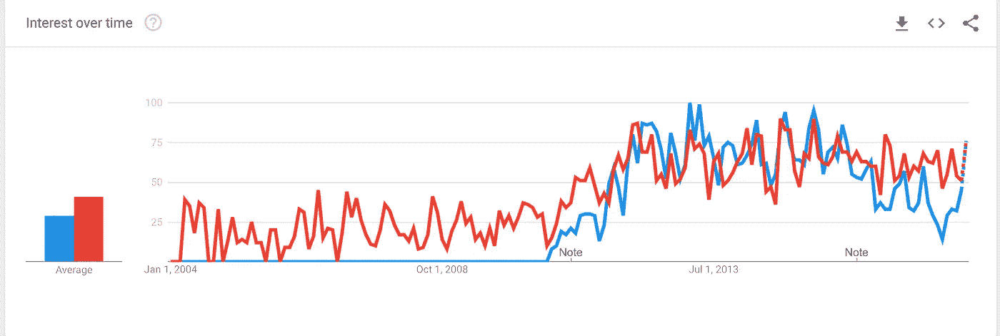
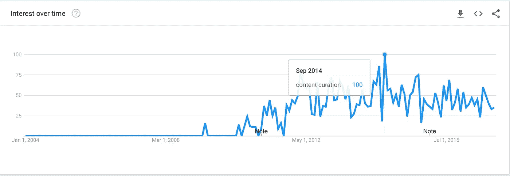
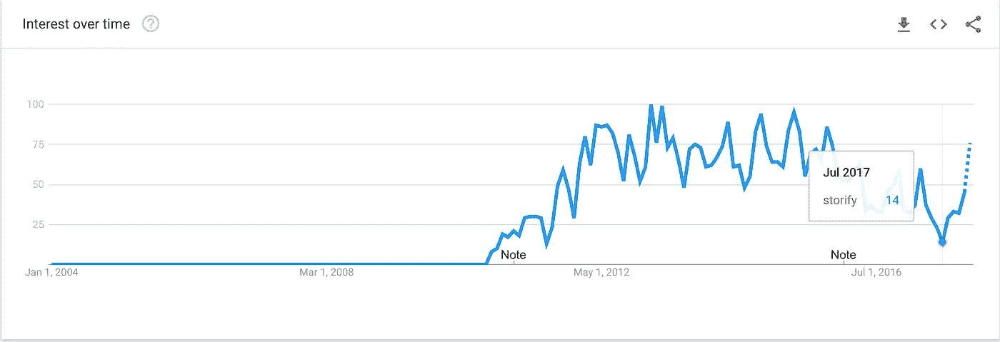

# RIP 内容监管

> 原文：<https://medium.com/swlh/rip-content-curation-8b2d8bcc5f01>

Photo by [Una Laurencic](https://www.pexels.com/u/unalaurencic/)

2009 年， [Rohit Bhargava](https://medium.com/u/8092d1a8236c?source=post_page-----8b2d8bcc5f01--------------------------------) 写了一份“内容管理员宣言”他在自己的博客标题中写道，这个角色可能是“**未来的下一个大型社交媒体职位**”

Bhargava 的推理是，社交媒体内容在互联网上呈爆炸式增长，需要人类的接触来筛选所有噪音以找到信号。

他预测，精挑细选一个故事而不是另一个故事的熟练人类*将给社交网络带来更多的效用和秩序*

*他写道:“社交书签和社交新闻已经存在一段时间了(例如像 [Digg](http://www.digg.com/) 或 delicious 这样的网站)，像 [Alltop](http://www.alltop.com/) 这样的新聚合模式正在涌现，以帮助我们浏览所有这些内容。”。“为了满足人们对任何可以想象的主题的大量内容的渴望，将需要一种新的个人在线工作类别。他的工作不是创造更多的内容，而是理解其他人创造的所有内容。”*

*六年后，我不认识一个有“内容管理员”头衔的人。我知道这样的事情一定存在，因为当我在 LinkedIn 上搜索“内容管理员”时，我会得到 6700 个结果。但是相比之下，我得到了 42，200 个关于“内容创建者”的结果*

*至少，你可以说这不是未来的下一个大型社交媒体工作。*

*本周，内容监管工具 [Storify 毫不客气地宣布关闭](https://storify.com/faq-eol)。我认为这一声明标志着互联网“内容监管”时代的结束。*

*根据 Google Trends,“内容监管”一词起源于 2009 年，当时 Twitter 正经历其曲棍球棒式增长。Twitter 最初是一个不断增长的信息消防队，没有太多的组织，它确实感觉我们需要新的系统来处理所有这些传入的信息。*

*我认为，这一过程中人情味是必要的，这一想法似乎对传统的看门人特别有吸引力，他们发现自己的角色在社交媒体中突然被忽略或变得无关紧要。*

*对我来说，在我的新闻工作被淘汰后，它给了我乐观，我在社交媒体中找到了新的角色。我的判断仍然有价值！如果我只是简单地创造内容而没有报酬，至少我可以从其他人那里收集内容。“馆长”一词源于那些为博物馆挑选艺术展品的人，这显示了教育和高雅的品味。*

*随着时间的推移，“策展”理念的兴起和 Storify 的成功交织在一起。*

**

*Amount of searches for “curation” (in red) and Storify (in blue)*

**

*Google search for “content curation,” peaking in September 2014*

*但到了 2014 年 9 月，“内容监管”这个词达到了顶峰。从那以后，它就稳定下来或者下降了。*

*今年夏天，谷歌对 Storify 的搜索量(过去几年一直在缓慢下降)降至 2011 年 7 月以来的最低水平。难怪他们要关门了。*

**

*这可能是因为我们只是不再经常使用“内容监管”这个术语。它听起来确实像今天说的“社交网络”或 Digg 和 delicious 一样过时。仍然有大量来自社交媒体的策展，包括 Buzzfeed 编辑器或 Twitter moments。手工制作永远不会完全消失。*

*但我认为是时候承认算法赢了。或者，如果他们还没有赢，他们很快就会赢，尽管他们可能会充满问题和忧虑。自从 Bhargava 在 2009 年做出预测以来，Instagram 和 Twitter 已经制定了算法时间表。尽管有周期性的抗议，但已经没有回头路了。人类管理互联网内容的想法现在看起来就像人类管理谷歌搜索结果一样古怪。*

*但是如果我们把互联网看作是被收集和消费的“内容”,那么它是由人还是由算法来完成几乎是无关紧要的。这只是在广告之间填充的一些东西。*

*对我来说，算法可以获取内容。我不想要。*

*人情味仍然很重要，但不是廉价的，一次性的互联网内容。*

*当我们谈论策展时，让我们回到真正有意义的事情上来。让我们策划艺术，而不仅仅是内容。*

## *喜欢你读的吗？在这里注册我的每周简讯。*

**

## *这篇文章发表在[《创业](https://medium.com/swlh)》上，这是 Medium 最大的创业刊物，有 292，582+人关注。*

## *订阅接收[我们的头条新闻](http://growthsupply.com/the-startup-newsletter/)。*

**