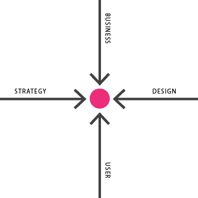

# 体验是王道

> 原文：<https://medium.com/swlh/rise-of-the-experience-consultant-ee8bc2f5a44e>

The sum total of the journey should be the focus, even beyond the individual user.

单靠用户体验设计太具体，解决不了更大层面的问题。我并不是说它不能解决问题，而是作为一个在这个领域工作的从业者，我相信我们对它的理解过于集中了。太具体了。例如，一个更好的表单域会帮助用户节省时间，但不一定能挽救生命。现在，如果我们在适当的上下文中查看表单字段，为什么需要改进表单，或者表单的改进如何影响所提供的服务，我们将开始影响组织。尤其是如果这种影响超越了“UX”设计，进入了体验的其他部分。如果你必须填写一份表格来挽救你的生命，问题不是“我们如何使表格变得更好？”问题是，“为什么我们要让人们一边流血致死一边填表呢？!"你的服务，你的运营，以及从事这项服务的人的核心被打破了

用户体验设计，设计本身，不足以影响世界，我的意思是真正影响世界，创造有意义的，持久的变化。它要求更多。更多的天赋、更多的思考和新的洞察力来创造服务、产品、娱乐等，以设计师看不到或不理解的方式看待问题的更大部分。

## 策略与设计的融合

Important concepts are converging to a point where the best solutions can be found.

现在设计界有一种趋势。有些人认为这是独立设计机构的死亡，但事实远不止如此。设计世界正在演变，随之而来的是一个生存和变革的时期。设计现在是一个非常棘手的问题，事实上，它是许多商业计划中公认的成功要素。将设计纳入商业和企业家的讨论话题是一种新的、有时令人不舒服的发展。这意味着设计师和设计公司被邀请参加我们没有准备好的会议和决策机会。为什么？因为我们传统上没有参与其中。我们通常不会花 10 年以上的时间来制定长期的战略目标和计划来发展一个组织。这是公司的工作。从本质上来说，“ [**”战略、“设计思维”和客户体验(一直)是公司的优先事项，不一定是设计公司。**](http://www.fastcodesign.com/3048192/why-are-design-firms-stagnating) 到现在为止就是这样。

让我们看几个现代情况作为例子:

如果你是一家像 Capital One 这样的公司，专注于建立长期增长和战略计划，但似乎无法执行或了解核心用户群的需求，你会怎么做？**你收购了像 adaptive path** 这样的公司并与之合并(我们可以说 AP 既做了战略也做了设计)。

如果你是一家咨询公司，客户抱怨你的战略失误，执行不力，并把他们的失败归咎于你，会发生什么？如果你是埃森哲，你会收购峡湾和混沌月亮工作室。**如果你是德勤，你就会获得热度。**为什么？用德勤的话说；

> 德勤数字创建了一个新的市场类别，叫做创意数字咨询。添加 Heat 的非凡和屡获殊荣的创作能力是对我们市场领先和历史悠久的数字业务的完美补充。
> 
> 其结果是一个变革的视角，指导首席营销官全面地重新想象他们的客户体验，并满足企业对其品牌和消费者之间的整体联系的需求。

当考虑到你的客户的长期旅程时，保持对你推荐的策略的执行的控制是有意义的。**更好的结果意味着更好的业务，这意味着你有更多的机会。**

如果你是一家陷入执行计划不周的想法或半生不熟的计划的设计机构，不需要天才就能明白你的想法需要从食物链的更高层开始。**你销售或与坐在桌边的人合作**。无论是咨询公司还是全职公司，你都希望在更高的层面上影响变革，在问题出现在你面前之前，把它们定义为肮脏、丑陋、没有想法的孩子(我同意这个比喻很奇怪)。

> “设计是最重要的，也是最有趣的数字作品的最前沿，简单地在你需要的时候雇佣它，如果你需要它，已经不再是一个好的长期游戏了……对它进行投资并让它成为你的一部分，对你的客户来说是可持续的、值得信赖的和可信的。”
> 
> 峡湾首席执行官奥洛夫·施贝格森

## IDEO 作为案例研究

我喜欢视频。我认为 IDEO 是一家在“经验”层面上参与世界的公司，或者是一家在定位自己方面做得非常出色的公司，因为我正在喝 Kool-aid！

最近，[他们宣布了加入一个“创意集体”](/ideo-stories/the-next-big-thing-in-design-513522543a6f#.nyjojnsop)的计划，因为他们的“设计过程过于封闭”我不会花太多时间去浏览他们的案例研究，但对于我所拥有的案例，我不会后退一步，对自己说，“哦，这绝对是一种孤立的方法。那个装有太阳能平板电脑和全套救生包的定制背包是极端封闭的。”然而，我是一名设计师，我像设计师一样思考。正是因为这个原因，他们想与其他公司合作，与他们想法不同的公司合作，解决问题的不同部分。 **在一个更广阔的平台上整合他们的专业知识，创造更具威力的解决方案。更好的适应和成功。**

我们在未来几年要解决的问题变得越来越复杂，其中包括我们触手可及的帮助解决这些问题的技术。作为一名体验设计师，我可以指着一个解决方案说“区块链、区块链、全渠道、网络应用、虚拟现实虚拟现实”，但我知道如何实现这些东西并让它真正发挥作用吗？没什么。我需要团队成员，开发人员，战略家，组织效率，交付领导，商业战略家，运营，实现，科学人(是的，科学人)，等等等等。为什么？因为**它不是关于界面，而是完整的体验。屏幕之间的瞬间，你的品牌和经历要么很快被遗忘，要么被口头称赞。**

正如 IDEO 的 CEO 所说，

> 变化的速度令人眼花缭乱，今天的先进技术——人工智能、基因组学、机器人、数据科学、物联网——已经远远超过了我们工业时代的组织和基础设施，最终进入了制度的死胡同。当然，这些技术不会停下来，它们只是继续前进，寻找它们领先的其他领域。如果我们的机构要生存，他们将不得不创造新的道路。
> 
> 这是一个设计问题——需要与广泛的合作者建立新的合作规则。我们很高兴在一些志同道合的设计公司中找到了这些合作者。
> 
> IDEO 首席执行官蒂姆·布朗

## 经验是彩虹尽头的一桶金

作为这种趋势和融合发生的另一个例子，我们有刚刚宣布的美味鱼——no——nitro razor(我会买这种剃刀)或者 SAPROFISHIENT。这不是那些组合——但你知道它是什么——这是一个很好的例子，说明公司有两个独特的重点(一个更具战略性，另一个更具创造性),结合起来达到一个难以捉摸的高原，所有的大人物都在那里玩和做决定。[查看网站](http://www.sapientrazorfish.com)及其介绍声明:

> 这是一个合作伙伴，旨在帮助公司重新思考如何通过彻底以客户为中心的方法和以改变游戏规则的技术为核心来组织、联系和发展。

**他们知道自己在追求什么。这是一种体验。** **客户的完整旅程以及他们在每个接触点影响它的能力。技术和执行成为构建体验的驱动力中的事后想法，事实上，良好的执行和可管理的技术只是隐含在他们的定位声明中**(它们在现实生活中是否实现这一点是一个不同的故事)。拥有和创造经验是与组织合作的长期方法。它允许对问题解决和解决方案创建进行更多的控制，并提供对实际可行机会的更深入的洞察。正如下面的引述所述，这是传统机构未曾涉足的领域，但现在，随着这些收购和合作，以前不存在的沟通渠道正在打开。

> “重塑企业是‘管理顾问’历来擅长的事情……与此同时，广告公司旗下的数字机构在很大程度上专注于‘营销传播’,不太负责在电子商务等领域建立体验，也不太参与创收。”
> 
> Jay B. Wilson Gartner 研究总监

**体验可以说是广告、营销和品牌意识的新形式，将在未来形成**。由于我们的互联世界，这些新的合作伙伴关系必须实时管理关系、体验和对话。明白这一点的公司会想方设法在独特的接触点取悦他们的客户，用他们的品牌声音与他们交谈，甚至创造内部笑话并与他们的用户建立独特的关系。建立和维护客户旅程，寻找方法来加强这些旅程，并在途中与客户交谈，这对于忠诚度和口碑分享非常重要。**需要一个拥有不同才能和知识的团队来发现机会，并帮助公司抓住机会。**人们需要跳出自己的思维界限来发现机会，并引入合适的人才来解决这些问题。

## **体验顾问**

这些新人将成为经验顾问。我并不是说这一定是他们的标题(可以是，我把它变成我的了)，但这表明了他们关注的是什么。这些女性和男性最专注，最多样化，来自尽可能广泛的背景，以便以多种不同的方式做出贡献。这些人将拥有设计、变革管理、交付领导、业务和运营、财务、法律、品牌、客户参与等方面的专业知识。他们每个人都可以专注于一个筒仓，但他们知道何时需要其他专业知识来解决问题或让球朝着正确的方向滚动。**他们清楚地知道，品牌或服务是由用户组成的，而这些用户通过体验来建立他们的关系。如果做得好，正是这些经历定义了感知并创造了忠诚。这些体验将是未来设计师关注的焦点，他们将被整体地对待，因为体验不会在单一渠道中被消费。**他们可以触及整个公司的运营，但也可以专注于一条推文，如果没有这种全局观和多技能方法，就会错失机会，失去潜在的关系。

[Dribbble](https://dribbble.com/WattleandDaub)|[Twitter](https://twitter.com/Wattle_n_Daub)|[insta gram](https://www.instagram.com/wattlendaub/)