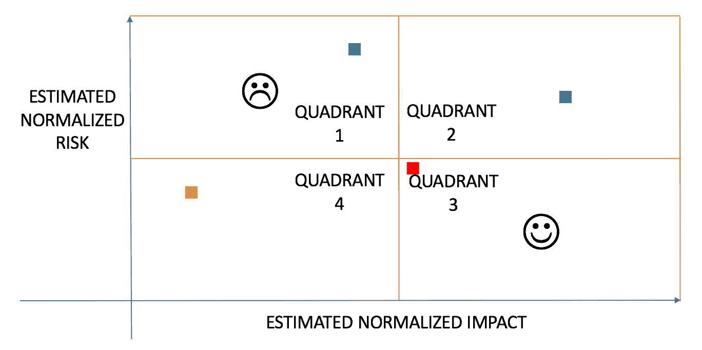

# 风险影响优先排序

> 原文：<https://medium.com/swlh/risk-impact-prioritization-689d03cb53de>

有一个最小可行的设计来测试你的假设是很重要的，这样时间就不会浪费在一个没有足够需求来成功的设计上。但是作为一个项目经理，你要和这么多既得利益者打交道——高层管理人员、董事会成员、开发团队、市场营销、销售，更不用说产品链本身的高层了。每个人都知道 MVP 应该是什么样子，应该包含哪些特性。但是，您只有有限的资源和有限的时间将早期版本的设计发布给少数精选的客户进行尝试。你如何决定哪些特性是有用的，哪些不是，你如何证明这些决定的合理性？事实证明，拥有这样一个框架会非常有帮助。

一个这样的框架是风险-影响方程。它考虑到了两个关键的方面，这两个方面在你的 MVP 之旅中最重要。请继续阅读，了解更多信息。

# 评估风险

理解，甚至量化，这个特性及时实现的可能性有多大是很重要的。需要回答的重要问题是:

技术上很有挑战性吗？

让我们以一个新的文本编辑器为例，正在考虑的功能是一个很酷的新预测系统，如 Google Suggest，它将试图猜测你打算如何完成你的句子。用这个很酷的新预测器炫耀 MVP 听起来确实很诱人。但是你的工程师告诉你，从零开始建立一个深度学习系统并让它在给定的应用程序上工作并不容易。该系统将需要正确地建立，将需要培训，以适应这种应用程序的需求，最后，它将需要测试的正确性和健全性。另一方面，如果正在考虑的特性是一种新的颜色编码方案，它有助于使编辑器的用户界面对用户来说更直观，这可能是相对风险较小的事情。

*是不是没有利用当前工程人员的专业知识？*

大多数时候，工程师都有自己的专业领域和兴趣。后端工程师不太可能乐于编写用户界面，甚至可能不擅长，而系统工程师可能不是实现机器学习模型来预测结果(或者在我们的情况下，预测句子的剩余部分)的最佳人选。)

与特性相关的风险也依赖于团队的性质。作为项目经理，很好地了解团队的优势和劣势以及专业领域是很重要的。如果你想快速发布 MVP，重点不能放在雇佣新工程师上，也不能放在培训现有工程师上。重要的是要弄清楚哪些功能超出了当前团队的能力范围，并将它们归类为潜在风险。

*只是工作量大吗？*

即使工程人员有能力实现这个特性，也需要考虑难度和时间限制。从长远来看，在早期阶段明智而谨慎地利用工程资源是非常有益的，因此从 PM 的角度来看，您需要对这些有限的资源进行明确的优先排序。在这种情况下，“风险”不仅仅意味着与该功能没有及时构建相关联的风险，还意味着该功能阻碍其他功能构建的风险。

毫不奇怪，你衡量风险的最大投入来自于工程师。但是提出正确的问题很重要，这样他们的答案才能符合这个框架。

高风险特性应该被给予较低的优先级，因为在它们上面花费时间可能不是花费时间的最佳方式。如果它们最终没有实现，可能会产生负面影响，因为对于一个旨在验证基本想法需求的设计来说，关键时间白白浪费了。

# 估计影响

这个功能对观众有多大影响？影响力较高的功能比影响力较低的功能优先，有时这甚至会导致产品中的功能减少。应该从各个角度衡量影响。

*对产品的整体影响:*

如果该功能对整个产品愿景非常重要，并且对产品的核心意义有重大贡献，那么它应该被评为高影响力功能。这是你希望你的早期用户看到和感受到的特性类型，因为他们对这个特性的反馈在更大的范围内有很高的价值。一般的、不那么重要的产品不应该得到这么高的分数，因为早期对它们的反馈可能不会影响整个产品旅程。

*相对于其他特征的影响:*

早期客户对 MVP 的体验有限。你需要优先考虑那些相对于其他产品来说比较突出的特性，这样用户就能真正“理解”产品的含义。在文本编辑器应用程序中，您希望用户尝试您带来的新功能(如预测系统),而不是通常与文本编辑器相关联的常见功能，如字体样式或布局。

*MVP 演练范围内的影响:*

同样，早期客户对 MVP 的体验有限。在为 MVP 设计时，要彻底考虑这一点。一个能够随着时间的推移记住用户偏好的深度学习系统对于只使用该产品几天的用户来说价值不大，但对于用户将拥有或使用多年的实际产品来说可能非常有价值。你可能不想让这个特性优先于其他在有限的时间内能够脱颖而出的特性。即使这个特性对于 MVP 来说是“必须的”,为了从他们那里得到可靠的反馈，花一些时间仔细考虑“如何”把它带到最前面，以便清楚地展示给早期用户，也是有价值的。

# 黑客帝国

一旦这些参数被测量，建立一个“风险-影响矩阵”。这在视觉上很吸引人，并且使得用简单的方式表达所有这些复杂的方程变得容易。将矩阵分为四个象限:(在下图中从左上角开始顺时针方向)高风险低影响、高风险高影响、低风险高影响和低风险低影响。

Risk-Impact Matrix Example

第三象限中的功能应优先于所有其他功能，这些功能带来的风险最低，但影响最大。相反，第一象限中的功能构成的风险最高，影响最小。因此，将这些放在最低优先级是有意义的，如果有剩余的空间/时间，可能会在最后重新访问它们。在剩下的两个象限中，优先级应该考虑公司、产品和需求。如果主题是走向保守，第四象限获胜。有时，如果你对产品的其他部分有足够的信心，你会想变得更有侵略性——这时你可以考虑优先考虑第二象限而不是第四象限。

因此，我们理论上的优先特征列表将是:D、A、B、C——我是一个保守的人。

最后，尽管这个讨论被应用于构建一个 MVP，事实是，即使它是一个真正的产品发布，像这样的一个框架也会以同样的方式工作。总会有有限的资源和大量的特性可供选择，并且总会有区分优先级的需要。Holly Hester-Reilly 在播客 This Is Product Management 中提供了她对这类框架的第一手见解，绝对值得一听！

*原载于 2017 年 10 月 9 日*[*【ambidextrouspm.com】*](http://ambidextrouspm.com/risk-impact-prioritization/)*。*

## 这个故事发表在 [The Startup](https://medium.com/swlh) 上，这是 Medium 最大的创业刊物，拥有 326，962+人关注。

## 在这里订阅接收[我们的头条新闻](http://growthsupply.com/the-startup-newsletter/)。

