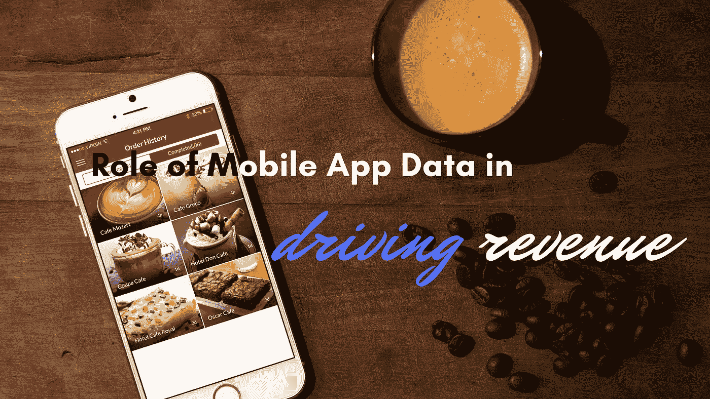

# 移动应用数据在推动收入方面的作用

> 原文：<https://medium.com/swlh/role-of-mobile-application-data-in-driving-revenue-149f3ef61a3c>

我们周围的事物变化如此之快，以至于做出正确的业务决策来为可持续发展和增长打下坚实的基础会变得非常困难。通常在我们移动之旅的最开始，我们会陷入一个恶性循环，即添加新的 SDK，测试新的工具，从一个营销和货币化服务解决方案转移到另一个，同时发现自己已经陷入了技术债务。这个领域的许多初创公司都面临着这一挑战。

在这种情况下，利用数据变得更加重要。你看，你成功的机会取决于你利用数据的能力。简单来说，就是看你有多擅长做数据驱动的决策。对您的应用程序数据行使所有权完全在您的控制之下。今天，我们将讨论如何利用移动数据来增加收入。

## **什么是第一方数据？**

你从应用中吸收的数据被称为第一方数据。你必须对它的收集、管理和使用负责。希望你的策略能确保你所有的数据都以人为中心。您在应用中生成的每个数据点都是您的第一方数据，无论是用户身份和个人资料、安装和升级、崩溃数据、事件数据、位置跟踪还是推送通知。

## **如何利用第一手数据？**

*   对于互动定位，首先要针对电子邮件、推送通知和其他定向广告对用户进行细分。
*   然后运用分析。使用您的数据来测试营销效果、群体、保留和其他分析。
*   这里的关键是个性化。利用您的数据为您的用户提供个性化的体验。
*   为了提高你的用户参与度和应用体验，利用 A/B 测试数据和其他形式的数据。

## **如何利用数据推动营收？**

*   从收集数据并对其行使所有权开始。大多数应用程序所有者没有做到这一点。他们更喜欢将它发送给推送通知服务、分析服务、归属服务、崩溃报告服务和其他营销解决方案服务。收集和维护您的第一方数据是至关重要的第一步。
*   然后，对你的用户进行细分。创收要求您识别客户，然后将客户细分为不同类别，以便您能够提供高度个性化和有针对性的信息。通过这种方式，您可以根据您的用户目前实际使用智能手机的方式来调整您的[移动战略](https://www.zibtek.com/services/mobile-app-development-services)。否则，这将在未来产生重大影响。
*   到目前为止，我们一直在讨论如何奠定移动应用数据基础，以帮助有效创收。现在，我们将讨论在目标消费群体中创造收入的部署策略。从广告开始，移动广告正在爆炸式增长，而且它的增长速度比任何其他数字广告类别都要快得多。在移动领域，显示和视频似乎是增长最快的子类别。此外，应用内移动广告的表现明显好于移动网络广告。广告商正在寻求将他们的品牌定位于特定的目标受众。你通过广告赚钱的效率主要取决于你向这些受众传递信息的能力。正确地获取和利用这些大量的丰富数据将极大地影响广告的成功。
*   其次，应用内商务包括对应用内的产品或服务收费。内容分发、电子商务和游戏是几个典型的例子。在这方面，传递有针对性的信息，如推荐和促销，对推动盈利变得至关重要。收集购物车漏斗数据、购买数据和用户行为数据对于了解您的用户、正确地对他们进行细分，然后提供高度有针对性的应用内互动至关重要。
*   当评估目标和创收策略的有效性时，请记住，你的目的并不是降低广告成本。你一直致力于提高广告效果。现在，了解特定营销策略的实际效果，从而做出正确的决定，是营销人员面临的最大挑战之一。在这里，如果你没有对你自己的数据施加控制，你就没有机会。
*   一旦你明白了什么有用，什么没用，就该调整了。完善运作良好的策略和细分，删除运作不佳的，通过尝试其他策略来测试想法。然后重复。

# **结论**

您的数据应该为您的移动内容和盈利战略提供支持。数据主要是智能手机的基础，因为变化的爆炸性本质使太多的营销人员和应用程序所有者处于被动的立场。大多数公司并没有主动保护他们的数据资产，而是仅仅通过尝试一个又一个服务来应对市场的力量，以此作为推动移动货币化和用户参与的手段。控制您的数据，反过来，一旦您掌握了利用您的应用程序数据实现移动货币化的艺术，您智能手机的未来将掌握在您手中。

*原载于* [*产品洞察博客*](https://www.cognitiveclouds.com/insights/) *来自 cognitive clouds:Top*[*AngularJS 开发公司*](https://www.cognitiveclouds.com/custom-software-development-services/angularjs-development-company)

## 这个故事发表在 [The Startup](https://medium.com/swlh) 上，这是 Medium 最大的企业家出版物，拥有 294，522+人。

## 在此订阅接收[我们的头条新闻](http://growthsupply.com/the-startup-newsletter/)。

