# 菜鸟指南:如何将 iOS UI 转换成 Android

> 原文：<https://medium.com/swlh/rookie-guide-how-to-convert-ios-ui-to-android-3cc1421d1e1f>

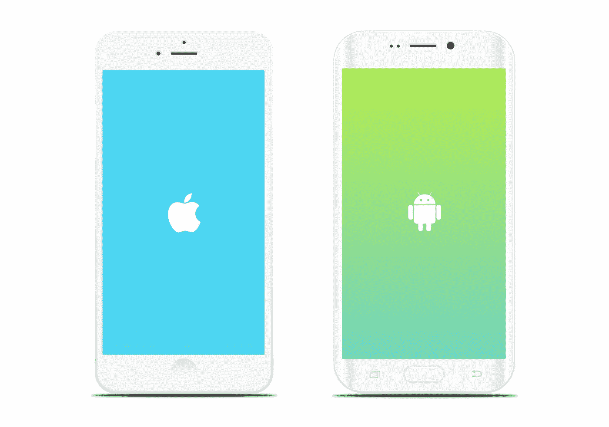

由[闵承松](https://twitter.com/songminseung)。产品设计师@WhatsApp

—

## **1。不转换**

你不应该对 Android 使用相同的 UI 规范。iOS 有一个“物理 home 键”，可以将你从任何屏幕带到家中。然而，Android 的屏幕上有“返回、主页和多任务按钮”。

这是什么意思？

Android 用户可以浏览你的应用程序，转到另一个应用程序，然后轻松返回。这有很大的不同。

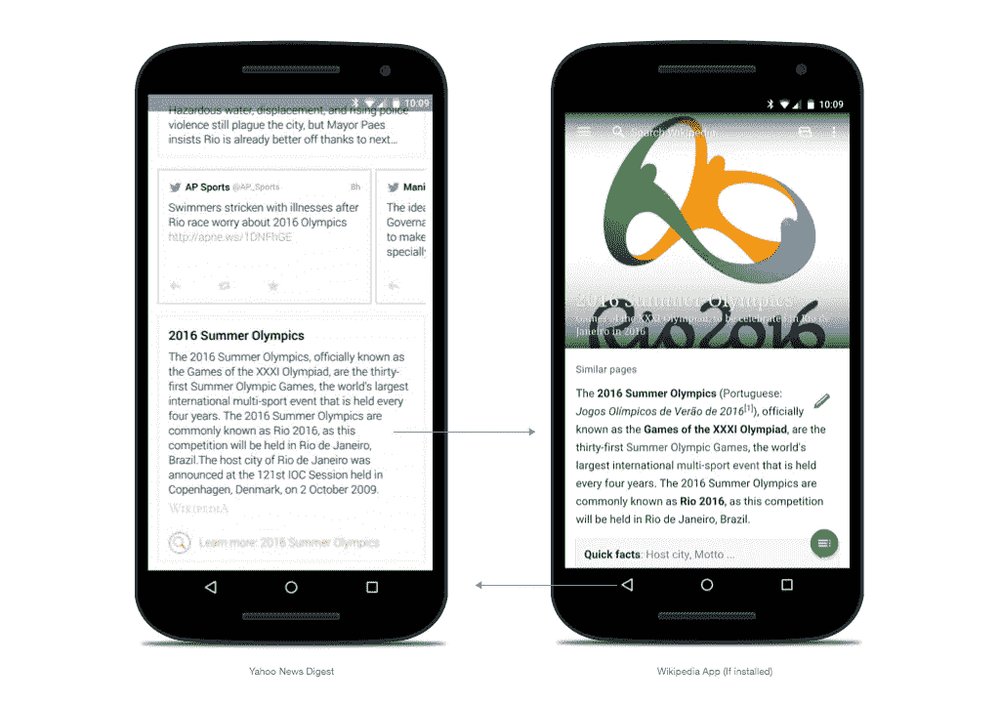

由于这个原因，iOS 通常混合了垂直和水平的 UI 结构，但是 Android 更垂直。

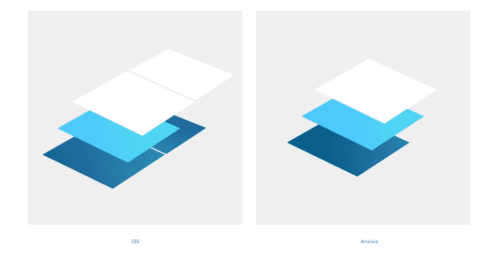

这些“返回，主页和多任务按钮”在底部，所以你不能在底部有一个标签。

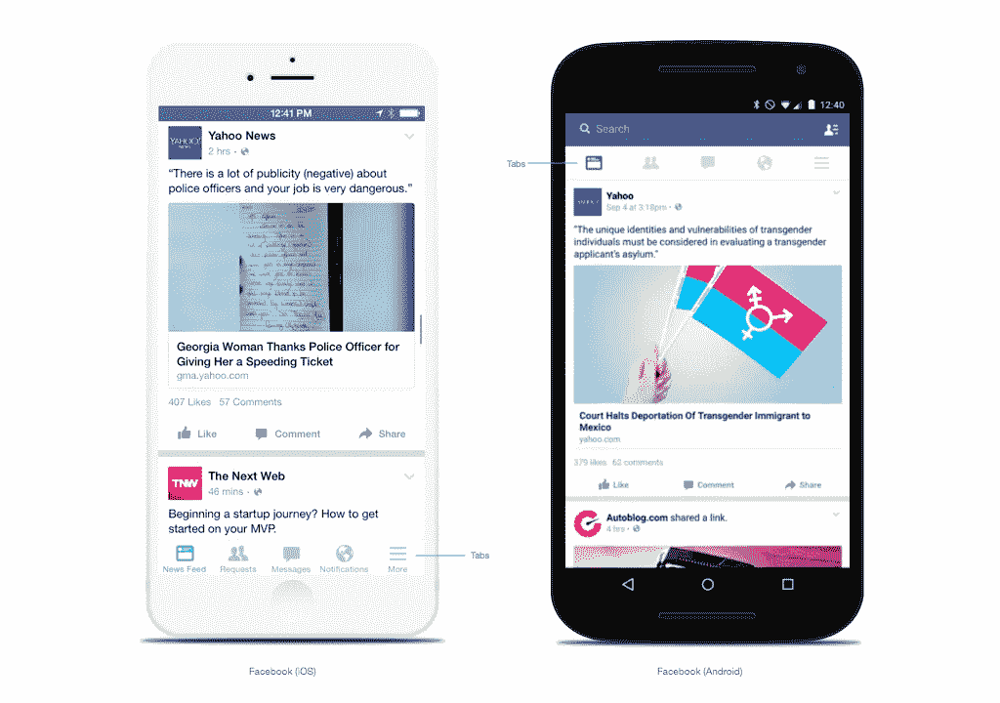

## **2。熟悉新术语**

你会经常听到“DP”、“SP”、“9 补丁”这些术语。DP 和 SP 是大小单位，9 Patch 是资产格式的名称。

DP 代表*密度独立像素*。它是绝对的单位，大小永远不变。

SP 基本上和 DP 一样，但是它是可扩展的。如果用户在设备设置中设置的字体过大，SP 定义的字体大小将被设置为过大。

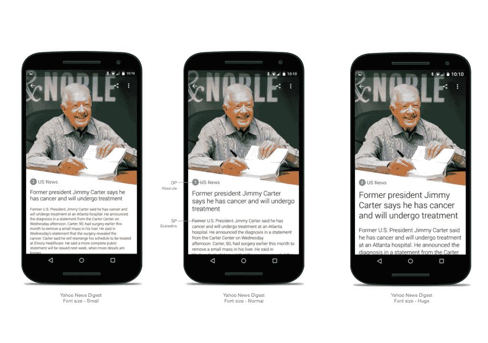

[Yahoo News Digest](https://play.google.com/store/apps/details?id=com.yahoo.mobile.client.android.atom)

9 补丁是一种独特的可扩展资产格式，可显著减小文件大小。它通常用于带阴影的按钮中。访问[该网站](http://developer.android.com/tools/help/draw9patch.html)查看详情

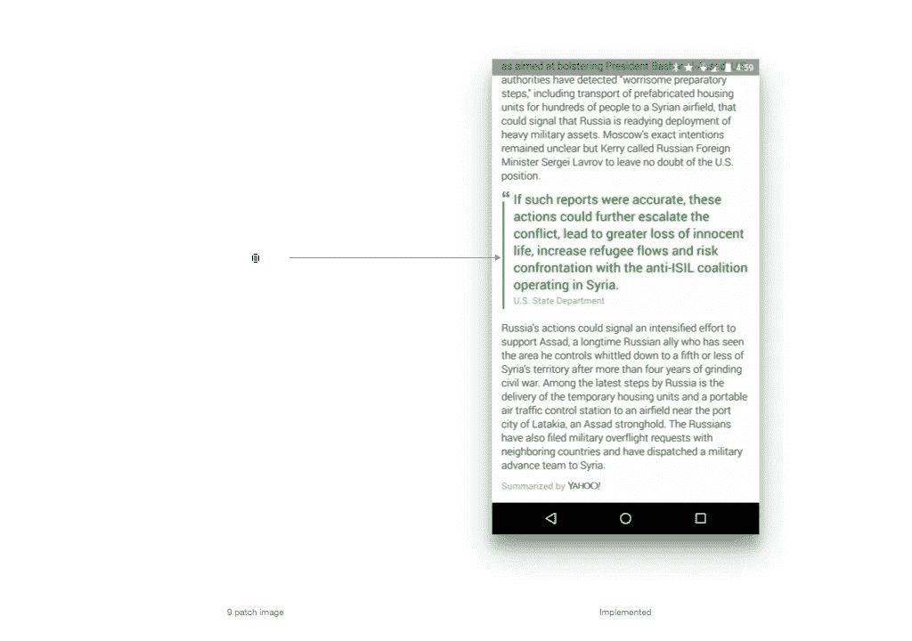

9 patch image (left) is dramatically expand its size and become meaningful graphic

## **3。了解屏幕密度和尺寸。**

与 iPhone 不同，数百家制造商制造自己的设备。比如，[OpenSignal.com](http://opensignal.com/reports/2015/08/android-fragmentation)造的漂亮，*造的吓人*安卓碎片信息图:

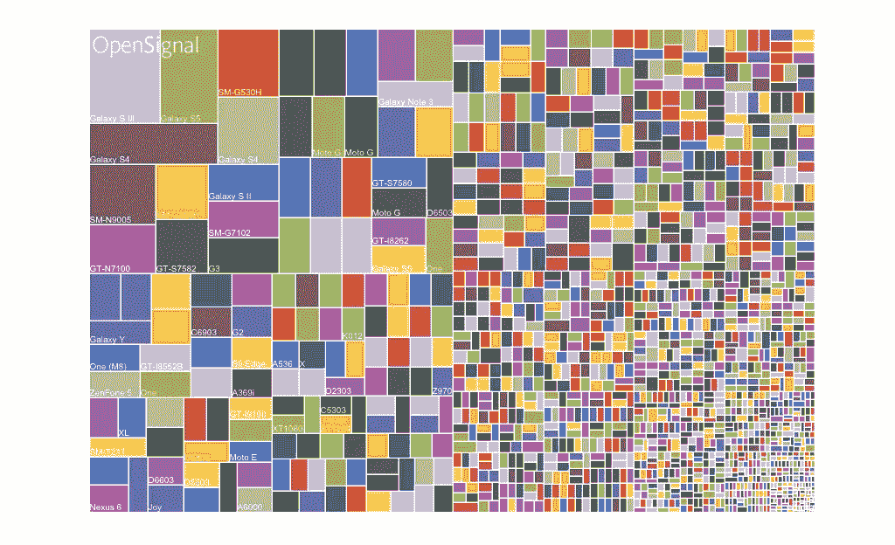

Image credit : OpenSignal : [Android Fragmentation](http://opensignal.com/reports/2015/08/android-fragmentation/)

但是不要惊慌，因为您不必为所有这些情况进行设计。

Android 有一个屏幕密度系统，可以适应每种屏幕尺寸。所以你只需要照顾五个(到七个)不同的尺寸。

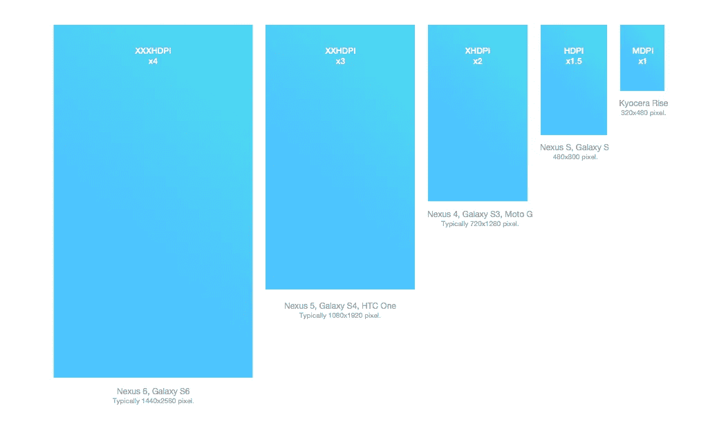

If you do a mockup at 1080 x 1920 pixels(XXHDPI), you have to divide all pixel numbers by three and it will be DP.

如果你从 1080 x 1920 像素开始设计，你不仅仅是在为 Nexus 5 设计。这些规格和资产都归所有其他 XXHDPI 手机所有，如 Galaxy S4、HTC One 或 LG G2。

让我们把 DP 带回来…

同样，DP 对于任何屏幕都是一个绝对数字。为了得到正确的像素数量，你必须乘以或除以每个密度。例如，如果你做一个 1080 x 1920 像素的实体模型，你必须将所有的像素数除以 3，这将是 DP。

是的，你必须在这里做一些数学计算，所以我更喜欢从 360 x 640 像素开始(然后每个数字都是 DP)。然而，这取决于你。

在任何情况下，你都应该努力针对不同的屏幕尺寸和密度来优化你的应用程序。我建议您在上线之前至少在五种不同密度的设备上进行测试。有趣的是，它的比例和其他的非常相似，所以你不必关心初始布局。

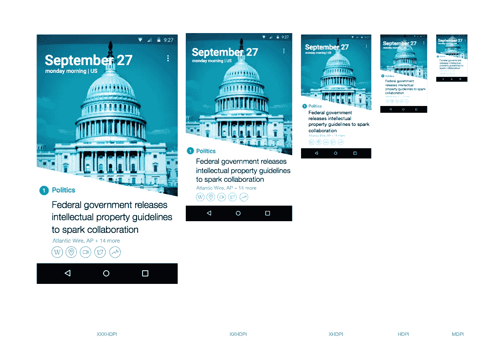

[Yahoo News Digest](https://play.google.com/store/apps/details?id=com.yahoo.mobile.client.android.atom). Optimized for Each Densities.

## **4。图标**

Android 上的图标风格更加立体圆润。

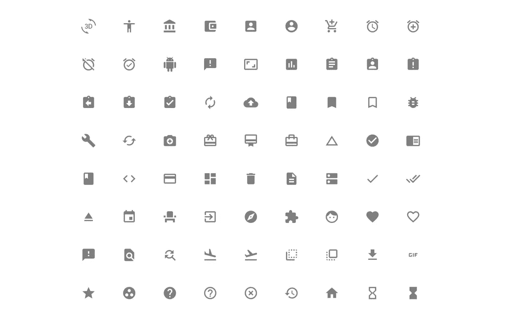

[Material Icons](https://www.google.com/design/icons/)

Android 可绘制图标系统自动放大/缩小图标尺寸。然而，这种缩放会在位图中产生伪像。为了确保您的位图看起来最好，您应该花一些时间来优化每个尺寸。

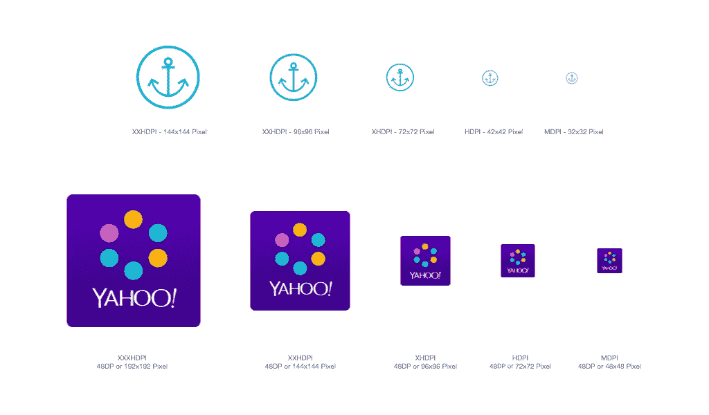

[Yahoo News Digest](https://play.google.com/store/apps/details?id=com.yahoo.mobile.client.android.atom). Icons are optimized for each densities.

## **5。材料设计**

去年，谷歌公布了它的 [*材料设计*](https://www.google.com/design/spec/material-design/introduction.html) ，一种新的设计语言。毫无疑问，这是一个真正令人敬畏的设计方向。访问他们的网站，了解基本的 UI 原理。但是，不要像特定的视觉设计一样，对色彩和阴影着迷。你可以在这方面发挥创造力。

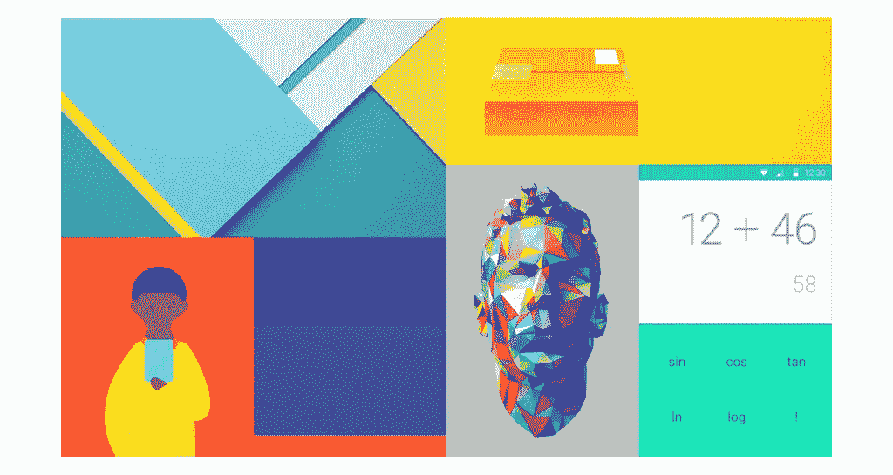

[Google Material Design](https://www.google.com/design/spec/material-design/introduction.html)

## **6。更多事情**

**软键**

典型的 Android 设备在屏幕上有专用的 Home、Back 和 Menu 按钮。但是，三星设备的硬件设备上有这些按钮。没什么区别。确保你的布局对三星和其他公司有意义。

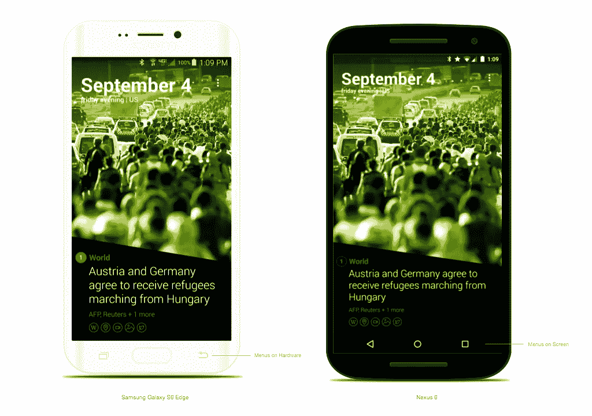

**小工具**

Android Widget 是早期版本的独特功能之一。您可以在主屏幕上创建简单而有用的卡片。但是它的功能有限；所以在你开始设计它之前，看看别人是怎么做的，和工程师交流一下。

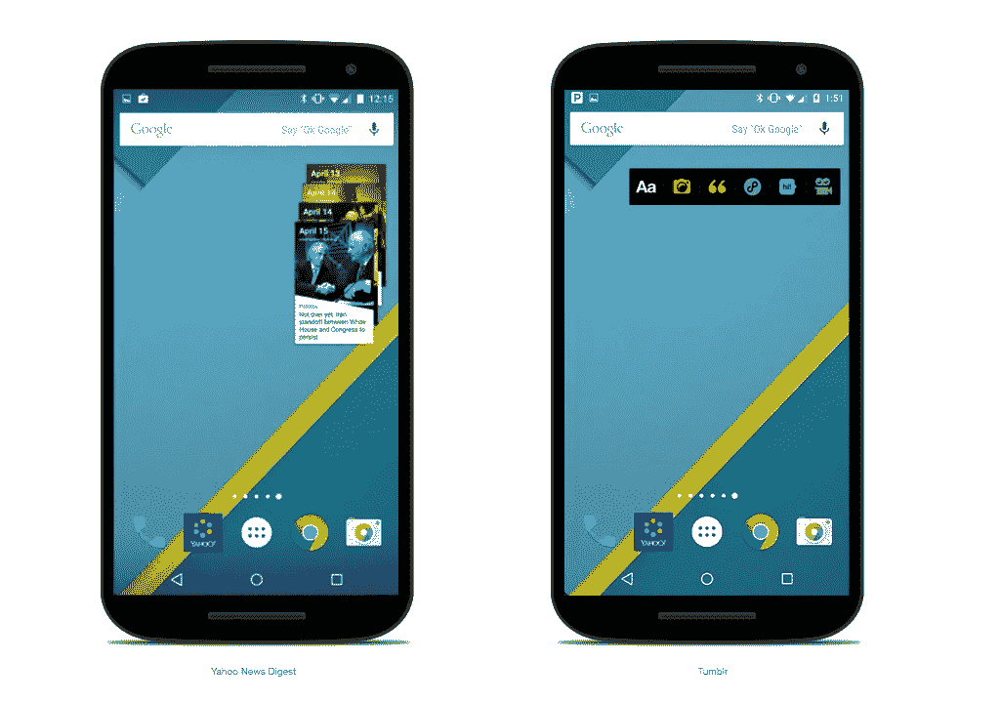

[Visit here for more screenshots](http://androidux.com/Widget)

**通知**

通知通常是图标+文本或图片+文本。Android OS 5(棒棒糖)和 OS4 以下(KitKat，姜饼)采用不同的处理方式。

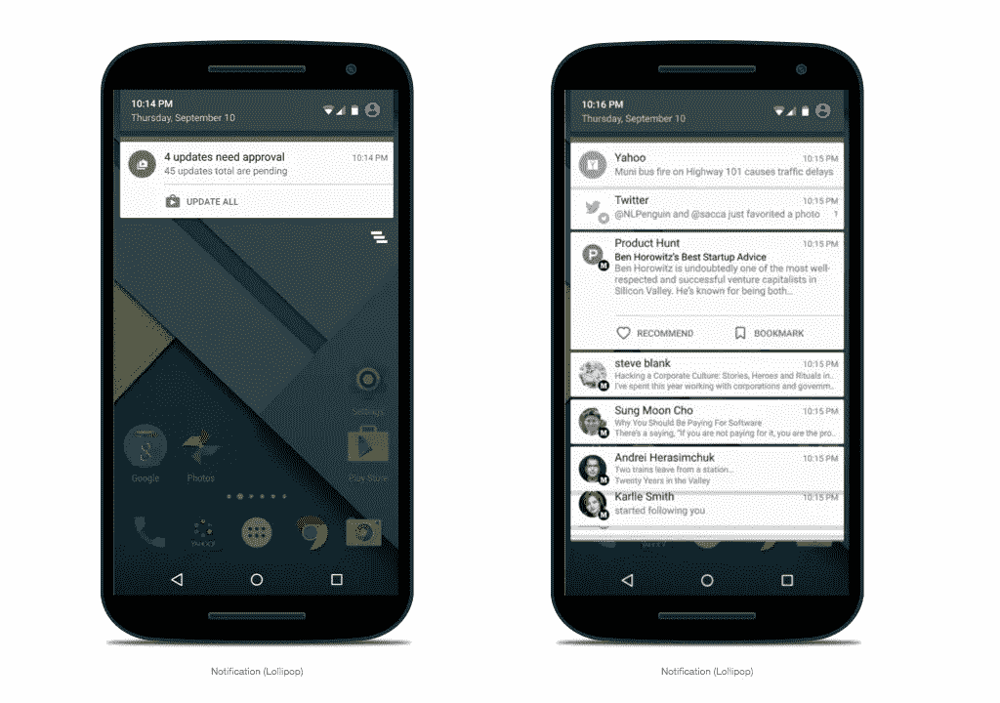

## **7。有用链接**

以下是有用链接的列表。

[谷歌材质设计](https://www.google.com/design/spec/material-design/introduction.html#)(通用)

[谷歌材质设计](https://www.google.com/design/spec/patterns/app-structure.html#)(图案)

[androidux.com](http://androidux.com/)

[pttrns.com](http://pttrns.com/?did=6)

[materialup.com](http://www.materialup.com/)

**还是那句话，不要转换。用一段时间。这有很大的不同。**

谢谢

*发表于* **创业、旅游癖、生活黑客**

-