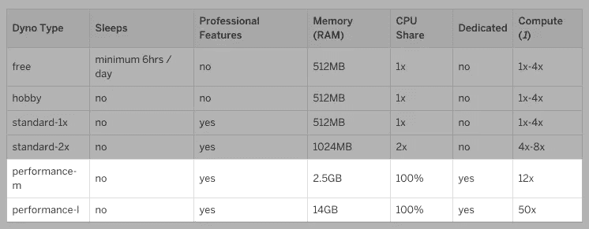
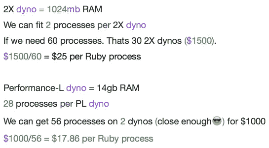
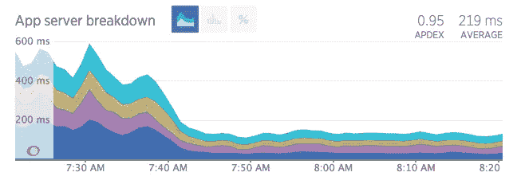

# 在 Heroku 的 Performance Dynos 上运行高流量 Rails 应用程序

> 原文：<https://medium.com/swlh/running-a-high-traffic-rails-app-on-heroku-s-performance-dynos-d9e6833d34c4>

*TLDR；如果你目前使用的是 10+2x dyno。考虑使用性能 dynos。如果 20–30 个 2X dynos，* ***肯定*** *使用性能 dynos。*

Heroku 最近宣布了他们的新性能-M(250 美元/月)和性能-L(500 美元/月)dynos。这是我们在[寻找产品](https://www.producthunt.com)的绝佳时机。刚刚推出 [LIVE](/@rrhoover/product-hunt-live-c52ef07417f1) ，我们的流量就失控了。

## **这里是新的动态统计数据**



source: [https://devcenter.heroku.com/articles/dyno-types](https://devcenter.heroku.com/articles/dyno-types)

我很高兴看到 14gb 内存的 Performance-L，它似乎非常适合我们参加[产品搜索](https://www.producthunt.com)。

当查看 PL dyno 时，我查看的第一个因素是每个 Ruby 进程的成本。对于产品搜索，我们目前的成本是 2X 上每个进程大约 25 美元，根据一些简单的数学计算，PL 上大约是 17.86 美元。



Highly “scientific” math 😎. Calc cost per process.

## 为什么要看每个进程的费用？

在扩展 Rails 应用时，我们关注的一个关键指标是它可以处理的并发请求数量。Ruby on Rails 应用程序通常使用大量内存，并且不受 CPU 限制。当使用 Ruby MRI(单线程)时，这意味着单个服务器(dyno)只能同时响应机器上运行的 Ruby 进程的数量。

如果我们使用的是 Puma，每个 Puma 进程使用 300MB 内存，那么 2X dyno 只能运行 3 个进程(并发处理 3 个请求)。

# 结果:产品搜索性能-L Dyno

我已经知道，从成本角度来看，转向 PL 是有意义的。我知道会有一些性能提升(专用 CPU，更少的可变性能)。但是我没有预料到我们经历的疯狂的性能提升。

我们改用 Performance-L dyno 后，性能比 2 倍的 dyno 提高了 3 倍。😎

检查这个[新遗迹](http://newrelic.com)过渡期间的响应时间图。



在左侧，我们运行了 **30 个 2X 测功器**。在右边，我们正在运行 **3 PL dynos** 。成本相同，性能提高 3 倍，请求响应时间的可变性更小。

***注*** :你的经历**会**有所不同。我们性能的大幅提升主要归功于更强大的 CPU。在我们的应用程序中，我们使用 rubyracer 进行预渲染反应(这在很大程度上受到 CPU 的限制)。

我们在 [Codeship](https://codeship.com) 的朋友也做了改变，并注意到类似的结果。

# 如何过渡到高性能-L Dyno

1.首先，你需要确定你当前的 dynos 在**生产**中使用了多少内存。

您可以通过多种方式实现这一点:

*   启用*日志运行时指标*并查看您的日志
*   使用 [Heroku 仪表盘](http://dashboard.heroku.com)
*   设置一个类似 [Librato](https://addons.heroku.com/librato) 的工具

用总内存使用量除以在 dyno 上运行的进程数，可以确定每个进程的内存使用量。

2.接下来，在您的 **staging** 环境中，您需要将 web dynos 的大小调整为 Performance-L。

```
 $ heroku ps:resize web=Performance-L --app your-staging-app
```

3.您需要确定在 Performance-L dyno 上运行的进程数量。为此，您将使用 14GB(PL 上的内存)除以每个进程的内存使用量。如果我们的应用程序每个进程占用 500MB，我们可以在 PL dyno 上运行 28 个进程。

***注意:*** 我最初喜欢保守一点，使用比我认为 dyno 上能容纳的进程数量更少的进程。安全总比以后投入生产好。

4.现在，您需要在您的登台环境中调整每个 dyno 上运行的 Ruby 进程的数量。下一步将根据您设置的服务器和环境变量而有所不同。该命令可能如下所示。您需要为您的应用程序引用 puma 或 unicorn 配置文件，以准确地知道要更改哪个 ENV 变量。

```
$ heroku config:set WEB_CONCURRENCY=20 --app your-staging-app
```

5.此时做一个负载测试&监控内存使用/ CPU 负载是一个好主意。我推荐使用[围攻](https://www.joedog.org/siege-home/)进行简单的负载测试，并使用 [Librato](https://addons.heroku.com/librato) 进行监控(升级到更高的计划以获得更详细的 5 分钟指标)。

***注*** :关于如何进行负载测试的细节，在我的书《Heroku apps 负载测试中有一章是关于[的。](http://www.amazon.com/Heroku-Cookbook-Mike-Coutermarsh/dp/1782177949)

6.一旦您对您的分段应用程序进行了负载测试，并对性能感到满意(没有 R14 崩溃)。生产中是时候这么做了。你可以在不停机的情况下做到这一点，但需要小心。

***注意:*** 记住你可用的数据库连接(或者 redis/memcached/etc)。如果每个进程使用 1 个连接，做一些快速的计算，确保你不会在升级过程中耗尽连接。您可以运行***$ heroku pg:info***来检查您当前的数据库连接和限制。

7.要在**生产**中进行转换，首先缩小您正在运行的 dyno 的数量&，然后调整到 PL(每个应用程序有 10 个 PL dynos 的限制，如果您给 Heroku 发电子邮件，可以取消此限制)。

```
$ heroku ps:scale web=3 --app your-production-app
$ heroku ps:resize web=Performance-L --app your-production-app
$ heroku config:set WEB_CONCURRENCY=20 --app your-production-app
```

8.你完了！现在监控 Librato/New Relic。几个小时后，您将对您的应用程序在 PL dyno 上使用了多少内存有一个很好的了解，并可以相应地调整并发性。

升级到 Performance-L dynos 为我们在[产品搜寻](https://www.producthunt.com)中带来了巨大的性能提升。它以更快的页面加载速度改善了用户体验，并降低了我们的 Heroku 账单。如果您在 Heroku 上运行的应用程序的速度范围是 10–30 2X dynos，那么您应该考虑使用 Performance-L。


🌟你可以在这里加入我的电子邮件列表。每次我发布新的东西，我都会发送一个更新。