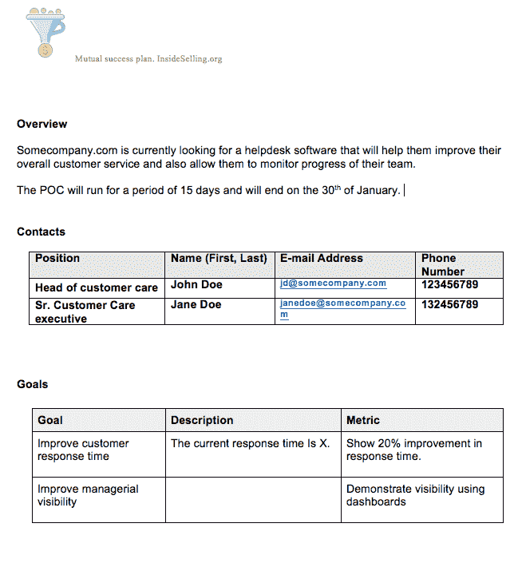
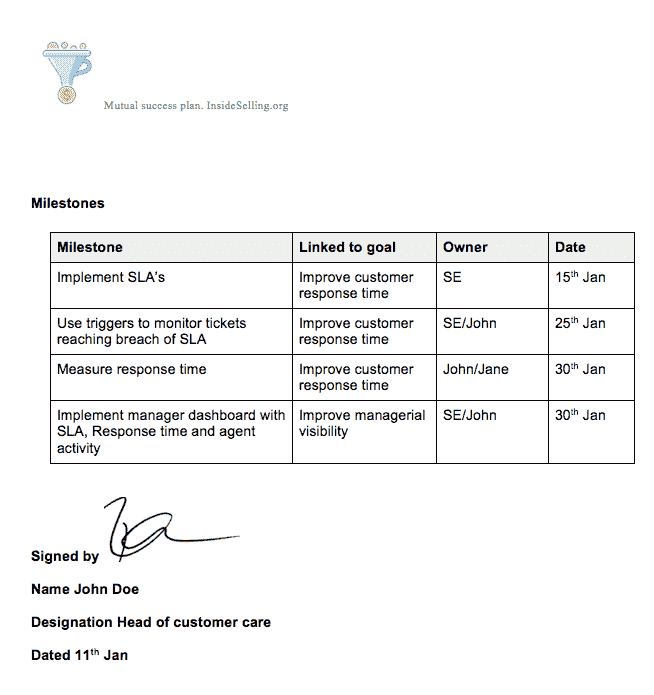
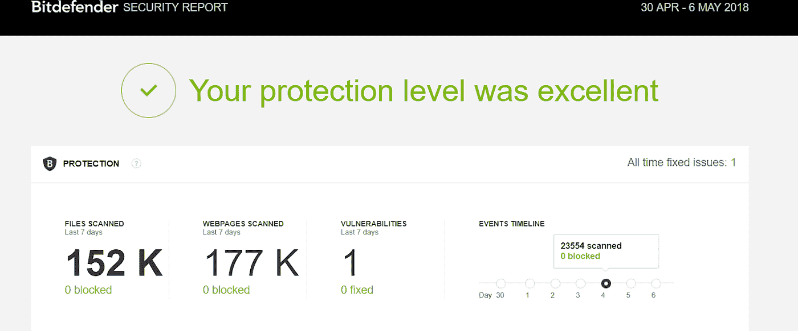

# 通过共同成功计划进行产品评估

> 原文：<https://medium.com/swlh/running-a-product-evaluation-via-a-mutual-success-plan-a3aa348f2f93>

有两种不同的方法来处理产品评估。第一个是共同成功计划驱动的产品评估。本质上，发布产品演示后，您可以与潜在客户一起制定评估路线图，然后确保他们遵守路线图。这既费时又费力，最适合用于大宗交易。

第二种方法是培养驱动法。您的潜在客户可能已经注册了试用，在这种情况下，您现在可以帮助他们发布产品演示。这意味着他们已经使用了一些产品或者根本没有开始使用该产品。

无论你使用什么技巧，在开始吸引潜在客户之前，你都需要有一个行动计划。为了这本书的目的。我将学习共同成功计划驱动技术 MSP 技术。第二个技巧我称之为培养技巧。

MSP 技术是结构化的，定义明确的，最重要的是“相互”同意的。培育技术的定义不像第一种那样严格，但管理起来占用的带宽要少得多。

所以管理产品评估的第一步是弄清楚你将使用哪种技术。

**共同成功计划**

下图显示了基于 SaaS 帮助台软件的共同成功计划。

从上面的图片中你能看出多少？希望很多！让我解释一下每一部分。

*概述*

“概述”一节清楚地概述了评估帮助台软件的主要业务目标，而不是抛出一个花哨的幻灯片来解决问题。概述还概述了产品评估的明确结束日期。

对于这个例子，我将概述部分限制得非常有限。然而，众所周知，概述部分长达一页。作为销售人员，我建议在向此部分添加信息时要小心。太多的信息意味着你的潜在客户可能不会阅读整个部分。

概述中应包含哪些内容

>问题陈述直接取自业务案例

>评估范围，即您将分配的资源、评估将持续多长时间以及评估的最后一天

>评价的目的

>完全清楚，您的潜在客户目前没有承诺购买任何东西。

概述中不应包含的内容

>定价，这是一个很大的禁忌。定价是你本应该避开的问题。这不是讨论定价的合适地点或时间。

>完整的业务案例。如果你有一个以上的问题陈述，你需要

*联系人*

通过在本部分添加主要联系人，您要求潜在客户做两件事:

a)明确概述其组织中负责评估的人员。我看到太多的评估失败了，因为人们忙着把责任从一个人身上转嫁到另一个人身上。此外，它还有助于您在评估过程中找出您应该指导的具体接触点。

例如，您知道如果正在购买一个客户支持软件，您不需要对财务主管进行产品培训。他只是财政大臣。从培训中获益的人将是地面上的人。

b)让个人负责产品评估，并增加他们在整个过程中的所有权。这是非常不言自明的，也是我过去经常使用的。一旦你听到评价是好的，并且一切进展顺利，你就可以把谈话推向结束。假设 Jane 已经同意并表示她喜欢该产品。最简单也是最快的下一步是继续前进。

例如“嗨，简，很高兴听到评估很顺利。我让约翰负责这里的财务。那么，我是应该继续和他交谈，还是你愿意开一个简短的电话会议？”

拥有 MSP 的好处在于你不会挫伤任何自尊。每个人都很清楚产品评估的负责人是谁，特别是哪个方面。

*目标*

这是产品评估中最重要的部分。通常情况下，你的潜在客户会有高层次的目标，如“改善客户服务”或“提高知名度”。这些都是很好的目标，但是这些目标没有一个是可以衡量改进的。

咨询式销售流程要求您作为销售人员将这些目标转化为可衡量的目标。

在本例中，“改善客户响应时间”的目标已经转化为将响应时间改善 20%的可衡量指标。

如果您的潜在客户对他们当前的响应时间没有把握，那么您的工作就是向他们咨询行业标准，并让他们同意固定的响应时间。这符合你在达成交易时需要反复灌输的咨询式销售方法。我已经在本书的开头讨论了 4 种类型的销售者。我的目标是让你尽可能接近顾问式销售。

你问为什么定义可衡量的目标如此重要？让我们暂时扭转局面。如果你站在潜在客户的立场上，想买一个软件，你会买一个你“觉得”有用的软件还是一个“实际上”有用的软件。

我同意‘一切价值都是感知’的说法。同时，当你可以从统计上支持你的观点时，为什么要把一些事情留给感知呢？归根结底，与感知价值相比，有形目标更容易销售。

如果你不能和你的潜在客户定义和达成一致的可测量的目标，产品评估就已经出师不利了。任何严肃的评估者也想知道你的产品带来了什么价值。事实上，如果您的潜在客户不知道他需要多少改进，这是您作为顾问介入并指导他们的机会。

让我离题一下，指出你应该彻底了解你的市场。没有任何借口可以让你与你所在行业的最新发展保持联系。更不用说，你需要像了解你自己的产品一样了解你的三大竞争对手。

*里程碑*

一旦设定了(可衡量的)目标。下一步是将这些目标转化为具体的特征或行动项目。在我们的示例中，我们将目标定为“改善响应时间”,然后将其分解为特定于服务台的里程碑。

这些里程碑很明显是可测量的，并且有一个日期。更重要的是，里程碑还应提到谁是潜在客户公司的负责人，负责里程碑管理。我已经指出了为每个特定的业务功能建立 SPOC 是多么有用，同样的原则也适用于里程碑的 spoc。

然而，使用 MSP 和里程碑部分的最大优势是，您不再需要推动您的潜在客户评估产品。因为你有双方同意的里程碑，你可以联系你的潜在客户，让他们知道里程碑还没有达到。

没有传统意义上的“推”。

*签名*

在共同成功计划上签字是至关重要的，它要求潜在客户致力于产品评估，最重要的是表明双方同样致力于产品评估。

重要的是，潜在客户不会觉得他是在承诺购买。销售人员应在产品评估开始前明确概述这一点。您还可以考虑在产品评估中提到，这不是购买意向，而只是关于如何进行评估的协议。

你应该用清晰的文字让你的潜在客户看到，而不是用小字添加“这不是购买协议”的条款。获得签名还有一个额外的好处。同意不同意，评估的时候就知道谁说了算了。在通过 MSP 进行了多次产品评估后，我通常会问潜在客户:“所以我们需要向您的组织发送一份 MSP。这不是购买协议。只是一份概述我们将如何进行产品评估的协议。你这边谁签字？”

在没有意识到的情况下，你被告知谁是负责人，可能会有最终决定权。你可能不会直接与签署 MSP 的人互动，但当我们谈论在产品评估期间变得冷淡的人时，这些信息会派上用场。

**使用 MSP 运行产品评估**

通过共同成功计划进行产品评估的最大优势在于，你不会随意发送跟进邮件。你发的每封邮件背后都有一个原因。

在 MSP 中，您将向潜在客户发送 3 种主要类型的电子邮件。

*里程碑驱动的电子邮件*

既然你已经有了一致同意的目标。你只需要“轻推”你的潜在客户使用软件的正确方向。让我们以里程碑“实施 SLA”为例。无需考虑何时跟进客户。只需给潜在客户发一封电子邮件，告诉他们我们的截止日期是 5 月 15 日，让我们开始吧！

里程碑驱动的电子邮件应附有 MSP 作为附件，以便您的潜在客户可以清楚地看到您为什么推动产品/功能的采用。

*用法分析*

一旦你的产品评估真正开始并且达到了里程碑。然后，您可以开始发送您的潜在客户使用分析。还是那句话，你不需要做任何像每日使用报告那样戏剧化的事情。考虑到产品评估的持续时间，您可以选择何时发送使用报告。

我的杀毒软件 Bitdefender 能够为我运行的使用报告给我留下了相当深刻的印象。记住，这是一个在后台默默运行的杀毒软件。所以告诉我他们为我努力工作是一个挑战。

这是他们发给我的使用报告。

注意到他们是如何强调我受到了很好的保护吗？将此转化为你正在销售的 SaaS 产品。你可以发送一份报告，上面写着“上周你的工作效率提高了 20%”或者“你的测试速度比上周快了 35%”。

但是，让我们在分析这份报告时不要止步于此。在评估过程中，您应该选择关键指标传递给潜在客户。如果你在销售一个图形设计软件，你可以选择一个指标，比如编辑的对象数量、制作的图形数量、合作者总数等等。

这个想法是为了确保你的投资回报率尽可能的有形。这就是我想向大家介绍的一个至关重要的销售法则。

使你的投资回报尽可能有形。不要依赖你的潜在客户对投资回报率的看法。

如果你没有可以为你运行这种报告的软件。你需要卷起袖子，然后自己做一份类似的报告。请记住，您不会对您正在进行的每一笔交易都使用 MSP(除非您本质上处理少量的大额交易)。

请记住，您不希望展示与您的潜在客户无关的功能或使用统计数据。能够定制此报告以符合您的潜在客户的确切业务案例和 MSP，这对您来说是一个巨大的优势。所以不要因为你懒得定制报告而错过这个机会！

*评估电子邮件结束*

这可能是您需要发送的最后一封电子邮件，以便将您的潜在客户带到谈判桌前，讨论接下来的步骤。评估邮件的结尾相当直接。

“亲爱的约翰:

怎么样了？

只是想让你知道试用将在 2 天后到期。我已经和你的团队联系过了，看起来一切都很顺利。我们什么时候能安排时间讨论下一步？

期待您的回复。"

如果电子邮件对你来说太被动了(对我来说也是)，拿起电话直接去高层讨论下一步行动。

如果您觉得这很有用，请随时向我们发送反馈。

## 这篇文章发表在《创业公司》杂志上，这是 Medium 最大的创业刊物，有 325，521 人关注。

## 订阅接收[我们的头条](http://growthsupply.com/the-startup-newsletter/)。

