# 我们为旧 iPhones 开发了一个基于人工智能的头像应用程序。苹果没有让它上线。

> 原文：<https://medium.com/swlh/russian-engineers-developed-an-ai-based-avatars-app-for-old-iphones-apple-didnt-let-it-go-live-aaeb3ff16298>

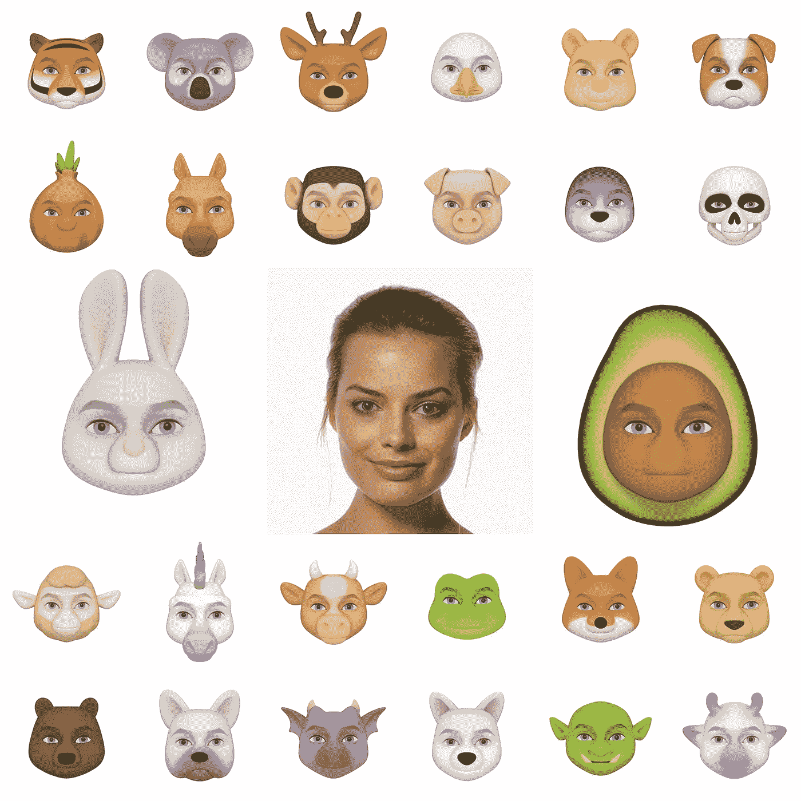

Margot Robbie’s Chumoji Pack

我叫阿肖特，是" [Chudo](https://chu.do/) "的创始人。这是一个消息应用程序，它使用机器学习技术将你变成看起来像你、移动起来像你、表情像你的活生生的动画角色。

我们是一家美国公司，在过去的两年里一直致力于这个项目。我们开发了一项专利技术，将人类 3D 人脸模型与我们艺术团队设计的角色混合在一起。

用该应用程序的摄像头自拍一张照片，Chudo 将为您生成 30 多个个性化角色。每组化身对于个人用户是唯一的。

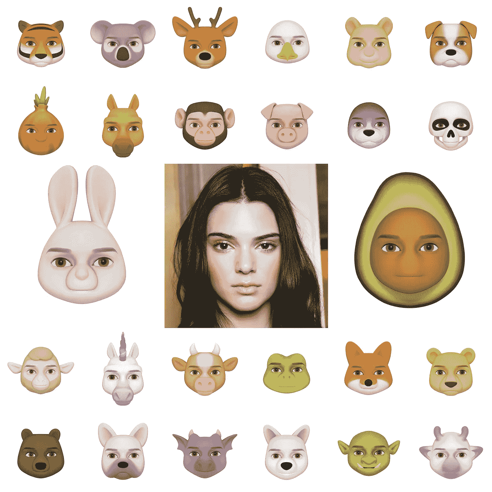

Kendall Jenner’s Chumoji pack

Chudo 不需要昂贵的深度相机，我们的应用程序使用神经网络来实时制作角色动画。

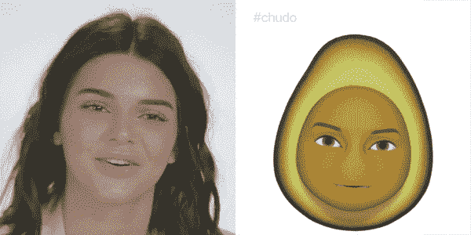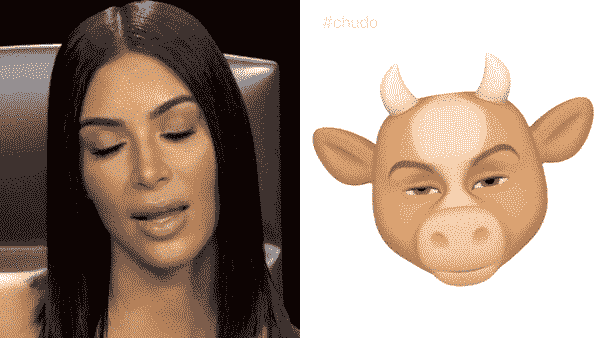

# [**利用机器学习技术，我们让头像在 iPhone 5S 和更高版本的苹果设备上工作。**](https://www.youtube.com/watch?v=yjcqplnfEhs&feature=youtu.be)

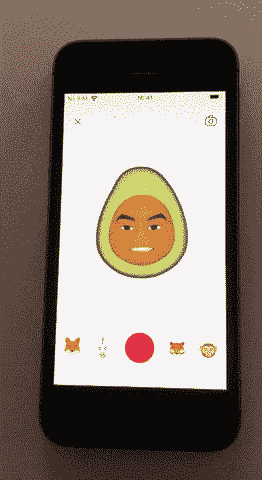

Chudo’s in-app camera feature on iPhone 5s

不幸的是，苹果不允许我们发布这个应用程序，因为我们的应用程序是

> **“与 Animoji 过于相似，这让人对苹果产品产生了误解。”，App Store 审核团队**

我写这个帖子是为了公开这个情况，因为这是我们唯一能做的。

但首先我想强调几个功能来解释一下该产品:

*   Chudo 可以在 iOS 和各种 Android 设备上工作，包括三星 Galaxy S9、S8、华为 Mate 10、Honor Play、Mate 9、谷歌 Pixel、OnePlus 6、OnePlus 5、诺基亚 8 等。你可以在这里获得安卓版本:[https://play.google.com/store/apps/details?id=app.chudo](https://play.google.com/store/apps/details?id=app.chudo)
*   你可以在和朋友发短信的时候，用个性化的角色实时播报你的情绪。

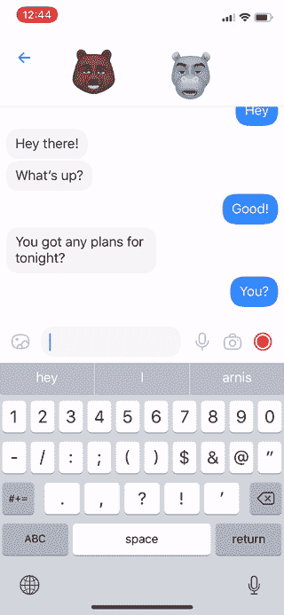

Chudo’s live emotions broadcasting

*   您可以录制动画 3D 贴纸，并在聊天中发送。

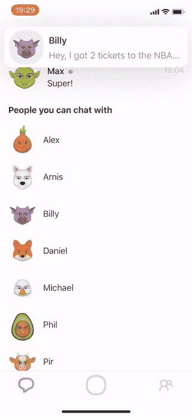

You can send live 3D-stickers with personalized avatars

*   你可以使用内置摄像头与 Chumoji 一起制作视频，并在各种社交媒体平台上分享。
*   所有这一切之所以成为可能，是因为我们在过去两年中开发了机器学习算法，收集了 15，000 张不同种族、年龄和性别的面部扫描数据集，并为 iOS 和 Android 设备实施和优化了代码。

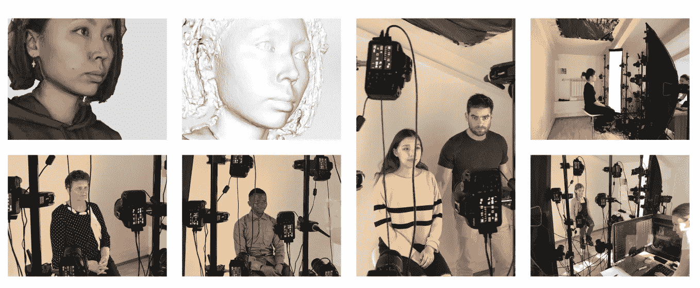

Our team spend over 2 years to collect data for training machine learning algorithms

**我们有信心做出用户会喜欢的伟大产品。我们相信 Chudo，因为它很有趣，是一种新事物，而且你不必买新手机就能使用它。**

我们已经等了一个多月，等待 App Store 审查团队发布这款应用。

终于，9 月 1 日我们收到了苹果的官方回复。

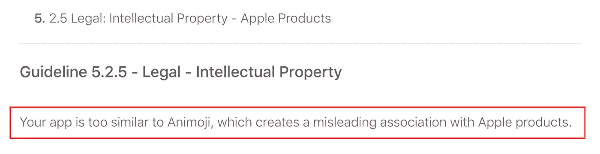

An official reply from the App Store Review Team

这非常令人费解，因为我们认为 Chudo 肯定不会与任何苹果产品混淆。有几个主要区别:

1) Chudo 是一个跨平台的消息应用程序，具有个性化的动画角色。应用内聊天让用户在与朋友发短信时实时表达情绪。我们没有在苹果的产品中发现任何类似的功能。

2) Chudo 不使用任何与苹果相关的商标:Animoji、Memoji 等。我们的应用程序叫做 Chudo，Chumoji 是我们对角色的称呼。

3)与苹果的 Animoji 不同，我们没有使用深度相机技术进行面部表情检测。我们使用我们专有的基于神经网络的技术。

4)我们专有的基于人工智能的技术通过用我们预装的角色变形捕获的人类 3D 人脸模型来构建个性化的 3D 化身。因此，用户会收到他们自己的一组字符中的一个——初末记。每组字符对单个用户来说都是唯一的。值得注意的是，没有一款与苹果的 Animoji 相似。

我们还想指出的是，App Store 中有许多应用程序与苹果的 Animoji 有着比 Chudo 更多的共同点。

Facehub app 就是其中之一，可以在 App Store 下载。苹果的立场是，这款应用不会让人对苹果产品产生误解，而 Chudo 会。

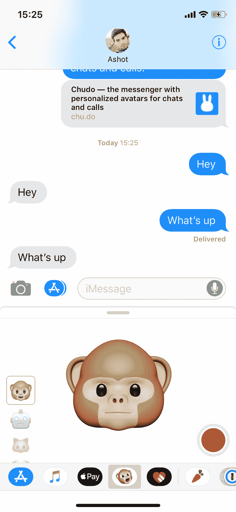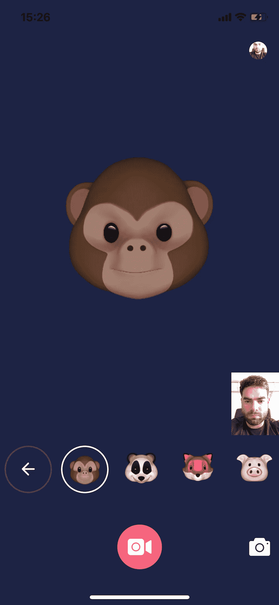

Apple’s Animoji (left) and Facehub (right) app comparison.

我们一直认为苹果是对开发者最友好的公司。我们现在想要的就是和 iOS 用户分享我们两年的辛苦。

如果你想让苹果发布我们的应用并试用，请通过在社交网络、记者和博客上分享这篇文章来帮助我们。

我们的团队认为，每个人都有权利感受神经网络和动画的魔力，即使你没有最新的昂贵智能手机。

***Ashot Gabrelyanov*** [***Chudo***](https://chu.do/)***，方正***

## 这篇文章发表在 [The Startup](https://medium.com/swlh) 上，这是 Medium 最大的创业刊物，拥有+365，763 名读者。

## 在这里订阅接收[我们的头条新闻](http://growthsupply.com/the-startup-newsletter/)。

