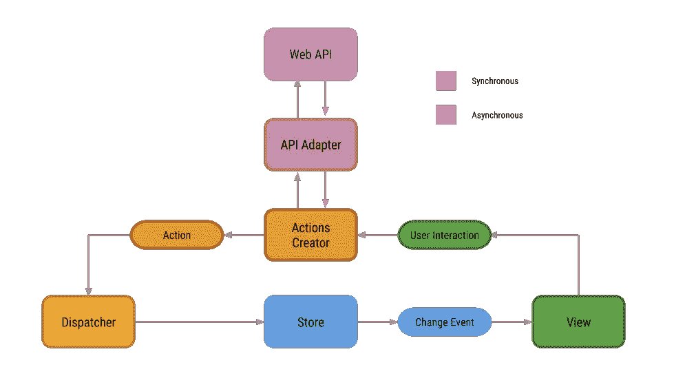

# RxFlux Android 架构

> 原文：<https://medium.com/swlh/rxflux-android-architecture-94f77c857aa2>

这是关于新 RxFlux 框架的第一篇文章。是一个小型的轻量级框架，它使 RxJava 功能很容易遵循[通量模式](https://facebook.github.io/flux/docs/overview.html)。

关于 Flux 是如何工作的我就不赘述了，为了更好的理解如何在 Android 中使用 Flux pattern， [@lgvalle](https://github.com/lgvalle) 创造了一个很好的[例子和解释](https://github.com/lgvalle/android-flux-todo-app)。我会推荐之前看。

在这篇文章中，我将解释如何使用 RxFlux 从头创建一个应用程序。如果你想了解如何使用 RxFlux 的更多具体细节，请访问 repo。最后一点要注意的是，我使用了 [Retrolambda](https://github.com/evant/gradle-retrolambda) ，因为用它一切看起来都很清楚。

[](https://github.com/skimarxall/RxFlux) [## skimarxall/RxFlux

### RxFlux 是一个小的框架，以遵循带有 RxJava 功能的 Flux 设计模式

github.com](https://github.com/skimarxall/RxFlux) 

> 请以回购中的样本 app 作为参考。

# 这个想法

在任何正常的应用程序开发中，第一步都是思考你想做什么。通量模式使得定义结构和指定期望的功能变得简单。

假设我们想要创建一个使用 Github API 的简单应用程序。这个应用程序向用户显示了一个存储库列表，用户可以查看所有者按下存储库项目。



Let’s keep this diagram in mind (author [@lgvalle](https://github.com/lgvalle))

# 逻辑和功能

我们首先必须考虑的是我们需要哪些“商店”。在我们的情况下，我可以考虑:

*   RepositoriesStore:将包含 GitHubRepos 列表。
*   UsersStore:将包含我们为每个回购请求的用户列表。

根据下面的图表，现在我们需要考虑我们应该定义什么接口，以便视图得到需要的信息。我们需要为每个商店创建一个界面。


We need to offer an interface for each store

对于我们的回购商店是非常简单的，视图只需要列表。

```
**public interface** RepositoriesStoreInterface {

  List<GitHubRepo> getRepositories();

}
```

为了显示 GitHubUser 曾经点击过列表中的一个项目，我们需要通过 id 获取一个特定的用户，我们也可能对获取完整的用户列表感兴趣。

```
**public interface** UsersStoreInterface {

  GitUser getUser(String id);

  List<GitUser> getUsers();

}
```

一旦我们定义了模型，下一步就是思考哪些可能的动作是由应用程序行为或用户与应用程序的交互触发的。

一个 RxAction 由 ***类型*** 和 ***数据*** (键值对)划分。

该应用程序需要的第一件事是请求回购列表，然后在用户按下其中一个项目的情况下，我们需要请求回购的用户信息。

```
**public interface** Actions {

  String ***GET_PUBLIC_REPOS*** = **"get_public_repos"**;
  String ***GET_USER*** = **"get_user"**;

  **void** getPublicRepositories();

  **void** getUserDetails(String userId);
}
```

我们创建一个接口，它将包含由我们的 RxActionCreator 将实现的键和方法定义的所有可能的动作类型。

最后一部分是定义我们将在 RxAction 中的键-值对映射中使用的键。这些密钥将帮助我们在收到 RxAction 时检索数据。

```
**public interface** Keys {
  String ***PUBLIC_REPOS*** = **"repos"**;
  String ***USER*** = **"user"**;
  String ***ID*** = **"id"**;
}
```

在这一点上，主要功能、动作类型和模型被清楚地定义。如您所见，添加或删除逻辑就像定义新动作或删除它们一样简单。

# 编码

这就是我们可以与其他开发人员分担工作量(如果是这样的话)而不会互相干扰的一点。每个部分都是独立的。每个部分(存储、视图、动作……)都被定义和指定了什么必须返回，什么需要，因此我们可以分别实现每个部分的逻辑。

让我们从商店开始。我们创建了我们的 RepositoriesStore，它扩展了 RxStore 并实现了我们的接口。

```
**public class** RepositoriesStore **extends** RxStore **implements** RepositoriesStoreInterface {

  **public static final** String ***ID*** = **"RepositoriesStore"**;
  **private** ArrayList<GitHubRepo> **gitHubRepos**;

  @Override
  **public void** onRxAction(RxAction action) {
    **switch** (action.getType()) {
      **case** Actions.***GET_PUBLIC_REPOS***:
        **this**.**gitHubRepos** = (ArrayList<GitHubRepo>) action.getData().get(Keys.***PUBLIC_REPOS***);
        **break**;
      **default**: *// IMPORTANT if we don't modify the store just ignore* **return**;
    }
    postChange(**new** RxStoreChange(***ID***, action));
  }

  @Override
  **public** ArrayList<GitHubRepo> getRepositories() {
    **return gitHubRepos** == **null** ? **new** ArrayList<GitHubRepo>() : **gitHubRepos**;
  }
}
```

RxStore 是一个抽象类，它提供了一些方法来发布事件，并将注册处理到 dispatcher 中。构造函数需要 dispatcher 作为参数，以便让 RxFlux 注册存储。

这里重要的方法是反作用。每次调度程序将 RxAction 发送到总线时，都会调用此方法。每个商店将决定如何处理这一行动(使用或忽略)。

在我们的例子中，我们等待类型为 **GET_PUBLIC_REPOS 的动作。**当我们得到这个动作时，我们从 RxFlux 的契约中知道，它将包含一个名为 **PUBLIC_REPOS** 的键，以及我们的回购列表。对于我们简单的应用程序，我们只是将它存储在我们的变量中，并将存储更改发送到 dispatcher。此商店更改需要一个 ID 和一个 RxAction。调度程序将把这一更改发送到总线，视图将接收到它，并使用 getRepositories 方法对请求数据做出反应。

现在让我们创建一个动作来给出这个列表。再看看流程图，我们需要动作创建器。RxFlux 提供了一个名为 RxActionCreator 的抽象类，它将帮助我们实现动作。普通构造函数需要 dispatcher 和 SubscriptionManager 作为参数。如果需要，我们还可以提供更多的参数。

```
**public class** GitHubActionCreator **extends** RxActionCreator **implements** Actions {
**public** GitHubActionCreator(Dispatcher dispatcher, SubscriptionManager manager) {
    **super**(dispatcher, manager);
  }

  @Override
  **public void** getPublicRepositories() {
    **final** RxAction action = newRxAction(***GET_PUBLIC_REPOS***);
    **if** (hasRxAction(action)) **return**;

    addRxAction(action, NetworkManager.*getApi*()
        .getRepositories()
        .subscribeOn(Schedulers.*io*())
        .observeOn(AndroidSchedulers.*mainThread*())
        .subscribe(repos -> postRxAction(newRxAction(***GET_PUBLIC_REPOS***, ***PUBLIC_REPOS***, repos)),
            throwable -> postError(action, throwable)));
  }
}
```

GitHubActionCreator 将实现我们之前定义的 Actions 接口。在这个方法中，我们将进行所有的“异步”工作(网络请求、解析等等)。首先我们需要创建动作，我们的动作很简单，没有参数，我们只需要调用*new RxAction(****GET _ PUBLIC _ REPOS****)它*会给我们一个类型为 ***GET_PUBLIC_REPOS 的新 rx action。*** 下一步是检查我们是否已经在做这个动作，hasRxAction()会告诉我们这个动作是否存在并且正在运行。

现在让我们使用 Retrofit 和 RxJava 创建请求。这里没有什么特别的，我们请求我们订阅的存储库，然后我们需要实现订阅的 onNext 方法和 onError 方法。

当 onNext 方法返回新的回购列表时，我们将发布一个新的 RxAction，其 GET_PUBLIC_REPOS 类型包含回购列表作为 dispatcher 的值。如果我们得到一个错误，我们将使用 postError 方法让商店和视图知道。

最后一步是创建视图并连接这些点。为了使这篇文章简短，我将跳过视图创建，只关注 RxViewDispatch。这个接口必须由应用程序的每个活动来实现。

```
**public interface** RxViewDispatch {
**void** onRxStoreChanged(RxStoreChange change);

  **void** onRxError(RxError error);
**void** onRxViewRegistered();

**void** onRxViewUnRegistered();
**void** onRxStoresRegister();
}
```

java 文档中解释了这些方法，但是它们非常清楚。

1.  监听存储更改，我们通过存储 id 和操作类型来识别它们。
2.  处理错误。
3.  当视图从 dispatcher 注册或取消注册时得到通知，这样我们就可以注册其他类似片段的视图。
4.  *onRxStoresRegister* 是一个重要的方法，是商店的实例必须注册的地方。最好的方法是像 dagger 一样使用 DI，获取 store 的实例并调用 register 方法。(注意:调度程序足够聪明，可以忽略商店是否已注册，因此您可以安全地注册多次)

```
@Override
**public void** onRxStoresRegister() {
  **repositoriesStore**.register();
  **usersStore**.register();
}
```

使用此方法后，两个商店都将在 dispatcher 中注册。如果您检查源代码，您会看到在活动的 onCreate 过程中调用了这个方法。RxFlux 将处理注销。

# 连接最后一个点

最后，在我们的应用程序实例中，我们只需要最后一样东西。我们必须初始化 RxFlux 类。该类将处理 dispatcher、SubscriptionManager 和 RxBus 的创建，还将处理应用程序的生命周期，以便注册和取消注册视图和存储，从而避免内存泄漏。

```
@Override
**public void** onCreate() {
  **super**.onCreate();
  **rxFlux** = RxFlux.*init*(this);
}
```

# 最终注释

我跳过了几个方法，它可能看起来很复杂，但只要你稍微练习一下，我希望你会意识到这是一个很好的设计模式，它和 RxJava 一起为开发人员提供了创建应用程序的惊人工具，而且定义良好和清晰的结构使得扩展和添加额外功能变得非常容易，易于测试和添加新模块。例如跟踪，可以通过创建一个新的模块来完成，该模块注册到 dispatcher 中，监听所有的 rx 动作并跟踪结果。

该框架处于早期阶段，如果你决定开始使用它或有一些建议来改善它，我愿意接受公关或新的想法。

如果你喜欢它，请分享它，我也很乐意回答任何相关的问题。

编码快乐！

在 Twitter 上找到我:[@ marxalski](https://twitter.com/marxallski)和 [Google+](https://plus.google.com/u/1/+MarcelPint%C3%B3)

前情提要:[反应式机器人形态](/@marxallski/rxflux-android-architecture-94f77c857aa2#.26yu2urap)