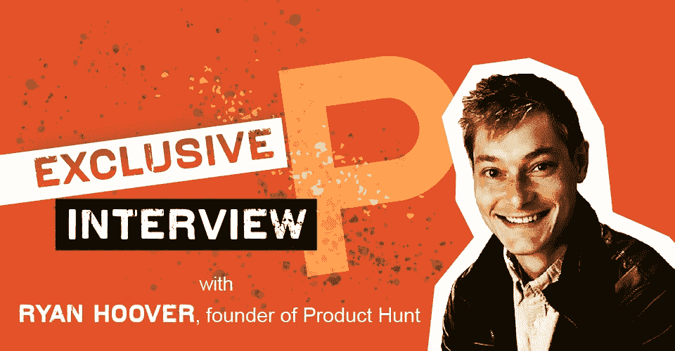
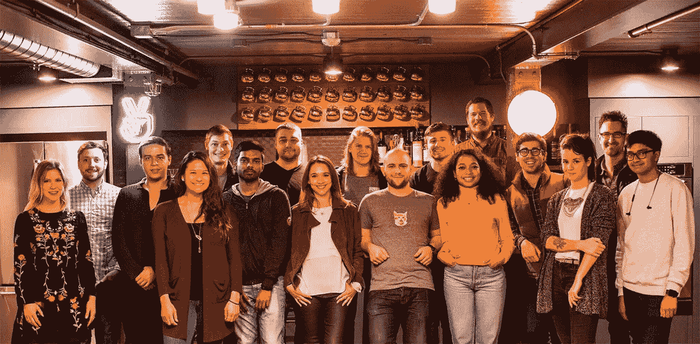
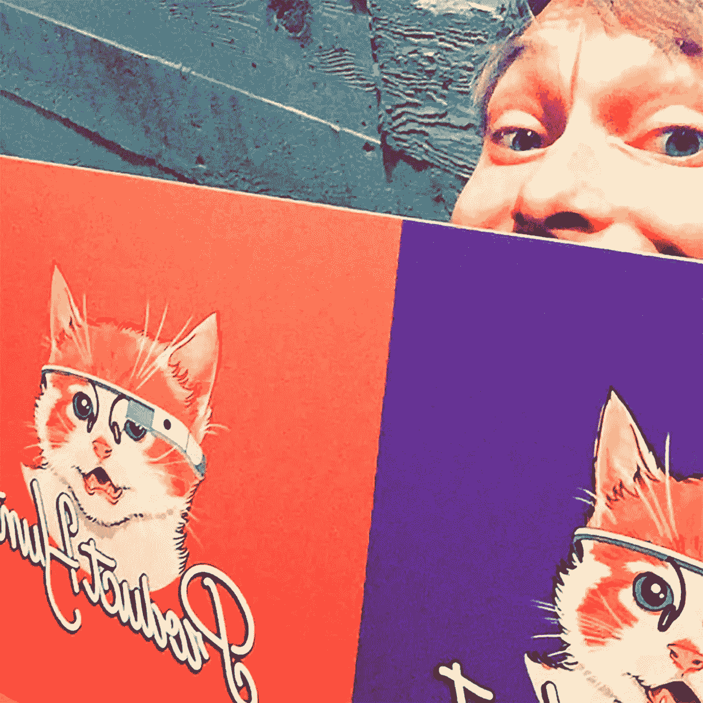

# 瑞安·胡佛谈论所有关于产品搜寻、生活和企业家精神的事情

> 原文：<https://medium.com/swlh/ryan-hoover-talks-all-things-product-hunt-life-entrepreneurship-1597ebffe72e>

瑞安·胡佛的创业之旅是他毕生好奇和实验的努力。从小时候卖游戏手册，到一年之内写了 150 多篇博文，再到创建了一个非常受欢迎的以产品为中心的网站，Ryan 本质上是一个创造者——充满了灵感、创造力和对所有企业家的建议。

Ryan 在 2013 年 11 月推出了[产品搜索](https://www.producthunt.com/),作为一个突出新产品的电子邮件列表。今天，它被称为一个面向初创公司、制造商和产品迷的网站——“一个分享和发现最新技术的全球社区。”

Product Hunt 最近经历了几个重大转变，例如 AngelList 在 2016 年收购了该公司，并在 2018 年引入了 Product Hunt 新的盈利目标。对于大多数公司来说，像这样的变化会导致组织混乱，但对产品搜索来说不会。瑞安已经确保公司文化保持不变，网站继续成为热爱新技术产品的人们的社区——他们标志性的吉祥物小猫完好无损。

我们对 Ryan 的全面采访涵盖了他的产品搜索想法的来源，他如何发展公司，给企业家的建议，他遇到的最奇怪的产品，最喜欢的 Philz 咖啡，等等。

**莱恩，这一切是从哪里开始的？**

我在俄勒冈州尤金市长大，父母都是企业家。从我出生开始，我的父母就一起工作，拥有自己的事业。当我还是个孩子的时候，他们开了一家电子游戏商店，这很棒，因为我可以免费玩所有的电子游戏。我有一个美好的童年，当我探索各种项目时，我父母的企业家天性感染了我。当我还是个孩子的时候，我会在易贝上买卖东西，制作视频游戏手册，并在我父母的视频游戏商店里出售——就像这样的事情。

这快进到我现在的位置。产品搜寻是我过去做过的许多不同实验中的一个，我的想法更像是，“嘿，我真的希望这个东西存在——我想尝试这个项目。”没有真正的期望去赚钱或做任何事情，或者在那个时候，把它变成一个真正的生意。

**我爸爸总是说，“找个洞，把它填上。”我把他的建议作为开始新项目的灵感，尝试解决我遇到或观察到的问题的想法。**

你是一名狂热的科技作家。是什么让你开始写作的？

在学校里，我讨厌写作，我想这是因为老师让我写一些我不关心的东西，比如《麦田里的守望者》的读书报告。我觉得很无聊。多年来，我一直在成长，心想，“我讨厌写作，它太无聊了，我不想做，”这很讽刺，因为在某个时刻，我开始写我确实关心的东西。我在大学时做过一点，但大部分是在大学毕业后。

我在 2012 年和 2013 年开始写了很多。2013 年，我写了 150 篇博文——其中一些真的很短，但在一天结束时，当我回头看时，我惊讶地发现那年我几乎每两天就发表一篇文章。我很喜欢这份工作，作为一个内向的人，在电脑前写作并在网上与世界分享让我越来越满足。

**我喜欢通过写作来了解产品**，经常写一些流行产品的拆解，试图解释为什么它们被设计成现在的样子。这方面的一个例子是在 Tinder 的早期——我会玩这个应用程序并问，“为什么它如此引人注目？”"产品设计中哪些细微之处是有效的或可行的？"我会试着理解它们，并对应用程序设计者使用的认知偏差和线索进行一些研究，以更好地理解产品。

**所以这就是寻找产品的想法的来源——剖析产品并与他人分享的愿望？**

这肯定是在相同的兴趣范围内，但这不是动机。真正的动机甚至更简单。我和我的朋友们总是分享我们发现的很酷的产品——要么通过短信，要么通过其他群聊，我们亲自思考，“你的主屏幕上有什么？”“你在玩什么？”“你觉得什么很酷？”

人们喜欢谈论产品，就像他们喜欢谈论电影、音乐或其他形式的娱乐一样，这是一种普遍的行为。

我意识到，我们已经在这么做了，但互联网上没有专门用于这种对话的地方——我们有 Twitter 和脸书，你有通用社交网络，但它们不是为发现新产品而设计的。

另一件事是，不一定有一个单一的清单“这是一个新的，很酷的产品，今天推出。”现在最好的仍然是科技出版物，但我对这些出版物感到失望的是，它们包含了许多我不太感兴趣的产品之外的其他新闻，此外，它们也没有社区方面。所以，想法很简单，创建一个邮件列表，列出当天最有趣的新产品。

对于初创公司来说，培养追随者至关重要。你是如何建立产品搜索的受众的？

在我发表这封邮件的最开始，我没有大量的追随者，但我在技术社区中有足够多的人关注我，他们会听并点击我在推特上发布的链接。

如果没有之前几年的博客和与他人建立关系，如果我没有至少一些追随者，产品搜索就不会成功。拥有第一批 300 名订户对启动这个社区非常有帮助。当我们的网站上市时，有两种增长机制在那个阶段特别有帮助。

**一个是一般出版社**。由于我们基本上是发现新产品及其背后的人的新来源，一些记者开始使用它，我们实际上相对容易从其他出版物获得新闻和关注。一开始，当 TechCrunch 写关于产品搜索的文章时，他们有时会在产品搜索上找到一个产品，并链接到我们这里——这真的很有意义，因为我们从如此小的用户群开始，他们写给与我们非常相关的受众。所以点击的人发现了其中的价值。这是极少数的案例之一，在早期阶段，媒体实际上是一个很好的收购策略。对于大多数公司来说，媒体并没有触及他们真正的目标受众，这可能是一个更虚荣的衡量标准，而不是一个增长战略。

**第二个是人们分享和口口相传的结合**，其形式是像我一样喜欢在推特、脸书和其他地方寻找和分享新事物的人。但是这些产品的制造商也会分享他们的产品页面，并进行讨论。**这两款车是 Product Hunt 在第一年的真正增长点。**

**你在寻找产品时遇到的最大挑战是什么？**

我认为有个人挑战，也有更广泛的商业挑战。我认为个人挑战毫无疑问是因为各种原因不得不放弃队友——这是不可避免的。如果你不让某人走，而且你从未解雇过任何人，那可能是出了什么问题。这可能是我这个角色最难管理的事情，尤其是当你的队友成为朋友，也为加入我们的任务做出牺牲的时候。

对于更多的商业方面，我认为挑战各不相同。我认为始终保持动力是每个公司都会遇到的问题之一。在最开始的时候，有很多兴奋和动力，来了，但又去了。每个公司也会遇到一些停滞不前的情况(也有一些例外)。每个公司都会尝试一些行不通的东西。这是必然的。**最难的部分之一是确保团队中的每个人都保持精力充沛、努力工作和兴奋，即使事情并不顺利。**

**自从把产品 Hunt 卖给 AngelList 后，有什么变化吗？**

这是我经历的唯一一次收购，所以数据点只有一个，但我觉得我们的位置有些独特，因为团队和社区保持了相对完整和真实的我们开始时的样子。我们的目标从一开始就是保持自主，保持我们的品牌和声音。

在其他情况下，很多时候，公司要么取消一个产品，要么将团队合并在一起，他们整合产品——随之而来的是许多挑战，当我们做出这个决定时，对我来说很重要的是，我们有 ProductHunt.com——我们仍然有我们的吉祥物小猫，仍然保持很大的控制权。安吉利斯特对此非常赞同。他们了解我们社区和品牌的重要性。

**你在产品搜索中见过的最奇怪或最疯狂的产品是什么？**

哦伙计(笑)。总有一些奇怪的东西。有一种产品叫做 Licki Brush，基本上它是一种放在你嘴里的刷子，你用它来刷你的猫，就像你在舔你的猫一样。这太荒谬了。

欢迎来到我的生活。

**产品搜寻的下一步是什么？你有什么想法或愿景可以和我们分享吗？**

我们有一堆事情要做！**其中之一是今年实现盈利**，这对我们来说是相对较新的，我们从一开始就有意放弃关注收入，直到最近，大约在去年 9 月和 10 月，我们开始了一些尝试。我现在不能分享数字，但上个月我们支付了一半以上的费用，我对此非常自豪，因为我们六个月前开始赚 0 美元。因此，我们在收入方面取得了非常好的进展。

除了这项收入计划，我们还建立了名为 [Ship](https://www.producthunt.com/ship) 的新平台，这基本上是初创公司和制造商的一个工具包，帮助他们与用户沟通，获得测试版测试人员，并了解他们的客户。从某些方面来说，我们本质上是在尝试将人们今天已经在使用的所有这些工具拼凑起来——涉及到调查、登录页面、电子邮件、营销等。这是我们税收计划中的一项工作。

**另一类是一般用户增长**。我们如何扩展产品搜索平台，让更多的人使用它，并发现我们提供的价值。我们以几种不同的方式在做这件事——其中一些是不太明显的，比如 SEO，它产生了很好的结果。但它也在尝试新的产品计划，包括为制造商提供一个新的地方来分享他们正在做的事情并获得他人的帮助。到目前为止，我们开始从这个小社区获得一些好的反馈，这让我非常兴奋。

**作为一名企业家，什么激励着你？**

这个问题问得好，因为很难讲清楚。因此，有时温暖、模糊的东西会鼓舞人心，制造商或某人会在事后给我们发电子邮件说:“嘿，非常感谢你支持我们。在我们启动后，发生了这样那样的事情，没有你我们不可能在这里……”这些事情当然是激励人心的。

我认为另一件事就是渴望产生更大的影响，变得更大。就像渴望将这个数字从 x 移动到 y 一样，无论这个数字是什么——无论是收入还是用户增长还是其他什么，在许多方面，构建产品就像一个巨大的游戏，在这个游戏中，你试图从战略角度思考，“我能做什么？”“我该怎么办？”“我们能建造什么？”**我喜欢这份工作，因为在这个职位上，我最喜欢的产品搜寻部分是开发新产品和新体验，同样，它们并不都有效，但它本身就很有激励性和趣味性。**

**如果你能给所有创业者一条建议，会是什么？**

这取决于企业家的背景，但对一些人的一条建议是建立追随者。当我第一次启动 Product Hunt 时，有几百人立即注册，这对于推出 Product Hunt 并获得早期关注至关重要。

这是唯一可能的，因为我花了很多时间，几年前，写并建立了一些追随者，与许多知名人士建立了关系，这些人在开始时成为了社区的核心成员。我认为这是很多企业家没有想到的。

我认为**创造某种类型的受众有很大的价值，**我不是指肤浅、虚荣的“我只是想增加我的 Twitter 关注”，但如果你能开始在某种类似的人口统计或兴趣空间内建立一个受众群体，这对你将来建立和推出的任何东西都非常有价值，因为你会有人向它发起。**最难的事情是任何产品的分销，即使只是获得测试版用户也可能非常困难，但如果你有一群关心你在做什么的人，你现在就可以立即获得支持你和你正在建设的东西的人。**

**你怎样做才能成为最有效率的自己？我相信你每天都有无数的事情要做！**

我认为在管理时间方面，我没有一个很好的流程——我可能会做得更好。对我来说，我会跳来跳去做很多事情，部分原因是因为我的角色——从产品到营销到团队成员，再到其他所有事情，我喜欢这样，因为我喜欢我要做的事情的多样性，但结果是，这让我更难真正计划好我的时间表，并花几个小时专注于一件事情。

我认为我最近做的最有成效的事情，是在每周的开始我写下三件需要在那一周完成的事情。如果除了这三件事，我什么都没做，那还是一场胜利。这有助于我分清主次，关注最重要的事情，因为很容易被许多不太重要的事情所拖累，然后你的一周就没了。

**是什么让你迷上了 Philz 咖啡，你喜欢喝什么？**

当我第一次搬到旧金山时，我的办公室在圣马特奥(旧金山以南 20 英里)。我以前的老板和我经常一起拼车，我去接他。他家旁边有个菲尔茨。我们会路过，带上菲尔茨，开车去圣马特奥，那是我的第一次介绍。

我对咖啡越来越感兴趣，很快它就成了一种习惯——我是一个非常常规、习惯性的人，也许这可以追溯到我的生产力篇，**但我每天早上至少花几个小时在 Philz，**我几年前就开始这样做了。

甚至产品搜索本身也是从费城开始的。我喜欢常规，我喜欢可预测性，这很讽刺，因为创业根本不可预测。

我默认的饮料是丝绸般的辉煌——这是一个很好的，安全的，平稳的赌注。

*访谈由 JotForm 的营销专员 Annabel Maw 主持。*[*@ AnnabelLMaw*](https://twitter.com/AnnabelLMaw)

*最初发表于*[*【www.jotform.com】*](https://www.jotform.com/blog/434-Ryan-Hoover-Talks-All-Things-Product-Hunt-Life-Entrepreneurship)*。*