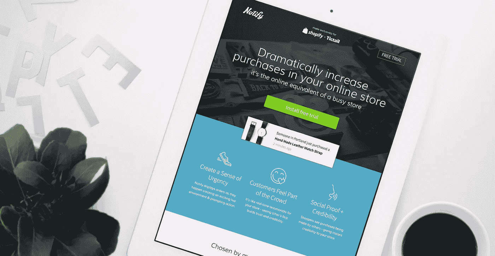
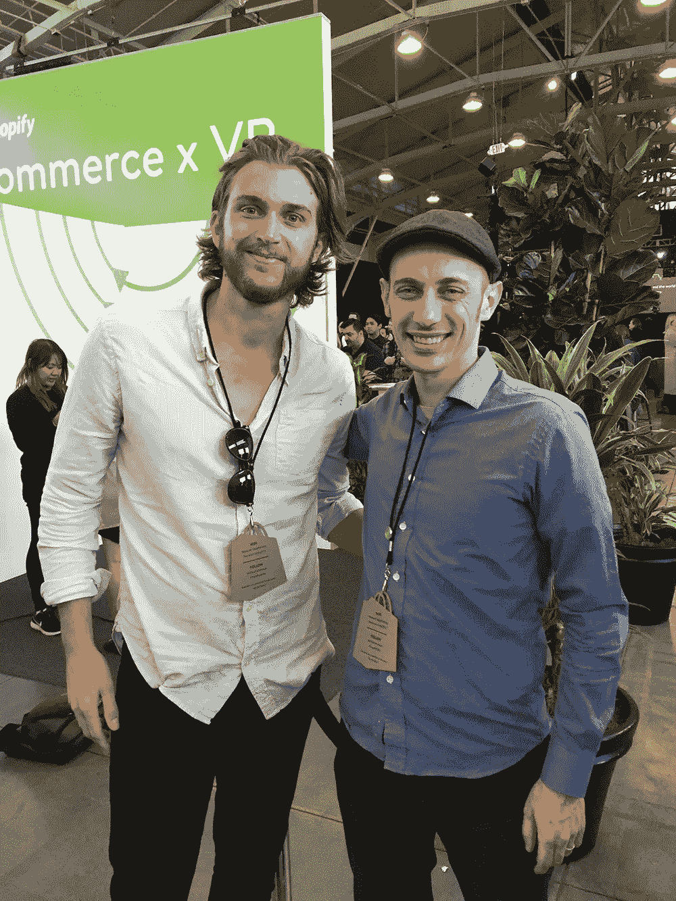

# 第七次幸运:打造成功的 SaaS 产品。

> 原文：<https://medium.com/swlh/saas-7th-time-lucky-b971dae7d36>

[Image description: The Notify landing page]

> “……你必须愚蠢地乐观，才能在商业中获胜，因为大多数机会都对你不利。”— [@jaltucher](http://twitter.com/jaltucher)

今年早些时候，我的 Shopify 应用程序 [Notify](https://notifyapp.io) (现在的 Fomo)被收购。我很幸运地带领它经历了自三年前推出以来的巨大增长。

在此之前，十年的副业取得了喜忧参半的成功。赢得 SaaS 奖没有完美的秘诀——我开发了一些没人用过的漂亮的应用程序，也有一些不起眼的应用程序获得了疯狂的流行。所有这些实验都帮助了 Notify，我为它的成功感到骄傲。

以下是我对 SaaS 成功投资的几点看法。

**先找到你的市场。**

这就消除了一半的战斗。在我职业生涯的早期，我采用了“你需要的只是一个好主意”的思维模式，但是好主意多的是。难的是找到你的市场。

*对于 Notify 来说，Shopify 店主是最理想的市场。Shopify 应用商店还没有饱和，我现有的(免费)应用已经产生了几千个潜在客户——我可以立即推广 Notify。此外，我熟悉这个生态系统，内置的计费 API 让接受支付变得轻而易举。*

**从第一天开始收费。**

不要因为害怕收费就开始免费增值。通过要钱来验证你的产品。如果你能得到一个付费客户，更多的人会跟着来。

*我一开始就把 Notify 的价格定为每月 14.99 美元。相对于当时的 App Store，这似乎有点高——但它物有所值:一位兴奋的客户进行了优化实验，看到 Notify 增加了 19%的收入。较高的价位似乎创造了一种独特的感觉，吸引了一群对我的产品充满热情的忠实顾客。*

**不要停止释放。**

部署应该是令人愉快的。准备好一个类似生产的环境，这样您(或者更好的是，您的测试)就可以安全地检查每个版本。

随着用户数量的增加，保持系统正常运行的压力也越来越大。每天都会显示数百万条通知。在早期，推送更新总是有风险的。这是一个不必要的瓶颈。设置一个临时服务器让我回到了每天发布的状态，产品也因此变得更好。专业提示:用 [*特拉维斯*](https://travis-ci.org/) *和* [*酱实验室*](https://saucelabs.com) *自动化你的测试。*

**说不**

> “制造半个产品而不是半个屁股产品的秘密是说不。每次你对一个功能说是，你就在收养一个孩子。你必须带着你的孩子经历一系列事件”——杰森·弗里德

这是 Notify 成功的关键因素。在早期的冒险中，我花了几个月的时间来扮演 creep。对通知变得严格是一个胜利。只有在受到高度追捧或对增长有直接影响的情况下，功能才会被淘汰，例如通知分析或开发新平台。

**保持精益。**

部署世界一流的应用程序从未如此简单。Stripe 让接受支付变得简单，AWS 让你可以访问大量的基础设施，CloudFlare 免费在世界各地分发你的内容。不要浪费时间多此一举。

有了这些资源，我可以在几天内完成一个 MVP。在巅峰时期，Notify 可以毫不费力地在少数几台机器上运行。CloudFlare 吸收了一半的流量，并为全球约 100 个数据中心的应用程序提供服务，为各地的用户提供闪电般的体验。AWS 自动扩展，保持低成本。十年前，建造这种规模的东西会是一场昂贵而混乱的噩梦。

**有末日计划。**

为最坏的情况做打算。能够访问数据库备份，并对您的部署流程了如指掌。

我半辈子都在保持网站应用在线。这个过程适用于 [*墨菲定律*](https://en.wikipedia.org/wiki/Murphy%27s_law) *，Notify 也不例外。幸运的是，访问备份很容易，而且新的环境已经准备就绪。*

避免成为第一个接触点。

当每个客户都有你的个人联系方式时，就很难在重要的事情上花时间了。

第一年的增长缓慢而稳定，每月增加约 20 名顾客。大部分增长直接来自 Shopify 应用商店。用户们在博客上描述他们在 Notify 上的成功，到处都在宣传有机食品。到 2015 年末，每月新增 500 名客户并不罕见。随着业务的增长，需要全天候的支持。我后悔没有早点外包出去。

**新客户不是增长的唯一途径。**

一旦你有了一个坚实的客户基础，追加销售优质功能，并密切关注客户流失。

*我像老鹰一样盯着‘总用户’指标。许多顾客每月收入 10 万美元；兜售高级功能将是一个很好的下一步。Shopify 应用程序通常具有很高的流失率——每安装两次试用版，就会有一次成为客户。自出售以来，Fomo 的人通过发送即时个人欢迎电子邮件减少了客户流失。*

**知道什么时候退出。**

突然之间，这个小副业变成了一个庞然大物。它占据了我的生活。早上 5 点起床，在开始真正的工作之前，塞进几个小时的工作，晚上和周末消失了。不断的电子邮件，机不可失的机会，对其他平台的巨大需求，风险投资产品。我成了瓶颈。两个选择:全职或者退出。

看着[@ ryanckulp](/@ryanckulp)&[@ Justin mares](/@justinmares)带通知上一级已经不真实了。Fomo 的一些最新功能让我大吃一惊。

有了好的应用程序，我有机会休息一下。我把我的朝九晚五的工作留在了旧金山的酱油实验室，以此来赶上生活。这是一个爆炸。

我终于带着 [@angeldixon](/@angeldixon) 度过了一个迟来的[蜜月](https://www.instagram.com/p/BHFzR97jTm_/)，和朋友&家人一起旅行，建立了家庭，[在树莓派上度过了](https://github.com/scottdixon/water-my-garden)，帮助一个朋友开发了他的[应用程序](http://refinery.io)，[加入了这个家庭](https://www.instagram.com/p/BRF3hqvDMtD/)，我开始习惯在工作日冲浪。

随着这一年的结束，我期待着回去。我比以往任何时候都更兴奋地参与下一个项目。

[Image description: A journey highlight — Meeting [@tobi](http://twitter.com/tobi) at Shopify Unite 2016]