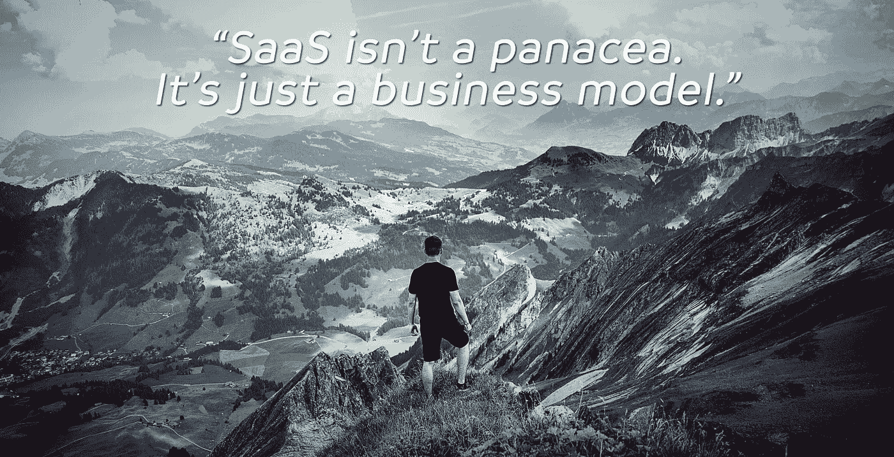

# SaaS 分裂的时机已经成熟

> 原文：<https://medium.com/swlh/saas-is-ripe-for-disruption-56429324a0ed>

## 我们是在 SaaS 峰吗？

以下是我想在这篇文章中回答的几个大问题:

1.  你应该在 2016 年创办一家 SaaS 公司吗？
2.  如果你有一个 SaaS，有哪些可能的威胁？
3.  还有哪些潜在的破坏性模式存在？

*注意:如果你想听，这里有这篇博文的音频版本:*

 [## 034-2016 年你应该在 SaaS 开一家公司吗？超级制造商

### 像 Slack、Basecamp 和 Freshbooks 这样的初创公司通过使用一种模式每月获得数百万美元的经常性收入…

simplecast.com](https://simplecast.com/s/20bc5c7f) 

我出生于 80 年代。第一台电脑:Vic-20 准将。第二台电脑:Tandy 1000。第三台电脑:386 PC 克隆。第四:奔腾克隆。

我买的第一个软件是给 Apogee 软件公司寄了 44 美元，买了一个叫 Keen 指挥官的游戏。1991 年，你可以从 BBS 上下载 Keen，或者从零售商那里购买盒装的 Keen。

在 90 年代的大部分时间里，大多数软件都是这样发布的。你会买下它，并安装在你的桌面上。流行的商业应用程序是微软办公软件和 Adobe Photoshop。公司将花费数百美元为每个员工的机器授权像 Office 这样的软件。

1999 年，一家名为 Salesforce 的软件公司成立了。他们使用了一种新的许可和分发模式:软件即服务(SaaS)。你不再购买单独的许可证，而是为每个用户支付月费。员工的机器上没有安装该软件；它被集中托管在一个网络服务器上。

五年后，37signals 推出了著名的 Basecamp。他们的发布会有很多不同的原因。首先::

> *我们向每位员工收取 100 美元的终身一次性费用。就是这样。所以如果你有 20 名员工，那就是 2000 美元。你付一次钱，就这样。没有经常性费用、维护费等。你唯一一次再次付钱是在你雇佣新员工的时候。那么这个新人就是 100 美元。*

自两年前推出以来，它们一直在盈利。他们有 30%的利润。

我喜欢 Claire 的战略，因为她将自己的*业务模式*与*客户的使用案例*结合起来:

我认为，一个企业主应该在员工在公司的整个时间里从员工那里获得反馈。不只是几周或几个月？— ?但是一个员工和你在一起多少年。订阅模式不鼓励这样做。很容易使用一个产品几个月，每月支付 50 美元，然后关闭它。

# 4.多合一

软件交付出现了分裂。在过去的 10 年里，公司购买的不同软件产品的数量增加了 10 倍。

我有一个单人公司(只有我一个人)。以下是我使用的所有 SaaS 产品:

1.  聊天空闲时间
2.  用于文档、表格等的谷歌应用程序..
3.  我的一些自动化序列的 Mailchimp
4.  为我的主[电子邮件简讯](https://justinjackson.ca/newsletter)进行转换
5.  策划简讯的好点子
6.  WordPress 主机的 WPengine
7.  我在 MediaTemple 上托管了一些旧的静态站点
8.  用于项目托管的 GitHub(和新的静态网站)
9.  用于托管一些软件项目的数字海洋
10.  Heroku 招待别人
11.  CRM 高层建筑
12.  电子邮件 Gmail
13.  社交媒体发布的缓冲区
14.  Twitter 分析的众筹
15.  卖我的书的口香糖
16.  蔻驰主办了[我的课程](http://devmarketing.xyz)
17.  作为支付网关的会员
18.  递归作为支付网关
19.  作为支付网关的收款人
20.  主持我的播客
21.  Mightybell 主办我的论坛

如果您看一下这个列表，就会发现有整合的机会。一些应用程序可以添加新功能，成为一站式商店。

例如，Nathan Kontny 刚刚增加了向[高层 CRM](https://highrisehq.com) 发送批量电子邮件的功能。对于一些客户来说，这可能意味着不需要在 MailChimp 上花钱。

Basecamp 刚刚将群聊整合到他们的项目管理软件中。

中小型企业尤其觉得他们使用了太多的应用程序，并为此付费。你每个月只能花 29 美元购买这么多应用。最终小企业会问:我绝对需要什么，我能摆脱什么？或者，换一种说法，我该如何省钱省时？

# 5.建立在更大平台上的微型 SaaS

之前我说过，以个人创始人的身份建立一个 SaaS 几乎是一个神话。最终，您需要雇佣员工来加快建设速度、参与竞争并支持客户。

然而，有一个例外:在更大的平台上建立了一个有利可图的“微型 SaaS”的独立创业者。以下是一些例子:

*   [喜欢。It](https://like2have.it/) 。这是一款 SaaS 的附加软件，主要通过 Shopify 应用商店销售。他们利用两大平台:Shopify 和 Instagram。
*   [加急 SSL](https://www.expeditedssl.com/) 。他们能够利用 Heroku 应用程序商店，并为开发人员提供一种快速的方法来将 SSL 添加到他们的 web 应用程序中。
*   [DBinbox](https://dbinbox.com) 。这位创始人建立在 Dropbox 的平台之上，为 Dropbox 用户提供了一种从客户端接收文件的简单方法。

# 最后的话

SaaS 只是一个许可和交付软件的模型。这不是商业灵丹妙药。

自 2008 年以来，我一直专门为 SaaS 公司工作。我在 SaaS 公司有股份。我可以告诉你:很难。这比其他商业模式要难得多。

SaaS 并不适合每一种产品。这不是每个客户的最佳解决方案。

我在这个帖子里想问的问题是:“怎么会被打乱？”

干杯，
[贾斯廷·杰克逊](https://twitter.com/mijustin)

附言:我只是一个好奇的蠢驴，想弄明白。如果你喜欢这种好奇的提问，你应该在 Twitter 上关注我: [@mijustin](https://twitter.com/mijustin) 或[订阅我的简讯](https://justinjackson.ca/newsletter)。

> ⚡️:你的营销计划需要颠覆性思维吗？我刚刚发布了[一本书](https://justinjackson.ca/jolt)叫《雷震》，你[可以在这里](https://gum.co/joltbook)得到。⚡️

如果你觉得这很吸引人，请点击下面的♥！还要突出，分享，回应！

*原载于 2016 年 8 月 12 日*[*Justin Jackson . ca*](https://justinjackson.ca/saas/)*。*