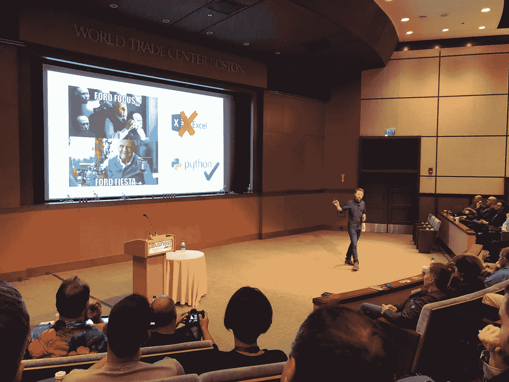

# SaaS 模拟:2018 闪电对话(软件的商业)

> 原文：<https://medium.com/swlh/saas-simulation-2018-lightning-talk-business-of-software-561410b8c2a0>

Dr Ford, the father of simulation. (Credit: [Business of Software Conference](https://businessofsoftware.org/))

我很荣幸在马萨诸塞州波士顿的软件商业会议上发表了我对 SaaS 物理学的看法。2018 年 9 月。有什么比通过 7-1/2 分钟自动播放的幻灯片来讲述故事更好的方法来引入新的思维方式呢？

## 前言

在 [2016 年](/@mattwensing/introducing-startup-py-for-b2b-saas-200858a2489a)，我写了一个 Python 脚本来预测我的创业公司在收入、支出、客户和潜在客户方面的未来。这很有效，但由于有一家初创公司要运营，我把这个想法放在了脑后，偶尔会动一动。快进两年(2018 年)，我决定申请在软件商业大会上做一次闪电演讲，以展示我对 SaaS 预测和模拟这一想法的想法。令我震惊和恐惧的是，会议接受了。

为什么惊讶的眼神中带着丝丝恐惧？因为我知道闪电演讲是一种特殊的折磨手段，用在那些认为自己是优秀演讲者的人身上……计时器开始计时，不管你是否准备好，每 30 秒你的幻灯片就会前进一次。这不是普通人在数百名他们尊敬和钦佩的商界领袖面前为了好玩而做的事情。但是，记住一篇演讲稿，然后把每件事都安排得恰到好处，这是一个挑战吗？我内心的愚人无法抗拒。

开始了。

## 视频:“10 年 1 家创业公司 vs 10 分钟 1000 家创业公司”

## 附言

感谢观看！你觉得怎么样？如果你喜欢这个演讲，你也会喜欢[sims AAS](https://simsaas.co)——这个应用程序让每个人都可以访问和使用 SaaS 预测。

*特别感谢* [*马克利特伍德*](https://medium.com/u/6d63a64a1fed?source=post_page-----561410b8c2a0--------------------------------) *以及整个帮派给与的机会和回忆。直到明年！*

## 这篇文章发表在 [The Startup](https://medium.com/swlh) 上，这是 Medium 最大的创业刊物，拥有+398，714 名读者。

## 在这里订阅接收[我们的头条新闻](http://growthsupply.com/the-startup-newsletter/)。

