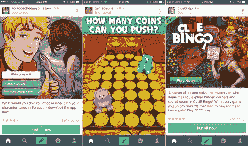

# 为 Tumblr 难过

> 原文：<https://medium.com/swlh/sad-about-tumblr-6b5dc3ce5a04>

我一直在想 2013 年我和杰森·卡拉卡尼斯的这段对话。

> 事实证明，世界上有很多钱。钱是无聊的。钱是要花的！钱是用来赌博的。
> 
> *–杰森·卡拉卡尼斯*

三年前[雅虎宣布他们正在收购 Tumblr](http://marissamayr.tumblr.com/post/50902274591/im-delighted-to-announce-that-weve-reached-an) 。从一开始，我就怀疑它会成功。

**开始，** [**用户讨厌这个想法**](https://twitter.com/mijustin/status/336522440769417216) **。**(我最喜欢的一句名言:“如果我们的 Tumblr 创始人如此需要钱，我们为什么不在 kickstarter 上举办一个活动来养活他呢？”)

其次，从商业角度来看，这似乎没有意义:

Tumblr 的文化(包括用户和团队)非常反广告。雅虎回应称:

> *当你听到我们谈论原生广告时，广告和内容一样好，甚至可能使内容更好——这就是我们的目标。*
> 
> *——雅虎首席执行官玛丽莎·梅耶尔*

这种策略并没有持续很久。以下是今天在我的 Tumblr feed 上循环播放的三个广告:

Tumblr ads from my phone today

这些显然是“桶底”类型的广告。事实上，这是我在 Tumblr 上看到的唯一三家做广告的公司。他们太可怕了。

雅虎承诺 Tumblr 的广告收入将在 2015 年达到 1 亿美元。在上个月的收入电话会议上，他们承认他们错过了这个目标(尽管他们没有说错过了多少)。

# “我们保证不会搞砸”

这句现在已经声名狼藉的话出现在玛丽莎·梅耶尔的[收购公告](http://marissamayr.tumblr.com/post/50902274591/im-delighted-to-announce-that-weve-reached-an)中。但是现在，事情*被*搞砸了。像之前的 Geocities 和 Broadcast.com 一样， [Tumblr 的价值正朝着零直线下降](http://venturebeat.com/2016/03/02/as-tumblrs-value-heads-to-zero-a-look-at-where-it-ranks-among-yahoos-5-worst-acquisition-deals/)。

> 这整个情况让我很难过。

多年来，我一直是 Tumblr 的活跃用户(我仍然热爱它)。我喜欢戴维·卡普为他的产品带来的奇思妙想。我喜欢这个社区的怪异和创意。

我用 Tumblr 为我的非技术客户提供网站托管服务，他们真的很喜欢它。直到今天，这是我见过的最用户友好的移动 CMS。

## 我为什么这么在乎？

我想我还是在问同一个问题:

收购要么成功，要么失败。似乎没有中间立场。当它们变坏时，它们会破坏用户的信任，疏远创始团队，并使业务的价值变得毫无价值。*

> 值得冒这个险吗？

在过去的 5-10 年里，创业的圣杯就是被收购。但是随着 70-90%的收购失败，也许是时候制定一个新的目标了。为什么*不从一开始*就专注于交付人们愿意支付的价值？

Tumblr 本可以向亲用户提供高级 CMS，按月收费。Squarespace 是该领域目前的领导者(2013 年他们报告的利润为 3800 万美元)。Tumblr 比 Squarespace 更容易使用，有更好的移动应用程序，内置内容分发。他们本可以成为名副其实的竞争对手。

> 虽然在**技术**方面有很多创新，但在**商业模式**方面没有多少创新。

赚钱的方式只有几种:你可以对你的产品收费，你可以卖广告，或者两者兼而有之。如果你自己不能让这些经济效益发挥作用，收购真的能改变这种情况吗？

还有一点:我还是不知道做风险投资人是什么感觉。我不知道什么是“大数字”然而，我的猜测是，在接下来的 5 年里，钱将不得不从*无聊的*转向*聪明的*。

干杯，
贾斯廷·杰克逊
@ mi Justin

PS:如果你喜欢这个，请给它一个♥，让其他人看到它！

> 你可能会喜欢我的新闻简报。

*是的，少数收购(如脸书收购 Instagram)进展顺利。但是根据哈佛商业评论，70-90%都失败了。

*原载于 2016 年 3 月 9 日*[*Justin Jackson . ca*](https://justinjackson.ca/is-the-money-still-bored/)*。*