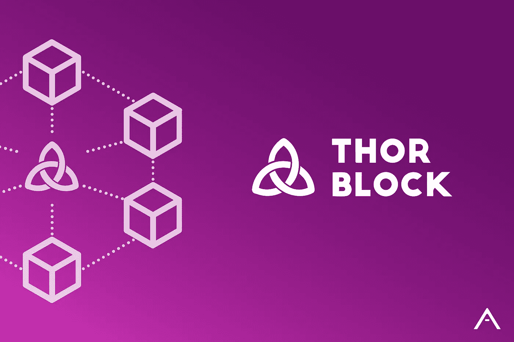

# 避风港的共享服务:Thorblock，使用 Arkane 作为他们的钱包提供商

> 原文：<https://medium.com/swlh/safe-havens-pooling-service-thorblock-uses-arkane-as-their-wallet-provider-3a7f2ba7207d>

> 感谢你对阿尔凯恩·❤️感兴趣，我们希望了解你，所以请不要害羞，加入我们的[电报](https://t.me/ArkaneNetworkOfficial) ✨

Thorblock Integration with Arkane

我们很高兴地宣布，[避风港](https://safehaven.io)已经与 Arkane Network 合作，以提高其 ThorBlock 产品的采用率和可访问性。

你可以在这里阅读 Arkane Network 如何支持 VeChain [。](/arkane-network/vechain-support-at-arkane-network-launch-c84f2c8cb9db)

## Thorblock 是什么？

[避风港](https://safehaven.io)，第一个在 VeChain 上尝试代币销售的项目之一，建立了 Thorblock，以促进在 VeChain 区块链上代币销售的筹款。避风港成功地卖出了他们自己的代币，现在将使用 Thorblock 服务于其他 VeChain 项目。Thorblock 的共用服务的好处是:

*   参与 VeChain 上的私人和公共代币销售
*   没有最低个人限额
*   降低被诈骗的风险
*   获得奖励代币的可能性

Thorblock 的快速发展激发了避风港和 Arkane 探索进一步的合作。通过使用 Arkane APIs 和其他工具，避风港可以更快地在 VeChainThor 网络上生成 DApps。

## Arkane 是什么？

Arkane 是一个多区块链钱包提供商，它充当区块链和应用程序之间的通信层。对于消费者来说，Arkane 可以被视为一个数字钱包。对于开发者和企业来说，Arkane 是让区块链成为主流应用的基石。

## 什么是 VeChain？

VeChain 是一个区块链平台，面向专注于金融服务、供应链管理和智能合同的企业。这是第一个制定灾难恢复计划的区块链，也是第一个与中国政府合作的。

## 这对我们的用户意味着什么？

Arkane 用户可以使用他们的 Arkane 帐户登录 Thorblock，并使用他们的 VeChain 钱包参与 Thorblock 提供的共享服务。

arkane.network in collaboration with [fundrequest.io](https://fundrequest.io)

## 这篇文章发表在 [The Startup](https://medium.com/swlh) 上，这是 Medium 最大的创业刊物，拥有+383，380 名读者。

## 在此订阅接收[我们的头条新闻](http://growthsupply.com/the-startup-newsletter/)。

