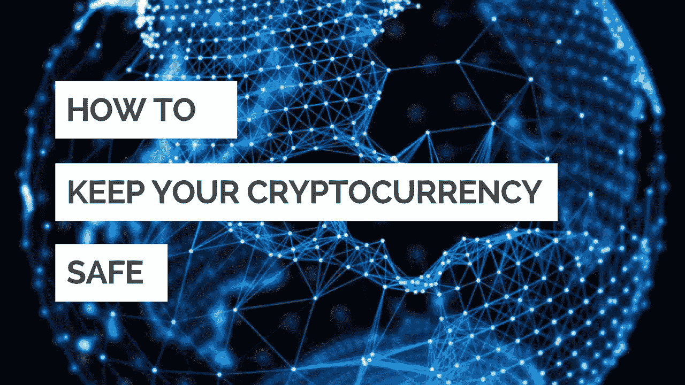
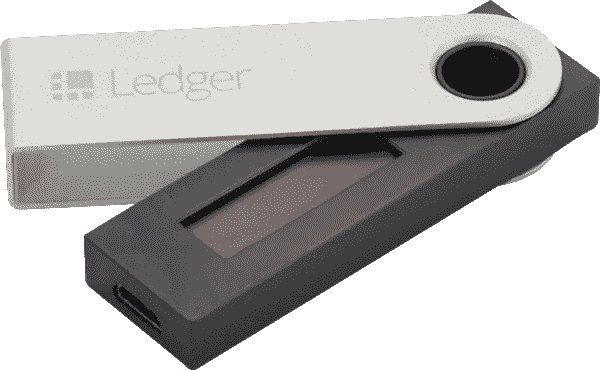

# 保护你的加密蛋免受黑客攻击

> 原文：<https://medium.com/swlh/safeguard-your-crypto-eggs-from-hackers-f503f066d217>

像美元和欧元这样的传统货币可以存在银行或钱包里。但有了加密货币，事情可能会变得有点复杂。

加密货币储存在区块链。就像银行有账户名和账号一样，加密货币在区块链有它们钱包的地址。每个钱包都有一个公共地址和一个私有地址。公共地址是您接收代币/代用币的地方，而私人地址是访问您的钱包或发送代币/代用币的关键。

准确地说，你永远不会在钱包里存放代币。您存储的是钱包中的公钥和私钥/地址。

有 5 种不同类型的钱包:

*   **桌面钱包** —顾名思义，桌面钱包可以下载并安装在电脑上。然而，风险总是存在的，如果你的桌面被黑客攻击或感染病毒，你可能会失去你的资金。这是官方[比特币钱包](https://bitcoin.org/en/choose-your-wallet)的链接。
*   **手机钱包** —手机钱包是基于应用程序的钱包，易于使用且随时可用。虽然，如果你的手机被盗或被黑，你可能会失去你的资金。[面包钱包](https://breadapp.com/)是适用于 iOS/Android 的比特币手机钱包。
*   **在线钱包—** 在线钱包是储存硬币的最简单方式，但也是最不安全的。所有的交易所都有内置的在线钱包。[比特币基地](https://goo.gl/gi8oxa)和 [MyEtherWallet](https://www.myetherwallet.com/) 就是两个最好的例子。
*   **纸钱包——纸钱包是存放硬币最安全、最便宜的方式之一。纸质钱包是打印出来的公钥和私钥，通常包含二维码。但是你必须保证它远离水和火。**
*   **硬件钱包(冷藏)——**硬件钱包是迄今为止最安全、最方便的储存硬币的方式。 [Ledger Nano S](https://goo.gl/BcfG4r) 和 [Trezor](https://trezor.io/) 是最受欢迎的选择，专门用于存储公钥和私钥。

Ledger Nano S

在我看来，硬件钱包是加密货币最好最安全的选择。这有点贵，但过一会儿你就会看到它的好处。

安全总比后悔好！

[**跟随 Medium**](/@akki11042011) 来到这里，并确保给这个鼓掌，以帮助更多的人轻松找到他们的密码问题的答案。

**刚接触隐体诗？**可以在 [**Cex.io**](http://goo.gl/DU8Ze2) 或者 [**比特币基地**](http://goo.gl/gi8oxa) 购买比特币和以太坊。你可以在 [**币安**](http://goo.gl/NYivTX) 或者[**changely**](http://goo.gl/nuy9D4)用你的 BTC/ETH 购买山寨币。安全离线存放你的硬币的硬件钱包— [**账本钱包**](http://goo.gl/BcfG4r) 。

免责声明:这篇文章包含附属链接。这意味着如果你选择注册一个项目或者使用我的链接进行购买，我可能会获得佣金。

此外，请查看[2018 年投资的五大加密货币](https://hackernoon.com/with-more-than-1300-altcoins-listed-on-coinmarketcap-its-not-an-easy-task-to-determine-which-7f950671f2f1)

## 这篇文章发表在 [The Startup](https://medium.com/swlh) 上，这是 Medium 最大的创业刊物，拥有 307，492+读者。

## 在这里订阅接收[我们的头条新闻](http://growthsupply.com/the-startup-newsletter/)。

