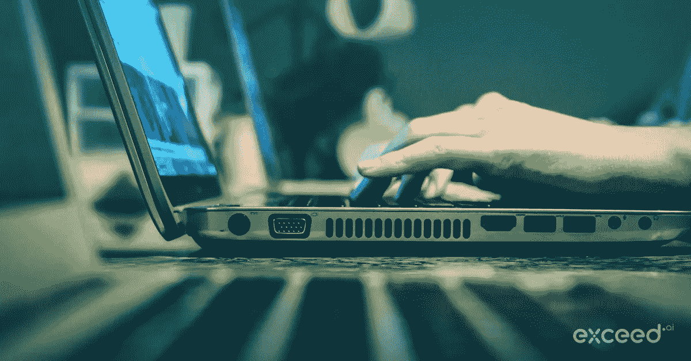

# 销售邮件——抑制销售冲动

> 原文：<https://medium.com/swlh/sales-email-resist-the-urge-to-sell-fea3d80c8ee2>

高管每天会收到 140 多封电子邮件，不管电子邮件自动化程度如何，你的电子邮件出现在他们面前的可能性微乎其微。

一封好的以客户为中心的电子邮件的关键是提供价值和抵制销售的冲动。

作为一名销售人员，你的目标是展开对话，这样你就可以向潜在客户展示你的产品或服务如何解决他们的问题并提供价值。要做到这一点，你的邮件不要太长，否则就没人看了。

许多潜在客户邮件中的一个常见错误是试图涵盖你的所有基础——价值主张、预约会议、为什么是你的公司、你有什么不同等等。

写一封专注于一个简单的价值主张的好的潜在客户邮件是一门艺术也是一门科学。

## 一封电子邮件就像一个小故事

每封电子邮件都应该像一个小故事，因为它的结构应该能够引起读者的回应。

一封好的以客户为中心的外发邮件需要包含以下几个部分:

1.  **使其相关—** 在你的电子邮件中使用上下文，表明你已经做了调查。参考类似的客户情况和/或任何你们的共同点。
2.  **提供价值**——提供一些与收件人相关的东西，比如案例研究、博客帖子或视频，可以教给他们一些新东西。
3.  **行动号召** —根据具体情况，行动邀请可以是网上研讨会、会议或见面会等活动，甚至只是一个保持联系的回应。

## **这里有一个简短的例子:**

**要有针对性——展示你已经做了调查**

> 您好，Melissa，
> 我看了您的 LinkedIn 个人资料，发现您是 Monday.com 公司 SDR 团队的负责人。
> 像您这样的 SDR 领导者面临的一个常见问题是优先处理和处理大量的潜在客户。

**提供价值——提供洞察力和有形资产**

> 思科的一位 SDR 负责人面临着同样的挑战。这里有一个 [**案例研究**](https://exceed.ai/product/) 的链接，展示了如何通过使用 Exceed.ai 的**虚拟 SDR 助手**，他们能够处理每一个线索，并将合格机会的数量增加了 81%。

**请求—使电子邮件具有可操作性**

> 梅丽莎，你觉得这适用于你吗？

## **最佳实践:**

*   少即是多。保持简短扼要。它需要适合手机屏幕。
*   说重点。不要以“我的名字是…”
*   不要道歉——“抱歉打扰你了……”
*   减少“我”、“我们”和“我们”的数量。应该是关于前景，而不是你。
*   没有必要在第一封邮件中开车去开会。“你有 15 分钟时间接听电话吗”
*   如果你们有任何共同点，比如你们在同一所学校有共同的朋友——那就推荐一下。
*   避免附件
*   在行动号召之前，用对方的名字来吸引他/她的注意力。“乔恩，你有没有经历过……”

## **主题行:**

主题是决定邮件打开率的首要因素。
避免点击诱饵:“必须现在打开”和诸如“客户关系管理”之类的套话

创建一个主题行，激发收件人打开邮件的欲望。

一个好的做法是引用你解决的问题。“太多未接触的潜在客户”或“浪费时间寻找不合格的潜在客户”。

我最好的建议是简单地测试一下，看看什么最有效。

## **复习和测试**

*   A/B 测试一切，但一次只做一件事。主题行、行动号召、电子邮件正文等。请注意，根据你的目标受众，一封电子邮件可能效果更好。
*   确保与团队中的其他人一起查看您的电子邮件。反馈是你可以使用的最好的工具。

既然您已经了解了如何让客户打开您的电子邮件并回复您，那么就在您的第一次通话中找出与潜在客户交谈的最佳方式— [而不要扼杀销售！](https://exceed.ai/curiosity-does-not-kill-the-sale/)

## 这篇文章发表在 [The Startup](https://medium.com/swlh) 上，这是 Medium 最大的创业刊物，有 344，974+人关注。

## 在这里订阅接收[我们的头条新闻](http://growthsupply.com/the-startup-newsletter/)。

