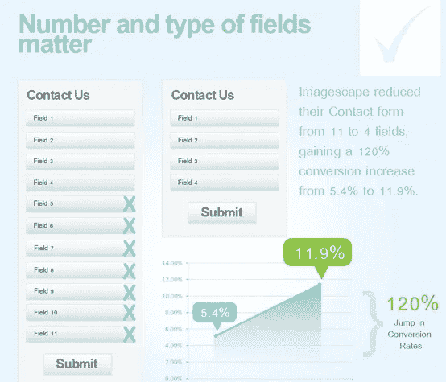
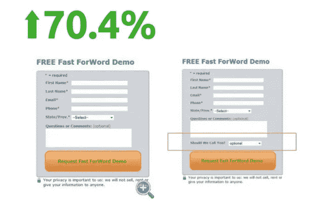
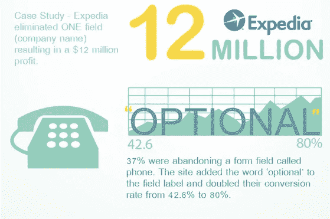
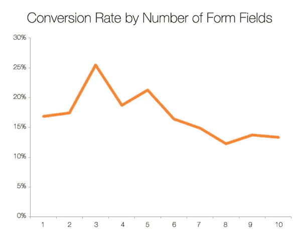
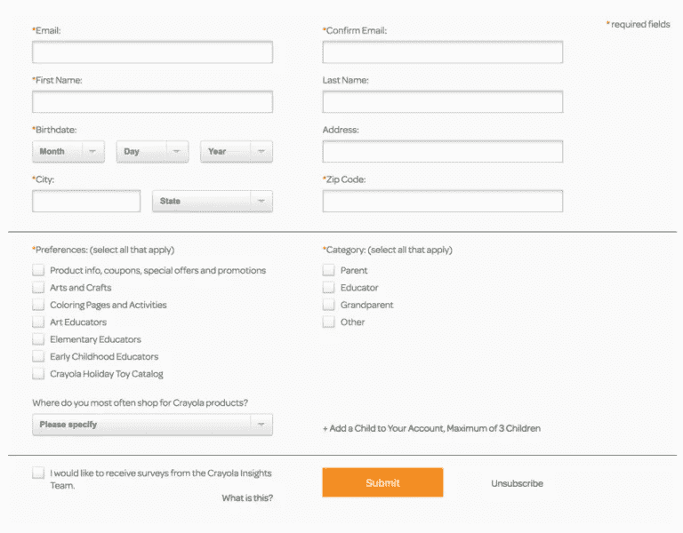
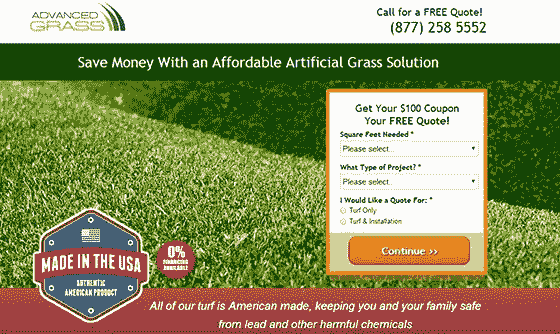
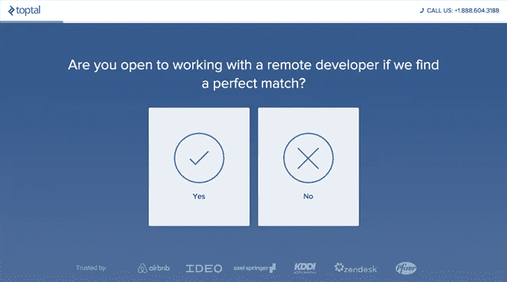

# 销售线索形式:根据研究结果选择最佳规模

> 原文：<https://medium.com/swlh/sales-lead-forms-choosing-the-optimal-size-according-to-the-research-results-6e080febfb37>

**引导表单**(或捕获表单)是网站或[登陆页面](http://blog.icondesignlab.com/en/2017/how-to-escape-the-most-expensive-mistake-while-ordering-landing-pages/)的主要部分之一，用户可以在这里给出自己的个人信息。它帮助用户订阅时事通讯或联系公司。今天，我们向您展示如何改变一个简单的销售线索表单的大小，可以将网站的转化率提高 120–240%。

如果表单中有太多的字段，用户填充它们的欲望就会降低。然而，如果只有几个字段，那么你得到的关于用户的信息就少了。

那么，如何选择最佳的引线形式尺寸呢？

我们已经收集了长引线和短引线形式的利弊。几个案例将向您展示如何通过改变字段的数量将转换率提高数倍，从而让您能够确定哪种销售线索形式最适合您。

# 短引线形式:优点和缺点

短引线表格通常有 1 到 3 个字段。这种引线形式有几个优点:

*   它很紧凑，这使得你可以把它放在任何网站上
*   有一两个领域更容易理解
*   用户不需要花费太多精力来填写它
*   它不需要用户提供太多的个人信息

例如，Webdesigner News 的订阅表单只有一个字段和一个“订阅”按钮。

短引线形式被认为具有更好的转化率，我们收集了最有趣的案例来强调这一事实。

## 证明销售线索表单字段数量减少可以提高转化率的 3 个案例

1.ImageScape 将其订阅表单中的字段数量从 11 个减少到 4 个，从而将转化率提高到 120%。

ImageScape 将他们的联系形式从 11 个字段减少到 4 个字段，转化率从 5.4%增加到 11.9%，增加了 120%。[图片来源](https://unbounce.com/conversion-rate-optimization/how-to-optimize-contact-forms/)

2.第二个案例——Gemm 学习服务专家[市场调研](https://autogrow.co/37-best-conversion-optimization-case-studies/)。

A/B 测试对两种铅形态进行了测试。第一种形式有 6 个字段，第二种形式有 7 个字段。这是一个要求打电话的下拉列表。

70.43%的人在没有电话选项的情况下完成了表格，从而表明简短的表格更有效。

结论是，你提供的交互选项越多，就越有可能迷惑顾客，让他们偏离主要目标行动。

3.Expedia 的第三个案例。

从销售线索表单中删除“公司名称”字段使该公司获得了 1200 万美元的收入。

37%的人放弃了名为“电话”的表单域该网站在字段标签中添加了“可选”一词，使他们的转化率从 42.6%提高到 80%，翻了一番。

## 证实短导联形式有效性的研究

HubSpot 的 Dan Zarella 对最佳表单长度进行了研究，分析了 4 万多个登陆页面。他展示了转换率如何与 lead 表单中字段数量的增加相关联。

具有三个字段的表单具有最好的转化率。随着字段数量的增加，转化率降低。

[他还发现](https://blog.hubspot.com/blog/tabid/6307/bid/6748/3-form-fields-that-kill-landing-page-conversion-rates.aspx)要求提供个人用户数据的表格会降低转化率:

*   如果加上“年龄”字段，转化率下降 3%。
*   如果增加一个“电话号码”字段，则下降 5%。
*   如果您请求一个地址，转化率可能会下降 2–4%。最重要的是，与请求城市或州相比，输入街道名称的请求降低了转化率。

案例研究证明，短引线形式对用户更方便，减少输入字段的数量可以大大提高转换率。但是尽管有这些优点，还是有一个明显的缺点。您可以获得关于用户的最少信息，这意味着:

*   没有办法通过兴趣、活动领域或其他标准来组织受众。
*   信息的缺乏使销售和市场部门变得复杂。

因此，为了使与用户的第二次接触更加个性化，你必须将表单加长。

# 使用长前置表格的利弊

如果 lead 表单有三行以上要填写，则认为它很长。从上述研究中，我们可以得出结论，用户对额外的输入字段特别反感:

*   他们不愿意浪费时间填写你需要的信息。
*   他们对披露更多个人信息的要求感到震惊。
*   他们不方便从移动设备上填写所需的文本。

为什么仍然使用长引线形式？

因为它们也有许多优点:

*   这种形式提供了更多高质量的线索。如果一个人花时间和精力填写了所有的字段，这意味着用户真的对你提供的东西感兴趣。
*   您有足够的数据来组织受众，并创建与您的特定受众更相关的简讯。

[克雷奥拉的](http://www.crayola.com/)建议填写的表格:

因此，公司为用户准备了更相关的时事通讯。

## 证明长销售线索形式也能提供高转化率的案例

1.[在高级 Grass 网站上研究](https://conversionxl.com/blog/web-form-optimization/)

一个简单的三个问题的表单(姓名、电子邮件、电话)被改成了包含七个字段的更长的表单。

用户分两个阶段填写该表单。此外，表格本身也不同于通常的表格，更像是一个测试。

经过这样的改变，转化率提高了 214%。

这个例子有一个重要的细微差别:开发人员用一个长表单制作了两个短表单。这样一来，用户填写第一部分(只有三个字段)并不困难，然后他们已经有了填写第二部分的动力，仅仅是因为他们不想放弃他们开始的东西。

2.从[到](https://www.ventureharbour.com/high-converting-lead-generation-forms/)的长引线表格示例

TopTal 更进一步，创建了一个很像测试的 lead 表单:

屏幕只显示一个问题。

这个不寻常的长格式是经过深思熟虑的:

*   条件逻辑用于根据不同用户之前的回答向他们提问。
*   有一个绿色指示器，显示已填写表格的百分比。
*   当表格完成 40%时，应用程序被发送到销售部门。

所有这些案例都证明了长表单也可以有很好的转化率，尤其是如果那个表单看起来不错的话。

# 选什么？

当你选择网站的引导形式时，你必须首先明白越小越好。此外，如果您想添加一个字段，请仔细考虑它的合理性。为此，您必须回答以下问题:

**1。你的领导形式的主要目标是什么？**

如果你需要一个用户群，那么一两个字段就足够了。如果用户提交活动申请，则需要附加信息。

**2。用户的动机是什么？**

为了让用户填写更多的字段，向他或她承诺一些有用的东西，比如免费的审计、奖金，或者为他们提供更多相关的、有价值的信息。

**3。你将如何处理给定的信息？**

如果你可以在没有额外信息的情况下操作，那么尽一切办法去做。如果数据是以某种方式收集的，并且你不使用它来进一步细分或销售，不要用不必要的字段折磨用户。

**4。lead 表单可以放在哪里？**

简短的领导形式可以放在几乎任何网页和网站上。长的在这方面就没那么灵活了。

**5。领导形式会是什么样的？**

如果它看起来像一个有几个步骤的测试，并且有一个不寻常的设计，没有文本墙，那么填写表单的概率会更高。

但是请记住，遵守所有这些建议不会给你一个 100%准确的答案，即你的网站的最佳领导形式的大小。在 A/B 测试、深思熟虑的文本和[高质量图形](http://www.icondesignlab.com/en/)的帮助下，可以达到最佳效果。

## 这个故事发表在[的创业](https://medium.com/swlh)上，这是 Medium 最大的创业刊物，有 356，974+人关注。

## 订阅接收[我们的头条新闻](http://growthsupply.com/the-startup-newsletter/)。

