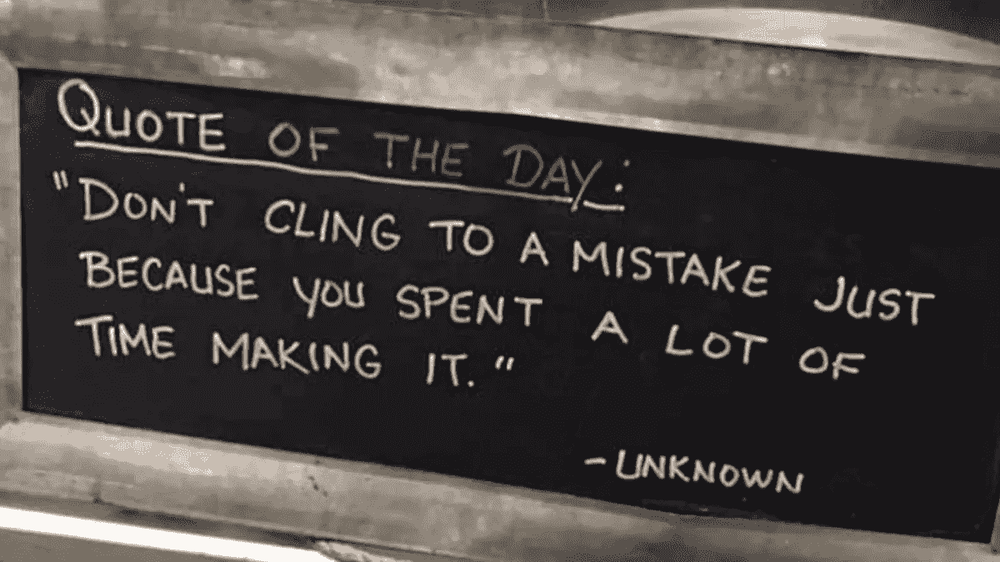

# 销售与品牌(60 秒内)

> 原文：<https://medium.com/swlh/sales-vs-branding-in-60-seconds-cfa47a91a322>

## 叉子和刀子都是器具。但是，就像销售和品牌一样，它们都服务于一个确切的目的，并且不可互换。这是获胜品牌用来粉碎向世界介绍某样东西时遇到的冷漠。有一门艺术和一门科学。但首先，你需要知道这两者之间的区别。

在公司中，销售和品牌之间有很大的混淆。

> 加里·维纳查克说得很好，“品牌和销售的区别很简单。你是想改变还是想创造一种体验？后者永远是赢家。”

这是《周三一分钟》第 12 集的主题。

# 做蠢事的时间越长，并不会变得更聪明(或更有效)

Animation credit: [**@Johnnny2x4**](https://giphy.com/channel/Johnnny2x4)

在我的新书中， [*品牌介入，*](http://a.co/6HUFJkG) 我用四个字来定义什么是品牌，“差异化的艺术”

如果理解得好，品牌可以帮助人们确定哪种产品或服务最适合他们以及他们的需求。

销售是帮助他人获得他们需要或想要的东西的活动。在销售之前，他们需要发现自己需要什么。

每项活动(销售和品牌)都提供 ***帮助*** 。这就是它们重叠的地方。

他们的不同之处在于:

*   人们尽可能多地推出有用的信息来提供帮助。
*   另一种是拉人来帮助完成交易(销售)。

# 销售和品牌的问题

当公司试图给某样东西打上品牌时，问题就出现了。他们通常会看看其他公司在做什么，然后试图“做他们自己的版本”其他人已经在做的事情。

那是 ***而不是*** 领先。那就是*以下。*那就是*抄袭。那是抄袭。*

这是差异化的失败(这是你品牌化的唯一原因)。

如果你回头看看加里·维在上面写的，你会发现，创造一种体验并停留在短期的眼光上(否则可能会成为一生的关系)也是一种失败。

品牌是一项长期任务。

销售通常是短期行为，就像现在的*一样。*

如果你既聪明又细心，你可以两全其美，在销售和品牌推广方面获得最佳效果。

***怎么*** 到底是什么？这是我在本周的*第 12 集*周三一分钟中报道的内容:

掌握其中的每一项，并了解它们在你的商业关系中各自的作用，你将变得不可阻挡。

*最初发表于*【www.risingabovethenoise.com】

**

## *这篇文章发表在 [The Startup](https://medium.com/swlh) 上，这是 Medium 最大的创业刊物，有 308，471+人关注。*

## *订阅接收[我们的头条新闻](http://growthsupply.com/the-startup-newsletter/)。*

**