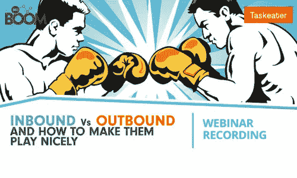
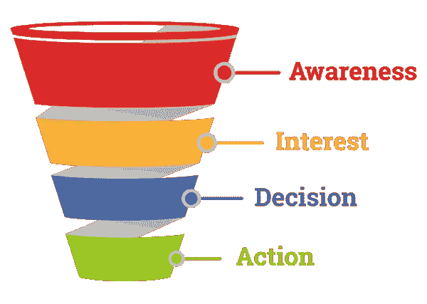
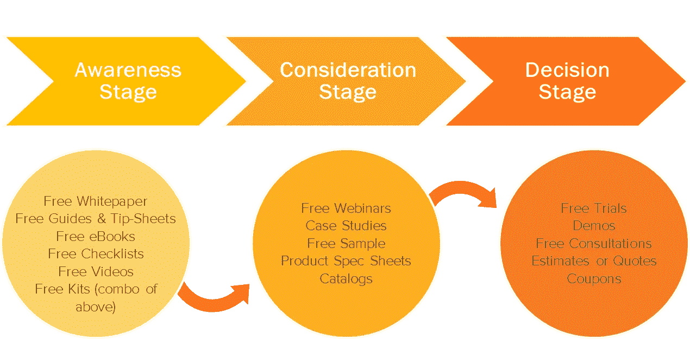
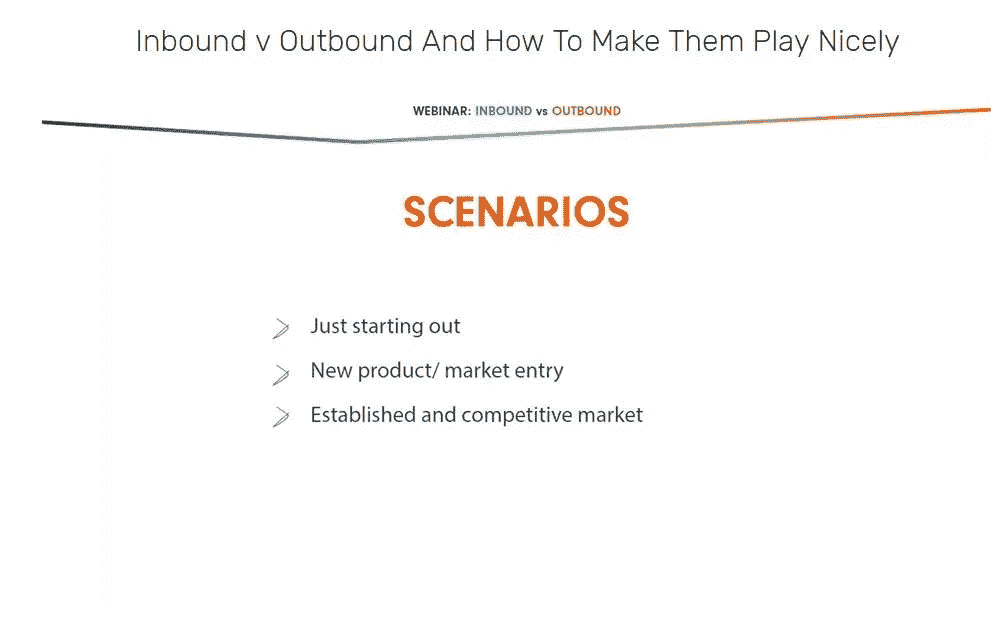

# 饱和买家的旅程:入境和出境的强大组合

> 原文：<https://medium.com/swlh/saturating-the-buyers-journey-a-powerful-combination-of-inbound-and-outbound-17b31205c6e6>

入境和出境营销和销售方法最终都有一个共同的目标:转化。内向和外向轨迹——吸引潜在客户、培养潜在客户和关闭客户——有很多共同之处。在购买者的整个旅程中，入站和出站可以相互支持，本文探讨了如何在每个阶段充分利用两者的优势。

正如许多文章指出的那样，为你的企业选择战略不应该是一个非此即彼的决定。我们主要是一家外向公司，我们开展电子邮件活动，为我们自己和全球 200 多家客户创造外向销售机会，因此将采用更传统、更直接的销售方法。然而，我们有博客，我们创作电子书，支持行业研究(见我们最近与《演讲家》和《泰晤士报》关于[外包的未来](https://www.taskeater.com/insights/what-is-the-future-of-outsourcing/)的报道)，并参加网络研讨会。

我们不会推行一种单边的、一刀切的对外解决方案，尽管我们当然可以这样做。原因很简单，因为外向和内向相互支持，相互促进。

我之前探讨了外向如何支持内向营销工作([外向可以支持你的内向营销的 4 种方式](https://www.taskeater.com/insights/outbound-sales-supports-inbound-marketing/))，但在本文中，我将更多地关注两者的结合如何在购买者的整个旅程中成为强大的资产。

我将详细介绍入境买家的旅程和销售漏斗，然后阐述入境和出境策略如何在流程的每个阶段结合起来。

为了更全面地了解相似之处、不同之处以及您可以为您的企业利用的可能策略， [**请收听我们与入境专家 BBD Boom**](https://www.taskeater.com/downloads/inbound-outbound-lead-generation/) 的网络研讨会。注册并立即在您的收件箱中收到完整的录音。

# 快速回顾一下:入站和出站之间的区别是什么？

为了避免用术语和技术术语迷惑你，让我们从一开始就弄清楚什么是入站和出站。

入站和出站方法是营销和销售方法，最终目标是产生销售线索和推动销售。

两者区别的线索就在名字中:

*   **呼出**是您向潜在客户发送一条或多条信息的地方。这可能包括电子邮件推广、电话营销、横幅广告等。你正在积极寻求潜在客户的任何营销
*   **呼入**是指潜在客户通过制作信息丰富、引人入胜的内容，自愿进入你的网站或邮件列表。这可以通过你的博客，下载电子书，注册时事通讯或网上研讨会等。

在我的文章— [内向与外向—哪个真正有效中，阅读更多关于这些策略，以及它们的优点和局限性？](https://www.taskeater.com/insights/outbound-marketing-v-inbound-marketing/)

# 入境买家之旅与销售漏斗

我想在这里强调的是，入站和出站并没有什么不同。他们有共同的轨迹和共同的目标，这意味着他们是兼容的。

每一个集客营销人员都非常熟悉 Hubspot 的[买家之旅](https://blog.hubspot.com/sales/what-is-the-buyers-journey)——集客营销和理念的核心。这一旅程贯穿了潜在客户在购买过程中经历的三个关键阶段。

**对于不太熟悉的人，我将简要介绍一下入境买家的旅程:**

(图片鸣谢:[影响](https://www.impactbnd.com/blog/what-is-the-buyers-journey))

1.  **认知阶段:**你的买家意识到他们有问题，但不确定如何解决。
2.  **考虑阶段:**买家了解他们的问题所在，他们正在研究最佳解决方案。
3.  **决策阶段:**买家现在知道他们想要什么，他们正在寻找最好的产品或最畅销的产品/服务。

尽管支持内向型和支持外向型的人之间存在矛盾，但作为任何内向型战略核心的买家之旅，与传统且广受欢迎的销售漏斗并无不同。

**简单来说，销售漏斗的阶段如下(这当然是简化的):**

(图片鸣谢:[邮件大嚼](https://www.mailmunch.co/blog/sales-funnel/))

1.  **认知阶段:**潜在客户通过广告或某种形式的外展活动了解了你现有的解决方案、产品或服务。他可能已经意识到了这个问题，或者实际上由于外展而意识到了这个问题，并认识到需要处理这个问题。
2.  **兴趣阶段:**潜在客户在积极寻找他的问题的解决方案和实现目标的途径。
3.  **决策阶段:**潜在客户正在积极地为他的问题决定一个解决方案，查看各种解决方案和产品，当然在决定你的解决方案是最好的之前。非常注重你所提供的东西的细节(包装和选项)。
4.  **行动阶段:**一次转换！要约被提出并被接受，潜在客户就成了客户。

这是漏斗的简化版本，旨在简单地展示入站和出站份额的相似性。当然，你的销售漏斗可能还有其他阶段，比如激励客户成为品牌倡导者和推荐客户。

内容营销对任何集客战略都至关重要，重点是为这三个阶段中的每一个阶段制作内容，以推动潜在客户完成他们的旅程。内容应该根据每个阶段来创建，如下所示:

*   **认知阶段——漏斗顶端内容(豆腐)**:吸引目标潜在客户并激起他们兴趣的内容。在这个阶段，潜在客户不太关注，甚至可能没有意识到他们的问题
*   **考虑阶段——漏斗内容的中间部分(MOFU):** 围绕特定问题和可能的解决方案的内容。潜在客户意识到他们的问题，并积极寻找解决方法。
*   **决策阶段——漏斗底部内容(富博):**与您的特定服务或产品相关的内容。潜在客户正在为他们的问题选择解决方案，而你希望这个决定成为你的产品或服务。

当前围绕集客买家之旅的想法当然是以集客为中心，如下图所示，通过各种内容吸引潜在客户并引导他们完成买家之旅。

(图片鸣谢: [Synerge 营销](https://synergemarketing.com/blog/understanding-content-marketing-strategy-stage-buyers-journey/))

现在，我将介绍每个阶段，并展示如何利用入站和出站来提高每个阶段的信息传递效率，从而增加销售。

# 意识阶段——也称为领先一代

最终，认知阶段是挖掘和寻找潜在客户。

当然，内向和外向来源的销售线索是不同的，而且有理由说明内向销售线索产生的持久性和复合效益([在此阅读更多信息](https://www.taskeater.com/insights/outbound-marketing-v-inbound-marketing/)):吸引潜在客户，而不是接近他们，意味着你知道他们肯定对某个领域感兴趣，他们可能正在经历一个你可以帮助解决的问题，他们会更容易接受你的信息。

需要明确的是，潜在客户可能会为了他们认为有价值的内容而放弃他们的联系方式:订阅时事通讯、电子书或白皮书下载、免费咨询、网上研讨会注册等。

外向潜在客户挖掘包括潜在客户挖掘，无论是你自己还是通过 Taskeater 等公司，这样你就可以识别出可能遇到问题或使用你的解决方案的人。

有了 Hubspot 这样的平台，你可以通过他们下载的内容来跟踪和评估潜在客户的兴趣水平，根据他们的需求水平来调整你的方法。这当然凸显了集客和内容营销的一个关键问题，即基于认知的内容(豆腐)，即吸引大量访问者的内容，通常是基于兴趣的，而不是基于问题的。正如上述阶段所强调的，处于这一阶段的潜在客户可能甚至没有意识到他们遇到了问题。他们可能只是感兴趣。

外向销售线索挖掘意味着您的目标是可能需要您的解决方案的潜在客户，但是您可能只有一次机会接近他们。你能有多准确地预测当然会极大地影响你的营销活动结果和转化率，但重点仍然是。你的方法也一样(出站营销被称为中断营销是有原因的！)

搜索也是集客营销方法的一个支柱，它避免了这个问题，因为关键字可以更清晰、更准确地描述潜在客户的兴趣和问题。如果有人搜索了“如何生成销售线索”并点击了我们的内容，我们知道他们需要生成销售线索。

随着技术的不断进步，你描述和吸引人们的过程已经有了很大的进步。我们现在能够以新的方式衡量意向和兴趣，这意味着您可以在潜在客户进入谷歌搜索并点击最高出价者之前，针对他们的问题发送相关信息。

将出站显示目标、赞助内容或电子邮件信息与有针对性的“卓越”内容相结合，可以让更多人对您的网站感兴趣。

## 可操作的见解—利用对外宣传活动推广内容并扩大受众

*   **赞助内容活动。**你可以使用脸书、LinkedIn、Twitter 或像 Taboola 这样的内容分发平台向更广泛的受众传播你的内容，如果你刚刚起步，这一点至关重要。这通常没有直截了当的销售产品那么烦人，而且可以利用出站策略将您的内容传递给更广泛的受众。
*   **内容可以加强传统邮件的外联。**您可以通过包含发人深省的内容，展示您在某个领域的领导力，从而在拓展销售线索的活动中更有说服力。
*   有趣的观众。像脸书、Twitter 和 LinkedIn 这样的平台能够根据兴趣对受众进行细分，这样你就可以在可能对你的解决方案或至少是你的内容感兴趣的新受众面前展示你的产品或内容。

# 考虑阶段——也称为线索培育

在入境买家的旅程和销售过程中，在认知阶段吸引了潜在客户后，你必须帮助他们认识到自己的问题，并开始研究解决问题的方法。最终，这是销售线索培育。

集客销售线索培育包括在下载或注册后跟进，询问潜在客户是否有任何未回答的问题或需要任何帮助。如果潜在客户订阅了时事通讯，您可以将此作为一个平台，向他们展示更多销售或产品导向的内容，或推广问题导向的内容，以衡量他们的需求和兴趣。针对入站的主要问题之一是这是一个缓慢的过程。你无法仅通过认知水平的内容了解潜在客户的销售准备情况。

虽然呼出是向目标潜在客户提供他们可能需要或想要的产品的一种直接方式，但不能保证在您接触他们时，您的潜在客户已经做好了销售准备。他们可能没有意识到他们有问题。他们可能有其他服务提供商。他们可能没有为你服务的预算。他们可能不认为这个问题是优先考虑的。出站的主要问题是，你可能会与不准备购买的潜在客户断绝关系，这种方法缺乏入站内容的持久性。

你可以通过跟进邮件来培养外向潜在客户(只要他们没有要求不要再联系他们)，但通过利用有趣的内容或向由于时机不佳而放弃你的产品的潜在客户宣传你的简讯，你正在以一种更有吸引力的方式培养他们。你的内容甚至会让他们更加意识到他们的问题或者对你的解决方案的需求。

在此阶段，有多种方法可以同时利用入站和出站来绕过这些问题。专注于潜在客户培育的公司创造了 [50%以上的销售额](https://www.protocol80.com/blog/30-shareable-buyers-journey-statistics-every-marketer)，而花费却减少了 33%。

## 可操作的见解—重新定位相关方并利用呼入列表

*   **重新定位于富博，服务或产品导向的内容。**这些人表示他们有问题或对兼容领域感兴趣，为什么不针对他们的问题或兴趣重新定位呢？
*   **匹配受众活动**(LinkedIn 上的匹配受众、Google 上的客户匹配、AdRoll 上的 CRM 受众、脸书上的定制受众和 Twitter 上的定制受众)允许您锁定联系人电子邮件地址列表，这是一种使展示活动更具针对性的好方法。这可以是包含有趣内容或产品的生成销售线索列表，也可以是包含更多销售就绪或基于产品的内容的呼入销售线索列表。

# 决策阶段——也叫结案陈词

决策阶段是一个关键点，在这个阶段，潜在客户既认识到了他们的问题，又研究了他们的解决方案。他们准备购买，但他们会选择您的解决方案吗？

从入站和出站的角度来看，达到这一阶段并不容易。《财富》500 强公司平均报告[2 . 4 亿美元的潜在收入损失](https://www.protocol80.com/blog/30-shareable-buyers-journey-statistics-every-marketer)，这主要是由于消费者“被困”在销售漏斗的某个特定部分。

销售漏斗过程到达这个临界点要快得多，尽管只有一小部分你的原始清单会在这里结束。对于集客来说，达到这一点可能需要很长时间，这取决于您的潜在客户对他们的问题的认识和对潜在解决方案的研究，尽管我们有所有可用的新技术，但这很难衡量。

这里需要注意的一点是，富博内容，特别是关于你的服务和产品的内容，需要作为任何内容营销策略的一部分加以利用。越近越好。根据研究，提供有针对性的内容和优惠会导致[比普通产品多 20%的销售机会](https://www.protocol80.com/blog/30-shareable-buyers-journey-statistics-every-marketer)。

使用内容、简讯和社交媒体进行销售和营销可以增加你的集客转化率，在你的销售活动中使用富博内容可以加强你的宣传。

*   **邮件外联。**有了基于兴趣的合格销售线索(网站跟踪)，您就能够确定哪些销售线索更适合销售，并调整您的销售方法。有了与他们互动的内容的想法，你也能够更具体地针对他们的问题领域和他们正在经历的事情来定制你的推销。
*   **通过您的内容和简讯进行销售。一旦人们注册了时事通讯，并开始定期阅读你的内容，你就有了可以开始更具体地销售的受众。使用您的内容向您的潜在客户推广销售就绪型产品。利用重新定位和匹配的受众活动来强调该产品。**
*   通过以下方式向你的社交媒体销售。这个和上面差不多。如果你因为你的内容而在社交媒体上积累了追随者，把它作为一个平台来分享更多的销售信息和产品，以鼓励转化，并加快缓慢的入境之旅。

# 记住，你的战略要以你的业务目标为基础

在开始任何策略之前，无论是对内还是对外，你都必须评估你现在所处的位置，你未来的目标是什么，以及如何与你的业务目标相适应。

没有放之四海而皆准的策略，正如我希望我在上一篇文章中所展示的那样，链接如下:

*   [入境与出境——哪个真的有效？](https://www.taskeater.com/insights/outbound-marketing-v-inbound-marketing/)
*   [4 种外向营销方式可以支持你的内向营销](https://www.taskeater.com/insights/outbound-sales-supports-inbound-marketing/)

如果你想为你现在所处的位置和你想要实现的目标找到正确的策略，我强烈建议你收听我们的 BBD Boom 网络研讨会[(注册并立即在你的收件箱中收到完整的录音)。下面的幻灯片展示了我们对 3 个关键场景的细分，我们将详细讨论这些场景的策略。](https://www.taskeater.com/downloads/inbound-outbound-lead-generation/)

# Taskeater 如何提供帮助

我们开展了对外宣传活动，并帮助全球 200 多家客户制定了有效的增长战略。我们知道如何在组合策略中利用您的最佳内容，从而取得成效。

我们提供专家发现和潜在客户创造服务，我们的专业知识可以帮助您为您的产品或服务制定正确的目标标准。

[联系并咨询我们的专家，为您的企业寻找战略。](https://www.taskeater.com/contact-us/)

# 作者:丹·范伦宁

Taskeater 的常务董事，Taskeater 以前的客户之一。他有 16 年的销售经验，两个男孩，热爱橄榄球。[接丹。](https://www.linkedin.com/in/dan-vanrenen/)

## 这个故事发表在 [The Startup](https://medium.com/swlh) 上，这是 Medium 最大的企业家出版物，拥有 328，729+人。

## 在此订阅接收[我们的头条新闻](http://growthsupply.com/the-startup-newsletter/)。

