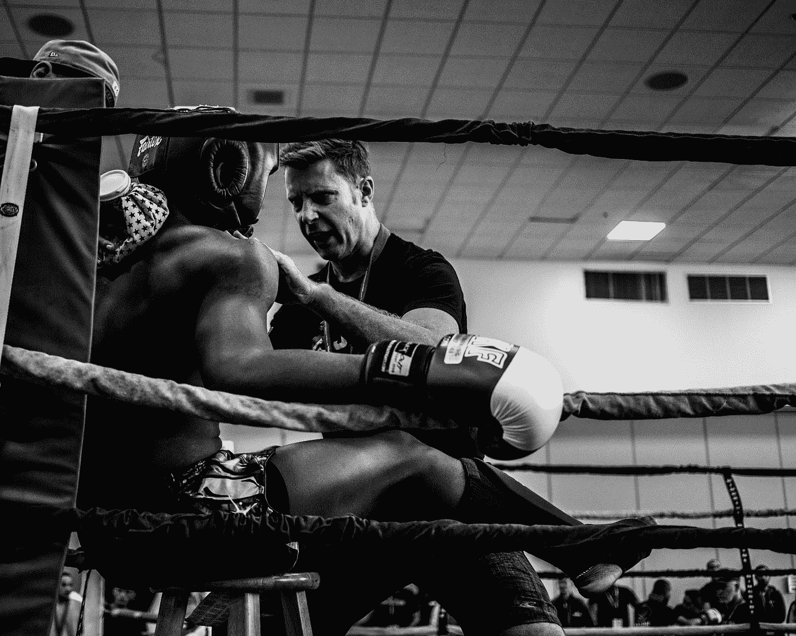

# 衡量你自己:作为一个创业创始人需要学习和成长的 12 项技巧

> 原文：<https://medium.com/swlh/scale-yourself-12-proven-techniques-to-learn-and-grow-as-a-startup-founder-e99ff6007990>

## 阅读我在从 0 到 300 名员工的创业之旅中学习和个人成长的方法，以及 30 岁以下的成功退出

Life-long learning. One of the most important founder skills. Photo by [Nik MacMillan](https://unsplash.com/photos/YXemfQiPR_E?utm_source=unsplash&utm_medium=referral&utm_content=creditCopyText) on [Unsplash](https://unsplash.com/?utm_source=unsplash&utm_medium=referral&utm_content=creditCopyText)

2012 年的一天，我走在汉堡易北河边的一条沙质小道上，突然脑子里灵光一闪。在过去的三年里，我一直在建立德国营销公司 RegioHelden，大学一毕业，我就独自创办了这家公司。我把公司扩大到 25 名员工，筹集了第一笔 100 万美元的风险投资，收入也在增长。**但我在首席执行官的职位上苦苦挣扎。在创办公司之前，我没有任何实际工作经验，所以我拼命工作，试图自己解决每一个问题。我觉得我没有帮助我的组织，因为一些员工已经辞职了——原因是“缺乏领导力”。**作为首席执行官，我感到精疲力竭、不健康、不开心。****

让我印象深刻的是一位非常有经验的企业家的评论，他那天和我走在一起。他离开了以前的公司，现在正在建立一家新的合资企业，总部设在柏林。他的家在汉堡，两小时路程。他的评论基本上是这样的:

> “我每周管理公司**一天**。我欠投资者的是一笔成功的生意，而不是在办公室里度过的时光。因此，我在周一与我的直接下属召开所有会议，然后在一周的其余时间离开办公室。”

Beautiful Hamburg in the summer. Good for sightseeing and learning. Photo by [Axel Ahoi](https://unsplash.com/@axelahoi?utm_source=medium&utm_medium=referral) on [Unsplash](https://unsplash.com?utm_source=medium&utm_medium=referral)

当然，我的目标不是减少 80%的工作时间，而是重组我的 CEO 角色。但是这个评论让我在接下来的几周里思考我的角色。这最终让我将更多的责任推给了公司的其他人。在这次谈话后的几个月里，我开始把我的时间和精力集中在我的强项和我喜欢的事情上(两者都非常相关！).

如果没有这种反思和我角色的微妙变化，我怀疑我是否能够将公司规模扩大到 300 多人，建立一个伟大的、自力更生的管理团队，并在 3 年后以 8 位数的价格卖掉它。在☀️汉堡美好的一天，我学到了很多

# 创业者的 12 个学习技巧

顾名思义，你不可能为第一次创业做好充分准备。你在实践中学习企业家精神。如果你不不断学习，你的公司将会超越你。

> “你通过实践来学习企业家精神。”

为了让你开始一生的学习之旅，我总结了 12 个(+1)技巧**，它们帮助我在 10 多年的旅程中学习和成长**,从一个 20 多岁的首次创始人成长为一家拥有 300 名员工的公司，完成超过 15 笔风投交易，多个并购项目，并发展成为我目前的投资者角色。

# 一般学习技巧

Think about learning as a strategic activity and put together an initial plan. Photo by [Maarten van den Heuvel](https://unsplash.com/@mvdheuvel?utm_source=medium&utm_medium=referral) on [Unsplash](https://unsplash.com?utm_source=medium&utm_medium=referral)

## 1.在你开始之前，先学会如何学习

在真正学习新东西之前，思考一下你的学习策略可能会有所帮助，以便变得更有效率和节省时间。

**你的学习方式是什么？你主要是通过阅读、听力还是做来学习？**就我个人而言，通过阅读、总结和向他人传授内容，我学到了最多的东西(猜猜我为什么在 Medium 上写这些内容😉).我还试着收集重要的学习内容，列在清单和思维导图中，我每个月都会浏览一遍(在[体式](http://asana.com/)或[思维导图](https://www.mindmeister.com/))。看到我一个月比一个月忘记了多少，真令人吃惊。

投入一点时间，想想如何学习最有成效。会有回报的。这个 coursera 课程可能也会有所帮助:[学习如何学习。](https://www.coursera.org/learn/learning-how-to-learn)

## 2.投入实践(就像你是运动员一样！)

This guy is probably practicing for something. Photo by [Edgar Chaparro](https://unsplash.com/@echaparro?utm_source=medium&utm_medium=referral) on [Unsplash](https://unsplash.com?utm_source=medium&utm_medium=referral)

一名职业运动员花 90%以上的时间练习，可能只有 10%的时间用于实际比赛。

我会说，就压力、表现、压力和适应的需要而言，成为一名初创企业创始人相当于成为一名职业运动员。但是作为一个创始人你实践了多少呢？对我来说，一开始是 100%“比赛”，0%“练习”/学习。

**随着时间的推移，我将大约 10%的时间(~ 6-8 小时/周)用于学习活动。你会意识到我在本文中提供的技术需要时间。当我回头看时，我会说那几个小时是我做过的最好的投资，因为它极大地改善了其他 90%的“竞争”时间。**

## 3.找出要学习的内容并创建知识地图

我经历了作为创始人的最初几年，收集了一些随机的东西。比如我在一次会议上听到有人讲公司文化，了解了一点。然后我去参加了一个领导力研讨会。第二天，我会读到一篇关于 KPI 的文章。你明白了...这种“随机学习”有价值，但进展缓慢。

创建某种**“知识地图”**关于**你已经知道的，你不知道的，尤其是你在当前阶段应该知道的**可能会有回报。

> “创建知识地图可能会有回报”。

例如，当你雇佣第一批员工时，积极学习人事管理是有意义的。不是几年前，希望也不是很久以后。

当我意识到我需要进行几轮融资时，我开始参加研讨会，阅读有关商业谈判的书籍，这对我后来帮助很大。

当你整理你的学习日程时，考虑合适的时机，你的公司所处的阶段，以及当前/未来的瓶颈。

# 向其他创始人学习

*我在公司实施的很多东西都来自其他有类似情况的创始人(就像我在汉堡的朋友)。记住，你的问题的解决方案几乎总是在别人的大脑中。*

Don’t forget to take notes when you are learning from other founders ;) Photo by [Alejandro Escamilla](https://unsplash.com/@alejandroescamilla?utm_source=medium&utm_medium=referral) on [Unsplash](https://unsplash.com?utm_source=medium&utm_medium=referral)

## 4.与其他创始人交谈

作为一名初创企业的创始人，身居高位是很孤独的。你的学校朋友可能不会“理解”你面临的困难。你的配偶可能自己不是企业家，可能也不明白。解决办法？**和其他创始人谈谈你面临的挑战。他们可能已经找到了解决办法。毕竟**你 99%的问题都不是你独有的**(虽然感觉很像！)而且之前已经被别人解决了。**

> “高处不胜寒。”
> 
> —每个第一次创业的人

为什么不主持或参加创始人聚会呢？如果你所在的城市还没有早餐会，为什么不举办一次月度创始人晚宴或早餐会呢？为什么不联系你大学/学校的其他创始人，和他们谈谈呢？

## 5.加入企业家组织(相信我这一点)

我怎么强调我从企业家组织的成员那里学到了多少知识以及我在自己的公司里运用了多少知识都不为过。**加入 EO 的确是我一生中做出的最好的决定之一。**

企业家组织把你和你所在地区的企业家们联系起来。你以 8-10 人的小组形式开会，每月一次讨论挑战。在我加入这个组织的前 5 年，我飞行了 600 公里(我想那大约是 100 万英里😉)每个月都到德国各地参加会议。完全值得。

全球有超过 15，000 名会员，组成了数百个地方分会。要获得申请资格，贵公司的年收入必须超过 100 万美元。如果你低于这个数字，但超过 25 万美元，你可以申请[创业加速器项目。相信我，你不会后悔的。](https://www.eonetwork.org/eo-acceleratorhttps://www.eonetwork.org/eo-accelerator)

*(如果你所在地区没有地方分会，请联系我，我会告诉你如何创建一个。)*

## 6.和其他创始人一起旅行，学习和娱乐

These are my founder travel buddies and I snowmobiling in Iceland. We also rode horses, but that’s a story for another day. Photo by a Viking.

我和企业家们一起参加了 SXSW 和 PubCon 这样的会议。一起旅行和共度时光可以建立一定程度的信任。信任能够促成关于实际问题和解决方案的深入对话(而不是通常的*“你的生意怎么样”、“太好了！!"*)。一起旅游不要去酒店。在 Airbnb 上租一间公寓，有一个大客厅。物有所值。

几年前，我开始至少参加两次年度**“创始人务虚会”**，我有 6 到 8 个密友，他们也是企业家。我们在一起度过了一段美好的时光，从彼此身上学到了很多东西。这也是我创办[数字创业者营](https://www.digitalfounders.camp/)的原因。

# 与导师、教练和行业专家一起塑造你的思维

每个职业运动员的背后，都有一个杰出的教练。在创业中，人们很容易迷失在日常活动中，因此对事物的外部视角是非常宝贵的。

Listen to your coach from time to time. Photo by [Wade Austin Ellis](https://unsplash.com/@wadeaustinellis?utm_source=medium&utm_medium=referral) on [Unsplash](https://unsplash.com?utm_source=medium&utm_medium=referral)

## 7.找一个适合你和你的公司所处阶段的导师

在第二或第三年，我和我的导师彼得谈论我们为办公室买的一台新的视频投影仪。他的问题是“花了多少钱？”。我回复了价格。然后我意识到这是一个很难回答的问题。他的回答是，“如果你知道投影仪的确切价格，你应该考虑一下你的优先顺序。你是 CEO 还是办公室经理？”。我一直喜欢彼得的交流方式😉

导师通常比你年长，积累了相关经验，并愿意定期与你分享这些经验。当我开始做 RegioHelden 的时候，我和我的导师 Peter 每天都会聊几次，因为我的桌子在他的办公室里。那对我来说是完美的环境。那些常规的 5 到 10 分钟的谈话被证明是非常宝贵的，因为我不仅可以向彼得请教，而且他还可以挑战我的思维和决策。我们可以谈论像战略这样的大事，也可以谈论像...视频投影仪和我的优先事项。

你应该从导师身上寻找什么？相关经验、关系网和信任。我认为关系中最重要的方面是你们两人之间的信任。你必须能够告诉你的导师你所想的一切。是的，即使你已经筋疲力尽，想要退出。在那种情况下，一个好的导师可能会帮助你。

**你如何找到一个好的导师？我通过一个共同的朋友(律师)认识了彼得。想想你网络中的老企业家。问问你认识的人。参加商务活动，接近那里的人。试着友好地给你的理想导师发邮件。)并邀请他们共进午餐。请不要认为师徒关系可以在一夜之间发展起来。好的导师通常有很多事情要做，不会等你出现。也许他们甚至不认为自己是导师。想想你能为他们做些什么。让他们投资你的公司？把他们和他们能从中受益的相关人员联系起来？分享你的知识，帮助他们解决具体问题？**

**导师有什么好处？**我从未付钱给导师，但通常会让他们以折扣价投资我的公司和/或给他们虚拟股份。我还分享了我公司的见解，这些见解可能对他们的其他项目有所帮助。

关于导师的最后一点:永远要考虑你的公司目前所处的阶段以及它需要什么。在 RegioHelden 的这些年里，我有 3-4 个不同的导师，因为我需要的知识会随着时间的推移而改变。例如，Peter 对企业家精神和公司文化有着非常广泛和全面的了解，但不一定了解如何建立一个全国性的销售组织。因此，当谈到建立这样一个组织时，我寻找一个特定领域的导师。

## 8.找一个商业教练来帮助你反思

教练通过问一些好问题来帮助我进行反思。我使用了常规的商业教练、心理学家、体育教练，甚至一个[催眠治疗师进行心态训练](https://elliotroe.com/)(强烈推荐！).

教练和导师之间的区别在于，教练不一定要非常了解你的业务或行业，而是必须非常善于提问并帮助你反思。我每小时付给我的教练 150-300 美元，并在不同的时间跨度内与他们一起工作，从几节课到几个月/几年的更长时间。

# 向他人学习

*当然，你需要学习的很多东西都是针对你所在的行业/阶段/地区的。因此，仅仅与其他创始人、导师和教练交谈并不一定能解决你所有的问题。*

Why not host a meet-up? Photo by [Edwin Andrade](https://unsplash.com/@theunsteady5?utm_source=medium&utm_medium=referral) on [Unsplash](https://unsplash.com?utm_source=medium&utm_medium=referral)

## 9.举办特定的活动/聚会

你对“亚马逊 SEO”了解不多，但在业务中需要它？为什么不开一个碰头会，邀请一位有经验的演讲者呢？通常你几乎不用花一分钱(🍕&🍺)并能为你和与会者创造很多价值。另外，如果你邀请一位专家来做讲座，你自己并不需要对这个话题了解很多。

如果你更进一步，你也可以让你的员工举办他们自己的见面会。我认为“ [Stuttgart WordPress meetup](https://www.meetup.com/de-DE/wpmeetup-stuttgart/) ”仍然不时在 RegioHelden 办公室举办。几年前，我们网页设计团队的一个人邀请了这个社区。

## 10.邀请您的客户或拜访他们

在 RegioHelden，只要有可能，我就尽量邀请客户来我们的办公室。**我认为对于一个创始人来说，最好的用户研究是在真实的人类对话中一对一地进行。**去他妈的市场调查研究，只和你的客户交谈(至少在最初几年是这样..).

> 最好的用户研究是在真实的对话中一对一进行的

我还派我的员工在我们的中小企业客户的公司进行 1 到 2 天的实习。这建立了一种纽带，并让他们对棘手问题、决策流程和竞争对手有了第一手的了解。比任何 PowerPoint 演示都好。

# 通过书籍和出版物学习

推动人类进化的是储存和分享信息的能力。所以，在你的策略中加入传统的学习方式可能是有意义的。

So much knowledge. Photo by [Patrick Tomasso](https://unsplash.com/@impatrickt?utm_source=medium&utm_medium=referral) on [Unsplash](https://unsplash.com?utm_source=medium&utm_medium=referral)

## 11.阅读商业书籍，和你的团队创建一个读书俱乐部(？！)

我个人通过阅读和思考学得很好，在过去的几年里，我读了大约 100 本商业书籍。有些完全没有价值，有些则是无价之宝。请查看我的阅读清单，以及我在 [GoodReads](https://www.goodreads.com/review/list/34244604?shelf=read) 上的评分，以获得推荐。为了节省时间，我通常会在阅读真正的书之前先阅读摘要。像 [Blinkist](https://www.blinkist.com/) 这样的应用很棒。

Discussing books with the management team. In that case “Topgrading” by Bradford Smart. Extra points for bananas.

为什么不更进一步，让你的员工一起读书呢？在 RegioHelden，我创建了一个每月读书俱乐部，我和我的团队会阅读同一本书，然后讨论内容。我们每年阅读 3-4 本书。这比大多数员工自己阅读的要多得多，讨论非常有价值。也可以让每个人读一本不同的书，然后向小组汇报。

以下是我们一起读过的一些书，它们对后来产生了积极的影响:

*   [传递快乐](https://www.goodreads.com/book/show/6828896-delivering-happiness)
*   [目标](https://www.goodreads.com/book/show/113934.The_Goal)
*   [拔尖](https://www.goodreads.com/book/show/915182.Topgrading)
*   [把事情做好](https://www.goodreads.com/book/show/1633.Getting_Things_Done)
*   [乘数](https://www.goodreads.com/book/show/8310410-multipliers)
*   [成功人士的 7 个习惯](https://www.goodreads.com/book/show/36072.The_7_Habits_of_Highly_Effective_Peoplehttps://www.goodreads.com/book/show/36072.The_7_Habits_of_Highly_Effective_People)
*   [工作规则](https://www.goodreads.com/book/show/22875447-work-rules)

我还制定了一项政策，公司的每个员工都可以订购任何他们想看的书，不问任何问题，由公司支付费用。不，没有人滥用它。

## 12.通过阅读传记和听播客来了解成功的创始人

和理查德·布兰森见面并和他一起集思广益不是那么容易的。但是你可以通过阅读他的书来了解他的思维过程、心智模式、决策和经历。

以下是我通常推荐给初次创业者的一些企业家传记和书籍:

*   [菲尔·奈特的《鞋狗》](https://www.goodreads.com/book/show/27220736-shoe-dogv)(要想扩大现金密集型产品/营销业务的规模，真他妈的难。)
*   [本·霍洛维茨《关于硬东西的硬东西》](https://www.goodreads.com/book/show/18176747-the-hard-thing-about-hard-things?ac=1&from_search=true)(它向你展示了创业的深渊。觉得有问题就看。然后再想想。)
*   雷伊·达里奥的《原则》(不仅仅是一本传记，也是我迄今为止读过的关于决策的最佳书籍之一。)
*   《埃隆·马斯克:创造未来》作者:阿斯利·万斯(这家伙疯了。)
*   沃尔特·伊萨克森的《史蒂夫·乔布斯传》。也可以看看艾萨克森写的本杰明·富兰克林的传记。)

在 GoodReads 上找到更多我最喜欢的传记。

**你不喜欢读书？**了解成功创始人的另一个好方法是听创业播客。例如，看看[我是如何建造这个](https://itunes.apple.com/us/podcast/how-i-built-this-with-guy-raz/id1150510297?mt=2)和[音阶大师](https://itunes.apple.com/us/podcast/masters-of-scale-with-reid-hoffman/id1227971746?mt=2)。

# 反思并照顾好自己

Get some distance and reflect! Photo by [Simon Rae](https://unsplash.com/@simonrae?utm_source=medium&utm_medium=referral) on [Unsplash](https://unsplash.com?utm_source=medium&utm_medium=referral)

## 13.额外收获:保持距离，独处一会儿

你可以从其他创始人、导师、教练、专家、书籍等那里获得所有的外部信息。，我最后的推荐是这样的:**花时间向自己学习！**

正如我在开始时提到的，当我在为自己的 CEO 角色而奋斗时，我想出了一个惯例:每周五早上，我都会一个人在咖啡馆里吃早餐。我拿起笔记本(纸和笔),开始记下我的想法。我思考了自己的优势、劣势、喜欢的东西、不喜欢的东西、从其他创始人身上学到的东西，并反思了自己的想法。在进办公室之前，我一直写了几个小时。就个人发展而言，这是我经历的最有成效的时期之一。

现在我经常做“自我日”。这意味着大约每 3 个月我会去一家酒店或另一个偏远的地方，把自己关起来，只是为了思考和反省。我认为比尔·盖茨用他著名的“思考周”抄袭了我😉。

最后，你作为一个创始人是负责任的。所以，不管其他人、播客或书籍会说什么，你必须做出决定。因此，你最好花点时间，思考一下，并根据你从其他技巧中学到的一切做出明智的决定🤓

*我祝你好运，祝你个人发展顺利，祝你走上一条激动人心的创业之路。如果你喜欢我的内容，* [*在 Medium*](/@feliks) *上关注我，看看我的其他文章。* ***还请不要忘记拍高达 50x* 👏为了让其他人也能找到这篇文章😊🙏*。***

我想听听你的反馈。随时和我联系[*LinkedIn*](https://www.linkedin.com/in/eyser/)*。费利克斯*👨‍💻

## 这篇文章发表在 [The Startup](https://medium.com/swlh) 上，这是 Medium 最大的创业刊物，有+ 374，357 人关注。

## 订阅接收[我们的头条新闻](http://growthsupply.com/the-startup-newsletter/)。

