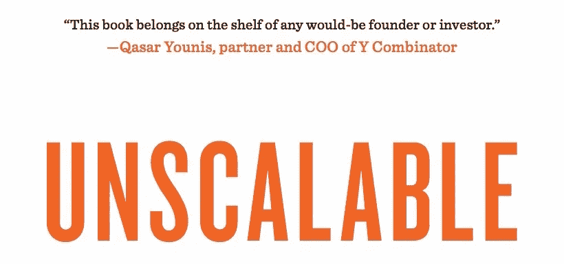

# 从有史以来发展最快的 SaaS 公司吸取经验教训

> 原文：<https://medium.com/swlh/scaling-lessons-from-the-fastest-growing-saas-company-ever-a6e077653d21>

Zenefits 是一家 21 世纪的人力资源公司，其目标是成为一个连接和管理所有人力资源服务的地方。尽管成立仅两年，他们已经筹集了超过 8000 万美元的资金，目前价值 5 亿美元。正如你所料，该公司迄今为止有着令人难以置信的增长轨迹，并被称为“[有史以来发展最快的 SaaS 公司](http://pando.com/2014/06/03/labeled-the-fastest-growing-saas-company-ever-zenefits-raises-a-66m-series-b-just-five-months-post-series-a/)”

最近，我有一个绝佳的机会，与 Zenefits 的创始人兼首席执行官帕克·康拉德坐在一起。他和我分享了 Zenefits 在以如此惊人的速度扩展时遇到的一些挑战，以及他一路走来的观察。这是其中的五个。

*注:以下采访节选自我的新书，* [**不可缩放:非正统的创业成长故事**](http://amazon.com/Unscalable-Charlie-Guo/dp/194175855X/) *。*

*阅读更多关于 Zenefits、GitHub、Codecademy 和许多其他公司的信息。*

# 一步一步地创建自动化流程。

> *一开始我们没有一个表单是自动化的。将会发生的情况是，有人会通过在线系统注册保险，我们会收到一封电子邮件说“某某人已完成……”我们会从数据库中提取他们所有的答案，然后手工填写表格。我们最初雇人来处理这个问题，但随着时间的推移，它变得机械化了。PDF 自动生成，所有信息都已填写，签名附在底部。*
> 
> 随着时间的推移，这变得越来越元。起初，我们会手工填写表格。然后我们将自动填表，但我们将手动设置自动化。但是每个州的每个保险公司对所有这些不同的交易都有不同的表格。所以它们有自己的表单，你需要在系统中分别自动化它们。这让我们把所有的时间都花在了自动化表单上。所以我们编写了自动化表单的软件，这样非技术人员就可以进入并上传表单，只需指出表单的哪一点需要填写哪些信息。

# 在与成熟的行业打交道时，要预料到那些不成规模的事情。

> 最难处理的[人力资源系统]领域是保险系统。都卡在 1986 年了。而对于员工少于 100 人的公司，除了**传真* *来进行添加或删除员工的更改之外，他们不接受任何东西。都在纸上，都是通过传真机。
> 
> *实际上比这更糟糕，因为他们不仅使用传真机，而且在处理信息方面也不可靠。当你给他们发一份传真要求改变时，90%的情况下他们正确地完成了工作，但 10%的情况下传真机会从另一端传来，那天负责处理的人有太多的工作要做，结果在混乱中丢失了，根本没发生，或者他们打错了，有人把员工 A 加到了公司 B，把员工 B 加到了公司 A， 实际上，你需要打电话跟进并结束你与保险公司之间的每一项变更。 你必须拿起电话，并确保它是正确的，这是最终的事情没有规模。*

# 有时你必须牺牲可伸缩性(和产品)来获得优势。

> *当时，我们实际上正在与 Y Combinator 团队中的另一家公司竞争。它被称为简单保险。最初，它与我们大相径庭，但在 YC 进行到一半时，创始人决定他们想做我们正在做的事情，于是公司转向了我们的市场。*
> 
> 因此，我们发现自己正在冲刺成为第一个出门的人。因为第一家推出的公司将被总结为“XYZ 公司推出，使小企业的保险福利更简单”，而无论谁在几周后推出，都会得到“ABC 公司似乎是 XYZ 的衍生物，做着同样的事情，为什么他们做着与 XYZ 公司相同的事情？”如果他们先推出他们的产品，我们先推出我们的产品也没关系。
> 
> *我们想发布*一些*的东西，以便出门。因此，当我们在 TechCrunch 上发布文章时，实际上一半的产品还不存在。我们认为，没有人会如此深入地研究产品，以至于他们实际上会看到[结尾]。我们推断，大多数公司会(中途)停下来，想和我们谈谈。这给了我们至少几天的时间来完成后半部分。*

# 大多数人被指数级的增长弄得措手不及。

> *尽管我们是在 2013 年 4 月底成立的，但到 2014 年 1 月，我们实际上已经成为加利福尼亚州最大的新业务保险经纪公司。*
> 
> 这很有趣，因为保险公司不习惯看到他们的经纪人增长如此之快。他们查看了排名前 20 位左右的经纪人，这些人中的大多数已经在前 20 名中呆了 30 年或更长时间。我们在 8 个月内从无到有成为第一。他们无法相信，突然有很多来自不同保险公司的副总裁来到我们的办公室，试图了解这是如何发生的。他们问我们，“嘿，我们怎样才能与你们更紧密地合作，我们怎样才能从你们那里获得更多的业务？”

# 瓶颈可能来自令人惊讶的地方…

> *有了很多看似*可扩展的东西，你会发现一些你从未想过的瓶颈，你突然需要找到解决方案。例如，我们生成要联系的公司列表的方式—在此过程中有一个手动步骤，需要有人将信息复制并粘贴到 Excel 电子表格中。我们到了这样一个地步，那个人实际上不能足够快地完成他们的复制/粘贴工作，公司的发展实际上受到了这个人将信息加载到 Excel 然后加载到我们的营销软件的能力的限制。我们从未想过这会成为我们的瓶颈。因此，我们不得不自动化许多过程，并围绕它开发软件。

# …过早的优化仍然是万恶之源。

> 与弄清楚什么会真正起作用相比，弄清楚如何扩展那些看起来不太可能扩展的东西要容易得多。你最好去追求那些不可扩展的工作，然后试图去解决如何扩展它，而不是试图解决所有的问题。
> 
> *这就是最终的结果——一旦你知道什么是有效的，就更容易专注于此。直到你有了真正起作用的东西，这都没关系。*

对剩下的*无法缩放的*感兴趣？你可以在 http://unscalablebook.com 免费找到第一章，还有平装本和电子书的订购链接！

⚠ *如果你有兴趣在未来听到更多郭查理的消息，* [*注册他的简讯*](http://tinyletter.com/charlierguo) *或* [*在 Twitter 上关注他*](https://twitter.com/charlierguo) *。*

⚠ *如果你觉得这个有趣、刺激或者有用，请点击下面的* ***。*** *这样有助于向别人推广这一块。*