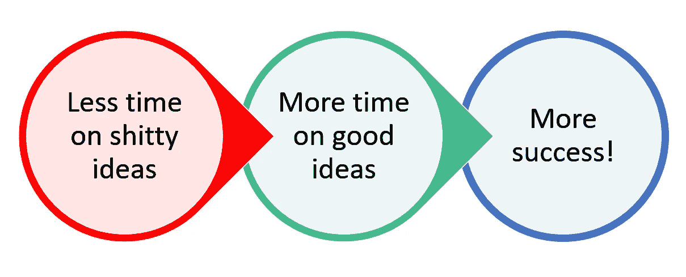

# 薛定谔的想法

> 原文：<https://medium.com/swlh/schrodingers-idea-d191acd642ab>

想法不是真理。

思想是想象的飘荡，是幻想的飞翔，是洞察力的白日梦。一个想法从来没有完全的确定性。如果一个想法是确定的，那么它就不仅仅是一个想法。

> *“我从一个想法开始，然后它变成了别的东西”——****巴勃罗·毕加索***

除了我们倾向于认为想法是确定的。至少对于我们自己的想法，我们认为它们是事实而不仅仅是可能性。我们认为我们的想法显然完全正确，甚至不值得讨论。

这是因为我们在情感上与我们的想法联系在一起。我们将自己的身份和情感与我们的想法联系在一起。具体来说，我们将情绪与想法的成败联系起来。

如果我们有一个想法后来被证明是真实的，那么我们会为我们的成就感到深深的自豪。如果我们有一个自己认为很棒的想法，但后来证明是个坏主意，那么我们会感觉非常糟糕。

我们如何解决这个问题？一个想法是尝试学习如何从构思过程中理清我们的情绪。有用但难以实现。我建议尝试不同的方法。

我建议给每个想法薛定谔的待遇。

# 薛定谔的猫

薛定谔的猫是一个自相矛盾的思想实验，经常被用来参考量子物理领域的辩论。完整的描述和背景信息[请阅读这篇维基百科文章](https://en.wikipedia.org/wiki/Schr%C3%B6dinger%27s_cat)。

但 TLDR 版本是:盒子里有一只猫，根据半随机事件的结果，它可能是死的，也可能是活的。从盒子外面，我们不知道猫的状态，所以理论上猫被认为是同时死亡和活着的(直到我们打开盒子发现)。

我试着把同样的思维应用到想法上。

# 薛定谔的想法？

此时，你可能想知道我吸了什么疯狂的东西，当地的精神病院是否有我的位置。答案是什么都没有，也没有。

我之所以提出薛定谔的猫，是因为我试图将薛定谔的思维应用到我所有的想法中。我称之为*薛定谔的想法*。是的，我刚刚蹩脚地篡改了一个思想实验的名字，这个实验是以一位老奥地利物理学家的名字命名的。我的写作达到了新的高度。

但是当我说薛定谔的想法时，我的意思是每当我有一个我认为很棒的新想法时，我会挑战自己去考虑为什么这个想法也很糟糕。就像薛定谔的猫一样，我的目标是对我的想法同时持有两种相反的观点。我想我的想法既聪明又可怕。

我没有被我的绝妙想法冲昏头脑，而是停下来思考相反的观点。我试图表现得好像我是反驳这个观点的人。本质上，我有自己的想法。

在初创企业和商业领域，当有人向投资者推销一个想法时，他们正是这么做的。他们倾听，然后假装站在对立面来挑战它。他们从各个角度戳它，拉伸它，试图找到漏洞。他们会探索各种可能性，考虑各种选择，然后决定这个想法是否值得投资。

准备向投资者推销一个想法的聪明人会通过与*薛定谔的想法*基本相同的过程来预测这些问题。

但是，为什么要把它留给那些精心挑选的、将创意作为投资卖点的时刻呢？为什么不把薛定谔的方法应用到我们所有的想法中呢？

# 为什么薛定谔的想法行得通

将薛定谔的想法应用到想法中的好处本质上可以归结为两种可能的结果——你要么讨厌你的想法，要么喜欢你的想法。

## 结果一:你讨厌这个主意

太棒了。这是一个很好的结果，因为你可以放弃这个愚蠢的想法，而不用浪费更多的时间。通过尽早测试你的想法，并发现它不太可行，你可以最大限度地减少浪费。你把你宝贵的时间和精力留给以后更好的想法。

听起来不错。太好了，我想我应该画出这张图来展示它的优点:

Focus your time on the right ideas

在坏主意上花的时间越少，在好主意上花的时间就越多，从而带来更多的成功。

*薛定谔的想法 FTW！*

# 结果二:你喜欢这个主意

如果你给了一个想法薛定谔的待遇，出来的另一边仍然有兴趣追求它，那么恭喜你。你有一个实际上值得追求的想法！更好的是你知道这是值得追求的。

任何能通过坚固的薛定谔分析的东西都是值得进一步努力的想法。

另外，你现在知道了人们会提出的主要论点，所以你可以为他们做准备。你知道对手会怎么想，因为你首先是自己的对手。当你能够有效地反驳别人提出的负面观点时，你就更有可能成功地说服别人相信你的好主意。

*薛定谔的想法 FTW！*

# 如何应用薛定谔的思想

将薛定谔应用到你的想法中的方法不是一个你可以像菜谱一样勾掉的简单的东西列表。这是一种你需要培养并不断努力的心态。

记住，将薛定谔应用于思想的要点是试图同时持有竞争和反对的观点。这不仅仅是一个简单的赞成和反对的练习，而是试图真正理解和相信，一个想法同时是辉煌和可怕的。

最简单的方法是，针对你的想法中的每一个积极点，问自己相反的消极问题。

例如:

*   人要去爱【idea】> > > > > >为什么人会讨厌【idea】？
*   [想法]会让我变得富有> >> >[想法]怎么会让我失去所有的钱？
*   我是世界的大师！>>>>>你需要帮助，不是薛定谔。

仅仅问自己这些类型的问题就会引发一些围绕你的想法的更深更尴尬的思考。这很好。这是健康的。一旦你开始有了这些问题的答案和可能的解决方案，你就知道你有了一个朝着正确方向前进的想法。

加油薛定谔。

*原载于*【www.zacsky.com】

**在*[*www.zacsky.com/newsletter*](https://www.zacsky.com/newsletter/)注册邮件更新*

**

## *这个故事发表在 [The Startup](https://medium.com/swlh) 上，这是 Medium 最大的企业家出版物，拥有 292，582+人。*

## *在此订阅接收[我们的头条新闻](http://growthsupply.com/the-startup-newsletter/)。*

**