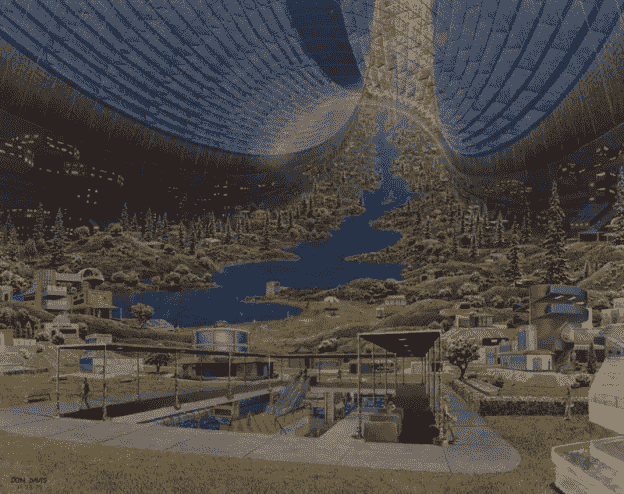
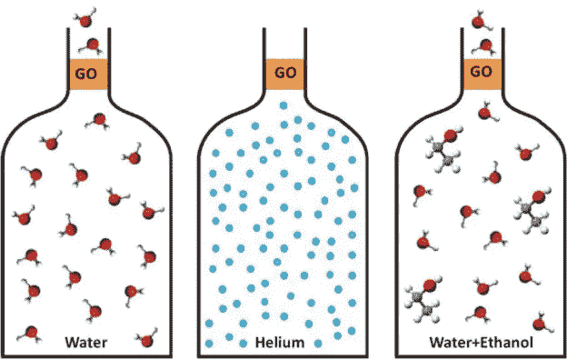
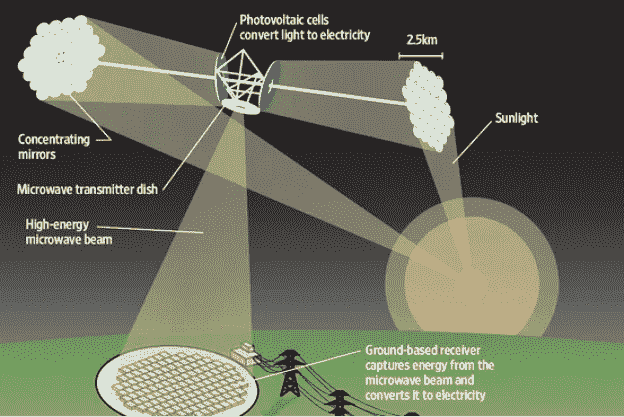
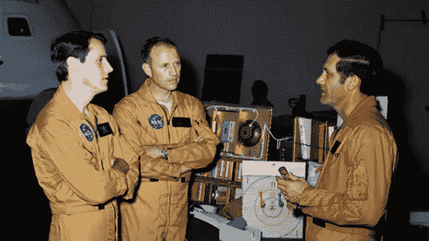

# 太空殖民的科学可承受性

> 原文：<https://medium.com/swlh/scientific-affordability-of-space-colonization-7f4360536df8>

# 由 Satyaki Goswami

由[塔菲姆·艾哈迈德·马苏迪](https://medium.com/u/4b43edc4cafd?source=post_page-----7f4360536df8--------------------------------)和[苏坎特·库拉纳](https://medium.com/u/6d41261644a8?source=post_page-----7f4360536df8--------------------------------)指导

我们的地球大约有 45.43 亿岁了。在宇宙日历的背景下，人类最多只是一个蹒跚学步的孩子。然而，作为一个物种，我们对我们家园的影响比任何其他地球上的动植物都要大。我们的祖先始于非洲，对知识的渴望和毅力使我们成为今天的样子。在我们渴望的一切中，有一个太空殖民的宏伟野心。这种野心不仅受到“幻想的需求”的推动，也受到“真正的需求”的推动；地球可能无法维持我们消耗自然资源的速度。因此，太空探索的主要目标之一是找到一个理想的地外环境，在我们的星球毁灭的那一天，这是我们地球上的物种生存所必需的。因为需要是发明之母，所以人们必须研究我们目前技术进步的潜力。

要想在外星球定居，首先需要满足的条件就是一个栖息地。以这样或那样的方式，一个理想的栖息地需要包含几乎所有其他的需求，以保持足够的气压、气体的环境组成(特别是氧气、二氧化碳和氮气)、可忍受的温度，并且必须保护生物免受有害辐射。计划建立一个群体并为其他人建造合适的栖息地的人类将面临一个棘手的局面。作为第一批定居者，他们需要有生命支持系统和供应品的巨大住所，因为像火星这样的行星需要大量的地球变化，据推测，火星是继地球之后人类可能定居的第一个星球。到目前为止，我们太阳系中所有被标记为可能被殖民的行星都拥有一个坚固的外壳。但是他们都被发现是敌对和贫瘠的，其中大多数缺乏液态水和氧气。这种情况需要巨大的地形改造，因此，需要大规模运输重型机械到目的地星球。但是任何人都可以猜到，这样的运输不会像地面运输看起来那么容易。在任何星球上装载重物都是一个巨大的挑战。去火星旅行需要很多燃料，那是我们最近的邻居之一。基于目前的技术，旅行火星和地球之间的距离，需要几个月到一年。有人对在这样一项任务上花费的钱的价值及其成果提出了疑问。但是这些人倾向于忽视这种使命可能给我们种族带来的可能性和辉煌的结果。谈到军费，各国都愿意花掉每一分钱。1)美利坚合众国在 2014 年的军费开支接近 6100 亿美元；这对于一次火星任务来说已经足够了！

**Artist’s impression of a space colony (Source:** [**http://discovermagazine.com**](http://discovermagazine.com)**)**

一旦栖息地的建造完成，下一个必须满足的需求就是持续的供水。在地球上，一个人每天需要喝两升水。除了解渴之外，水还用于农业、洗涤、工业等。2)在印度，对于人口超过 100，000 的社区，每人每天的用水量约为 150-200 升。因此，如果一个群体有 10 个人，他们每天总共需要 1500-2000 升水。根据简单的猜测来运输水不是明智之举。因此，如果我们不能经常运送如此大量的水，那么就必须自己制造。

带来多余的水来满足长期需求是不可行的；人们可以带来氢气和二氧化碳。安装在国际空间站的萨巴蒂埃反应堆系统的工作原理是，在高温高压下，氢气和二氧化碳转化为甲烷和水。这些水可以用于各种目的，而副产品，即甲烷，可以分解产生氢气和碳，后者是废物。尽管如此，光靠这个还不足以满足水的需求。人们可以建议从类似于近地天体的天体中回收水，但是假设这种天体存在和基本程序都将是非常低效的。因此，我们必须有在外星栖息地循环水的机制——一个将废水转化为饮用水的闭环。

3)值得注意的是，曼彻斯特大学的研究人员发现石墨烯薄膜可以成为一种优秀的水过滤器。科学家们希望在不久的将来能够利用使用这种石墨烯过滤器的设备将不纯净的水变成淡水，这将大大有利于这种殖民地和定居点的水管理。但为此，最初的团队肯定需要携带一定量的水进行回收。一个群体也可以尝试从可能的地下资源或像火星这样的行星的极冠中提取水。这项任务同样需要高科技和重型机械来大规模执行。

**Narrow capillaries made from graphene vigorously suck in water allowing its rapid permeation, if the water layer is as thin as graphene itself. At the same time, they present an impermeable barrier for other molecules. (Source:** [**www.sciencedaily.com**](http://www.sciencedaily.com) **)**

水也是氧气的来源。电解过程可以用来分解水分子产生氧气和氢气。美国宇航局正在开发惊人的技术，从大气副产品中提取氧气。这样的技术可以帮助太空殖民地有多余的氧气。

**Electric current is passed through water in the process of electrolysis. The molecule of water breaks down into its constituent atoms- oxygen and hydrogen. Oxygen is deposited at anode whereas hydrogen at the cathode. (Source:** [**www.meritnation.com**](http://www.meritnation.com) **)**

继水和氧气之后，另一个极其重要的因素是食物。由于太空殖民化的方法现在显而易见，科学界正在努力寻找食物供应(地球以外)的解决方案——在外层空间种植植物，并在另一个与地球生态系统不同的星球上种植自己的食物。5)亚利桑那大学受控环境农业中心(CEAC)的科学家们正试图找到一种不用土壤就能种植植物的方法；用一种叫做水培的方法在水中生长。在这种方法中，几个管状结构被用作温室，被埋在行星表面。这将保护种子和树苗免受有害的宇宙辐射和微陨石。因此，埋在地下的“温室”将不同于传统的温室，传统的温室让阳光进入并将其捕获为热量。在部署并让水通过这些结构后，科学家们声称蔬菜可以在 30 天内生长。这种机制将由机器人组件和复杂算法指导，这些组件和算法将使用传感器分析和收集数据，然后使用受控系统相应地优化程序。研究天体上的土壤也让科学家分析数据，并制定适当的方法在这些星球上种植作物。

2008 年，美国宇航局的“凤凰号火星着陆器”使用火星土壤进行了首次湿化学实验。研究人员在样本中发现了镁、钠、钾和氯化物。还发现土壤是碱性的。这种类型的数据是重要的，以便确定当涉及到外星农业时，哪个星球将是最佳候选，因为任何此类殖民地的人口对食物的需求都不应与地球上的人口有任何不同，并且殖民者应该健康和活跃。

不容忽视的是，要运行这样一个技术先进的定居点，人们需要产生和收获足够的能量。我们已经在使用并且肯定会在另一个星球上使用的东西是光伏太阳能电池板。但是当然，这项技术确实需要进一步改进。太阳能电池由砷化镓、晶体硅和其他类似的半导体材料组成。月球上的殖民地肯定会受益于这样一个事实，即月球土壤含有大量的硅，它可以制造这种电池用于太阳能转换。尽管太阳能电池可靠，但效率很低。因此，必须将它们组合成大型阵列，才能为实际应用产生足够的功率。此外，核能也可以使用。在远处建造的完好无损的房间可以储存核反应堆，并进行小规模的裂变或放射性衰变，以产生电力。涡轮机也可以通过创造一个封闭的流水循环来发电。另一条创新之路是在卫星上安装巨大的太阳能电池板，将太阳光转化为微波，微波进一步传输到天线，再转化为可利用的能量。为了通过这一过程产生足够的能量，需要大直径的天线，并且必须在地球上进行部分组装。然后，这些组件可以被带到目的地星球，以便有效地建造它。作为无限太阳能的提供者，它没有副产品浪费，可以证明是革命性的。此外，久而久之和这样的太空殖民地变得更加高效和稳定，如果主行星包含一个熔化的核心，地热能可以被证明是一个主要的电力供应来源。

**The Indian Space Research Organization and US National Space Society launched a joint forum to develop partnership in harnessing solar energy through space-based solar collectors (Source:** [**www.yoursolarlink.com**](http://www.yoursolarlink.com)**)**

为了使命和我们的种族，这样的使命的人的方面同样重要，因为如果我们忽视考虑第一批定居者在执行这样一个大任务时可能面临的心理影响，那将是一个犯罪的疏忽。6)在一次“天空实验室”任务中，工作人员因为工作量过大而停止了工作。他们没有工作，整整一天；按照目前的估值，天空实验室一天的价值约为 2240 万美元。据说这次兵变的可能促成因素是:

停留时间

孤立的环境

航天器设计

工作量

缺乏经验

没有过渡期

最近，费城宾夕法尼亚大学进行了一项实验，六名男子接受了筛选，并在一个小栖息地度过了 520 天。他们中的四个被发现有嗜睡、失眠和生产力的广泛问题，归因于他们的严密监禁。因此，人们还必须考虑到这样一个事实，即宇宙飞船在旅行期间和定居点的环境必须宽敞，并有足够的规划，以便定居者不得面临任何形式的创伤或抑郁。

**Faces of the famous “Skylab Mutiny”; these three men make up the crew of the Skylab 4 mission. They are, left to right, scientist-astronaut Edward G. Gibson, science pilot; astronaut Gerald P. Carr, commander; and astronaut William R. Pogue, pilot. (Source:** [**www.whyy.org**](http://www.whyy.org) **)**

这项事业最大的成就之一就是消除了人为因素。如果由地球地面团队控制的机器人能够建造定居点，那么在初始阶段风险系数为零。人工智能和机器人领域的密集研究和进步可以帮助我们监督和远程操纵所有这些设施的建设。由较轻金属制成的机械也会使搬运工作变得更容易。为了克服这些困难，科学和工程的所有领域必须共同努力，因为实现太空殖民的方法不仅仅是抑制我们的幻想。在太阳系中向外移动将对我们有益，因为太阳总有一天会吞噬地球。

如果一颗和导致恐龙灭绝的那颗一样大的小行星撞击我们的星球会怎么样？当我们消耗掉最后一点不可再生资源时，会发生什么？因此，我们有很多理由共同努力，为这条道路上出现的每一个问题找到解决方案。这将给所有人类一个共同努力的目标，而不是互相争斗。这的确是一个庞大的工程，但是作为人类，自从我们的祖先第一次从非洲移民以来，我们已经走过了漫长的道路，我们肯定还有很长的路要走。正如美国国家航空航天局行星科学部主任吉姆·格林所说，“我真的相信一个单一的行星物种不会存活很久。离开这个星球是我们的命运。”

Source: [www.flickr.com](http://www.flickr.com)

参考书目

1.  2000 年至 2016 年美国军费开支(以十亿美元计)；[www.statista.com](http://www.statista.com)

2)印度教徒；一个城市居民需要多少水？作者:s·维斯瓦纳特

3)通过石墨烯氧化物膜的精确和超快速分子筛，由 R.K Joshi，P. Carbone，F.C Wang，，Y. Su，I.V Grigorieva，H.A Wu，A.K Geim，R.R Nair

4)Space.com；太空农民能在其他星球上种植作物吗？作者:阿努拉达·k·赫拉特

5)月球温室可以为未来的月球殖民地种植食物；Space.com

6)太空中的哗变:为什么这些天空实验室的宇航员再也没有飞行；作者凯特·艾施纳，【www.smithsonianmag.com 

— — — — — — — — — — — — — — — — — — — — — — — — — —

我叫萨提亚基·戈斯瓦米。由于经济和家庭方面的限制，我正在 IGNOU 攻读学士学位，主修物理。我将在 2018 年 6 月参加期末考试，然后我打算攻读物理学硕士学位；目前，我正在准备大学理科硕士的入学考试。我是一个如饥似渴的读者，热爱书籍。我想写一部漫画小说，因为我也喜欢写作和绘画。但是，我真正的爱在于探索未知的领域，这种冲动点燃了我对科学的热爱。我想成为一名天体物理学家，更多地了解我们生活的这个庞大的宇宙，尤其是关于时空结构、宇宙学、黑洞和恒星形成。我对研究非常感兴趣，因为这是我长久以来坚持下去的动力。空间科学一直是我最感兴趣的领域，在我的理学学士课程中，我严格地研究了天体物理学和天文学。

电子邮件:satyaki452@gmail.com

— — — — — — — — — — — — — — — — — — — — — — — — — — — —

Tafheem 是一名太空爱好者，在太空生物学领域工作，正在研究外层空间的自我维持环境。他和一个充满活力的研究团队一起，正在建立一个空间学习平台。此外，他还致力于在各种印度学校创建首个针对特定主题的互动教育游戏模块。

[https://www.linkedin.com/in/tafheemmasudi](https://www.linkedin.com/in/tafheemmasudi/)/

 [## 塔菲姆·艾哈迈德·马苏迪

### 塔菲姆·艾哈迈德·马苏迪在脸书。加入脸书，与塔菲姆·艾哈迈德·马苏迪和其他你可能认识的人联系…

www.facebook.com](https://www.facebook.com/tafheemmasudi)  [## 塔菲姆·马苏迪(@塔菲玛苏迪)|推特

### 塔菲姆·马苏迪的最新推文(@ tafheemmasudi)。想成为科学家。印度本加卢鲁

twitter.com](https://twitter.com/tafheemmasudi) 

T2 博士苏肯特·库拉纳经营着一个学术研究实验室和几家科技公司。他也是著名的艺术家、作家和演说家。你可以在 www.brainnart.com 的[或 www.dataisnotjustdata.com 的](http://www.brainnart.com)或[了解更多关于 Sukant 的信息，如果你希望为公益事业从事区块链、生物医学研究、神经科学、可持续发展、人工智能或数据科学项目，你可以在 skgroup.iiserk@gmail.com 联系他，或者通过 linkedin 的](http://www.dataisnotjustdata.com)[https://www.linkedin.com/in/sukant-khurana-755a2343/](https://www.linkedin.com/in/sukant-khurana-755a2343/)联系他。

这里有两个关于 Sukant 的小纪录片和一个关于他的公民科学努力的 TEDx 视频。

## 这篇文章发表在 [The Startup](https://medium.com/swlh) 上，这是 Medium 最大的创业刊物，有 321，672+人关注。

## 在这里订阅接收[我们的头条新闻](http://growthsupply.com/the-startup-newsletter/)。

