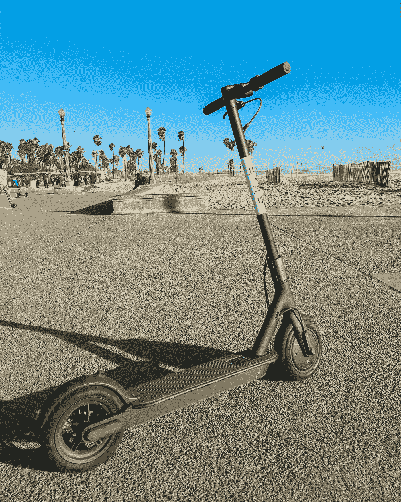
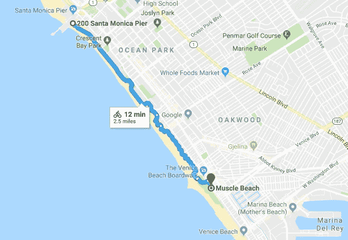
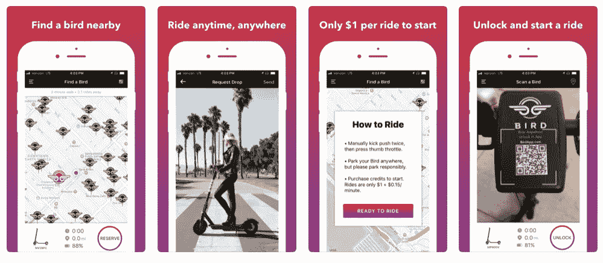
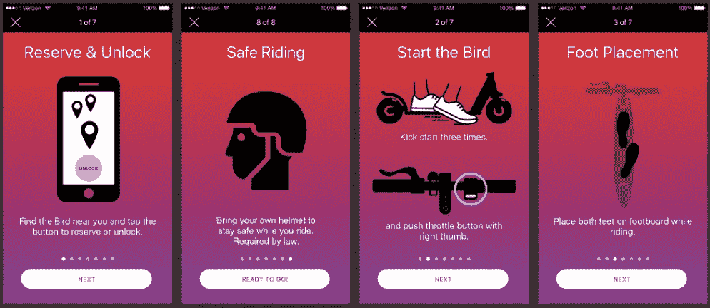
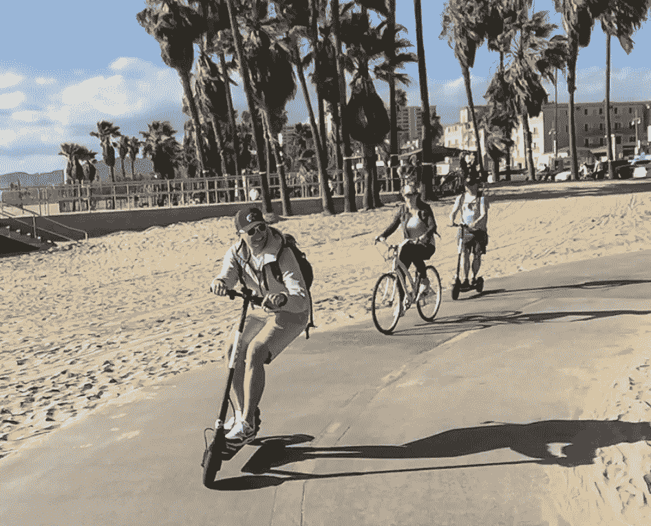

# 踏板车入侵——激动人心的城市交通新方式

> 原文：<https://medium.com/swlh/scooter-invasion-exciting-new-ways-of-urban-transportation-c46ee8de82c9>

拼车服务减少了我们通勤的大量时间。找到它们又快又容易，我们可以到达任何我们想去的地方。但是我们还是要等他们。例如，当我们到达火车站，还有一英里要走的时候。

每一项新服务，只要能为我们再节省一分钟，就有机会胜出。其中有几家公司最近启动并筹集了大量资金。我说的是代步车租赁服务。西海岸的两颗闪亮的星星是[伯德](https://www.bird.co/)和[莱姆比克](http://www.limebike.com/)。他们最近一起筹集了 2 亿美元的资金，并获得了大量的公关。

他们覆盖你的最后一英里。可能是上班的通勤，在城市里的购物之旅，或者当你在去海滩的路上。最后一个场景是我在洛杉矶测试的时候。

## 找到我的第一只鸟

上周末，我们去了圣莫尼卡。我们的计划是租自行车去威尼斯海滩。沿着肌肉海滩、滑板公园、篮球场，当然还有大海，这是一次美丽的风景骑行。有很多可看的东西，你会觉得自己置身于电影中，而且天气总是很好。

The path along Santa Monica and Venice Beach

但这一次不同了。当我们到达木板路时，我们注意到许多人骑着电动滑板车。他们看起来都玩得很开心。我没听说过这项服务，但它们都有“鸟”这个名字。我们很好奇，想知道更多。

这项服务于 2017 年 9 月推出，已经改变了圣莫尼卡。他们到处都是。

带有获取应用程序说明的网站很容易找到。下载应用程序需要一些时间。这是一个 84MB 的 iOS 下载。在应用程序启动时，你会看到一张地图，帮助你找到附近可用的滑板车。这个应用程序显示了一张地图，但在上面我们没有看到我们周围的任何鸟类。然而，我们发现他们停了很多车。肯定是应用程序的 bug。

当你走向摩托车时，你会看到一个二维码。扫描应用程序中的代码可以显示滑板车的状态。

App store description

虽然很容易找到停放的踏板车，但要找到一辆可用的却不容易。其中一些被人们锁起来，放在那里以备后用，另一些则没有电了。我们四个人不得不四处走走。5 分钟后，我们找到了两辆可用的滑板车。收取了 38%和 56%。巨大的成功——不确定我们是否能成功到达威尼斯并返回。我们稍后会谈到这一点。

## 注册并开始使用

添加信用卡信息轻而易举。(OCR 的巨大优势——扫描信用卡号码的图像识别——无需输入)然后我们出发了。

我的两个朋友从德国来访。他们在美国没有数据计划，所以他们无法获得解锁滑板车的应用程序。我希望我能以我的名义为他们预订另一辆摩托车。我们不得不再买两辆自行车。

开始骑行的说明简单易懂。尽管它告诉我们要戴头盔，但我们没有看到海滩上有人这样做。

Some of the instructions

## 乘坐

骑鸟很有趣。不要慢到无聊，要快到有趣。海滩走道上没有颠簸或坑洞。但是车轮应该能够在人行道上留下小凹痕。

踢了三下，我们就出发了。一直到威尼斯。中间在滑板公园稍作休息。

Riding sure is a lot of fun

滑板车最酷的一点是，你可以把它们停在任何你想停的地方。我说的不是马路中间或者你自己的车库。当你离开时，它们会自动锁定，但会为你保留。然而，对于自行车，你总是不得不要么锁上它，要么盯着它。

## 一个警告

我说的是电池寿命。滑板车和手机都需要电池。是的，它发生了…嘿，有很多可看的，拍照和录像。电池可能会没电。

当我们到达篮球场时，我朋友的手机没电了。现在她再也不能打开她停放的摩托车了，我们不得不把她和其中一辆自行车配对。

用我的手机解锁她的摩托车就好了。但我能看出其中的安全问题。我们没有尝试注销和登录她的帐户。我想你只能用已登录的帐户来解锁滑板车。

骑了一个小时后，我的滑板车下降了 25%,我想我可以一路开回来。但是没有成功。三分之二的路程，我的滑板车放弃了。尽管我看到周围停着很多鸟，但它们都没电了。这是你意识到你在自行车上有多独立的时候。回家不需要电话或电池。

我认为这是另一个问题。其他的摩托车停的到处都是。人们把它们丢在人行道中间。我可以想象城市会如何对此进行管理，或者要求公司鼓励在特殊区域停车。但我也认为城市和地区应该鼓励像这样的可持续交通。我确信他们会解决这个问题。

## 定价和摘要

在海滩租自行车每小时 7 美元，全天 20 美元。Bird 每骑 1 美元，每分钟 0.15 美元。我花了 15.40 美元买了 1 小时 36 分的滑板车。我们骑了 4.8 英里。如果你想在海滩上骑一整天，骑自行车会更便宜。如果是几个小时，这是值得的“乐趣”溢价。

总而言之，我肯定会再次使用它。我非常兴奋，他们现在在旧金山推出。看看他们能否占领山头将会很有趣。但是沿着海滨骑行是必须尝试的。

可能有一些事情要和城市解决，也可能对服务有一些限制。我希望他们能解决这个问题。以 Bird 和 Limebike 获得的资金规模来看，扩展这项服务应该是可能的。我等不及下一次去另一个城市了。

## 这篇文章发表在《创业公司》杂志上，这是 Medium 最大的创业刊物，有 315，628 人关注。

## 订阅接收[我们的头条](http://growthsupply.com/the-startup-newsletter/)。

