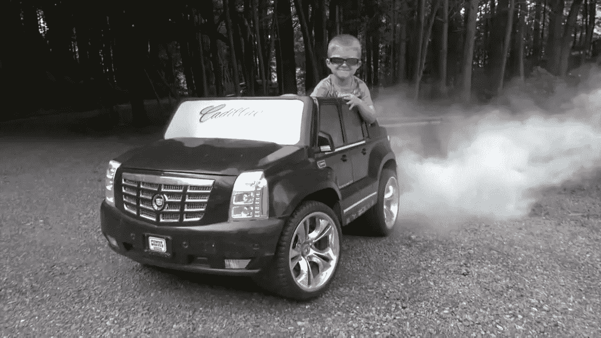
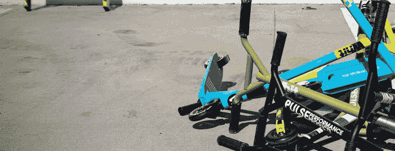
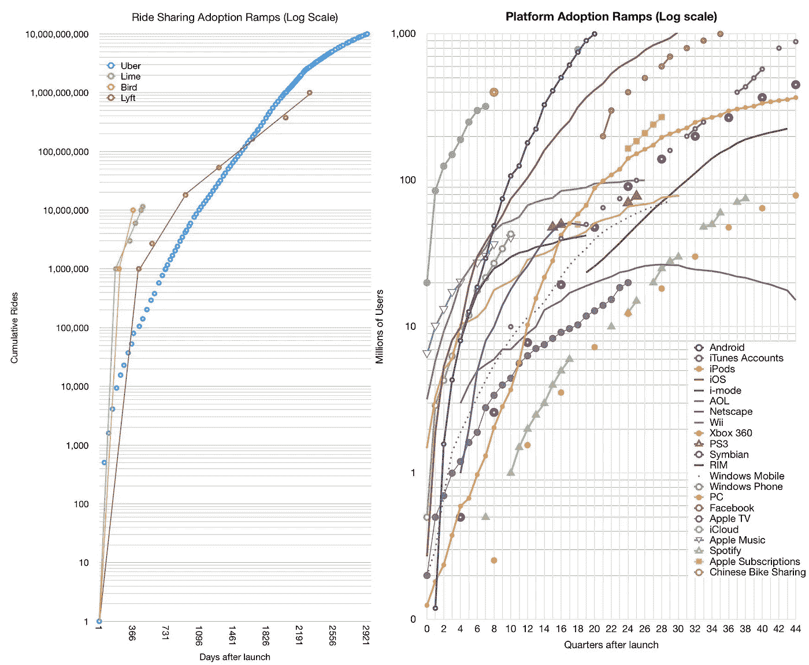
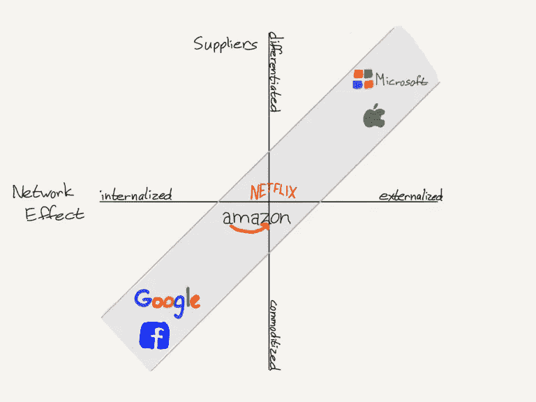

# 抛弃优步的剧本:滑板车、科技和传统交通

> 原文：<https://medium.com/swlh/scooters-and-the-short-haul-brawl-2d92fc25e635>

## 天使和魔鬼，还有一只鸟

Annotote is the most frictionless way to get informed and inform others

当然，信息丰富的时代容易乞求、借用和窃取你的注意力。阅读博客、新闻和研究一直是一种低效的用户体验——大海捞针——但现在 Annotote 是解药，查看一下: [*不要浪费时间或注意力；开门见山*](http://annotote.launchrock.com) *。*

The importance of being earnest?

踏板车共享和拼车共享之间的差异是理解踏板车市场、城市交通和线上线下技术将如何发展的基础…

# 轻资产与实物资产

在 Stratechery 上，Ben Thompson [最近写了一篇关于新兴的无人驾驶踏板车行业的更新文章](https://stratechery.com/2018/san-francisco-and-scooters-skips-strategic-moat-santa-monica-and-scooters/):

> “……想想自动驾驶汽车:传播自动驾驶汽车技术的最有效方式是通过提供拼车服务的集中车队，这是有道理的。然而，这种集权使得政府更容易实施监督；换句话说，我认为将自动驾驶汽车推向市场的最积极尝试是通过私家车，尤其是特斯拉，这并不奇怪。”
> —重点由[提供注释](http://annotote.wordpress.com)

在书中，他表示，鉴于特斯拉汽车的分布式性质，无人驾驶技术的最大扩散是通过特斯拉进行的，这并不奇怪，这些汽车都是由私人拥有的。他表示，另一方面，还有优步和 Waymo，它们的市场战略(据称)受到了它们全资拥有和运营的车队的集中性的抑制。(这里面有逻辑谬误，但这不是我在这里反驳的重点，所以跑题了。)然后，他将这一逻辑延伸到了代步车共享，暗示其集中的车队所有权也使其容易受到监管摩擦的影响。

但是，这有点语义上的争论。具体来说，基于这些标准，所有这些行业都同样容易受到监管——无论是摩托车共享、传统拼车还是汽车制造。毕竟，优步代表了拼车的集中协调，就像特斯拉代表了自动驾驶的集中部署一样。如果监管需要执行一个或两个，那么每一个都是一个联系，监管者可以接种到广泛分散的市政当局期望的执法行动。每一个都是一个要掐的芽。

在这种情况下，集中化的监管风险是一种错误的启发，无法概括共享经济、制造业等领域的代步车共享及其前身之间的差异。我们就直说了吧:代步车共享母公司全资拥有并运营他们的车辆，而优步目前的司机是独立承包商，特斯拉的汽车由独立买家所有。真正的资产企业和 T2 的轻资产企业之间的区别更多的是财务上的影响，而不是政治上的。

Your uberXL awaits

优步目前的拼车业务是一种轻资产模式，将市场供应外包给独立汽车和司机。与踏板车调度员不同，优步可以利用先前存在的汽车法规制定的标准化来挫败系统性欺诈和安全违规行为。从理论上讲，优步的黑车乘客不应该得到一个电动轮(或者那些期待有驾照的司机不应该得到一个孩子)。踏板车市场缺乏任何这样的杠杆来实现这种标准化。如果代步车共享依赖于独立的代步车所有者来提供供应——本质上是点对点的——那么他们将缺少一个管理质量保证的传输机制。

在深入研究踏板车市场的前景之前，弄清楚这一点很重要。鉴于其不同的供应链，这里的竞争将基于与过去的技术企业不同的因素，这些历史先例仍然是大多数分析师框架的基础，这是错误的…

# 完全竞争？

关于这个滑板车行业的市场结构，有一个真正的问题:它是一个完全竞争的行业，还是更倾向于[赢家通吃、先发制人的优势动态](/@AnthPB/the-reality-of-exponential-growth-7cafde6337f1)，这是当今科技伪垄断[的特征](/@AnthPB/antitrust-techs-endgame-8705eac3cd00)？

直觉上，滑板车初创公司不像过去的独角兽公司那样经营双边市场。例如，对于滑板车，理论上你走出家门，抓住最近的滑板车，不管它的品牌；但是对于拼车，你选择服务的依据是很多因素，比如市场流动性(即司机供给和乘客需求)。

Consumer preference in scooter-sharing: Grab one… any one…

消费者需要下载的实际应用程序似乎是将他/她锁定在一个或另一个滑板车品牌的最大问题。但是，为了结束这种应用程序锁定，新进入者可以很容易地闯入行业的现有者，只需刷信用卡或挥舞 Apple Pay，甚至无需下载专用应用程序，对用户体验几乎没有负面影响。因此，供应方很容易受到竞争的影响。事实上，供应商在某种程度上是商品化和模块化的——至少我们可以控制监管运营许可。

但是坚持住。在“[踏板车经济](https://stratechery.com/2018/the-scooter-economy/)”中，本·汤普森确实提到了几个有助于网络和规模因素的特征(重点是我的):

> “如果没有双边网络效应，那么，无人驾驶踏板车和电动自行车的潜在护城河相对较弱:专有技术最多只能提供短暂的优势，而**伯德和莱姆有充足的资金来源。两家公司都在尝试“充电共享”，他们付钱给人们为他们家中的滑板车充电，但两家公司都通过自己的承包商为车辆充电并将其转移到高需求地区**
> —重点介绍[注释](http://annotote.wordpress.com)

这里提到的三个差异化点是*资本*、*电荷共享*，我称之为*再分配*。要评估这些护城河的可持续性，请考虑以下因素…

1.  *资本:* 优步本身就将获得资本作为规模优势——尽管我们可以说，太阳已经落山，宏观环境为这一战略创造了条件。
2.  *充电共享:*
    招募第三方来收获和充电滑板车可能会进入良性循环，因为滑板车业务的收入基础越大，它就越有能力支付志愿者为其滑板车充电——尽管这种方法的固定边际成本更类似于经典的规模经济(线性)而不是网络效应(指数)。
3.  *重新分配:* 有人需要移动踏板车来满足需求。无论这是通过员工还是独立承包商实现的，它都更有利于网络/规模经济，这是供应方差异化急需的一点——至少比#1 或#2 更有利于网络/规模经济。

因此，换句话说，差异化的机会是逐步增加的，但从战略规划的角度来看，重要的是要承认，所有这些仍然是比 Web 2.0 技术或 ridesharing 的同类产品更弱的护城河…

# 可持续与短暂的护城河

这让我想到了最近关于踏板车行业努力实现可持续的 T2 差异化的讨论。也就是说，Stratechery 分析了一个叫 Skip 的滑板车新贵(重点是我的):

> “……Skip 的主要竞争优势将是它与政府官员的关系……就商业模式而言，小型摩托车可能没有护城河，但商业模式并不存在于真空中，而**让政府监管机构为你创造护城河肯定能完成这项工作**。”

我再次表示不同意。赢得参与试点项目的运营许可并不意味着可持续发展！稍后会有更多的内容，但重点是，共识似乎过度指向旧金山，由于最近在旧金山的胜利——包括许可胜利和政府善意，跳过作为一个有希望的最爱。然而，竞争对手 Bird 可能在这两个部门都取得了更大的进步——在其家乡圣莫尼卡赢得了不错的许可，在面向政府的新产品推广中赢得了更大的胜利:

在严重缺乏可持续发展的护城河的踏板车行业，这是一个聪明的策略，应该会给伯德带来回报。

与单纯的规模经济等传统护城河相反，网络效应等现代技术护城河变得不仅仅是暂时的优势——它们变得几乎无懈可击，部分原因是规模的边际成本较低。出自[胡萝卜加大棒](/adventures-in-consumer-technology/the-carrot-and-the-stick-on-the-missing-incentives-for-crypto-networks-87af5eed5deb):

> “大型科技公司的市场都趋向于垄断，因为它们经营着零进入壁垒的多边网络。因此，网络流动性是他们中许多人竞争的基础:谁拥有最多的买家和卖家；最多的生产者和消费者；最供需；等等。这种流动性引发了网络效应的良性循环，其中规模改善了用户体验，提高了规模，等等。如果你把软件的零边际成本加到这个良性循环中，你就会得到聚合理论……”

注意:我说“无懈可击”是因为“垄断”和“买方垄断”的法律概念通常不适用于此处(参见“[反垄断和科技的最后阶段](/@AnthPB/antitrust-techs-endgame-8705eac3cd00)”)，尽管确实存在可强制执行的监管滥用(参见“[科技的代理问题](/adventures-in-consumer-technology/of-chinese-walls-and-techs-agency-problem-6cab543094d2)”)。

与那篇摘录中讨论的 Web 2.0 初创公司不同，“进入壁垒”确实存在于今天的踏板车行业:例如，它有点资本密集型；有边际成本；更重要的是，市政当局只发放了少量的运营许可。这并不意味着供应方是稀缺的，因为地方政府在每个地区都提供了上述竞争性配额；但它也不是完全充足的，因为政府保证竞争是有上限的。

The adoption rate of scooters (left) vs prior technologies (right)

赢家显然将是那些能够在踏板车市场的管理竞争中聚合骑手需求的供应商，这受制于上文讨论的一些内生竞争因素(例如资本/费用共享/再分配)*加上*监管运营许可的外生加持。关键是，上述护城河(资本/费用共享/再分配)只是短暂的——传统企业的遗迹，容易受到其他企业的破坏，如现代聚合商，其非竞争性业务提供了结构性竞争优势。

例如，曾几何时，传统的规模经济提供的竞争优势只能在有限的时间内持续*，但它们并不是真正的*无懈可击的*。今天，软件已经改变了目标——提供了长期可持续的优势。虽然传统企业可以通过无数的竞争威胁分一杯羹，但真正让一家全面整合的企业下台的唯一方式是通过*新的市场颠覆*。此外，一个聚合商的经济允许它使用无数的策略吃掉其他企业的午餐，包括经典的*低端破坏——如广受欢迎的 Clay Christensen 的*。*

*现在，有了这个框架，[谷歌和优步肯定会打破传统的壁垒，如资本、费用共享、再分配、订阅、奖励计划等——至少踏板车行业对他们来说是一个具有战略重要性和/或富有成效的行业。](/adventures-in-consumer-technology/uber-lyft-and-the-subscription-opportunity-f6f970cacb32)*

*与那些短暂的护城河相反，波导的政府科技板块试图开拓出一条可持续的 T2 护城河和无懈可击的 T4 护城河。这个面向政府的平台是一个厚颜无耻的策略。在一个渴望差异化的市场中，这是一个差异化点——一个在其他方面几乎完全竞争的市场。这不仅给了伯德更大的个人代理权来获得那些梦寐以求的经营许可，也给了他们一个潜在的收入流，可以帮助总需求。如果波导有一个盈利的政府数据业务部门，它几乎可以以低边际成本无限扩展——就像软件一样——那么它可以为波导核心滑板车业务的需求聚合提供资金，在这种业务中，零毛利定价将削弱竞争……# ftw。*

*现在，只要政府干预是为了在踏板车行业的供应方面实现某种程度的竞争，少数竞争对手可能会继续存在，但内生的市场力量应该会形成双头垄断，因为踏板车共享市场的特点是消费者需求的两个不同部分之间有一条明线，如下所示。由于其被俘虏的观众，优步将可能是双头怪物的一端；伯德现在是我最喜欢的另一个…*

1.  **城市滑板车(Bird):*
    在特定意图的驱使下，那些仅使用第三方交通解决方案来满足短途需求的人，将会提供至少一个单独的专用滑板车解决方案——即使他们已经使用优步和 Lyft 来满足长途需求；*
2.  **多式联运(优步/莱姆):*
    寻求一站式服务，那些使用第三方运输满足所有需求(例如[代替汽车所有权](/adventures-in-consumer-technology/uber-lyft-and-the-subscription-opportunity-f6f970cacb32))的人将保留或下载一个运输聚合应用程序*

*如果“让一个政府监管者创建你的护城河肯定能完成任务”——正如本·汤普森所断言的那样——那么波导面向政府的数据解决方案应该能让它赢得许可，聚集更多需求，获得更多数据，让更多政府签署其平台，等等。那更像是梦寐以求的网络效应和规模的良性循环！*

*此外，这也可以将波导的市场份额与优步隔离开来，后者不愿将其整体数据交给监管机构。(据我估计，[传统拼车的外部性](https://www.axios.com/ride-hailing-sharing-services-uber-lyft-global-cities-traffic-26816575-fff8-44b0-a608-9dd86e8b5a10.html)是足够大的结构性问题，即使优步首席执行官达拉·科斯罗萨西的仁慈也无法克服它们——但如果有人有数据证明我是错的，我会很高兴。需要澄清的是，优步过去曾与市政当局共享数据，但前提是数据是被请求的——而且通常是通过法律程序。最近，优步已经开始自愿共享数据，但仅限于“非专有”数据。)*

*我理解为什么公众舆论热衷于称赞与监管者友好相处是一条战略护城河。我也支持那些有良好公民责任感的好人和女孩。是的，[许多这样的滑板车公司都是从优步的剧本](https://slate.com/business/2018/09/after-losing-to-uber-cities-are-squeezing-scooters-and-bike-shares.html)开始的，也就是说，鲁莽的“快速行动，打破东西”的心态集中体现为“请求原谅而不是许可”。(具有讽刺意味的是，这种革命性的信条是帮助优步获得福音派骑手和司机的狂热追随者的吸引力的一部分，这些人在该服务一再向政府和监管机构施压中发挥了作用。)前面提到的 Skip 是游击队游说团的反对者。斯基普是一个好牧人，他在勇往直前之前，很早就选择了顺从监管者。当然，现在已经证明，这比其他选择积累了更多的善意，其他人都不得不争先恐后地赶上来——包括伯德，他自己也曾经是那些打烂嘴巴的破坏者之一。*

*尽管起点很高，但伯德通过投资组合来确保其商誉更具结构性而非短暂性。如果 Bird 可以赢得市政当局的青睐，那么 Bird 也可以通过与公共交通基础设施和工作流程完全集成来赢得自己的专属观众(类似优步)——而不仅仅是将数据倾倒在公共机构上。来自[小鸟自己的发布公告](https://www.bird.co/blog/bird-announces-new-govtech-products-and-team-cities-primary-customer-for)(重点我的):*

> *“Bird……今天发布了其 GovTech 平台，这是一套与城市合作并为城市而构建的全面的技术和产品。该平台将帮助地方政府整合和管理电动滑板车，作为其交通基础设施的一部分。
> —重点感谢[注释](http://annotote.wordpress.com)*

*Bird 的平台是一个良性的特洛伊木马，使集成交钥匙。*

# *垂直与水平整合*

*Bird 正在应对两个市场，每个市场都需要不同的方法…*

1.  **垂直整合(GovTech 数据):*
    既然真的只有波导取得了先发优势来提供这种有价值的数据，那么踏板车市场的原料就相对匮乏，所以为第三方市政提供一个平台就是杀手级应用；*
2.  **横向整合(代步车共享):*
    即使有政府监管，代步车市场的指定供应商也相对商品化了——鉴于它们的形式较弱、短暂的护城河如上所述——因此聚集对专有解决方案的需求是杀手级应用*

*在“[护城河图](https://forum.stratechery.com/t/the-moat-map/6506/2)”的背景下思考这些策略:*

**

*The Moat Map*

*为了简化其中“网络效应”X 轴的内涵，我使用“专有聚合器”对“第三方平台”(而不是“内部化”对“外部化”)来描述企业产品的性质。这更具描述性和直观性。(值得一提的是，我也主张使用“供应商”变量作为 X 轴，因为“差异化”与“商品化”因素比“网络效应”更有解释力，但这一点可以向地图的创建者本·汤普森(Ben Thompson)和詹姆斯·奥尔沃斯(James Allworth)请教。)*

*有了这样的解释，结果是数字企业想要战略性地占据上面强调的护城河，因为:*

*   *如果供应商高度商品化，那么新进入者应该针对专有解决方案进行优化(例如，供应容易获得/太多，因此聚集是吸引需求的主要因素)；*
*   *如果供应商高度*差异化*，那么新进入者应针对*第三方*解决方案进行优化(例如，供应很难获得/过于稀缺，因此*平台*是对供应商的主要吸引力)*

*因此，占据护城河之外的另外两个象限是没有意义的:*

*   *如果供应商高度商品化，那么第三方解决方案要么通过增加另一层冗余碎片(增加无谓损失)来加剧丰富性，要么制造出不如聚合商的产品；*
*   *如果供应商高度*差异化*，那么*专有*解决方案要么通过增加另一层冗余聚合(引发[代理问题](/adventures-in-consumer-technology/of-chinese-walls-and-techs-agency-problem-6cab543094d2))来加剧稀缺性，要么制造出比专业第三方更差的产品*

*现在，再次将 Bird 放入该框架中…*

1.  **GovTech(垂直):*
    滑板车市场的数据供给相对*差异化*，所以*第三方平台*是杀手级 app*
2.  **代步车共享(横向):*
    代步车市场的车辆供应商相对*商品化*，因此*专有聚合*是杀手级应用*

*伯德不像谷歌/脸书或微软/苹果那样远离每个象限的极端尖端——考虑到前述法规培育的结构性竞争，我们也不希望踏板车共享如此完全不受约束。尽管如此，它的战略方针是合理的，特别是考虑到一只手(政府科技)可以养活另一只手(代步车共享)。*

*现在，Bird 必须快速扩展其政府科技平台，然后希望其整体数据能够真正反映踏板车的正外部性(与拼车并列)。这当然是一个挑战，尤其是如果滑板车无法在短期内取代汽车的话——最大的威胁是季节性(即在冬天、下雨、下雪、冰雹时，骑滑板车的用户会少得多)。*

## *关于可持续发展的话题…*

*

Highlights, by you and for you, on all the blogs, news, and research you read. Annotote has the distilled knowledge you need. All signal. No noise.* **

## *这篇文章发表在 [The Startup](https://medium.com/swlh) 上，这是 Medium 最大的创业刊物，拥有+ 374，357 人关注。*

## *在这里订阅接收[我们的头条新闻](http://growthsupply.com/the-startup-newsletter/)。*

**