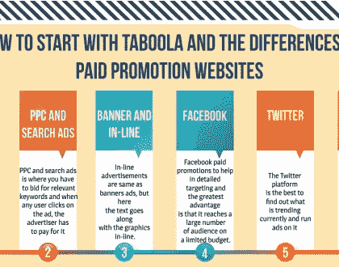
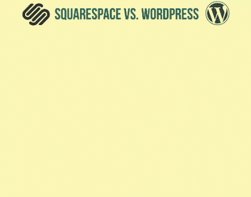
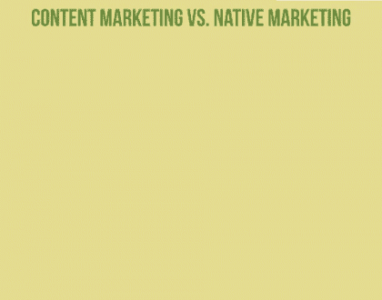

# 2018 年搜索引擎

> 原文：<https://medium.com/swlh/search-engines-of-2018-56ec14f4c8d>

搜索引擎是为了从万维网上提取信息而开发的软件。有许多搜索引擎，但最受欢迎的是谷歌。每当我们不得不在互联网上搜索任何东西时，我们也会想到谷歌，而不是其他任何东西。嗯，有更多的搜索引擎不是很出名，但它们也是最好的。今天我们将浏览 2018 年的搜索引擎列表。在进入列表之前，让我们看看搜索引擎的重要性。

搜索引擎的重要性是无法解释的。没有搜索引擎，就不会有搜索引擎优化，也可能没有意义创建一个网站。如果没有搜索引擎，博客、社交媒体账户和在线广告都将不复存在。当任何商业网站出现在搜索结果的顶部时，就会自动获得更多的线索和网站访问者。

在线广告和网站的相关性都属于这个范畴。搜索引擎也帮助顾客和搜索者容易地在网上获得正确的信息。

## 搜索者要求的查询有三种类型，它们是:

*   信息:当用户需要某个主题的特定信息时。
*   交易型:当用户将要在网上购物或者想要买东西的时候。
*   导航性:当用户想访问其他 URL 并想被重定向时。

世界历史上的搜索引擎有“阿奇搜索查询”、“大西洋在线”等。所有这些搜索引擎都是未知的，并且在当前世界中没有被使用。这个世界已经在数字化方面得到了改善，现在搜索引擎已经变得比过去更先进。

## 现在让我们看看 2018 年的搜索引擎。

如前所述，谷歌是最常用和最著名的搜索引擎。自推出以来，它就统治着搜索引擎游戏，任何搜索引擎都很难战胜它。尽管它没有像雅虎和 Mahalo 那样分别以购物中心和人力资源管理而闻名的功能，但它仍然是最大和最常用的搜索引擎。谷歌最伟大的地方在于，它有能力深入追踪人们甚至没有意识到已经提供的信息。谷歌提供的其他功能包括谷歌地图、图片、新闻、视频等。这些也是最常用的。谷歌地图有助于定位一个地方，并通过给出正确的方向来指导旅行。

对于 SEO 也有很多排名因素。 [**阅读我们的谷歌 100 大排名因素指南**](http://www.webtraffic.agency/2017/10/google-100-ranking-factors/) 。

这个搜索引擎的界面非常整洁干净。它看起来像谷歌，但它有许多不同的功能。它有许多谷歌可能没有的流畅功能。这个搜索引擎也有助于澄清搜索者提出的问题。界面比谷歌的更干净，广告也更少。

这个搜索引擎目前是仅次于谷歌的第二大热门搜索引擎。它是微软为了打败不可能也可能在不久的将来不可能的谷歌而推出的。必应在 2009 年更新，在此之前它被称为 MSN 搜索。

Bing 被称为决策搜索引擎，因为它提供了许多有用的建议。界面左侧有各种非常有用的搜索选项，如“相关搜索”、“维基建议”和“视觉搜索”。

在谷歌接管搜索引擎游戏之前，Dogpile 是使用最多的，也是搜索者的选择。1990 年后，Dogpile 慢慢开始衰落，这时谷歌接管了它。

好吧，狗堆又回来了。这是一个非常友好的搜索引擎，今年一定要尝试一下。

有一种叫做深度网络搜索引擎的东西，它能提供其他搜索引擎不能提供的信息。他们基本上为你搜索其他搜索引擎，很难找到他们。

Yippy 是一个深度网络搜索引擎，使其独一无二，非常有用。如果你在寻找其他搜索引擎找不到的信息，例如兴趣爱好博客、神秘内容或政府信息等。那么 Yippy 是最好的搜索引擎。

这个搜索是谷歌的一个非常特别的版本。这个搜索引擎有助于提取数据，这些数据有助于赢得严肃话题的辩论。谷歌学术的重点是基于著名学者和科学家检查过的科学研究。主题涉及法律、学术、物理、经济、法庭、世界政治等。被讨论。

谷歌也有信息，但谷歌学术有更有价值的信息，可以与受过高等教育的人讨论。

这个搜索引擎是那些不懂技术的人的终极解决方案。Webopedia 提供了定义，其行为就像计算机世界的百科全书。它解释了与计算机和技术数据相关的术语是一种非常简单而有效的方法。这种方式可以帮助那些不懂技术和不懂电脑的人。

雅虎在搜索引擎和受欢迎程度方面排名世界第三。它不仅是一个搜索引擎，也是一个电子邮箱，一个新的馈线，购物中心，游戏和星座中心等。这是它提供的许多选项和选择，这使它成为一个非常有用的网站。他们中的许多人将他们的默认搜索引擎设置为雅虎，因为它拥有一切。具有许多其他功能的搜索引擎非常适合初学者。

1.  **互联网档案搜索**

互联网档案是长期网络爱好者最喜爱的目标。互联网档案搜索近年来一直在对整个万维网进行描绘，使你和我能够进行一次旅行，以便了解网站页面在过去几年的样子。

你不能每天都访问这个档案馆，就像你访问谷歌、雅虎或必应一样，但是当你需要回到过去的时候，可以利用这个查询网站。

以上是 2018 年一个人绝对要用的顶级搜索引擎。

2018 年 1 月 15 日

2018 年 1 月 11 日

2018 年 1 月 10 日

*原载于 2018 年 1 月 15 日*[*www . web traffic . agency*](http://www.webtraffic.agency/2018/01/search-engines-2018/)*。*

## 这篇文章发表在 [The Startup](https://medium.com/swlh) 上，这是 Medium 最大的创业刊物，拥有 284，454+人关注。

## 在此订阅接收[我们的头条新闻](http://growthsupply.com/the-startup-newsletter/)。

