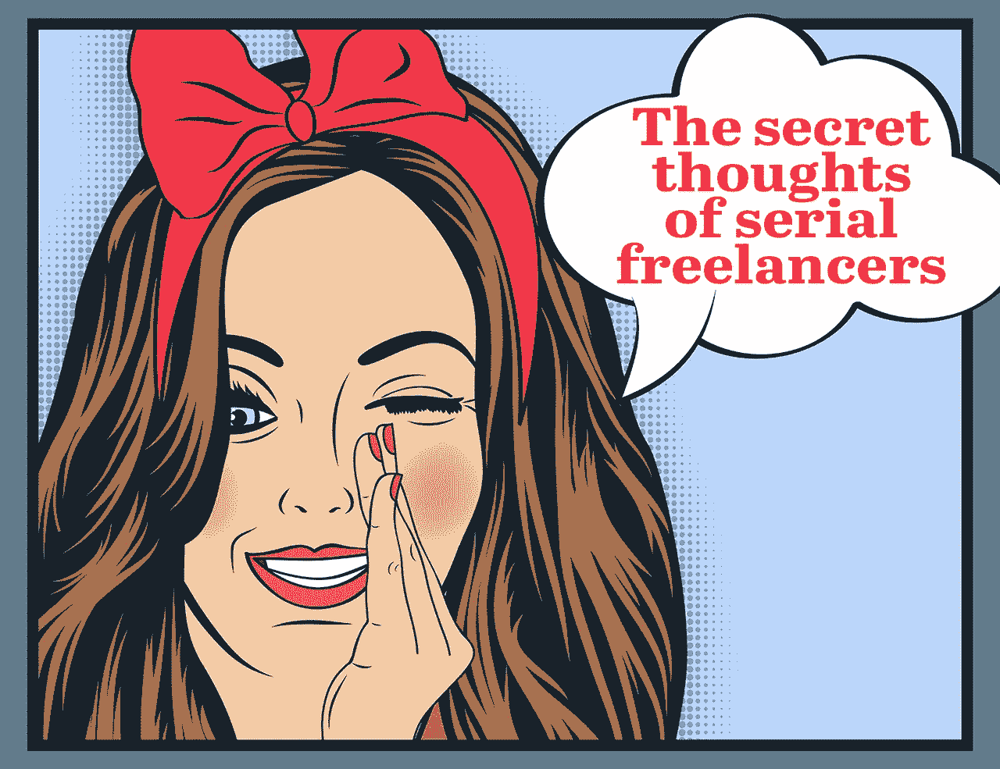
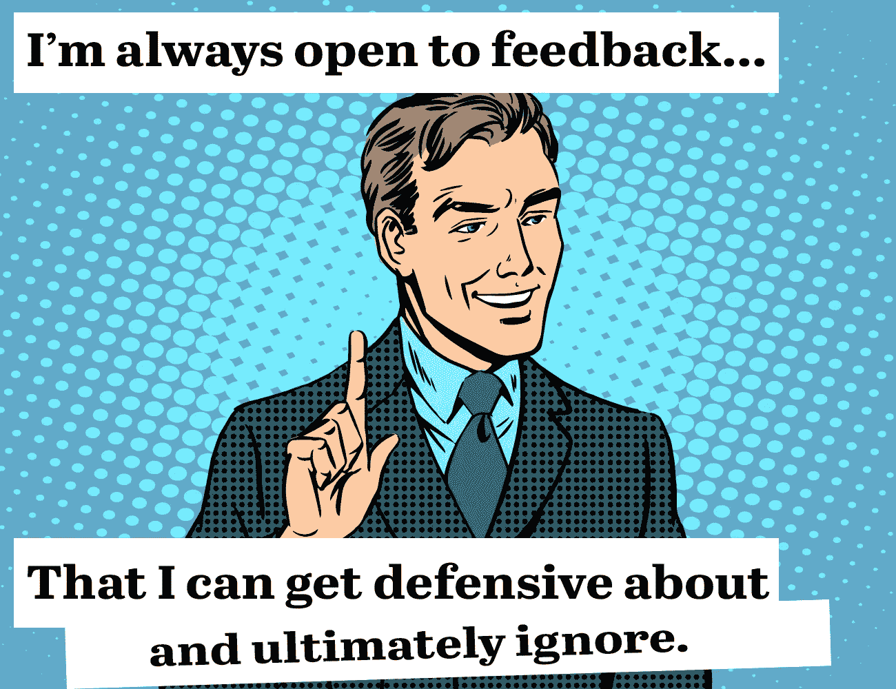

# 一个连续自由职业者的秘密想法

> 原文：<https://medium.com/swlh/secret-thoughts-of-freelancers-f230ecd57863>

> ***“不要再把【人才】当成家人或者自由人。而是把他们当成盟友。”——***[***奥莱利***](https://medium.com/u/8bd20f383de4?source=post_page-----f230ecd57863--------------------------------)

你可以说我是一个连续的自由职业者。是的，可怕的“f”字。

可能不是你想的那样。我不是被迫成为自由职业者的。而且我也不是专门做设计或者 SEO 的。我选择成为一名自由职业者。我选择成为一名综合主义者，或者在我的特殊情况下，成为一名全面营销者。

因为在自由职业变得很酷之前，我就已经是自由职业者了，所以我经历过相当多的难缠的客户。幸运的是，与难相处的客户一起工作的痛苦最终转化为获得非凡客户的快乐。

《五十度客户》之后，我有一些坦诚的内部秘密，想和那些雇佣和管理自由职业者的人分享。在你把自己排除在这篇文章之外之前，请记住，到 2020 年，40%的美国劳动力将由自由职业者组成——也就是 6000 万自由职业者。

根据《哈佛商业评论》的《敏捷人才》,世界上越来越多的人正朝着自由职业者的方向发展，越来越少地关注传统的就业安排，而更多地关注人才。

现在是了解自由职业者的时候了。以下是你需要知道的。

# 1.你不需要所有这些专家。

当我开始与一个新客户合作时，我总是觉得有点滑稽(而且非常糟糕)，所有这些专家都是凭空出现的。

最近的一个客户，可以说是迄今为止我合作过的最有信誉的品牌，雇佣我来发展它的一个副业项目的网络形象。内部利益相关方雇佣了一名博客编辑每周发布两到三篇文章，雇佣了许多专职作家每月写一篇文章，雇佣了一名外联专家为这些专职作家安排采访对象，而我则为其时事通讯和社交媒体渠道撰写文稿。

这不仅是对资源的彻底浪费，而且也给不在公司工资单上的人(如上述受访者)带来了令人讨厌的体验。想想吧。这些有影响力的大人物没有多少时间，他们不想和外联专家打交道，只想被介绍给作者，然后抄送给编辑，如果需要编辑的话。更不用说，完成任何事情都要花费更长的时间。

在经历了像这样一个笨拙的过程后，祝你好运让一个有影响力的人回复你的邮件。

一个更有效的资源利用方式应该是雇佣一个全面的专家来管理博客、进行推广和管理社交。唯一需要的额外自由职业者是作家，他们应该开展自己的外联活动，并从他们的文章中提取社交媒体“可引用的内容”。

# 2.自由职业者并不是虚拟助理的同义词。

不幸的是，大多数客户认为自由职业者是廉价的帮手，他们完全按照你想要的方式做你想要的事情。如果你想要那样的自由职业者，我强烈推荐 Fiverr。

如果你想要一个给你竞争优势的自由职业者，不要这样想。

真正优秀的自由职业者通常选择自由职业有两个原因——这两个原因都不是你可怜的退伍军人。相反，他们选择非传统的路线，因为[他们可以赚更多的钱](http://www.bloomberg.com/news/articles/2016-01-19/why-an-ex-google-coder-makes-twice-as-much-freelancing)，他们可以在工作上有更多的自主权。

事实上，[超过 40%](http://www.businessnewsdaily.com/2910-freelance-creative-pay.html) 的自由职业者表示，自由选择工作是自由职业最吸引人的特点。

你可以告诉我们要完成什么，但你不能告诉我们如何完成。埃里克·施密特在 1999 年的一幅作品中很好地诠释了这一点。

> “你还不如对一位伟大的艺术家说:‘我来给你描述一下什么是美丽的画。然后我会给你一个特定的画的想法。我会告诉你用哪种颜色。我告诉你用哪个角度。现在你只要画那幅画。那样的话，你永远也不会从任何一个艺术家那里得到一幅伟大的作品——如果你试图这样和你的极客们交谈，你也永远不会从他们那里得到伟大的作品。你需要给他们一个问题或者一套目标，给他们提供大量的【资源】，然后要求他们解决问题。"

让我们忘记这样一个事实:自由职业者鄙视被告知如何达到他们的目标，并考虑一个更紧迫的目标。

根据 IRS 指南，[行为控制](https://www.irs.gov/businesses/small-businesses-self-employed/behavioral-control)是独立承包商和公司员工之间的关键区别因素。

行为控制意味着，虽然员工必须遵循你疯狂的方法，但承包商不会，当然，除非你想给他们全职工作带来的所有好处。

# 3.自由职业者希望被包括在内。

自由职业者是[孤独的](http://www.fastcompany.com/3059317/your-most-productive-self/how-ive-learned-to-thrive-with-the-loneliness-of-freelancing)，所以当你被邀请加入一个新客户的公司闲散小组，却不料其全职员工称你为“侮辱者”或者仅仅是[容忍](/@laurenholliday_/go-where-you-re-celebrated-not-tolerated-41f0adce303)你的存在，这真的很糟糕。

根据敏捷达人的说法，自由职业者希望被包括在内。

> “像全职员工一样，外部人员希望做有意义的工作；能力和机会的增长；受到尊重、信任和参与；被视为团队的一部分；接受有关与其工作相关的问题的持续沟通，并感觉自己的贡献和努力得到了公平的回报和认可。相反，他们常常感到仅仅是被与他们一起工作的组织雇员容忍或怀疑。他们觉得自己不受管理层赏识，在应对合作伙伴组织的行政官僚主义时无能为力。”

# 4.你不能处理反馈。

当我们谈到“侮辱者”这个话题时，让我们来谈谈一个不太受欢迎的术语，即所谓的“激进坦白”。

根据[第一轮评估](http://firstround.com/review/radical-candor-the-surprising-secret-to-being-a-good-boss/)，彻底的坦诚源于个人关怀和直接挑战的结合。

作为顾问，我们的工作是告诉你，有时是非常详细地告诉你，你在哪里以及如何搞砸了。我们试图尽可能好地做到这一点，但大多数时候它不受欢迎，客户带着强烈的感情退缩了。

一些自由职业者会试图避免这种情况，他们会简单地告诉你你想听到的，并遵从你说出的每一个想法和/或结论。相信我，你不会想要一个做这个的自由职业者。这要么意味着，他们不知道自己在做什么，要么他们只关心本雅明——并且尽快得到那些本雅明。

最好的自由职业者会告诉你真相——即使真相难以启齿。

[*劳伦霍利迪*](http://laurenholliday.com) *是个* [*全栈有一手*](https://hackthejobhunt.com) *。你可以在*[*Twitter*](https://twitter.com/laurenholliday_)*上找到她，或者订阅她的邮件简讯。*

 [## 劳伦霍利迪- Revue

### 劳伦霍利迪-获得职业生涯，营销和偶尔咆哮瘦。http://hackthejobhunt.com

news.laurenholliday.com](http://news.laurenholliday.com)