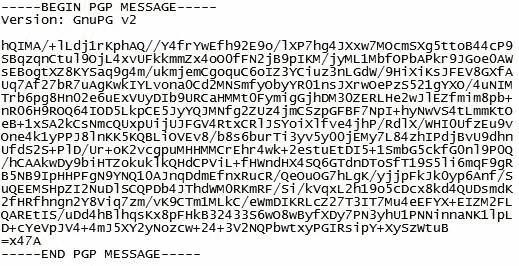
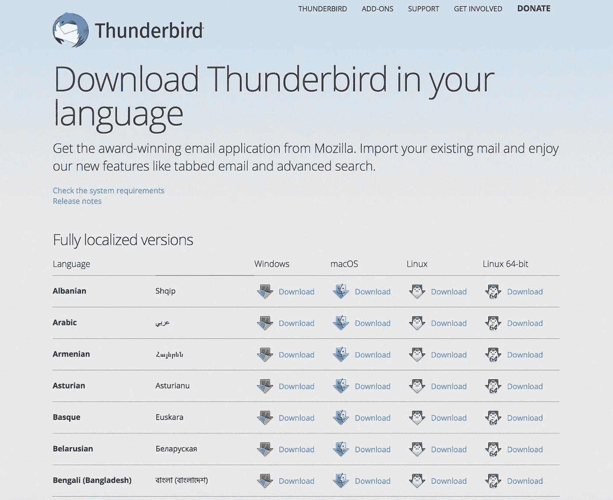
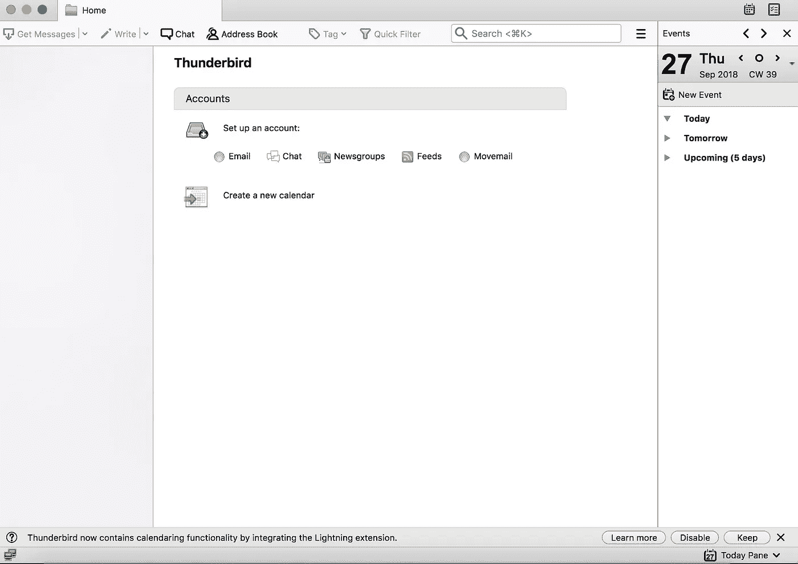
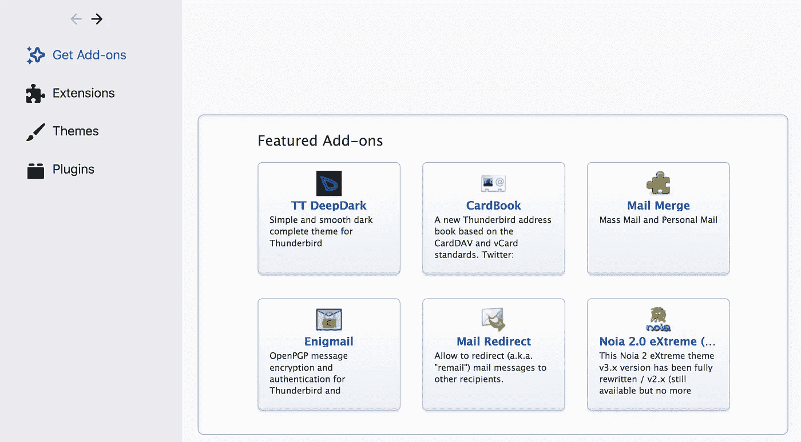
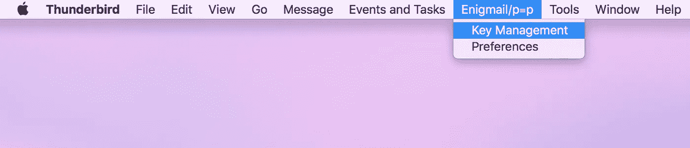
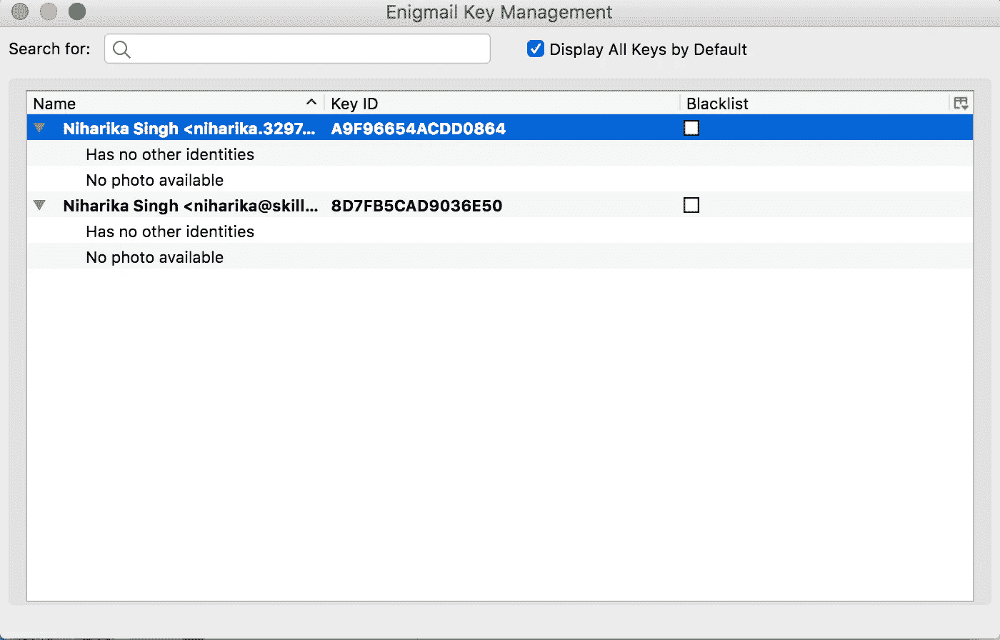
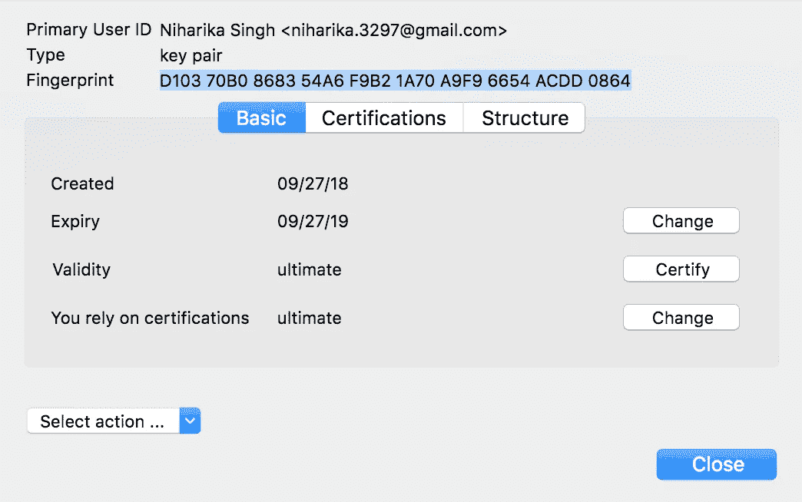
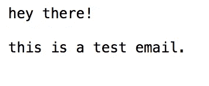

# 使用 PGP 在 5 分钟内保护您的电子邮件🔐

> 原文：<https://medium.com/swlh/secure-your-emails-in-5-minutes-using-pgp-5435ba007b3b>

如果你担心政府监视你，或者如果你的鹰眼公司对你的邮箱太感兴趣，或者如果你厌倦了有针对性的广告，或者如果你想与你的爱人私下交流，或者管理身份证、银行对账单、密码等敏感文件，使用 PGP 加密对话是值得的。

Source: [https://www.pexels.com/photo/aerial-photo-of-high-rise-building-754587/](https://www.pexels.com/photo/aerial-photo-of-high-rise-building-754587/)

## 什么是 PGP(相当好的隐私)？

> 我不打算深入研究 PGP 的细微差别，因为它使用了复杂的加密技术。

本质上，PGP 混淆了电子邮件，使其看起来像随机的字母和数字。这种加密使用接收者的公钥进行。因此，如果你想安全地给任何人发送电子邮件，你只需要他们的公钥。如今，将 PGP 公钥作为 Twitter 个人信息是一种趋势。

[https://darkwebnews.com/pgp-guide/](https://darkwebnews.com/pgp-guide/)

当这个消息在接收者端被下载时，它使用接收者的私钥被解密。确保你永远不会与任何人分享你的私人钥匙。因此，如果有人在窥探你的邮箱，他们只会看到乱码！

# 设置 PGP 的分步指南

## 1.下载并安装 Mozilla 雷鸟

雷鸟是一个免费的电子邮件应用程序，易于设置和定制。

去 https://www.thunderbird.net/en-US/thunderbird/all/的[下载适合你的操作系统的雷鸟。](https://www.thunderbird.net/en-US/thunderbird/all/)

这是我的应用程序控制台的样子—

在雷鸟上设置您现有的帐户。这可能需要 5 到 10 分钟，取决于你有多少封电子邮件。

## 2.下载并安装 GNU 隐私卫士

GnuPG 是由 [**RFC4880**](https://www.ietf.org/rfc/rfc4880.txt) (也称为 *PGP* )定义的 OpenPGP 标准的完整免费实现。GnuPG 允许你对你的数据和通信进行加密和签名；它具有一个多功能的密钥管理系统，以及各种公钥目录的访问模块。

去[https://gnupg.org/download/index.html](https://gnupg.org/download/index.html)下载。

## 3.下载 Enigmail

Enigmail 是一个简单的 OpenPGP 电子邮件安全接口。

去[https://www.enigmail.net/index.php/en/download](https://www.enigmail.net/index.php/en/download)下载。

要在 Thunderbird 上安装 Enigmail，使用**右键单击“将链接另存为……”**将扩展保存到本地。然后导航到雷鸟菜单工具>插件

选择 Enigmail 并添加它。

## 4.拿你的钥匙

转到 thunderbird，然后转到 Enigmail/p=p 菜单>选择密钥管理

This is your public key. This is what trendy cool people put in their twitter bio.

现在让我们通过发送电子邮件来测试一下。

您使用收件人的公钥(指纹)加密您的电子邮件，收件人将使用他们的私钥(指纹)解密邮件。

# 测试时间！

我用雷鸟发了邮件，用 gmail 打开了邮件，这就是我得到的结果。

我实际上写道:

雷鸟将自动解密电子邮件给你的雷鸟帐户有发件人的公钥(指纹)。

这就是如何做到的！

## 这篇文章发表在 [The Startup](https://medium.com/swlh) 上，这是 Medium 最大的创业刊物，有+ 373，071 人关注。

## 订阅接收[我们的头条](http://growthsupply.com/the-startup-newsletter/)。

