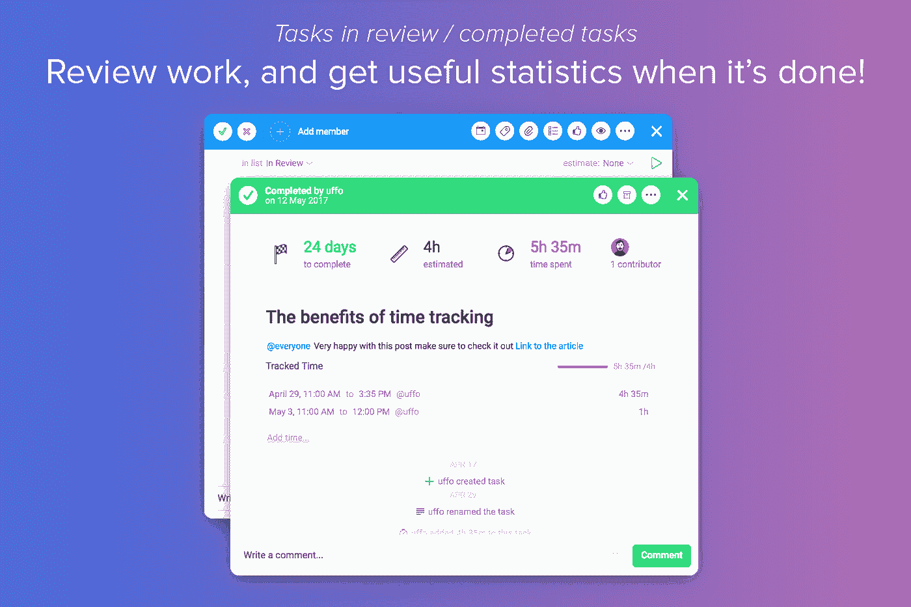

# 使用 Ora 查看您的团队或项目的表现

> 原文：<https://medium.com/swlh/see-how-your-team-or-project-is-performing-with-ora-dd4c094c1107>

[**Ora**](https://ora.pm/) 使您能够定制您的项目，并以您想要的方式进行协作。Ora 拥有您的团队提高工作效率和协作所需的一切。任务管理、看板、列表、问题跟踪、时间跟踪、聊天、项目报告和团队生产力。敏捷任务管理和可视化团队协作于一体，Ora 是您团队的指挥中心。

[**凯文威廉大卫**](https://medium.com/u/8ea7bd91b1a4?source=post_page-----dd4c094c1107--------------------------------) 采访了 [**瓦西里恩切夫**](https://medium.com/u/81ac3c3b83c2?source=post_page-----dd4c094c1107--------------------------------)[**奥拉**](https://siftery.com/ora) 了解更多。

## 嗨，瓦西里，给我们讲讲奥拉吧？

[Ora](https://ora.pm/) 是任务管理和团队协作的一体化解决方案。它很灵活，因此您可以打开和关闭不同的功能，以满足您团队的需求。也超级好用，设计也很棒。

## 告诉我更多关于你为什么要建立这个的信息？

两年前，当我们开发矢量设计应用程序时，我们改变了很多工具，但没有一个是我们满意的。要么是缺少功能，要么是应用程序太复杂，用起来不舒服，让我们觉得恶心。我们希望有任务并记录时间。所以我们开发了一个小应用，我们认为它有巨大的潜力，我们可以把它变成一个面向所有人的网络服务。我们试图完成的是有一个简单易用的应用程序，有很多功能。我知道这听起来不可能，但我认为我们迄今为止取得了良好的结果。

## Ora 与市场上已经存在的产品有何不同？

我们经常被客户比作[特雷罗](https://medium.com/u/fb5dd2d116a1?source=post_page-----dd4c094c1107--------------------------------)和 [**吉拉**](https://siftery.com/atlassian-jira) 。我们的一些用户甚至开玩笑说，我们已经找到了两者之间的中庸之道。有几个因素使 Ora 与众不同，是任何项目的好选择:

首先，有一个时间跟踪特性，它与我们的任务集成得如此之深，以至于任何集成都难以与之匹敌。此外，我们正在与第三方服务进行活动同步，以便您可以在一个地方获得 3 或 4 个系统的任务。这对于我们的“我的任务”视图非常有用——用户可以看到不同项目分配给他们的任务。

## 您能否介绍一下使用 Ora 的不同客户群？

我不知道有哪家公司不进行某种形式的任务管理。所以每个企业都是我们的潜在客户。我们只想让每个需要完成工作的人都能轻松使用 Ora。正如我所说的，当您创建项目时，您选择项目的复杂性。它可以是一个简单的待办事项列表，也可以是一个所有功能都开启的 1000 个任务看板。然而，我们确实有一些主要针对软件开发团队的功能，因为这是我们最大的客户群。

我们也是自用的好选择。这是免费的，成功人士会找到一个地方来组织一切。

## 您的客户如何使用 Ora？你能分享一些不同的使用案例吗？

大多数情况下，它要么是一个有很多客户的机构，每个客户都有一个独立的项目，要么是一个只有几个项目但有很多任务的软件公司。有些公司什么都用 Ora。他们制作产品板、营销板，甚至是基本的 CRM。有些人用它建立链接列表。我们也使用我们自己的产品来处理所有与公司相关的事情。

## 在早期构建产品时，最大的挑战是什么？你是如何解决的？

我们每天仍然面临许多挑战。最大的挑战是运输它。这样做花了我们两年时间。压力很大，来自每一个希望我们发货的人，以及引用雷德·霍夫曼的话的朋友“如果你不为你产品的第一个版本感到尴尬，那么你已经发布得太晚了”。

## 你加入的最有趣的整合是什么？

我们喜欢集成，我们计划今年增加至少 30 个新的。Ora + [Slack](https://medium.com/u/26d90a99f605?source=post_page-----dd4c094c1107--------------------------------) 是我们目前最好也是唯一的集成。不过，我觉得一旦我们完成了 [GitHub](https://medium.com/u/8df3bf3c40ae?source=post_page-----dd4c094c1107--------------------------------) 、[bit bucket、](https://siftery.com/atlassian-bitbucket)、[、 **Trello** 、](https://siftery.com/trello) [Asana](https://medium.com/u/4fecc4c082c?source=post_page-----dd4c094c1107--------------------------------) 和[、 **Zendesk** 、](https://siftery.com/zendesk)会非常有趣。(希望很快)。

## 最后，你运营公司最依赖的 5-10 种产品是什么&你如何使用它们？

[**Ora**](https://siftery.com/ora) —我们用作任务管理、问题跟踪、营销和时间跟踪平台。

[**时差**](https://siftery.com/slack) —我们用来沟通和接收来自 Ora 的更新

[**帮助侦察**](https://medium.com/u/fa62fdcc8ea3?source=post_page-----dd4c094c1107--------------------------------)——用于支援系统

[**ChargeDesk**](https://siftery.com/chargedesk)**—帮助我们弥合 Braintree 和 HelpScout 之间的差距，并为我们的客户制作 PDF 发票。(我喜欢)**

**[收纳盒](https://medium.com/u/2d2c8f4cb281?source=post_page-----dd4c094c1107--------------------------------)纸张——用于书写各种文件**

**[**Visual Studio 代码**](https://siftery.com/visual-studio-code)——开发人员经常用它来制作 Ora**

**[**iPad 原画**](http://protosketch.io/) —用苹果铅笔画的一些概念**

**[**Adobe Illustrator**](https://siftery.com/adobe-illustrator)—我们的桌面设计选择**

****

## **这个故事发表在 [The Startup](https://medium.com/swlh) 上，这是 Medium 最大的企业家出版物，拥有 294，522+人。**

## **订阅接收[我们的头条](http://growthsupply.com/the-startup-newsletter/)。**

****