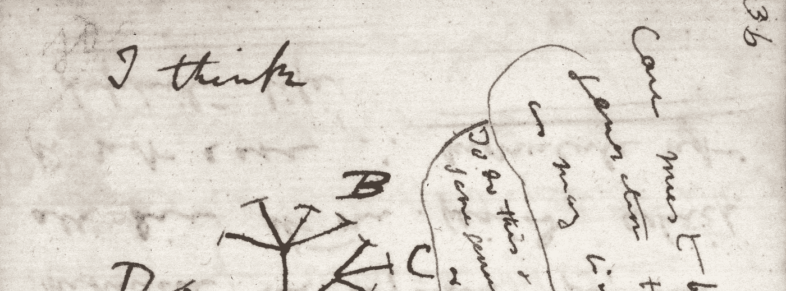

# 看到创业中的科学

> 原文：<https://medium.com/swlh/seeing-the-science-in-startups-db64bc414f77>

## 从学术界到黑客界的一小步

A page in Charles Darwin’s notebook in which he sketches his hypothesis for the origin of species. [Credit](https://www.pinterest.com/pin/265571709246349915/)

2017 年底，我在伦敦大学学院完成了神经科学博士学位，并在一系列初创公司投入了数据科学工作。

从学术界到工业界的转变带来了各种各样的新体验，比如在你的工作场所享受免费的、正常工作的咖啡机，人们关心…