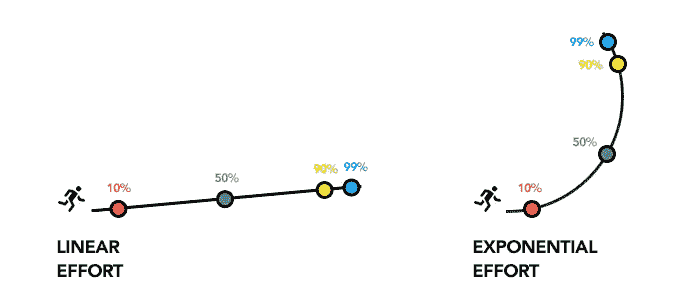
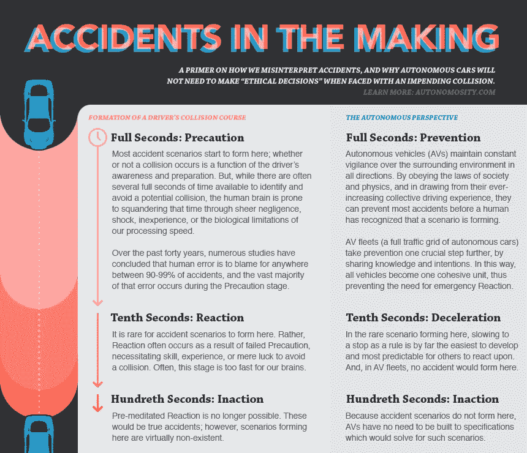

# 自动驾驶汽车永远不会 100%安全，因为我们不懂数学

> 原文：<https://medium.com/swlh/self-driving-cars-will-never-be-100-safe-because-we-dont-understand-math-643486385dbe>

你可能对一张纸折叠 42 次就能到达月球的说法很熟悉。如果你不太熟悉，这里有一个动画效果很差的视频来解释它——“它”是指数增长的一个比喻。

分析了这个视频上的大量评论后，我可以告诉你有四种类型的人在看它:

1.  人们不理解这个概念，而是依靠他们的生活经验来怀疑这个概念的有效性。这是最大的群体。
2.  那些确实理解了概念，但没有理解足够的数学来令人信服地回答第一组的无知怀疑的人。这是第二大群体，我也在其中。
3.  理解概念和足够相关数学知识的人可以令人信服地回答任何人的问题。这些人对作为假设的概念的有效性感到满意。这是第三大群体。
4.  理解概念和数学的人，依靠这种经验来怀疑假设的有用性，因为它忽略了复杂的变量，而这些变量可以通过一个缺陷较少的类比来避免。这是最小的群体。

你发现那里的两个重大问题了吗？

首先是大众无知导致摩擦的问题。前两个群体占了大多数，然而他们却在争论着他们都不理解的观点。第二组不能回答第一组不知情的问题，所以第一组坚持他们的(不正确的)观点，这阻碍了两组在信息方面取得任何进展。

其次是无知伪装成智慧的问题。第一组和第四组都对这一说法表示怀疑，并且都从他们的个人经历中得出这样的结论。因此，第一组中的某个人听到第四组的陈述并想象自己属于后一个阵营是合理的，因为立场似乎是相同的。这就是社会如何以白痴重复他们从聪明人那里听到的论点而告终，让我们其他人很难知道谁是聪明人，谁是偷了聪明人的话的白痴。

关键是，我们大多数人都是白痴。让我们一开始就承认这一点，因为尽管假装我们理解汽车、交通、撞车和经济学等事情很有诱惑力，但鉴于像自动驾驶汽车这样的革命性转变，我们真的没有必要精心制作或抓住这样的观点。

我们已经听到一些政治家和汽车高管说，无人驾驶汽车需要“完美”，才能足够安全地载人——“99%还不够好。”随着特殊利益集团游说反对这项技术，我们很可能在不久的将来会听到更多这样的言论。

问题是，“完美”是不可能的。

要理解为什么一辆“完美的”自动驾驶汽车是一个荒谬的需求，你必须理解面对一个难度呈指数增长的问题意味着什么……就像折叠纸一样。

左边的那个家伙？他正在努力克服难度的线性增加。你每天走上一段楼梯时都会这样做。我们都认为走一级楼梯比走十级楼梯容易，对吗？但这仅仅是你已经证明有能力解决的同一个问题。如果你已经爬了楼梯的 99%,你将能够完全依靠意志力或肾上腺素的爆发来完成。线性问题完成了 99%就意味着你差不多完成了。

右边的家伙可没有这种奢侈。他的登顶之旅变得异常艰难。

在 10%时，他会采用你我都会采用的策略。他会尽最大努力跑向那个障碍，不需要特殊训练或数学方程式或辅助装置。

在 50%的时候，正确的人会意识到他的计划不会成功。跑上山似乎只解决了一半的问题，对于剩下的 50%显然成了无果的方法。一些事情现在变得显而易见:

*   他没有彻底考虑这个问题
*   他不能依赖传统解决方案，可能需要更多资源
*   他已经在原来的方法上浪费了时间和资源

现在大家注意了:假设我们已经达到了 99%。Right Dude 和一个由 30 名工程师组成的团队获得了 3000 万美元的资金，致力于解决在这座山上让人体处于近乎颠倒状态的问题。不要问他们是怎么做到的…这件事花了几个月才解决，它涉及到一个通量电容植入，这使得这家伙睡觉时血压不稳定。此外，他们用金刚合金替换了他的指甲。但是嘿，我们做到了。99%!我们快完成了！

不，我们还没完——把香槟放好。指数难度不是这样的。

这里的 99%是指，“我已经解决了这个问题中 99%的已知场景。”那剩下的 1%呢？这可能比达到 99%的问题更难解决 50 倍。这可能要困难一万倍。人类可能需要数百年的时间才能想象出可行的解决方案。99%只告诉你到目前为止你取得了什么成就。这并不能保证你就要完成了。

在自动驾驶汽车的情况下，我们谈论的是解决事故、导航失误、故障……总的来说，无数的场景。无限的 99%是多少？这些岗位的工程师把自己的达成率从 99%提高到 99.9%，到 99.99%，到 99.999%……没有 100%。总有一些事情没有解决，通常，在你解决了其他问题之前，你不会知道这是一个问题。这就是为什么你最后会谈论 99%没有分母的东西。

猜猜这是谁的工作，放弃并说，“好吧，99.999%够好了吗？”

你们这些家伙！选民们。纳税人。消费者。应该为更美好的明天而努力的社会成员。

我们通过指数努力移动的每一个小数位反过来意味着指数投资:如果一辆自动驾驶汽车在晚上遇到一个两英尺高的孩子从一辆停着的汽车后面冲出来的问题，并且只有十分之一秒的反应时间，我们应该尝试解决它吗？答案是可能。也许吧，如果这是我们经常遇到的情况，如果在这种情况下我们因失败而遭受的损失值得减轻的话。

但是——如果它几乎从未发生，如果解决它意味着投入数十亿美元和数年的研究来解决这个问题……这些资源可能会有更好的用途，尽管它有缺点，但推出这项技术会有更大的价值。因为，当然，你让自动驾驶汽车停留在实验室的每一天，就是我们因常规车祸而失去 85 条生命的一天，也是我们花费 20 亿美元来撞车和修复我们的交通基础设施的一天。这仅仅是在美国。在某种程度上，[试图解决边缘案件](/@mitchturck/self-driving-cars-and-sound-cannons-an-indecent-proposal-43ebf99fafc#.a106c6jos)的收益递减变成了浪费，讽刺的是，也是不人道的。你不需要推测 AVs 就能理解这一点——这是人类曾经采取的几乎每一项举措的现实。我们从来没有达到 100%。

怎样才能确保一个小孩不被一辆只有不到 0.2 秒反应时间的车撞上？人类反应时间的极限 0.1 秒怎么样？在某种程度上，我们正在花费大量的现实世界的资源——这导致了现实世界的浪费——来解决一个更多地存在于我们头脑中而不是现实中的问题。而且，即使这个问题可以解决，这个解决方案的重量(字面上和比喻上)可能会阻碍车辆的整体效率，就像增加功能和预防措施通常会做的那样。将这种低效率乘以每年行驶的数万亿英里，你会发现你的解决方案已经产生了自己的问题。

[事实上，道路上的每一起事故都是由人为疏忽造成的。我们傲慢地允许它继续下去，以便我们可以争论解决一个未来不存在的问题，这令人震惊。但是当然，我们继续这样做是因为我们不懂数学——特别是当它要求我们摆脱自己的头脑时。](http://cyberlaw.stanford.edu/blog/2013/12/human-error-cause-vehicle-crashes)

自动驾驶汽车越来越近了。接近完美？不。差不多了。除非你明白你的要求在一个永远不会完美的世界中的反响，否则不要像个傻瓜一样指着那些有待解决的问题。现在已经不那么完美了。