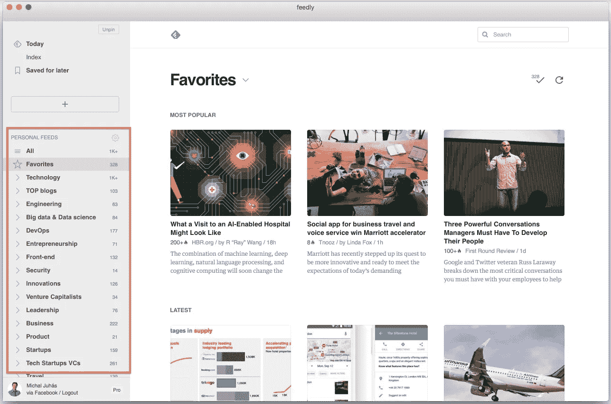

# 快速提升个人成长的自我管理工具

> 原文：<https://medium.com/swlh/self-management-tools-to-boost-your-personal-growth-quickly-a446eca22e1c>

最近，我采访了几位技术负责人——工程部门的首席技术官和副总裁——包括 [*朱利安·穆特*](https://es.linkedin.com/in/jmoutte)*[*王泰利*](https://hk.linkedin.com/in/terrywong)*[*张秀坤·劳特*](https://de.linkedin.com/in/dominikraute/en)*[*阿什坎·罗沙纳伊*](https://nl.linkedin.com/in/ashkanroshanayi)*[*罗德里克·于尔*](https://my.linkedin.com/in/roderickruhl) [*克劳迪奥·卡瓦列罗*](https://th.linkedin.com/in/ccaballero)*[*斯蒂芬·施耐德*](https://sg.linkedin.com/in/3digitalminds)*[*马塞尔·杜蒙*](https://nl.linkedin.com/in/marceldumont)*[*马修学士*](https://uk.linkedin.com/in/matthewjbatchelor) 和[*约瑟夫·内沃拉*](https://th.linkedin.com/in/josefnevoral)*******

**此外，我阅读了大量关于个人生产力的文章和书籍，尝试了许多工具，并采用了以下最佳实践和自我管理工具。**

**我挑战你去采纳其中的一些，创造你自己的系统**#自我管理**系统来促进你的个人成长。**

# **文件管理系统**

**有一个好的系统是很重要的，所以我尝试了下面的文件系统来帮助我保持有条理:**

*   **[**Evernote**](http://evernote.com)**:**👎❌:已经过时了，Mac 版本就像是 20 世纪 90 年代的。分享和桌子烂透了。**
*   **[**OneNote**](http://www.onenote.com) **:** 👎 👎❌:我用它做了 2-3 周的实验，从 Evernote 转移了几个文档，它看起来很花哨，但是共享&评论就是不行。啊，微软，微软！:-/**
*   **[**谷歌文档**](http://docs.google.com) **:** 👎❌:我在工作中使用它，但不喜欢自我管理。文件结构和文档链接差得很远。**
*   ******:**👎❌:我用它来处理一些不太重要的文档(在测试阶段)，它没有离线模式，其他方面还好。****
*   ****[**妙语**](http://www.quip.com) **:👍👍👍✅:那里最好的工具。不开玩笑。我正在迁移 Evernote、OneNote 和 Paper 中的所有文档。妙语连珠杀了它。文档管理、协作和应用内聊天完美无瑕。查看示例文件夹:******

********

****Document management in Quip****

# ****个人成长路线图****

****在软件开发中，每个版本都有自己的版本。尽管我们在逐渐进步，并没有被“释放”，但我喜欢这样思考我人生中的里程碑。它帮助我想象自己在 2.0、3.0 和 4.0 版本中的样子👴****

****阅读 Tomas Laboutka 如何[计划&与你一起实现长期目标 v2.0](https://tomaslaboutka.com/new-year-new-you-plan-achieve-your-long-term-goals-with-you-v2-0-11a8e37c4ba3) 。****

****这是我实现所有这些目标的公开承诺！:-)****

********

****My personal Growth Roadmap and versions to be “released” soon.****

## ****健身目标****

****我所有的健身目标和最近的实际数据都在一个表格中，分为三类:****

1.  ******力量** *(仅体重，不拉铁！)*****
2.  ******有氧**(#跑步)****
3.  ******灵活性&机动性**(#瑜伽)****

****对于力量练习，我遵循蔻驰·保罗·韦德的囚犯条件反射量表。他在监狱里呆了很多年；这就是这本书的名字。****

********

****My fitness goals for the next biennium (Strength, cardio & flexibility)****

## ****进一步阅读****

*   ****[酒吧兄弟](https://barbrothers.com/)****
*   ****[使用健身操避免去健身房](http://www.military.com/military-fitness/workouts/avoid-gym-by-using-calisthenics)****

# ****日历和提醒****

****类似地，对于文档系统(Evernote、OneNote、Google Docs、Paper、Quip)，我也尝试了几种不同的日历。****

****最终，我购买了 [**幻想曲 2**](https://flexibits.com/fantastical) **。这是迄今为止我用过的最好的日历。💡提示:不要从 Mac 的应用商店购买——你不能拥有 30 天的试用期。相反，从他们的网站下载，先试一试。******

****一些杀手级的功能包括做得很好的日常议程，提醒，和完美的(！)同步。它应该配得上它的博客帖子*(如果你想知道更多，请平我)。*****

****我开始使用**提醒**(下面截图上的黄色)，无法想象没有它们的世界👴****

## ****进一步阅读****

*   ****[百万富翁不使用待办事项清单](http://www.forbes.com/sites/kevinkruse/2015/07/10/to-do-lists-time-management/#30a14cfaa72e)****

********

****A screenshot of Fantastical2\. Expensive, but IMHO totally worth.****

# ****有重新安排时间的生产力目标****

****[RescueTime](https://www.rescuetime.com) 允许我跟踪我的每日/每周生产率，设定目标，并在达到一些阈值后收到通知。****

********

****RescueTime has a great dashboard showing details, not just about the productivity, but also the distracting tools.****

****我通过 RescueTime 跟踪以下限制:****

********

****My daily productivity goals tracked and evaluated by RescueTime.****

# ****习惯形成和追踪****

****有了习惯，一切都容易了。我发现早上 5 点起床锻炼非常具有挑战性，直到它成为一种习惯。冥想、日常生活也是如此。****

****同样，我尝试了几个习惯追踪应用程序，并坚持了 [**的生活方式**](http://wayoflife.com) (WOL)。我认为这是最好的一个——需要付费，但很值得。****

********

****Habit tracking with “Way of Life” iOS app (WOL)****

## ****我的日常习惯包括:****

*   ****早上 **5:05 起床**或更早(从早上 5:30 开始)****
*   ****不要打瞌睡(避免负面行为)****
*   ******健身**(力量或跑步或柔韧性瑜伽)****
*   ******拉伸**10 分钟以上****
*   ******冥想**会话带顶空****
*   ****听一个或多个**播客******
*   ****上午**策划**(指认 MITs)****
*   ****阅读一本**书**至少 30 分钟****
*   ****阅读**文章**20 分钟或以上****
*   ****给予**反馈******
*   ****刻意**练习** >速读****
*   ****晚报**倒影**日报&****
*   ****完成所有 **MITs******
*   ******步行**7000 步或更多****

## ****进一步阅读****

*   ****习惯:我们为什么做我们所做的事情？****
*   ****[养成你将保持的习惯](https://hbr.org/ideacast/2015/03/set-habits-youll-actually-keep.html)****

# ****麻省理工学院早上的规划****

****每天早上开始工作前，我会确定一天中最重要的三个 MITs。我把它们放在一张纸上，放在我的书桌上。今天的目标很明确:完成所有 3 个 MITs。****

******我在 WOL 养成了一个习惯**，并一直保持下去。****

## ****进一步阅读****

*   ****[你一天的目标:最重要的任务(麻省理工学院)](https://zenhabits.net/purpose-your-day-most-important-task/)****
*   ****[80/20 法则和你最重要的三项任务](http://www.smartproductivework.com/8020-rule-3-important-tasks/)****

# ****沉思****

****克里斯蒂娜·康格顿在她的文章[中声称，正念可以改变你的大脑](https://hbr.org/2015/01/mindfulness-can-literally-change-your-brain)正念不应该再被认为是高管们的“好东西”，而是“必须品！”****

****早上，刚做完运动和伸展，我就用[顶部空间](https://www.headspace.com/)冥想 10 分钟。50+节之后，只能推荐了。****

****我养成了早上冥想的习惯，并在 WOL 中记录下来。****

********

****Headspace iOS app. Left: a list of sessions. Right: a list of series to choose from.****

## ****其他来源:****

*   ****Hbr.org: [冥想如何让首席执行官受益](https://hbr.org/2015/12/how-meditation-benefits-ceos)****
*   ****TED 演讲:[只需要 10 分钟的专注](https://www.ted.com/talks/andy_puddicombe_all_it_takes_is_10_mindful_minutes)****

# ****RSS via Feedly****

****我尝试了几个 RSS 源，认为是最好的一个。高级功能每月花费 7 美元。亮点:****

*   ****[袖珍](http://pocket.com)集成****
*   ****一个很棒的 Chrome 插件，可以根据受欢迎程度对文章进行分类****

********

****RSS feeds organized in different categories in Feedly****

# ****我口袋里的物品****

****当我找到一篇我想稍后阅读的文章时，我会将它放在[口袋](http://getpocket.com)中，并附上其中一个标签。它帮助我专注于一个领域，阅读关于类似主题的多篇文章。****

****我养成了每天阅读几篇文章的习惯，并在 WOL 中记录下来。****

********

# ****电子邮件简讯订阅****

****我仅通过电子邮件订阅以下出版物:A)提供无法通过 RSS 提供的个性化内容；B)需要订阅才能阅读几篇文章(如 HBR.org)。其余的通过 RSS feed。****

*   ****[**【my bridge】**](http://mybridge.co)(前 10 篇文章的个性化每周摘要)****
*   ****[**中等**](/) (我关注的那些话题的个性化每日摘要&作者)****
*   ******(每日管理提示和每周总结)******
*   ******[**首轮回顾**](http://firstround.com/review/) (精彩的深度访谈)******
*   ******[**找错了人**](http://www.bakadesuyo.com/) (很好研究的话题)******
*   ******[**创始人网**](https://foundersgrid.com/) (初创公司创始人的每日时事通讯)******

# ******快速阅读******

******我的目标之一是每年读 100 本书。为了达到这个目标，我需要把我的阅读速度从每分钟 230 字提高到每分钟 800 字。******

******一本书平均有 50000 个单词。以每分钟 800 字的速度，我可以在一两个小时内读完一本书，而且理解能力和今天一样。真诱人！我会随时通知你进展情况。******

******我养成了练习快速阅读的习惯，并在 WOL 中保持这种习惯。******

## ******工具/应用程序******

*   ******[**Acceleread**](https://itunes.apple.com/us/app/acceleread-speed-reading-trainer/id528963250?mt=8)(iOS)——练习速读的绝佳 app。一个月之内，我从每分钟 230 英里增加到每分钟 312 英里。******
*   ******[**Outread**](https://outreadapp.com/)(iOS)——一个连接到 Pocket 的应用程序，提取文章并以高亮显示的单词提供给你，以练习快速阅读。******
*   ******[**舒尔茨表格**](https://itunes.apple.com/us/app/schultz-tables-increase-reading/id524144158?mt=8)(iOS)——一个简单而强大的应用程序，它可以扩大一个人的视野，因此阅读率应该会增加。******
*   ********❓**[**spritz**](http://spritzinc.com/)**/**[**快速阅读器**](https://itunes.apple.com/us/app/rapid-reader-with-spritz/id887141866?mt=8)**/**[**readsy**](http://www.readsy.co/)**——我只是在试验这些，还不能推荐**。**********

## ******进一步阅读******

*   ******你阅读的速度够快吗？******

************************************

******From the left: Acceleread, Outread and Schultz Tables.******

# ******要读的书的队列——好的读物******

******我从小就热衷于读书。我理想中的周日下午可以用这些关键词来描述:一本书、Kindle、咖啡、扶手椅、花园、熟睡的孩子👴******

******我使用 [**Goodreads**](https://www.goodreads.com) 来跟踪我积压的所有书籍——参见 Goodreads 上的[必读清单](https://www.goodreads.com/review/list/7330756-michal)并关注我以获得更多提示。******

******我的目标是每周读一本书。我按等级排列列表，选择等级最高的一个，阅读并重复。******

******我养成了每天早上阅读的习惯，并在 WOL 保持这种习惯。******

************

******My reading queue. Order by rating descending.******

# ******播客******

******我在 60-90 分钟的锻炼中听播客。随着收听速度的提高(1.5 倍)，我每天听 2-3 个甚至更多的播客，一周 7 天。******

******原生 iOS 应用程序很好，不需要任何花哨的东西。******

******我养成了每天早上听播客的习惯，并在 WOL 保持这种习惯。******

## ********播客积压********

******我也喜欢组织播客“积压”。我选择一个，听所有过去的剧集(即*开发者茶*有 200 多集)，然后我转移到另一个播客。******

******在一个妙语连珠的文档中，我有一个我完成的播客的运行列表和一个待听的播客的积压列表。******

************

## ******我最喜欢的播客******

*   ******[**黑仔创新**](http://killerinnovations.com) **:** 惠普前 CTO 维持他的播客 12 年。******
*   ******[**开发者茶**](http://developertea.com) **:** 乔纳森·卡特雷尔以不到 20 分钟的剧集开始了他的播客。******
*   ******[**20 分钟的 VC**](http://www.thetwentyminutevc.com) **:** 主持人哈里刺戳，19 岁开始他的播客(！)并结识了所有知名风投。他选择了一个有趣的方法:受访者需要推荐和介绍另一家风投。******

******我其他喜欢的播客包括[性能提升播客](https://itunes.apple.com/us/podcast/performance-enhancing-podcast/id827772201?mt=2)、[指数智慧](http://www.abundance360summit.com/podcast/)等等。如果你愿意的话，请在评论中告诉我。******

# ******音乐******

******专注是我们最宝贵的资源。 [**Focus@Will**](http://focusatwill.com/music/#player) 是一项在线服务，提供旨在提高精神专注度的背景音频。当我需要专注于重要的工作时，我几乎每天都用它。******

******[**Noisli**](https://www.noisli.com/) 是一个类似的服务，目的略有不同。它让我可以混合不同的声音，创造一个完美的环境，也就是说，我创造了自己的*“嘈杂的咖啡”&*流，我一边阅读一边听。它帮助我不受干扰地阅读。******

## ******进一步阅读******

*   ******生产力的秘密:心流、时间、音乐和你的心跳！******

# ******每周计划和回顾******

******我每周的例行工作非常简单:******

1.  ********规划**周一上午******
2.  ******周五晚上的回顾会******

************

******Weekly **planning** (Monday) and **retrospective** (Friday)******

# ******每日回顾******

******我的日常工作也很简单:******

1.  ******早上的计划(MITs——见上图)******
2.  ********晚上回顾********

## ******进一步阅读******

*   ******你以为你什么都知道吗？7 分钟后再想******

************

******Daily routine (morning & evening)******

******下面是我保存在 Quip 中的一个模板，在我的晚间回顾中每天复制。******

************

******A template (in Quip) for the regular evening retrospective.******

# ******向周围的人提供反馈******

******我最近写了一篇关于[提供反馈](/@michal.juhas/feedback-matters-396fa4c96715)的重要性的文章，所以我挑战自己每个工作日至少提供一次反馈。******

******我养成了一种习惯，并在生活中保持这种习惯。******

# ******💡额外小费******

******安装 [**语法**](http://grammarly.com/) ，它会帮助你学习英语。即使在写这篇博文的时候，我也在提高自己的水平！******

************

******Grammarly is fixing my grammar mistakes. *(Thanks!)*******

# ******❓下一步是什么？******

******学习和个人成长对我们的未来至关重要。把每一天都看作是学习更多和变得更好的机会。******

1.  ******选择 1-3 个新习惯，从今天开始(最迟明天)******
2.  ******下载上面提到的应用程序(Quip、WOL、Pocket、Feedly、Noisli、Grammarly、随意聚焦、Headspace)******
3.  ******创建一个你想听的播客列表(至少 2-3 个开始)******
4.  ******列一个你想读的书的清单(开始至少 5-10 本)******
5.  ******在晚间回顾会上开始评估你的一天******

********📈保持成长，玩得开心！********

************

# ******免责声明:******

******我没有参与本文中提到的任何产品和服务。没有附属链接。我真诚地推荐我日常使用的工具，没有任何好处。******

# ******更多见解和最佳实践******

******我对加速成长和学习充满热情。和我一起探索父母可以从创业环境中运用什么来养育他们的孩子。******

******激情、企业家精神、**早期学习、**快速阅读、**家庭学校、**编码和机器人技术如何帮助**加速我们家庭的教育和成长？********

## ******[报名](https://growth.michaljuhas.com/subscribe/)学习如何最大限度地发挥孩子的潜力:******

****** [## 订阅:为现代热情的父母成长

### 回答希望最大限度发挥孩子潜力的父母的问题。教育体系陈旧，学…

growth.michaljuhas.com](https://growth.michaljuhas.com/subscribe/)******