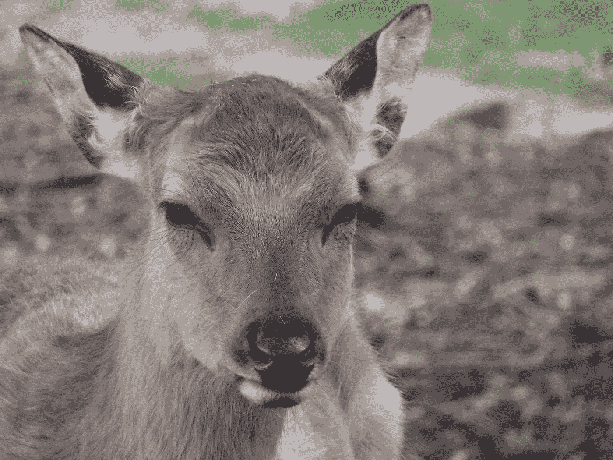

# 自给自足伴随着感觉和科学

> 原文：<https://medium.com/swlh/self-sufficiency-happens-with-sense-and-science-da500a1fd573>

Please don’t burn down my forest. Credit Christyl Rivers

越来越多的人听从自己的感觉，发现气候变化是真实的。

这当然很重要，但重要的是，许多人在早期没有依赖经验科学。

# 科学第一:你需要所有的感官