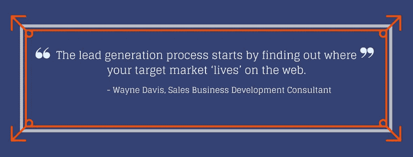

# 在正确的地方向正确的人销售:如何创建完美的前景图

> 原文：<https://medium.com/swlh/sell-to-the-right-people-in-the-right-place-how-to-create-the-perfect-prospect-map-2fc3d0f23c56>

即使是世界上最好的营销信息，如果在无人能看到的沙漠中也是无用的。你需要知道你的潜在客户在哪里度过他们的时间，以便有效地抓住他们的注意力。

你可以拥有令人难以置信的数据，你对[的潜在客户简介](https://www.taskeater.com/insights/generate-more-sales-prospect-profile/)了如指掌，令人惊叹的销售套牌和为你的目标受众量身定制的完美信息，但如果你在他们看不到的地方提供这些信息，所有这些都是毫无意义的。

找出你理想的潜在客户在网上花时间的地方和了解他们的生活和职业一样重要。知道你的努力集中在哪里可以让你的营销活动尽可能有效。如果你猜错了，结果又错了，你将会浪费你的销售团队和你自己的时间——这可能会导致错过很多机会。

通过创建前景图，将您的精力集中在您知道您的前景所在的平台上。前景图有助于您找出潜在客户最有可能与您接洽的地方，并就您能为他们提供什么展开对话。

**在我们开始之前，什么是在线社区？**

在线社区是在你和你的潜在客户之间建立直接联系的最有效的方式。这通常包括社交媒体网站，但是简单地到处发布你的信息是没有用的。你必须使用你在潜在客户档案中收集的信息来最好地确定你的潜在客户在哪些网站上，因为这些是你应该关注的网站。

与其将你的社交媒体营销努力分散在许多渠道上，不如将你的时间和精力集中在一两个你知道你的潜在客户最活跃、最愿意参与的平台上，这要有效得多。

# 如何确定使用哪些社交平台

一切都是为了研究。把你收集的关于你理想中的潜在客户的数据和每个社交媒体网站的已知人口统计数据放在一起看。如果你想更深入地研究，你会在网上找到很多这方面的信息，但是我们总结了一些要点。

*   脸书是互联网上最受欢迎的社交媒体网站。它往往是更成功的 B2C 营销人员，但你不应该太快折扣。鉴于其每月 20.7 亿活跃用户，它有一个巨大的潜在印象池——但鉴于该网站的亲密性质，请注意，更具侵入性的广告可能不会得到积极的参与，因为人们认为该网站是一个个人空间。
*   LinkedIn 完全是商业驱动的。这是一个领先的 B2B 广告社交平台，让您的品牌在建立社交网络时可以轻松地与合作伙伴、潜在客户、客户和同行建立联系。全球月活跃用户达 1.06 亿(总计 4.67 亿用户！)这是创建 B2B 在线存在的可靠方式。B2C 广告在这一领域表现不佳，因为潜在客户期待以业务为导向的信息，并积极参与网站上的活动。
*   **年轻消费者使用 Youtube** 最多。它是第四大最常用的社交平台(15 亿月登录用户)，但[是第三大最有效的](https://www.linkedin.com/pulse/six-social-media-platforms-b2b-marketing-2016-kent-lewis/)。它是世界第二大搜索引擎，归谷歌所有，这意味着你可以通过有机搜索结果获得更高的知名度。尽管这一领域的人口较为年轻，但 B2B 消息传递仍有巨大的价值。
*   Instagram 也是年轻消费者使用最多的，然而作为 B2B 空间更具争议。这里很难定位 B2B 角色，因为它更倾向于 B2C，并且是基于美学的(餐饮、旅游、时尚)。然而，它的参与度确实比 Twitter 或脸书高得多。鉴于其 8 亿月活跃用户，这可能是营销策略的关键。
*   Pinterest 的主要用户是女性。类似于 Instagram，虽然有一个更小的(但仍然意义重大！)每月 1.5 亿活跃用户的用户群，对于 B2B 营销人员来说，它在目标和人口统计方面可能是有限的，从而有助于更具美感和创造性的职业。
*   Twitter 经常被用作新闻文章的来源，并为用户提供定期的、微小的更新。它拥有 328 个月活跃用户。对于 B2B 营销人员来说，付费搜索能力是有限的，因为商业人物角色很难锁定目标，更适合 B2C 营销(活动、优惠、新发布、销售等)。).Twitter 上的广告和任何真实的推文一样具有互动性——所以用户转发并喜欢你的消息，增加了它的覆盖范围。由于它们看起来像推文，广告融入了 feed，比脸书或 Instagram 更不受干扰。

一旦你确定了你更想探索哪个平台，你就需要知道如何最好地接近它。我们就 B2B 领域最常用的三种渠道给了你一些实用的建议。

# 如何使用 LinkedIn 建立前景图

这是领先的 B2B 营销空间。潜在客户以商务身份出现在 LinkedIn 上，他们有正确的心态去接触商业产品。

如果你在 LinkedIn 上和你的潜在客户有联系，研究他们在那里做什么。

*   他们是任何互助团体的成员吗？花些时间浏览小组活动并加入对话。
*   **他们是否属于你不属于的任何团体？去加入他们吧。**
*   **他们有什么技能或者代言吗？**你如何以这种方式最好地与他们互动？
*   **他们读过哪些文章？**查看他们的活动以及他们分享的内容。
*   **他们关注哪些有影响力的人和公司？找出他们喜欢和钦佩的人，并从这些公司的营销活动中获得灵感。**

# 如何使用脸书构建前景图

尽管它不是最好的 B2B 渠道，许多公司仍然使用脸书做广告。请注意，随着[算法](https://blog.hootsuite.com/facebook-algorithm/)的最新变化，脸书在其新闻源中优先考虑非品牌内容，因此相应地调整你的有机策略。它的付费功能仍然是接触合适的人的一种强有力的方式，并且通过按兴趣细分的选项，你可以接触到你以前从未认为感兴趣的潜在客户。

这就是你该怎么做。

*   **看看你或你的竞争对手所在的任何 FB 小组。**参与对话。积极响应，在这里建立联系。
*   **您*是否应该*加入**任何餐饮团队，以便与您的目标潜在客户交谈？加入他们。
*   您的目标潜在客户分享哪些类型的内容？**看‘喜欢’的话题和模式。**付费功能允许您根据兴趣进行细分。
*   你的潜在客户在关注谁？他们崇拜谁？他们还偏爱哪些公司？看看这些公司的脸书营销。
*   看看你的竞争对手在脸书的活动。什么有效，什么无效？你能从哪里区分出来？谁似乎在跟踪你的竞争对手，为什么？

# 如何使用 Twitter 建立前景图

如果你的领域很活跃，Twitter 是一个强大的工具。有些不是，有些是。在决定加入之前，花点时间做一些初步的研究，看看你的主题在那里是如何表现的，谁在表现，他们看到了什么样的参与人数。

*   编辑一个标签列表，这些标签与你所做的事情和你的内容营销主题相关。使用这些搜索推文，并注意他们使用的任何附加标签。为你的受众建立一个相关标签的列表。
*   有些标签是专门在提问时使用的，比如#entrepreneurquestions。找到适合你的相关问题标签，跟踪你的观众在问什么。这让你知道谁是你感兴趣的，谁是你可以帮助的，并给你一个直接接触的机会。
*   基于这些标签，**追随主导这些空间的影响者**。他们在分享什么？谁在参与，如何参与？创建一个私人 Twitter 列表，关注话题、辩论和突发新闻。您可以将此用于您自己的帐户。
*   **在推特上列出竞争对手的名单。**这是一个很好的方式来跟踪任何新的发布，并确保您覆盖所有相关的新闻和内容趋势。

# 在你开始利用你的发现之前…

确保你的商业页面是专业的，并且清楚地展示你所做的事情。这是一个展示你品牌更多情感元素的好地方——你的商业文化、获得的奖项、取得的进步等等。这不会直接影响到你的地图，但是一旦你接触到他们，你希望有一个值得关注的存在。

从您的公司帐户共享内容和新闻更新，并开始建立一个活跃的状态。你需要发布关于产品和服务，以及只是内容更新。这里的平衡将确保你不会惹恼你的观众，但你也促进了你实际销售的东西(不仅仅是行业内有趣的趋势)。

使用 Twitter，直接给新的关注者发消息，询问你是否可以帮助他们任何具体的事情，或者与他们分享一个独家产品，作为对关注你的感谢。有很多方法可以使用诸如 [SocialOomph](https://www.socialoomph.com/) 和 [CrowdFire](https://play.google.com/store/apps/details?id=com.justunfollow.android&hl=en) 这样的工具来实现自动化。与其他平台不同的是，这里有直接接触网上感兴趣的个人的空间，没有 LinkedIn 的字符数限制，也没有侵犯更多个人空间，而脸书信使对许多人来说是这样的。

# 关于前景图的最后一句话

通过彻底研究每个平台内的活动，你将开始构建一张地图，显示在哪里可以接触到你的理想潜在客户。这将让你知道应该关注哪些领域，以及你的潜在客户选择如何在这些平台上与他人交流。

请记住，随着新平台的出现和新沟通方式的流行，您的潜在客户地图总是在变化，因此请习惯定期查看您的地图，以获得潜在客户的最佳参与。

前景地图对于找出你的潜在客户在网上花时间的地方并围绕这些地方构建数字战略来说是令人惊讶的，但如果你正在考虑一种更直接的方法，并且需要关于对你的企业来说最好的出站战略的建议，请下载我们的电子书[“出站战略:为什么电子邮件比电话多提供 11 倍的会议”](https://www.taskeater.com/downloads/outbound-strategy-why-emails-deliver-11x-more-meetings-than-calls/)。

# 作者:丹·范伦宁

Taskeater 的常务董事，Taskeater 以前的客户之一。他有 16 年的销售经验，两个男孩，热爱橄榄球。[与丹连接。](https://www.linkedin.com/in/dan-vanrenen/)

## 这篇文章发表在[《创业](https://medium.com/swlh)》上，这是 Medium 最大的创业刊物，有 340，876+人关注。

## 在这里订阅接收[我们的头条新闻](http://growthsupply.com/the-startup-newsletter/)。

