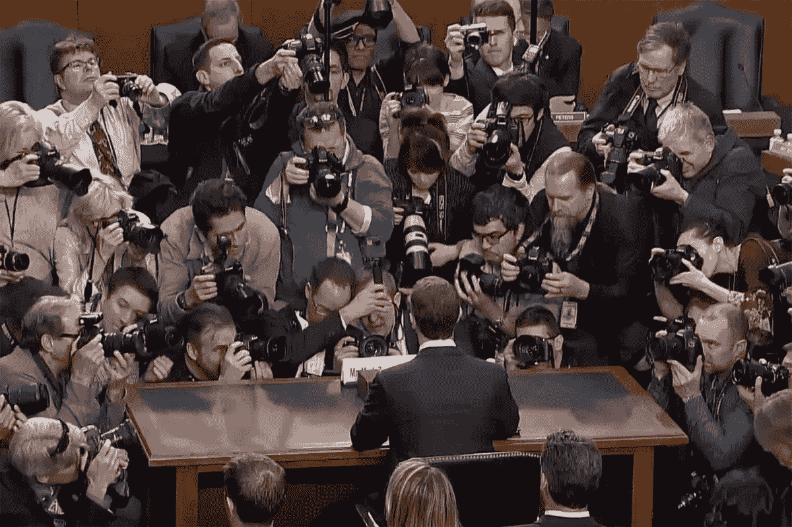

# 把你的数据卖给广告商是一件好事

> 原文：<https://medium.com/swlh/selling-your-data-to-advertisers-is-a-good-thing-6a5f45f1b931>

## 另一种选择更可怕

马克·扎克伯格在最近的国会证词中表示，“总会有一个自由的脸书。”付费、无广告的选择会有助于鼓励一个更加注重隐私的生态系统吗？

常识告诉我们答案是肯定的，但或许另一种选择更可怕。

尽管互联网广告存在隐私问题，但它们的破坏性影响最终是间接的。大多数广告通过由广告平台(例如，脸书广告管理器)提供给广告商的强大但受限的专有工具来定向。广告商通常无法获得原始数据。甚至剑桥分析公司可能也没有向政党提供原始的 SQL 转储。广告平台和/或中间人在最大化目标能力同时最小化数据泄露方面具有既得利益。他们的数据集是他们的摇钱树，他们将是愚蠢的放弃。

但是，如果你摆脱了广告，直接数据披露市场会成为主流吗？这个市场已经通过大广告商和可疑分析公司之间的灰色市场交易存在了。如果不是脸书广告经理，我们有脸书批量数据出口商业务会怎么样？脸书更希望从技术角度来看，对其专有数据集的暴露应该受到固有的限制——你不需要原始数据来创建有针对性的广告，因此 FB 不会通过他们的工具来提供这些数据。但退而求其次的选择是出租原始数据本身，并通过法律控制来实施许可。与广告相比，这对于用户隐私来说绝对是一场噩梦。

许多无广告模式的倡导者会说，解决方案在于让用户直接付费。Medium 正试图做到这一点，但至少在脸书这件事上，它是天真的。几乎没有人会为脸书支付 20 美元/年(他们的年收入除以他们的月活跃用户数)。

更重要的是，在脸书和类似的网站上，产品不是服务，产品是你。转向要求用户付费，类似于要求丰田从收费公路中赚钱。如果广告被移除，他们仍会向你推销，但可能是以你无法——也不想——想象的“创新”方式。

## 用户隐私有什么解决方案？

让我们暂时把公司渎职放在一边。在我们生活的世界里，数百万人的姓名、地址、SSN 和信用卡号码定期合法地在律师、自行车信使、法官和调查人员口袋里的 USB 驱动器上穿梭。在那里，你甚至不知道存在的私人信息被不假思索地定期缓存在 Akamai 服务器上(因为谁会想到缓存呢？)[因为工程上的懒惰，你去过的每个网站的记录都被发送到随机选择的服务器上](https://blog.cloudflare.com/fixing-reachability-to-1-1-1-1-globally/)。

由于这些原因，任何数字隐私的解决方案都不能仅仅依靠技术控制。我们必须启动乏味、容易出错和反复的政治监管过程。[欧盟 GDPR 法案可能很繁重，但却是朝着正确方向迈出的一步。立法机构应该致力于创建灵活的框架，不要对技术解决方案进行微观管理，而是制定可以通过法院解释的指导方针。](https://en.wikipedia.org/wiki/General_Data_Protection_Regulation)

比起其他地方，在线广告是更好的监管起点。这是一个我们已经有几十年经验的已知量。对企业来说，围绕广告的立法将提供明确性和确定性。对于终端用户，它将有望维护我们的权利。对于企业家和创新者来说，专注于广告的监管仍然会为创新留下新的货币化方法——如果我们的立法者和监管者能够做到这一点。

## 这篇文章发表在 [The Startup](https://medium.com/swlh) 上，这是 Medium 最大的创业刊物，有 315，628 人关注。

## 订阅接收[我们的头条新闻](http://growthsupply.com/the-startup-newsletter/)。

