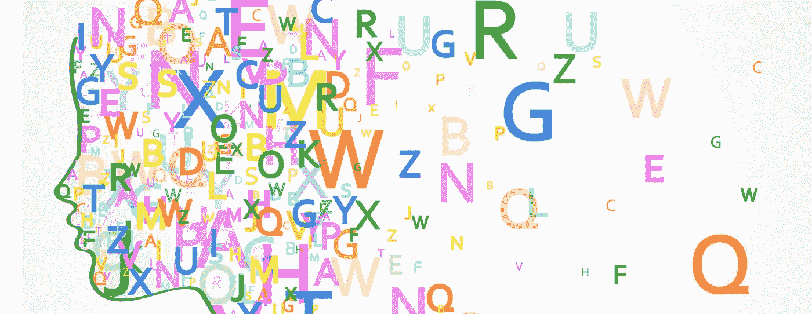
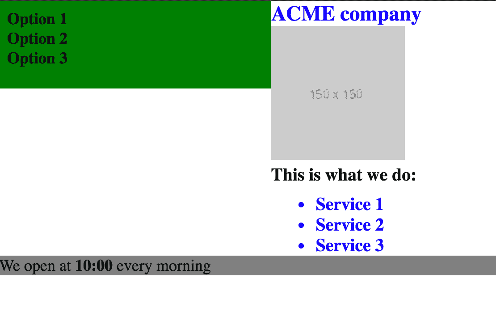

# 语义:软件开发中最重要的概念

> 原文：<https://medium.com/swlh/semantics-semantics-and-semantics-e22aa8657e44>



在软件开发中，语义是王道。

> "计算机科学中只有两个难题:缓存失效和事物命名."。—菲尔·卡尔顿

这是我最喜欢的名言之一。我并不完全同意缓存失效，但是命名事物是计算机科学中最关键也是最困难的事情之一。

“命名事物”的意义远比你想象的要大。对我来说，以正确的方式命名事物，从简单的变量，到 CSS 类，到 HTML 元素，到你在 OO 语言中使用的任何对象。自下而上地正确命名事物，可以创建清晰性和可重用性。它允许内聚的责任和易于维护。另一方面，自顶向下正确命名通常是好架构的标志。这意味着您的主要组件正在做它们被设计要做的事情，不多也不少。

好的命名是好的语义的标志，好的语义使命名事物的困难任务变得更容易。

要了解这一点，让我们尝试一个使用 HTML 和 CSS 的例子。这个想法是生成下面这个可怕的屏幕:



Awful looking screen

我们将遵循两种方法来编码它。

## 选项 1(非语义)

```
<html>
  <head></head>
  <body>
    <div id="menu_wrapper">
      <div id="menu">
        <div class="item">
          Option 1
        </div>
        <div class="item">
          Option 2
        </div>
        <div class="item">
          Option 3
        </div>
      </div>
    </div>
    <div id="content_container">
      <div class="name">
        ACME Company
      </div>
    <div class="image">
        
        <div class="company_description_wrapper">
          This is what we do:
          <ul>
            <li>Service 1</li>
            <li>Service 2</li>
            <li>Service 3</li>
          </ul>
        </div>
      </div>
    </div>
    <div style="clear:both"></div>
    <div id="footerWrapper">
      <div class="opening-time">We open at <span class="bold"> 10:00 </span> every morning
      </div>
    </div>
  </body>
</html>
```

现在让我们写一些可怕的 SCSS 代码。

```
html {
    #menu_wrapper {
        float: left;
        background-color: green;
        width: 20%;
        #menu {
            .item {
                font-weight: bold;
                font-size: 18px;
            }
        }
    }
    #content_container {
        width: 80%;
        float: right;
        height: 300px;
        .name {
            font-size: 23px;
            color: blue;
            font-weight: bold;
        }
        .image {
            height: 100px;
        }
        .company_description_wrapper {
            font-size: 22px;
            font-weight: bold;
            ul {
                li {
                    font-size: 18px;
                    color: #0000ff;
                }
            }
        }
    }
    #footerWrapper {
        height: 60px;
        display: block;
        background-color: grey;
        .opening-time {
            span.bold {
                font-weight: bold;
            }
        }
    }
}
```

如果你是一名普通的工程师，你头脑中的警钟很可能在向你发出尖叫——它们应该如此。这是**错误的**在很多方面，我甚至不知道从哪里开始描述问题:特殊性，缺乏标准，缺乏语义，糟糕的 SCSS 使用，不必要的嵌套，缺乏响应单元，在 HTML 和样式表的结构之间创建不必要的依赖，等等。至少，我们没有在标记中写内联 CSS。那可能会更糟。

所有这些都是**可怕的，糟糕的，错误的**。但不幸的是，它也非常普遍。

让我用语义化的 HTML、标准化的名字和好的 SCSS 来重写。这不会是完美的——只是第一遍——但差别将是巨大的。

## 选项 2(语义)

```
<!DOCTYPE html>
<html lang="en" xml:lang="en" ae ly" href="http://www.w3.org/1999/xhtml" rel="noopener ugc nofollow" target="_blank">http://www.w3.org/1999/xhtml">
 <head><title>ACME Company</title></head>
 <body>
     <main class="company-landing">
         <nav>
             <ul>
                 <li>Option 1</li>
                 <li>Option 2</li>
                 <li>Option 3</li>
             </ul>
         </nav>
         <section class="company-info">
             <h1>ACME company</h1>
             <figure>
                 
             </figure>
             <section class="company-details">
                 <h2>This is what we do:</h2> 
                 <ul class="services-list">
                     <li>Service 1</li>
                     <li>Service 2</li>
                     <li>Service 3</li>
                 </ul> 
             </section>
         </section>
     </main>
     <footer>
         We open at <time> 10:00 </time> every morning
     </footer>
 </body>
</html>
```

和一些基本的 SCSS(当然仍然可以改进):

```
html{ font-size: 18px; }
main { display: flex; flex-flow: row wrap; }
h1 { color: blue; font-weight: bold; font-size: 1.3em; }
h2 { font-weight: bold; font-size: 1.1em;}
ul { list-style: none; }
figure { margin: 0; }nav { 
     background: green;
     flex: 1;
     font-weight: bold;
     height: 80px;
     padding: 0.5em; 
     ul { padding: 0; margin: 0 }
}footer {
     background-color: grey;
     text-align: left;
     time { font-weight: bold }
}.company-info { flex: 2; }.services-list { 
     color: blue;
     font-size: 1.1em;
     font-weight: bold;
     list-style: disc;
}
```

这两个代码有相似的输出(我没有浪费时间润色细节)，但是它们遵循两种完全不同的风格和哲学。

# 分析

我来说几个关于 ***选项 1*** 的可怕之处:

*   **语义**在哪里？它只是一堆普通的 div。他们有的有 id，有的有其他类，但是容易读懂吗？没有。
*   完全没有标准。有时它使用 IDs(高特异性)，有时使用 class，名称在 snake-case、camel-case 或 kebab-case 之间交替，没有任何标准。
*   代码是不可重用的，组件(或面向对象)的概念在这里不存在。
*   CSS 结构几乎完全模仿 HTML 结构，这在两者之间产生了强烈的依赖性。
*   它到处使用像素，而不是更敏感的单元(如 em)
*   滥用 HTML 元素中标识符的用法。
*   通常，“包装器”和“容器”表示缺乏语义和代码结构。
*   冗长混乱的 HTML 和 CSS
*   高特异性 CSS，永远不会被重用。此外，如果它必须被修复，它可能会被更具体地重写，而不是重构现有的。通常，开发人员不想处理这种混乱。它创造了 CSS 雪球效应。
*   一个机器人不会理解任何东西(不友好的搜索引擎优化)。我可以继续下去…

因此，在创建同一个屏幕的 ***选项 2*** 后，我们可以看到以下改进:

*   一些基本通用样式的初始化(、

*   **语义** HTML5 元素的用法(<主>、<图>、<导航>、<页脚>、<时间>)。
*   SEO 友好、标准化的命名约定
*   **语义**名称(“公司信息”、“服务列表”等)。)
*   使用响应单元，如“em”和柔性元件。
*   语义 CSS 和对 HTML 结构的低依赖性。
*   如果我们想改变导航栏的属性，我们应该只改变一些 CSS 属性。这就是 CSS 最初被创建的原因，以分离语义和样式。
*   它没有在 SCSS 不必要的嵌套，导致一个更轻的 CSS。
*   在 CSS 中首先指定了更一般的元素，然后我们再看更多的细节。
*   我们可以读取 CSS 中的一个元素，我们知道它指的是什么(导航，服务列表，等等。).
*   CSS 和 HTML 代码都是可维护和可重用的

不幸的是，像第一个例子这样的代码无处不在。我得说，我每天都在来 [Rootstrap](https://www.rootstrap.com) 寻求救援任务的客户身上看到这种代码。我们通常不得不说，这种损害是不可逆的，从头开始会更有效。我们可能会失去现实的和高质量标准的客户，但是最终，我们要对我们交付的代码负责。如果你不愿意做好，对不起，我们不能和你一起工作。

语义很关键。但如果分解一下，也没那么难。

在 HTML 上，列表标签是针对列表的；导航标签用于导航菜单，页脚标签用于页脚，页眉标签用于页眉，节标签用于节。

在 CSS 上，id 是针对在你的整个应用程序中只出现一次的东西，有很高的特异性，不能重用。类用于识别元素的特征和语义。一切都要有反应。你必须考虑可重用性和可维护性。

语义是指导好的代码和架构的基本原则。好名字与语义密切相关。

**在软件开发中，语义是王道。**

请随时给我写信，让我们谈谈我们如何能帮助你开发更好、更有语义的软件。

[T3【anthony@rootstrap.com】T5](https://www.rootstrap.com)

[](https://medium.com/swlh)

## 这篇文章发表在 [The Startup](https://medium.com/swlh) 上，这是 Medium 最大的创业刊物，有+396，714 人关注。

## 订阅接收[我们的头条新闻](http://growthsupply.com/the-startup-newsletter/)。

[](https://medium.com/swlh)