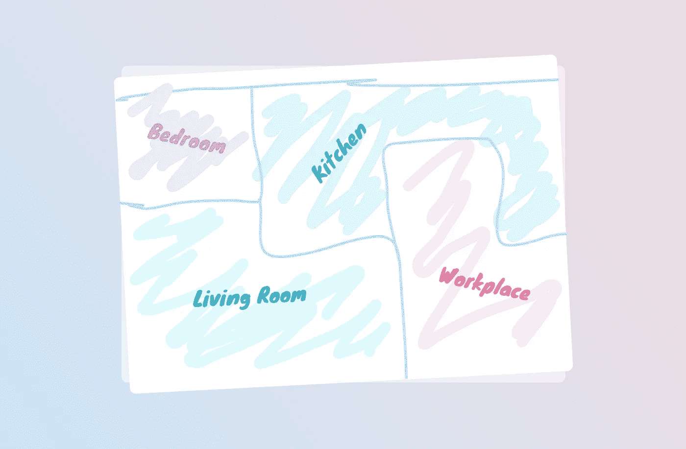
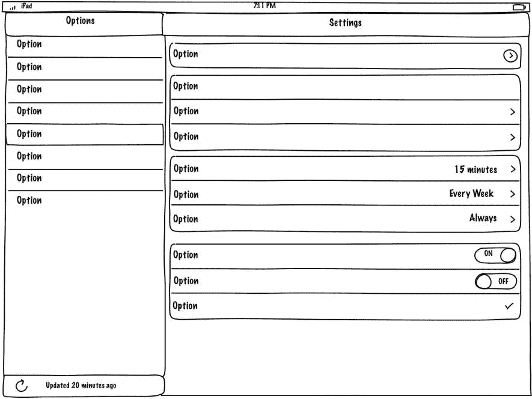

# 给我发送问题，而不是线框

> 原文：<https://medium.com/swlh/send-me-problems-not-wireframes-fc5b4f66f081>

在过去的几年里，作为一名自由产品设计师，我注意到每个人都喜欢创建线框。这是产品开发过程中最有价值的一件事，需要熟悉产品，最重要的是，这非常容易做到。

线框是产品的基础设施。他们决定了整个产品的架构，什么是主导航，什么是次导航，不同部分之间的层次结构等等。这些都是需要考虑的非常重要的事情，因为它们对开发周期的所有方面都有很大的影响，甚至可能最终成为产品成功或失败的因素。

但是对于许多产品经理、开发人员，甚至首席执行官来说，线框只是他们希望产品工作的方式。很多时候，当一个公司的团队来找我时，他们认为他们很清楚自己想要什么，而项目经理已经在 Axure 或 PowerPoint 中计划好了一切。耶！它已经准备好了，所以现在我们可以带 Ariel 来帮助它变得漂亮，并为开发人员准备文件。

对我来说，当客户想这样工作时，这通常是一个很大的转变。

如果我把它比作盖房子，那就像去找建筑师，把你在餐巾纸上画的房子的设计图交给她，让她用颜色重做，并确保建筑工程师也能理解。

Dear Mr. Architect, here’s how we want you to design our house.

这是 100%合法的，因为你付钱给她做你要求的工作。但是一个著名的职业建筑师会愿意接受这个工作吗？大概不会。她会有很多不应该这样做的充分理由——你规划的房子可能是一个安全灾难，她可能是规划方面的专家，而你认为你可以做得更好，因为仅仅修饰别人的工作不如解决一个问题让她满意。

你的线框不是你需要分发的。他们是头号创意杀手，他们可能不是问题的最佳解决方案，他们可能没有考虑视觉设计，见鬼，最佳解决方案甚至可能是一个完全不同的东西！这就是为什么一个好的设计师可能更喜欢**而不是从你这里得到它们**。

Great! This solves everything.

作为一个和设计师一起工作的产品团队，你应该做些什么呢？让设计师参与你的用户研究过程。向她介绍产品和公司。向她解释为什么你甚至认为需要这个产品，为什么你选择的平台是最合适的解决方案。告诉她该产品需要实现的 3 个主要目标，成功对你意味着什么？详细说明你认为必需的所有特性，以及为什么。帮助她确保她不会错过任何相关的东西。

如果你认为她理解错了，和她讨论一下。允许她学习，尽你所能给她你在解决这个问题时所获得的知识。她会加入她的产品设计知识，这样整体会比部分的总和更大。奇迹将会发生。

在你的帮助下，自己想出解决方案，会帮助她理解她要设计什么，这些知识最终会帮助她想出更好的解决方案。[既实用又美观](http://www.vanschneider.com/beauty-vs-function/)。

所以请给我发送问题，而不是线框。

除非你觉得我很蠢。

—

作者[阿里尔·韦博](http://www.arielverber.com)。一个产品设计师在这里没什么可宣传的。没有。我不招人，我也没有任何自由职业者市场，我想让你试试。祝你一周愉快！