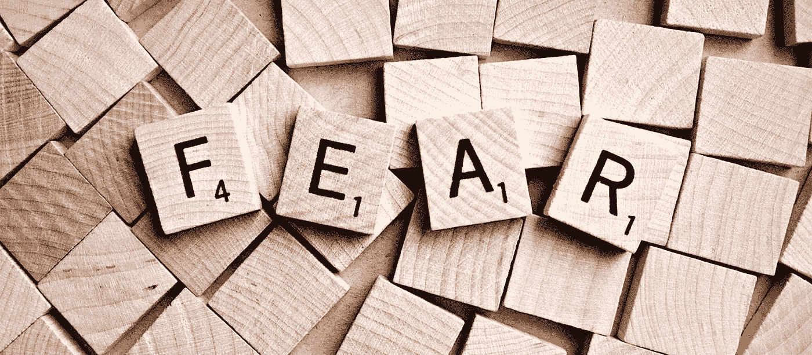

# 塞内加论无端恐惧的愚蠢

> 原文：<https://medium.com/swlh/seneca-on-the-folly-of-groundless-fear-db65dc6afb26>

是什么阻止了你追求梦想的工作，阻止了你创作艺术，阻止了你环游世界，阻止了你把自己展现出来？**恐惧。**就这么简单。我们可以把它归咎于太忙、时机不对、缺乏才能、资源不足或无数其他事情，但从根本上说，往往是恐惧在拖我们的后腿。

所有这一切的疯狂之处在于，我们所谓的恐惧往往是毫无根据和夸大的。事情并不像我们想象的那样可怕。斯多葛派哲学家塞内加在给他亲爱的朋友卢西留斯的一封信中写的正是这个主题。这封信是塞内卡一些最受欢迎的作品的一部分，这些作品被汇编成现在被称为 [**的书信，或**](https://en.wikisource.org/wiki/Moral_letters_to_Lucilius) **[**写给卢西留斯**](https://en.wikisource.org/wiki/Moral_letters_to_Lucilius) 的道德书。**

> *因此，有些事情比它们应该的更折磨我们；有些人在他们应该折磨我们之前折磨我们；有些人折磨我们，而他们根本不应该折磨我们。*

[**信 13 论无端恐惧**](https://en.wikisource.org/wiki/Moral_letters_to_Lucilius/Letter_13) 探讨了我们与恐惧的非理性关系。它探究了为什么我们会有这些未经证实的想法阻碍我们前进。塞内卡以非常理性和系统的方式剖析恐惧，消除了我们的许多担忧。

这些是他的**信中的五个要点，至今仍然适用。**

# **1.了解你的恐惧就是战胜它**

**塞内卡在信的开头简单陈述了了解自己恐惧的价值。如果你害怕某件事，但你已经经历过了，明白那是什么，那么你就更有能力在未来面对它。这是一个简单的想法，但经常被忽视。**

> **“……如果一个职业拳击手从未被打得鼻青脸肿，他就不可能兴高采烈地投入战斗；唯一可以自信地进入名单的参赛者是一个见过自己的血的人，一个感觉到自己的牙齿在对手的拳头下格格作响的人，一个被绊倒并感受到对手冲锋的全部力量的人，一个在身体上而不是精神上被击倒的人，一个每次跌倒后都以比以往更大的蔑视重新站起来的人。”**

**这很有道理。当然，问题是我们很少去寻找我们害怕的情况，这样我们才能直面它们。**

**如果你害怕什么，为什么不投身其中，看看它到底是什么。你真正害怕的是什么？这值得害怕吗？这样做只会在风险更大的时候减轻你的恐惧，并给你一种其他方式找不到的力量。**

# **2.在你看来，事情往往更糟**

**我不知道我们为什么或如何做到这一点，但当我们害怕某件事时，我们有一个诀窍来想出我们能想象的最糟糕的可能结果。当想象场景和它们潜在的灾难性后果时，我们会有惊人的创造力。**

> **“……我们在想象中比在现实中遭受更多的痛苦……因此，有些事情比它们应该的更折磨我们；有些人在他们应该折磨我们之前折磨我们；有些人折磨我们，而他们根本不应该折磨我们。我们习惯于夸大、想象或预测悲伤。”**

**例如，假设我想开一家公司，但我害怕结果，因为我知道如果我把自己放在那里，所有这些可怕的事情都会发生。**

*   **每个人都会讨厌我的产品或服务**
*   **我所有的朋友和家人都会恨我**
*   **没有人会再给我机会了**
*   **我下半辈子就没钱了**

**事实上，如果我真的开始了那项业务，最糟糕的情况可能就是它会被忽视。差不多就是这样，但至少我还是做了，并从中吸取了教训，这比你想象的更有价值。没那么糟糕。不要被你的恐惧冲昏头脑。**

# **3.不要让别人吓到你**

**很多时候，甚至不是你害怕或对未来有任何疑问，而是其他人在你脑海中植入这些想法。当人们不理解你在努力做什么的时候，当他们羡慕或嫉妒或悲观的时候，他们会让你充满消极和恐惧。你必须意识到这一点，不要让它阻碍你。**

> **“……我们太快就同意了人们所说的。我们不会去测试那些让我们恐惧的事情；我们不去研究它们；我们退缩和撤退，就像士兵们因为奔跑的牛群扬起的尘雾而被迫放弃他们的营地，或者因为一些未经证实的谣言的传播而陷入恐慌。不知何故，这是无聊的报告最让我们不安。”**

**人们总是会说一些事情，但你不能只把他们的话当作真理。你必须亲自检查这些恐惧，理解它们，看看它们是否真的值得害怕。他们可能无法克服，但你一定可以。**

# **4.期待失败是没有价值的**

**可能会发生，也可能不会。你永远不知道会发生什么。如果你让你的恐惧支配可能发生的事情，那么你将一事无成。你需要明白，目前一切都很好，冒这个险可能会有好的或坏的结果，但可能不会像你现在担心的那样极端。**

> **“……跑出去迎接你的苦难有什么用？当它到来的时候，你很快就会受苦；所以同时期待更好的事情。你这样做有什么好处？时间……当没有任何迹象指向任何邪恶时，头脑有时会为自己塑造邪恶的假象；它把一些意义可疑的词扭曲成最糟糕的结构……但是生命不值得活下去，如果我们尽最大可能放纵我们的恐惧，我们的悲伤是没有限度的。”**

**你最好保持乐观，无忧无虑地生活，而不是小心翼翼地面对可能的痛苦和失败。不要担心你不能控制的事情。**

# **5.探索真正可能出错的地方**

**我们通常不会问自己，但真正应该问的问题是，可能发生的最坏情况是什么？如果你真的仔细观察，事情真的会变得多糟糕？除了一些极不可能发生的意外，你真正害怕的事情可能并没有那么糟糕。**

> **“你自己必须说。如果真的发生了呢？让我们看看谁赢了！也许这是为了我的最大利益；也许这样的死亡会给我的生活带来荣誉。”**

**你可能无法控制你的恐惧将带你去的未知地方，但是你可以试着去看看那些恐惧实际上会是什么样子。如果你真的失业了呢？如果你不得不重新开始呢？如果你理性地考虑这些情景，并得出结论，它可能看起来不再那么糟糕。你会意识到你实际上可以处理它。如果真的发生了，你可以从中恢复。风险不是很大，潜在的失败是值得的。**

> ***傻瓜，尽管有他所有的缺点，也有这一点，他总是准备好生活。***

**最后，最重要的一点是要记住，恐惧是在做一件事，阻止我们过我们渴望的生活。塞内卡在这封信中分享的建议是永恒而宝贵的(*阅读全文**[***此处***](https://en.wikisource.org/wiki/Moral_letters_to_Lucilius/Letter_13) )。***

***要是我们有自己的好朋友，能时不时地给我们写些如此深刻的见解就好了！幸运的是，我们有这些信。***

***如果你正遭受这种毫无根据的恐惧，那就相信他所说的话，并注意到事情并不像你描述的那样可怕。注意，探索你的恐惧，了解它们到底是什么。如果你这样做了，你会发现它们真的没有那么可怕。***

## ***喜欢这篇文章吗？想要更多吗？[订阅](http://alyjuma.com/subscribe)我的时事通讯，每周日都可以在你的收件箱中充分利用网络资源！***