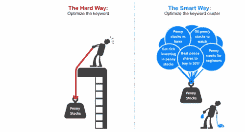
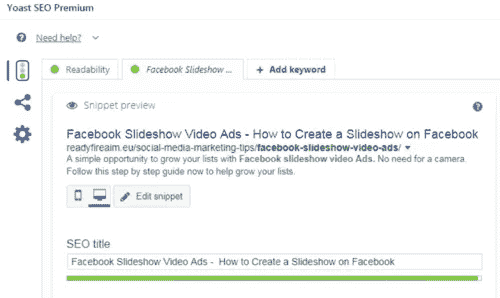
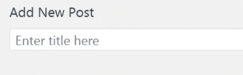

# SEO 基础——搜索引擎优化的基础

> 原文：<https://medium.com/swlh/seo-basics-the-fundamentals-of-search-engine-optimization-ef168ed24010>

最近，我读了一份由 Clutch.co 的人写的报告，报告称只有 44%的企业投资于搜索引擎优化策略，这使得它成为最不受欢迎的数字营销渠道。

那剩下的 56%呢……你的企业会落入这个桶里吗？如果是这样的话，就迁就我一会儿……就几小段，然后再决定要不要继续读下去。

如果你的企业属于 56%不做 SEO 的那一类，我敢打赌这是因为以下原因之一:

1.  SEO 需要很多人的力量
2.  搜索引擎优化在我的业务中不起作用
3.  SEO 没有立竿见影的效果

这三个反对意见中唯一有点道理的是最后一个。

SEO 结果不是即时的，这是事实。正因为如此，在 AIM，我们总是说: *SEO 是一场马拉松，而不是短跑*。

我们经常这么说，以至于这已经成了 AIM 办公室里的一个内部笑话。

然而，它敲响了真正的时间，一次又一次。

这是因为它需要时间来发展你的网站，并把它变成一个营销渠道，带来稳定的高质量的线索流。

如果我告诉你，你可以在 SEO 的基础上投入最少的努力，并且随着时间的推移仍然可以建立一个可行的销售渠道，会怎么样？

事实上，在搜索引擎优化的整个生命周期中，搜索引擎优化带来的商机比付费搜索带来的商机价值高 3-5 倍。

此外，没有必要担心人员配备或投资任何钱到搜索引擎优化。

当看到你的搜索引擎优化工作的结果时，只需要一点点努力就可以让你从一个死站变成至少一个体面的飞奔。

如果你对此感兴趣，请继续阅读。

# 不想做搜索引擎优化的企业搜索引擎优化目标指南

你可能和我一样清楚，SEO 不像付费搜索，付费搜索可以很快带来大量的线索。这可能也是为什么你的企业不把 SEO 作为营销渠道的原因。

有利的一面是，与付费搜索不同，有了 SEO，你可以更好地控制你在网站上发布的内容，而且产生的线索质量更高。例如，一个客户最近报告说，在他们的一生中，他们看到他们的 SEO 线索比他们的付费搜索线索赚钱多 6 倍。

这篇文章将概述基本的组成部分，你可以把地方，让您的网站产生强大的有机线索，并成长为一个线索生成发电站。

通过把这些组件放在适当的位置，它将允许你在几个月，甚至几年内开始做 SEO，并使它更快，更容易地扩展。

我将把事情分为 4 个不同的部分:

*   技术搜索引擎优化
*   页面搜索引擎优化
*   离页搜索引擎优化
*   多方面的

# 技术搜索引擎优化

拥有一个好的网站结构是一个成功网站最重要的方面之一。

无论你的内容有多好，一个优化不佳的网站结构意味着你的网站永远不会发挥其全部潜力。

你想以一种建立清晰主题的方式来组织你的网站内容。回答下面的问题会让你很好的了解你应该如何构建你的网站。

*   你想对哪些话题领域进行排名？
*   你写得最多的话题领域是什么？
*   你的业务中最有价值的线索来自哪些主题领域？

一个好的网站结构可以大大提高网站的可用性和可见性。

好消息是，如果你正在使用 WordPress，它在优化你的网站结构方面做得非常好。对于内容发布者来说，为你谈论最多、对你的业务最有价值的主题创建中心页面是最好的策略。你可以在这里阅读更多关于 hub 页面如何工作的信息。

在过去的 18 个月里，谷歌一直在推动两个比其他公司更重要的技术元素。

首先是结构化数据。

结构化数据是一种标准化的代码类型，使搜索引擎更容易在搜索结果中抓取、组织和显示您的内容。

这几个月来我讲了很多，包括这里的，这里的，这里的。

结构化数据一直是我在过去 12 个月中参加的两次 SEO 会议的关键主题之一，感觉好像没有一个星期谷歌没有发布一种新的支持结构化数据的类型，或者他们没有就如何在你的网站上正确实现结构化数据给出建议。

Google Gods 最近发布的两个公告是[问题&答案结构化数据](https://searchengineland.com/google-confirms-new-faqs-qa-and-how-tos-for-search-results-snippets-303116?guid=384d61ee-9237-0533-8500-335c81ef66f5)在这里，当在你的网站上实现结构化数据时，[你不应该使用 Google Tag Manager](http://www.thesempost.com/google-dont-rely-google-tag-manager-structured-data/?guid=384d61ee-9237-0533-8500-335c81ef66f5) 。

Moz 的人出版了一本优秀的 SEO 结构化数据指南，你可以在这里阅读。一定要去看看。

在你的网站上实现结构化数据是必须的。它帮助你的网站出现在知识图表中，用于品牌搜索，它告诉谷歌你拥有你的社交媒体档案，帮助谷歌新闻收录，以及让谷歌更好地理解你的内容和其他东西。你可以使用这个谷歌工具来测试你的网站的结构化数据错误[。](https://search.google.com/structured-data/testing-tool/?guid=384d61ee-9237-0533-8500-335c81ef66f5)

谷歌努力推动的另一个技术要素是网站速度。

网站速度和网站结构非常相似，不管你的内容有多好，或者你的网站结构有多好，如果你的网站速度慢，你的排名就不会像你应该的那样高。就这么简单。

如果你不确定你的网站是否足够快，它可能不够快，你可以提高加载速度。目标是不到 2 秒的加载时间。

我发现，当一个网站出现速度问题时，图片、未使用的插件和缓慢加载的付费搜索像素通常是罪魁祸首。你可以使用免费的 [Pingdom 网站速度测试](https://tools.pingdom.com/?guid=384d61ee-9237-0533-8500-335c81ef66f5)来审核你的网站速度。我一直建议在审核速度的时候多看你的主页。看看你最近的一些帖子，你的访问量最大的页面，以及排名在第 2、3 页的页面。提高这些页面的速度通常会带来快速提升。

7 月初，谷歌发布了他们的[移动速度更新](https://searchengineland.com/google-speed-update-is-now-being-released-to-all-users-301657?guid=384d61ee-9237-0533-8500-335c81ef66f5)，所以如果你在谷歌分析中看到你的移动流量下降，这可能与此有关。我还推荐[谷歌灯塔](https://developers.google.com/web/tools/lighthouse/?guid=384d61ee-9237-0533-8500-335c81ef66f5)工具，以及谷歌手机速度测试工具[Dareboost.com](https://www.dareboost.com/en?guid=384d61ee-9237-0533-8500-335c81ef66f5)，这是一个优秀的手机速度审计工具。Dareboost 给你一个瀑布视图，告诉你到底是什么让你的网站变慢了。请让您的 web 开发人员检查一下。

我去年写了一篇关于如何在 Google Analytics 中审核你的网站的移动体验的文章，现在仍然适用。点击这里查看。

到目前为止，我所谈到的技术方面，可以为您的网站进行设置并忘记它，以及您的 web 开发人员可以帮助进行的修复。

但是，您应该定期监控您的站点速度和结构化数据设置，但是一旦最初修复或实现，只需几分钟就可以检查一切是否正常。

# 页面搜索引擎优化

页面搜索引擎优化永远不会设置它，忘记它，但是如果你把它运用到你的内容发布工作流程中，只需要额外的 5-10 分钟就可以把基本的东西做好。

你猜怎么着，我已经为你创建了一个页面搜索引擎优化清单。[你可以在这里下载。](https://s3-eu-west-1.amazonaws.com/aimimage/amm/On-page-seo-checklist.pdf?guid=384d61ee-9237-0533-8500-335c81ef66f5)

让我们简要讨论一下清单上的每个问题。

**a .页面标题中的首要关键词是？**

标题标签是一个巨大的信号，可以帮助搜索引擎理解你的页面内容。它们可以说是最重要的页面 SEO 排名因素，应该包含你的页面所针对的主要关键词。

标题标签的长度应为 50-60 个字符，最佳格式为*主要关键字-次要关键字|网站名称*。

当我说页面标题时，我指的是页面的元标题。Yoast SEO 插件称之为 SEO 标题。

当你在页面上时，WordPress 页面标题可以也应该是不同的。像这样设置页面标题格式是没有意义的。

*主关键词—次关键词|网站名称*。但是，也要试着把你的主要关键词放在这个页面标题中。

这里是 WordPress 页面的标题。

**b .网址短，关键词丰富吗？(URL 是否解释了页面的内容？)**

URL 需要易于理解，并告诉搜索引擎和人类这个页面是关于什么的。URL 应该少于 115 个字符，但是越短越好。

目标是 60 个字符或更少，包括尽可能靠近 URL 开头的关键字。

页面上是否有 H1 标签？(是 H1 标签中的主要关键字吗？)

第一个问题真的只需要做一遍。在 WordPress 中，WordPress title 标签是默认的

# 标签，这很完美。

然而，有时候 WordPress 主题可以去掉

# 标签。可以在源代码中搜索

# 。如果你的

# 是页面标题，完美。如果不是，或者有多个

# 标签，让你的 web 开发者知道。

就像网页标题一样，尽量把你的主要关键词放在靠近开头的地方。

页面上有图片吗？还有图像优化了吗？(大小< 50kb，优化文件名& KW rich alt text)

不久前，我在你的网站上创建了一个优化图片的指南。[你可以在这里查看。](https://readyfireaim.eu/seo/get-90-more-views-by-optimizing-images-3-essential-tips/)

如果你要在你的内容中发布一张图片，至少，你应该在发布前通过 https://compressor.io/[运行它。](https://compressor.io/?guid=384d61ee-9237-0533-8500-335c81ef66f5)

Compressor.io 是一款免费工具，可以在保持图像质量的同时缩小图像尺寸。做起来不到 30 秒。正如我前面提到的，图片是网站运行缓慢的主要原因之一。

你的图像文件名应该解释图像是关于什么的，替代文本也是如此。如果相关的话，最好的做法是在其中加入一个关键词。

副标题是否用 H2 标签包装？(关键词是否在至少 1 个副标题中？)

把你的标题标签想象成一本书。在书中，章节标题是一个标签。所有的子章节都有一个

## 标签。

如果这些子章节有另一个子区域，那么这个子区域将被标上一个

### 标签，以此类推。最佳实践是每页一个

# 标签。页面可以也应该有多个

## 标签。

对于

## 标签没有字符限制，但是您应该尽量将它们控制在 70 个字符以内。你可能不会在所有的文章上都有副标题，但是如果你有，你应该尽量把你的主要关键词压缩到至少一个副标题里。

**f .是首段的首要关键词？**

除了将页面的主要关键词放在标题和副标题中，最好的做法也是将它们放在开头的段落中。

第一段应该告诉读者，谷歌帖子是关于什么的，应该包含页面的主要关键字。有时候这在理论上比实践容易，尤其是在你的网站上发布电子邮件内容的时候。

如果它不容易或不自然地适合，跳过这个检查。你可以在这里阅读更多关于文本结构的内容。

**g .内部链接了吗？(有没有链接回分类页面/hub 页面？)**

顾名思义，内部链接是同一网站上从一个页面到另一个页面的链接。内部链接允许你将链接资产传递给你最重要的页面，也允许你将访问者推向你的金钱页面。一个好的内部链接策略会让谷歌知道你最重要的页面是什么，并帮助他们排名更高。

内部链接并不复杂，而且对你的 SEO 工作非常有益。如果你在你的网站上发布了一篇讨论某个特定主题的文章，你应该从那篇文章链接回你网站上那个主题的中心页面。hub 页面也将成为推动最多转化的页面。

在我的文章 [SEO hub pages 文章](https://readyfireaim.eu/seo/grow-your-website-with-hub-pages-internal-links/)中，我谈到了内部链接的重要性。看看这个。Neil Patel 也有一篇关于内部链接的很好的文章。[你可以在这里阅读。](https://neilpatel.com/blog/commandments-of-internal-linking/?guid=384d61ee-9237-0533-8500-335c81ef66f5)

最佳做法是在内部链接的锚文本中使用你的中心页面的目标关键字。

Yoast SEO 插件也为你的网站上其他相关内容的内部链接提供了一些建议。在你的内容中加入一些内部链接将有助于让用户在你的网站上停留更长时间。你有没有在维基百科上阅读一篇文章，然后突然 30 分钟过去了，你正在阅读完全不同的东西，但仍然在维基百科上？这要归功于他们令人敬畏的内部链接策略。

有元描述吗？

元描述对排名没有影响，但是它们非常重要。把它们想象成付费搜索广告。你想抓住搜索者的注意力。

你的元描述长度应该少于 156 个字符，并且是可操作的。

他们也应该是唯一的，并包含您的主要关键字。

几年前，我写了一篇关于优化元描述以帮助增加网站流量的文章。看看这个。

**H3:这个内容应该排名吗？(是在蚕食你网站上的另一块内容吗？)**

当你的网站上有两个或更多的页面以相同的关键词为目标时，关键词自相残杀就会发生。这不应该发生。这让谷歌很困惑，最终结果通常是两个页面都没有应有的高排名。

当你每天在网站上发布电子邮件内容时，这并不容易。随着时间的推移，关键字蚕食问题将会发生。

我强烈建议对你的整个网站进行审计，看看有没有关键词自相残杀的问题，但是每天，你只需要弄清楚你发布的内容是否存在自相残杀的问题，如果有，就不要索引你发布的页面，或者将你发布的页面规范化为这个页面所针对的关键词的首选页面。

Yoast SEO 的人已经制作了一个关于如何找到和修复关键词自相残杀问题的杰出指南，你可以在这里阅读。发现食人问题是一步一步来的。

我们刚刚看了一遍清单，虽然看起来工作量很大，但一旦它进入你的工作流程，并且你已经掌握了它所需要的一切，它就非常简单，只会为你的每篇文章增加额外的 5-10 分钟的工作量。

[你可以在这里下载清单。](https://s3-eu-west-1.amazonaws.com/aimimage/amm/On-page-seo-checklist.pdf?guid=384d61ee-9237-0533-8500-335c81ef66f5)

如果仍然觉得有点令人畏惧，[伸出手](mailto:cosullivan@readyfireaim.eu?guid=384d61ee-9237-0533-8500-335c81ef66f5)，我们可以讨论一些定制的页面搜索引擎优化培训，让你马上上手。

# 离页搜索引擎优化

如果你没有一个集中的 SEO 策略，你就不会做任何离页 SEO，真的。离页搜索引擎优化占用大量资源，有时会非常困难。

然而，有两个简单的胜利。

**1。追踪品牌提及&声称未关联提及。**

几个月前，我写了一篇关于如何跟踪品牌提及的文章，当你被提及时，通过伸出手并要求返回到你的网站的链接，也可以轻松获得你的网站的反向链接。你可以在这里阅读那篇文章。

我发现在你被提及后，你越快伸出手，你就越有可能得到一个回到你网站的链接。

**2。报名参加 HARO。**

HARO 代表[帮助记者](https://www.helpareporter.com/?guid=384d61ee-9237-0533-8500-335c81ef66f5)。当一名记者寻求建议，或者引用你的专家们所擅长的话题时，他们会给你发电子邮件，征求你的意见。全世界有超过 55，000 名记者在使用它，它非常适合在高权威网站中建立你的站点的反向链接。你并不总是得到一个链接回到你的网站，但很多时候，你会。

# 多方面的

我已经添加了一个杂项部分，因为我想让你确保你已经划掉了基础。我希望您确保以下设置和配置正确。我要你回答以下问题。

*   谷歌分析设置正确吗？
*   跟踪是否正确？
*   谷歌搜索控制台设置好了吗？
*   你的网站的所有版本都设置了谷歌搜索控制台吗？
*   你在谷歌搜索控制台中选择了你的首选域名了吗？
*   你有没有告诉谷歌你在谷歌搜索控制台的目标是哪个国家？
*   你已经通过谷歌搜索控制台把你的 XML 站点地图提交给谷歌了吗？
*   你把谷歌分析连接到你的谷歌搜索控制台了吗？
*   Yoast SEO 插件设置和配置正确吗？
*   你的网站上安装了 SSL 证书吗？
*   在过去，你的网站是否受到过谷歌处罚或算法更新的负面影响？
*   你的网站对手机友好吗？
*   你的反向链接配置文件可以吗？

如果这些问题的答案是否定的，或者你不确定，请[联系](mailto:cosullivan@readyfireaim.eu?guid=384d61ee-9237-0533-8500-335c81ef66f5)，我们可以免费帮你回答。确保这些元素都设置好了，并且你的网站不受谷歌惩罚，这对帮助你的网站成长是至关重要的。

这篇文章我看了很多。我已经提到了站点结构和结构化数据。帮助谷歌理解你的网站的两个关键技术要素。我还提到了网站速度，以及无论你做什么，如果你的网站速度慢，你就是在浪费时间。

记住: *SEO 是一场马拉松，不是短跑*。

但是如果你参加马拉松，你不会赢。

我还浏览了我的页面搜索引擎优化清单，并概述了每一部分的内容。

我谈到了可以帮助你的网站成长的简单的离页 SEO 成功，最后，我问了你 13 个问题，在你真正开始 SEO 工作之前，你需要回答这些问题。

开始吧。最近，我读了 Clutch.co 的家伙们写的一份[报告](https://clutch.co/agencies/digital-marketing/resources/how-businesses-use-digital-marketing-2018?guid=384d61ee-9237-0533-8500-335c81ef66f5),报告称只有 44%的企业投资有针对性的 SEO 策略，这使得它成为最不受欢迎的数字营销渠道。

那剩下的 56%呢……你的企业会落入这个桶里吗？如果是这样的话，就迁就我一会儿……就几小段，然后再决定要不要继续读下去。

如果你的企业属于 56%不做 SEO 的那一类，我敢打赌这是因为以下原因之一:

1.  SEO 需要很多人的力量
2.  搜索引擎优化在我的业务中不起作用
3.  SEO 没有立竿见影的效果

这三个反对意见中唯一有点道理的是最后一个。

SEO 结果不是即时的，这是事实。正因为如此，在 AIM，我们总是说: *SEO 是一场马拉松，而不是短跑*。

我们经常这么说，以至于这已经成了 AIM 办公室里的一个内部笑话。

然而，它敲响了真正的时间，一次又一次。

这是因为它需要时间来发展你的网站，并把它变成一个营销渠道，带来稳定的高质量的线索流。

如果我告诉你，你可以在 SEO 的基础上投入最少的努力，并且随着时间的推移仍然可以建立一个可行的销售渠道，会怎么样？

事实上，在搜索引擎优化的整个生命周期中，搜索引擎优化带来的商机比付费搜索带来的商机价值高 3-5 倍。

此外，没有必要担心人员配备或投资任何钱到搜索引擎优化。

当看到你的搜索引擎优化工作的结果时，只需要一点点努力就可以让你从一个死站变成至少一个体面的飞奔。

如果你对此感兴趣，请继续阅读。

# 不想做搜索引擎优化的企业搜索引擎优化目标指南

你可能和我一样清楚，SEO 不像付费搜索，付费搜索可以很快带来大量的线索。这可能也是为什么你的企业不把 SEO 作为营销渠道的原因。

有利的一面是，与付费搜索不同，有了 SEO，你可以更好地控制你在网站上发布的内容，而且产生的线索质量更高。例如，一个客户最近报告说，在他们的一生中，他们看到他们的 SEO 线索比他们的付费搜索线索赚钱多 6 倍。

这篇文章将概述基本的组成部分，你可以把地方，让您的网站产生强大的有机线索，并成长为一个线索生成发电站。

通过把这些组件放在适当的位置，它将允许你在几个月，甚至几年内开始做 SEO，并使它更快，更容易地扩展。

我将把事情分为 4 个不同的部分:

*   技术搜索引擎优化
*   页面搜索引擎优化
*   离页搜索引擎优化
*   多方面的

# 技术搜索引擎优化

拥有一个好的网站结构是一个成功网站最重要的方面之一。

无论你的内容有多好，一个优化不佳的网站结构意味着你的网站永远不会发挥其全部潜力。

你想以一种建立清晰主题的方式来组织你的网站内容。回答下面的问题会让你很好的了解你应该如何构建你的网站。

*   你想对哪些话题领域进行排名？
*   你写得最多的话题领域是什么？
*   你的业务中最有价值的线索来自哪些主题领域？

一个好的网站结构可以大大提高网站的可用性和可见性。

好消息是，如果你正在使用 WordPress，它在优化你的网站结构方面做得非常好。对于内容发布者来说，为你谈论最多、对你的业务最有价值的主题创建中心页面是最好的策略。你可以在这里阅读更多关于 hub 页面如何工作的信息。

在过去的 18 个月里，谷歌一直在推动两个比其他公司更重要的技术元素。

首先是结构化数据。

结构化数据是一种标准化的代码类型，使搜索引擎更容易在搜索结果中抓取、组织和显示您的内容。

这几个月讲了很多，这里[这里](https://readyfireaim.eu/seo/organic-traffic-seo-google-structured-data/)，这里[这里](https://readyfireaim.eu/seo/voice-search-marketing-opportunities/)，这里[这里](https://readyfireaim.eu/podcast/episode-8/)。

结构化数据一直是我在过去 12 个月中参加的两次 SEO 会议的关键主题之一，感觉好像没有一个星期谷歌没有发布一种新的支持结构化数据的类型，或者他们没有就如何在你的网站上正确实现结构化数据给出建议。

Google Gods 最近发布的两个公告是[问题&答案结构化数据](https://searchengineland.com/google-confirms-new-faqs-qa-and-how-tos-for-search-results-snippets-303116?guid=384d61ee-9237-0533-8500-335c81ef66f5)在这里，当在你的网站上实现结构化数据时，[你不应该使用 Google Tag Manager](http://www.thesempost.com/google-dont-rely-google-tag-manager-structured-data/?guid=384d61ee-9237-0533-8500-335c81ef66f5) 。

Moz 的人出版了一本优秀的 SEO 结构化数据指南，你可以在这里阅读。一定要去看看。

在你的网站上实现结构化数据是必须的。它帮助你的网站出现在知识图表中，用于品牌搜索，它告诉谷歌你拥有你的社交媒体档案，帮助谷歌新闻收录，以及让谷歌更好地理解你的内容和其他东西。你可以使用这个谷歌工具来测试你的网站的结构化数据错误[。](https://search.google.com/structured-data/testing-tool/?guid=384d61ee-9237-0533-8500-335c81ef66f5)

谷歌努力推动的另一个技术要素是网站速度。

网站速度和网站结构非常相似，不管你的内容有多好，或者你的网站结构有多好，如果你的网站速度慢，你的排名就不会像你应该的那样高。就这么简单。

如果你不确定你的网站是否足够快，它可能不够快，你可以提高加载速度。目标是不到 2 秒的加载时间。

我发现，当一个网站出现速度问题时，图片、未使用的插件和缓慢加载的付费搜索像素通常是罪魁祸首。您可以使用免费的 [Pingdom 网站速度测试](https://tools.pingdom.com/?guid=384d61ee-9237-0533-8500-335c81ef66f5)来审核您的网站速度。我一直建议在审核速度的时候多看你的主页。看看你最近的一些帖子，你的访问量最大的页面，以及排名在第 2、3 页的页面。提高这些页面的速度通常会带来快速提升。

7 月初，谷歌发布了他们的[移动速度更新](https://searchengineland.com/google-speed-update-is-now-being-released-to-all-users-301657?guid=384d61ee-9237-0533-8500-335c81ef66f5)，所以如果你在谷歌分析中看到你的移动流量下降，这可能与此有关。我还推荐谷歌灯塔工具[，以及谷歌手机速度测试工具](https://developers.google.com/web/tools/lighthouse/?guid=384d61ee-9237-0533-8500-335c81ef66f5)[Dareboost.com](https://www.dareboost.com/en?guid=384d61ee-9237-0533-8500-335c81ef66f5)，这是一款优秀的手机速度审计工具。Dareboost 给你一个瀑布视图，告诉你到底是什么让你的网站变慢了。请让您的 web 开发人员检查一下。

我去年写了一篇关于如何在 Google Analytics 中审核你的网站的移动体验的文章，现在仍然适用。点击此处查看。

到目前为止，我所谈到的技术方面，可以为您的网站进行设置并忘记它，以及您的 web 开发人员可以帮助进行的修复。

但是，您应该定期监控您的站点速度和结构化数据设置，但是一旦最初修复或实现，只需几分钟就可以检查一切是否正常。

# 页面搜索引擎优化

页面搜索引擎优化永远不会设置它，忘记它，但是如果你把它运用到你的内容发布工作流程中，只需要额外的 5-10 分钟就可以把基本的东西做好。

你猜怎么着，我已经为你创建了一个页面搜索引擎优化清单。[你可以在这里下载。](https://s3-eu-west-1.amazonaws.com/aimimage/amm/On-page-seo-checklist.pdf?guid=384d61ee-9237-0533-8500-335c81ef66f5)

让我们简要讨论一下清单上的每个问题。

**a .页面标题中的首要关键词是？**

标题标签是一个巨大的信号，可以帮助搜索引擎理解你的页面内容。它们可以说是最重要的页面 SEO 排名因素，应该包含你的页面所针对的主要关键词。

标题标签的长度应为 50-60 个字符，最佳格式为*主要关键字-次要关键字|网站名称*。

当我说页面标题时，我指的是页面的元标题。Yoast SEO 插件称之为 SEO 标题。

当你在页面上时，WordPress 页面标题可以也应该是不同的。像这样设置页面标题格式是没有意义的。

*主关键词—次关键词|网站名称*。但是，也要试着把你的主要关键词放在这个页面标题中。

*这里是 WordPress 页面标题*。

**b .网址短，关键词丰富吗？(URL 是否解释了页面的内容？)**

URL 需要易于理解，并告诉搜索引擎和人类这个页面是关于什么的。URL 应该少于 115 个字符，但是越短越好。

目标是 60 个字符或更少，包括尽可能靠近 URL 开头的关键字。

页面上是否有 H1 标签？(是 H1 标签中的主要关键字吗？)

第一个问题真的只需要做一遍。在 WordPress 中，WordPress title 标签是默认的

# 标签，这很完美。

然而，有时候 WordPress 主题可以去掉

# 标签。可以在源代码中搜索

# 。如果你的

# 是页面标题，那就完美了。如果不是，或者有多个

# 标签，让你的 web 开发者知道。

就像网页标题一样，尽量把你的主要关键词放在靠近开头的地方。

**d .页面上有图像吗？还有图像优化了吗？(大小< 50kb，优化文件名& KW rich alt text)**

不久前，我在你的网站上创建了一个优化图片的指南。你可以在这里查看。

如果你要在你的内容中发布一张图片，至少你应该在发布前通过[https://compressor.io/](https://compressor.io/?guid=384d61ee-9237-0533-8500-335c81ef66f5)运行它。

Compressor.io 是一款免费工具，可以在保持图像质量的同时缩小图像尺寸。做起来不到 30 秒。正如我前面提到的，图片是网站运行缓慢的主要原因之一。

你的图像文件名应该解释图像是关于什么的，替代文本也是如此。如果相关的话，最好的做法是在其中加入一个关键词。

**e .副标题是否用 H2 标签包装？(关键词是否在至少 1 个副标题中？)**

把你的标题标签想象成一本书。在一本书里，章节标题是一个标签。所有的子章节都有一个

## 标签。

如果这些子章节有另一个子区域，那么它将被标上

### 标签，以此类推。最佳实践是每页一个

# 标签。页面可以也应该有多个

## 标签。

## 标签没有字符限制，但您应该尽量将它们控制在 70 个字符以内。你可能不会在所有的文章上都有副标题，但是如果你有，你应该尽量把你的主要关键词压缩到至少一个副标题里。

**f .是首段的首要关键词？**

除了将页面的主要关键词放在标题和副标题中，最好的做法也是将它们放在开头的段落中。

第一段应该告诉读者，谷歌帖子是关于什么的，应该包含页面的主要关键字。有时候这在理论上比实践容易，尤其是在你的网站上发布电子邮件内容的时候。

如果它不容易或不自然地适合，跳过这个检查。你可以在这里阅读更多关于文本结构的内容。

**g .内部链接了吗？(有没有链接回分类页面/hub 页面？)**

顾名思义，内部链接是同一网站上从一个页面到另一个页面的链接。内部链接允许你将链接资产传递给你最重要的页面，也允许你将访问者推向你的金钱页面。一个好的内部链接策略会让谷歌知道你最重要的页面是什么，并帮助他们排名更高。

内部链接并不复杂，而且对你的 SEO 工作非常有益。如果你在你的网站上发布了一篇讨论某个特定主题的文章，你应该从那篇文章链接回你网站上那个主题的中心页面。hub 页面也将成为推动最多转化的页面。

我在我的文章 [SEO hub pages 文章](https://readyfireaim.eu/seo/grow-your-website-with-hub-pages-internal-links/)中谈了很多关于内部链接的重要性。看看这个。Neil Patel 也有一篇关于内部链接的很好的文章。[你可以在这里看。](https://neilpatel.com/blog/commandments-of-internal-linking/?guid=384d61ee-9237-0533-8500-335c81ef66f5)

最佳做法是在内部链接的锚文本中使用你的中心页面的目标关键字。

Yoast SEO 插件也为你的网站上其他相关内容的内部链接提供了一些建议。在你的内容中加入一些内部链接将有助于让用户在你的网站上停留更长时间。你有没有在维基百科上阅读一篇文章，然后突然 30 分钟过去了，你正在阅读完全不同的东西，但仍然在维基百科上？这要归功于他们令人敬畏的内部链接策略。

有元描述吗？

元描述对排名没有影响，但是它们非常重要。把它们想象成付费搜索广告。你想抓住搜索者的注意力。

你的元描述长度应该少于 156 个字符，并且是可操作的。

他们也应该是唯一的，并包含您的主要关键字。

几年前，我写过一篇关于[优化元描述以帮助增加网站流量的文章](https://readyfireaim.eu/seo/optimize-meta-descriptions-to-triple-your-traffic/)。看看这个。

**H3:这个内容应该排名吗？(是在蚕食你网站上的另一块内容吗？)**

当你的网站上有两个或更多的页面以相同的关键词为目标时，关键词自相残杀就会发生。这不应该发生。这让谷歌很困惑，最终结果通常是两个页面都没有应有的高排名。

当你每天在网站上发布电子邮件内容时，这并不容易。随着时间的推移，关键字蚕食问题将会发生。

我强烈建议对你的整个网站进行审计，看看有没有关键词自相残杀的问题，但是每天，你只需要弄清楚你发布的内容是否存在自相残杀的问题，如果有，就不要索引你发布的页面，或者将你发布的页面规范化为这个页面所针对的关键词的首选页面。

Yoast SEO 的人已经制作了一个关于如何找到和修复关键词自相残杀问题的优秀指南，你可以在这里阅读。发现食人问题是一步一步来的。

我们刚刚看了一遍清单，虽然看起来工作量很大，但一旦它进入你的工作流程，并且你已经掌握了它所需要的一切，它就非常简单，只会为你的每篇文章增加额外的 5-10 分钟的工作量。

你可以在这里下载清单。

如果仍然觉得有点令人生畏，[联系](mailto:cosullivan@readyfireaim.eu?guid=384d61ee-9237-0533-8500-335c81ef66f5)，我们可以讨论一些定制的页面搜索引擎优化培训，让你很快上手。

# 离页搜索引擎优化

如果你没有一个集中的 SEO 策略，你就不会做任何离页 SEO，真的。离页搜索引擎优化占用大量资源，有时会非常困难。

然而，有两个简单的胜利。

**1。追踪品牌提及&声称未关联提及。**

几个月前，我写了一篇关于如何跟踪品牌提及的文章，当你被提及时，通过伸出手并要求返回到你的网站的链接，也可以轻松获得你的网站的反向链接。[你可以在这里阅读那篇文章。](https://readyfireaim.eu/seo/backlinks-seo-signup-boxes-hub-pages/)

我发现在你被提及后，你越快伸出手，你就越有可能得到一个回到你网站的链接。

**2。报名参加 HARO。**

HARO 代表[帮助记者摆脱](https://www.helpareporter.com/?guid=384d61ee-9237-0533-8500-335c81ef66f5)。当一名记者寻求建议，或者引用你的专家们所擅长的话题时，他们会给你发电子邮件，征求你的意见。全世界有超过 55，000 名记者在使用它，它非常适合在高权威网站中建立你的站点的反向链接。你并不总是得到一个链接回到你的网站，但很多时候，你会。

# 多方面的

我已经添加了一个杂项部分，因为我想让你确保你已经划掉了基础。我希望您确保以下设置和配置正确。我要你回答以下问题。

*   谷歌分析设置正确吗？
*   跟踪是否正确？
*   谷歌搜索控制台设置好了吗？
*   你的网站的所有版本都设置了谷歌搜索控制台吗？
*   你在谷歌搜索控制台中选择了你的首选域名了吗？
*   你有没有告诉谷歌你在谷歌搜索控制台的目标是哪个国家？
*   你已经通过谷歌搜索控制台把你的 XML 站点地图提交给谷歌了吗？
*   你把谷歌分析连接到你的谷歌搜索控制台了吗？
*   Yoast SEO 插件设置和配置正确吗？
*   你的网站上安装了 SSL 证书吗？
*   在过去，你的网站是否受到过谷歌处罚或算法更新的负面影响？
*   你的网站对手机友好吗？
*   你的反向链接配置文件可以吗？

如果这些问题的答案是否定的，或者你不确定，请[联系](mailto:cosullivan@readyfireaim.eu?guid=384d61ee-9237-0533-8500-335c81ef66f5)，我们可以免费帮你回答。确保这些元素都设置好了，并且你的网站不受谷歌惩罚，这对帮助你的网站成长是至关重要的。

这篇文章我看了很多。我已经提到了站点结构和结构化数据。帮助谷歌理解你的网站的两个关键技术要素。我还提到了网站速度，以及无论你做什么，如果你的网站速度慢，你就是在浪费时间。

记住: *SEO 是马拉松，不是短跑*。

但是如果你参加马拉松，你不会赢。

我还浏览了我的页面搜索引擎优化清单，并概述了每一部分的内容。

我谈到了可以帮助你的网站成长的简单的离页 SEO 成功，最后，我问了你 13 个问题，在你真正开始 SEO 工作之前，你需要回答这些问题。

开始吧。

感谢阅读。

科尔姆·奥沙利文，SEO 专家，AIM
[cosullivan @ readyfireaim . eu](mailto:cosullivan@readyfireaim.eu?guid=384d61ee-9237-0533-8500-335c81ef66f5)

附言:如果您想每周在收件箱中收到直接回应营销提示，[请在此](https://readyfireaim.eu/free-ready-fire-aim-eletter/)注册。

## 这篇文章发表在 [The Startup](https://medium.com/swlh) 上，这是 Medium 最大的创业刊物，有 358，974 人关注。

## 在这里订阅接收[我们的头条新闻](http://growthsupply.com/the-startup-newsletter/)。

