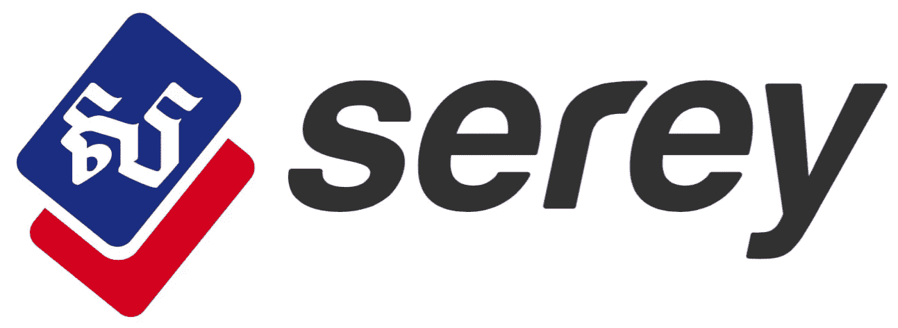
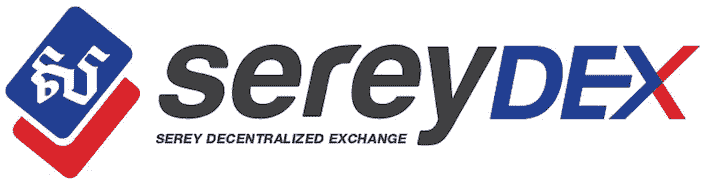

# SEREY:柬埔寨区块链上令人兴奋的社交媒体平台

> 原文：<https://medium.com/swlh/serey-an-exciting-social-media-platform-on-the-blockchain-in-cambodia-401e8322e645>

[www.serey.io](https://serey.io)

有一个专门针对柬埔寨市场的新社交媒体平台。在 60 年代和 70 年代的内战、红色高棉政权和随后的饥荒中，这个国家有近四分之一的人口死亡，但它正在迅速崛起。伴随着过去二十年惊人的经济发展，这个国家已经明显摆脱了过去的麻烦，热切地期待着一个光明的未来。伴随其发展的还有新技术的采用。

What is Serey — animation video

区块链就是这样一种技术。它现在被 Serey 团队用于他们的社交媒体平台，在这个平台上，作家和歌手等内容创作者因发布他们的内容而获得奖励。Serey 平台最近上线，已经有许多用户在编写内容，从虚构的短篇故事到加密货币、自制美容产品和文化。该系统基于民主投票系统，每个用户都可以对文章进行投票。根据投票数量和投票者，内容创作者可以获得该平台的本地加密货币 Serey coins (SRY)。

# 论塞里的创始人

Serey 的创始人是两个柬埔寨兄弟，他们出生在位于泰柬边境的一个名为 Khao I Dang 的柬埔寨难民营。在 1975-1978 年红色高棉时期，他们的父母逃离了这个国家，来到了这个难民营。为了更详细地回忆营地的生活，位于美国的经济教育基金会出版了一份营地创始人的备忘录。

1991 年，在大约 5-6 岁时，创始人被授予荷兰居民身份。他们接受过经济学(荷兰阿姆斯特丹)和哲学(澳门和爱尔兰都柏林)的教育。受古典自由主义哲学和 Friedrich Hayek 的知识分散理论的影响，两位创始人一直在寻求利用区块链技术创建一个平台的方法，在这个平台上，人们可以在柬埔寨表达他们的创造力，分享知识，并进行深思熟虑的文明讨论。此时此刻，还没有这样的线上平台。创始人希望有一天 Serey 平台将被视为柬埔寨充满才华和活力的人的见证。

# 论塞里的视野和哲学

Serey 的目标是成为一个主要的社交媒体平台，在这里人们可以自由地表达他们的创造力。意识到每个人只知道集体知识的一小部分，因此我们的集体知识本质上是分散的，Serey 希望通过 Serey 平台鼓励分享个人拥有的独特信息。

简而言之，Serey 希望创建一个开放的平台，每个人都可以自由进入，无论他们的出身、种族或经济实力如何。在这个地方，任何人、任何地方都可以发挥他们的创造力，而不必担心被迫保持沉默或顺从。其中用户在交友的同时彼此分享有趣的内容。

We need to learn to dance with our feet, with ideas, with words, and, need I add that one must also be able to dance with the pen?

# 在塞里任务中

因此，Serey 任务可以概括为:

> “奖励自我表现和创造力。”

# 论 Serey 与传统社交媒体的差异

传统的社交媒体，比如脸书和推特，通过获取用户的内容并卖给广告商，为他们的股东创造了数十亿美元的收入。Serey 平台的参与者不是将价值输送给一小群股东，而是因为他们的写作而获得奖励。因此，价值流向那些提供内容的人。

在你加入 www.serey.io 的第一瞬间，你会得到少量的 serey，这让你在决定什么内容应该得到奖励时有发言权。

# Serey 平台及其特点

Serey 主要是区块链上另一个社交媒体平台 Steemit 的一个分支，因此基本上利用了 Steemit 和 Bitshares 背后的石墨烯技术。然而，在 Steemit 试图征服世界的地方，Serey 完全致力于柬埔寨人民。Serey 认为，地区差异需要不同的用户界面和特定的功能，以匹配人们的文化构成和他们对区块链技术的复杂程度。因此，Serey 团队选择创建一个平台:

1)全新的布局
2)市场区
3)高棉语选项
4)广告区
5)奖励系统的简化

## 2018 年 5 月/6 月的塞里指数

除了上述变化之外，Serey 还将发布一个 Serey Decentralized Exchange(Serey DEX ),目前正在与接近 Bitshares 和 Steemit 的开发人员合作建立。这将是一个成熟的分散交易所，世界上任何地方的任何人都可以进入。

The Serey Decentralized Exchange is currently under development and will offer an English and Khmer language option

除了 Serey coins (SRY)，该交易所还将上市最重要的加密货币，如比特币、以太坊、Dash 以及 bitUSD、bitEUR 和 bitCNY 等国家货币数字资产。有了 Serey DEX，柬埔寨人民将有一个有趣的加密货币交易平台值得期待。它将以英语和柬埔寨人民的母语高棉语提供。目前，柬埔寨还没有一家本地加密货币交易所。

Serey 今年值得期待的其他令人兴奋的功能包括在线博彩系统、市场板块的改进以及类似于脸书的综合聊天功能。

# 论块状简单合伙

Serey 团队与备受推崇的美国区块链咨询和开发服务公司 [Blocksimple](https://blocksimple.consulting) 建立了合作关系，该公司拥有在美国、柬埔寨、越南和乌克兰开发区块链项目的经验。除了咨询 Serey 平台的开发，Blocksimple 还开发了其预售网站，并将继续成为 Serey 的重要合作伙伴。

# 关于 Serey 白皮书

塞里已经公开发布了他们的白皮书，你可以在这里找到。

# 关于预售/ICO

目前，Serey 正在进行预售。有 1 亿枚最初的塞里硬币被创造出来，其中 5500 万枚以 0.015 美元的起价出售给公众，并逐渐上涨到 0.020 美元。该团队希望筹集至少 50 万美元，这将为他们在未来 5 年开发该平台提供足够的喘息空间。

除了一个 SRY 的价格上涨，投资者还可以受益于(1)由于其授权的股权证明系统而获得的硬币利息，以及(2)当他们在 Serey 平台上投票时，他们的投票权权重增加。这意味着他们对文章的奖励分配有更大的影响力。

为了参加预售，你应该先在[网站上注册账户。](https://serey.io)

预售网站的一个链接是 [www.sale.serey.io](https://sale.serey.io) ，付款方式是 BTC、ETH、LTC。有关预售的更多信息，请参见白皮书(第 14-15 页)。

# 接触

如果您有任何问题，可以通过以下方式联系团队:

邮箱:*联系@serey.io* 。
脸书: *Serey 平台* / *Serey.io*

## 这个故事发表在 [The Startup](https://medium.com/swlh) 上，这是 Medium 最大的创业刊物，拥有 318，983+人关注。

## 在这里订阅接收[我们的头条新闻](http://growthsupply.com/the-startup-newsletter/)。

