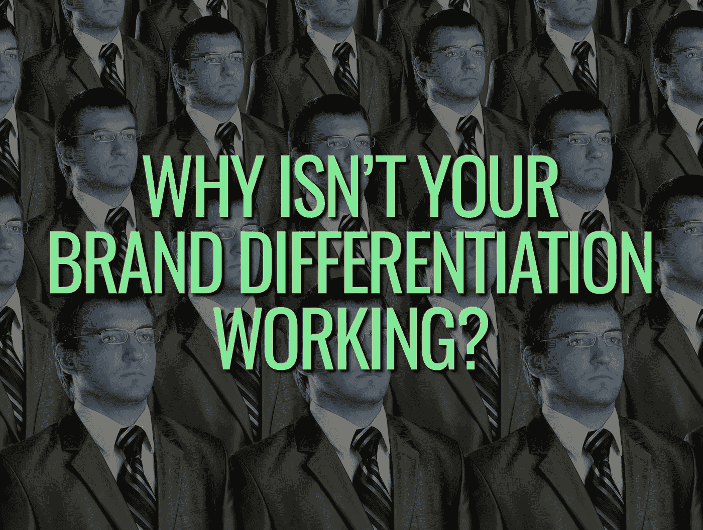
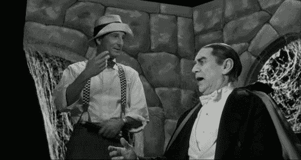

# 说真的，为什么你的品牌差异化不起作用？

> 原文：<https://medium.com/swlh/seriously-why-isnt-your-brand-differentiation-working-1df1be17b485>

## 是时候要求你在世界舞台上的位置，并结束其他人对你的品牌如何以及在哪里在世界上留下印记的描述了。

差异化艺术是品牌的核心，也是品牌差异化本身的核心。

> “在拥挤的市场中，合群是一种失败。在一个繁忙的市场中，不引人注目就等同于被忽视。”塞思·戈丁

品牌差异化的终极形式被视为“唯一的选择”，为你的客人、顾客和崇拜者*提供一个精确的、可识别的交付品和利益集合。*

这个差异化的因素就是我在本周的*一分钟星期三*中要解决的。

# 那么，为什么品牌差异化这么难呢？

有可能你对“差异化”的理解是如此微妙，并且过分夸大了它的重要性，以至于你的“差异化点”实际上是[微小的增量变化](https://www.risingabovethenoise.com/3-secrets-to-launching-a-brand-revolution/)，根本不是真正的差异化。

或者是那种没人真正关心的差异。

## 但是有一个经常被忽视的原因:真正了解你的竞争对手有一个和你 180 度相反的目标。你需要接受并克服这个事实。

那个目标？保持一切看起来相同，尽量减少任何可察觉的差异，消除你可能提供的任何明显的好处和区别。

相似性和共性是你的竞争对手的盟友，是对抗你的武器，也是你被关注和保持相关性的目标。

差异是竞争增长的敌人。消费者越相信“没有任何真正的差异，任何差异都是宣传”，你的竞争就越愉快，这样他们就可以在实际价值之外的其他层面上竞争，即价格。

# 你的差异化工具

是什么*差异化的工具？*

它们很多，但这里有一个快速的清单:

*   语言
*   颜色
*   设计
*   排印
*   意象
*   用户体验(在线或店内)
*   文化和客户服务(我们的员工消费体验)
*   创新ˌ革新
*   主动行动(相对于被动措施)

> ***你可以掌握这个*** ，前提是你明白你面对的是什么:
> 
> 正如赛斯·戈丁在本文开头所说，你的竞争目标是融入社会，被视为一种商品，并“隐身”。

## 从这篇文章中获得了价值？然后鼓掌，分享，关注我，订阅我的 [YouTube 频道](https://www.youtube.com/user/headmusik)，每周都有新视频。需要一个品牌重塑或一个难忘的主题演讲人？这里联系我[。](http://david@risingabovethenoise.com)

## 这篇文章发表在 [The Startup](https://medium.com/swlh) 上，这是 Medium 最大的创业刊物，有 356，974+人关注。

## 在这里订阅接收[我们的头条新闻](http://growthsupply.com/the-startup-newsletter/)。

