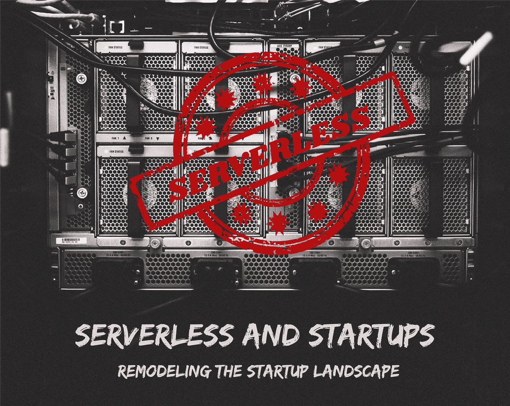

# 无服务器和创业:重塑创业格局

> 原文：<https://medium.com/swlh/serverless-and-startups-remodeling-the-startups-landscape-87be9711ac7a>

## 创业公司最重要的是什么？

# 性价比+灵活性+强大的技术依赖+强大的想法=成功的创业！

随着时间的推移，软件开发方法发生了巨大的变化。技术栈正在继续发展，具有更强大和更先进的模型，例如，智能客户协助、云技术、机器学习和沉浸式体验。为了实现“事半功倍”，许多企业和初创公司正在选择无服务器技术。

如果你还没有考虑这项技术，你可以在这里阅读无服务器架构。

当你听到“无服务器”这个词时，你可能会想到“无服务器”架构。不幸的是，你走错了方向。这里有一个术语“无服务器”的快速介绍。

# 什么是无服务器？

无服务器并不意味着没有服务器。有服务器，但您不需要担心部署、维护和底层基础设施。

无服务器是一个宽泛的术语，代表一种高级形式的云技术，它消除了管理服务器的负担。

# 无服务器计算正在增长:为什么创业公司应该注意？

他们说，十个创业公司中有九个会失败。

失败背后可能有几个因素。这可能是一个糟糕的想法，缺乏重点，团队和资源管理不善。最重要的是，预算和现金流会给创业公司的可持续性带来更多麻烦。

对于科技初创公司来说，这是利用现代技术的最佳时机，这些技术可以以极低的价格获得。云让初创公司更容易管理整个基础设施，甚至不需要购买。它提供了管理的灵活性，还允许您根据需要增加存储。

> 无服务器优于云的所有功能。

它通过消除手动配置和维护服务器的任务，消除了 It 管理员的所有麻烦。

# 它是如何有利于创业的？

## 考虑关于无服务器模式的一些事情:

*   专门编写的小函数来执行任务
*   你需要支付你所使用的东西
*   任何小单元的变化都不会影响整个应用程序
*   无需自己管理服务器和基础架构
*   快速高效地交付
*   关注产品而不是基础设施管理
*   与其他技术相比非常划算

首先，任何创业公司都需要注意通过产品/服务来验证他们的想法。另一方面，服务器配置、基础设施设置及其维护需要大量时间。最后，它将资源和时间分成两部分—一部分是产品增强，另一部分是服务器管理，

# 这里，无服务器在创业中扮演着游戏规则改变者的角色。它解决了主要问题

*   **缩放**

在创业的初始阶段，几乎没有人会有处理大量客户的准备。为了保持竞争力，可扩展性是任何数字解决方案的一个重要方面。随着创业公司的成长，web 应用程序应该处理大量的客户，并有效地满足他们的要求。

现在有了无服务器，这个问题就解决了。

任何应用的可扩展性都将由无服务器服务提供商负责。

举个例子，

亚马逊推出了 AWS Lambda 平台，让你无需管理服务器就能运行代码。它是一个事件驱动的计算平台，在函数和事件的帮助下执行代码。

*亚马逊网络服务的首席产品策略师马特·伍德说，*

> “有一种特殊的使用类别，在这种情况下，开发人员希望主要关注于向他们的应用程序添加功能，他们不想担心扩展和缩减(基础架构)，他们希望成本与他们的应用程序的使用相一致，而不是与他们的基础架构的利用率相一致，Lambda 为寻求这种关注的开发人员提供了一个非常好的答案。”

*   **按需付费**

这是创业公司无服务器的另一个显著优势。

无服务器架构只在执行代码、功能或服务时才会增加成本。全天候实时运行您的应用程序是不收费的。

**这总体上节省了更多维护和运行服务器的费用。**

*   **更快的上市时间**

无服务器技术基于称为功能的更小单元，这些功能非常具体。而且，你不需要担心服务器的维护和配置。因为这整个环境，它提供了你的应用程序更快的上市时间，因为你只需要选择一个需要的功能。

**您可以添加或删除功能，而不会影响整个应用程序。**

*   **快速成型**

使用无服务器技术很容易构建 MVP(最小可行产品)。许多创业公司利用它的灵活性来建立 MVP。

在最初的验证阶段，Serverless 将帮助初创公司根据需要添加或删除功能。它有助于构建具有更大的可伸缩性、敏捷性和效率的 MVP。

它还支持快速变化的想法，这种想法通常伴随着原型的构建。你经常需要根据市场和业务需求来修改想法、功能或特性。

FaaS/无服务器可以帮助创业公司快速原型化他们的想法。

**与整个场景相反，许多人认为无服务器会导致原型的终结。**

通常，一旦原型开始流行，就需要从头开始修改/构建，使其更加先进和可扩展。

有了无服务器，如果构建正确并做了必要的更改，您的 MVP 可以被扩展并用作最终产品。这是另一个可以帮助创业公司节省时间和成本的场景。

# 利用敏捷性:无服务器成为初创企业的标准

有许多工具和平台提供无服务器计算，包括亚马逊、IBM、谷歌等科技巨头。许多创始人和企业家已经在探索选择无服务器技术的好处，以更快的速度扩展他们的想法。它使得制造原型比以往任何时候都更快、更容易、更便宜。

你为你的任何想法尝试过无服务器吗？您想了解更多关于无服务器如何帮助您降低成本的信息吗？

你的下一个想法是使用无服务器吗？请通过评论让我们知道！

这篇文章最初发表在我们的博客上: [*这里*](https://www.spec-india.com/blog/serverless-and-startup-remodeling-the-startup-landscape/)

## 这篇文章发表在[《创业](https://medium.com/swlh)》上，这是 Medium 最大的创业刊物，有+398，714 人关注。

## 在这里订阅接收[我们的头条新闻](http://growthsupply.com/the-startup-newsletter/)。

