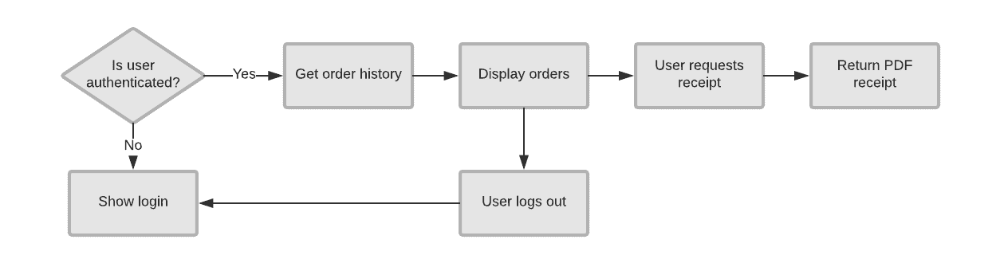
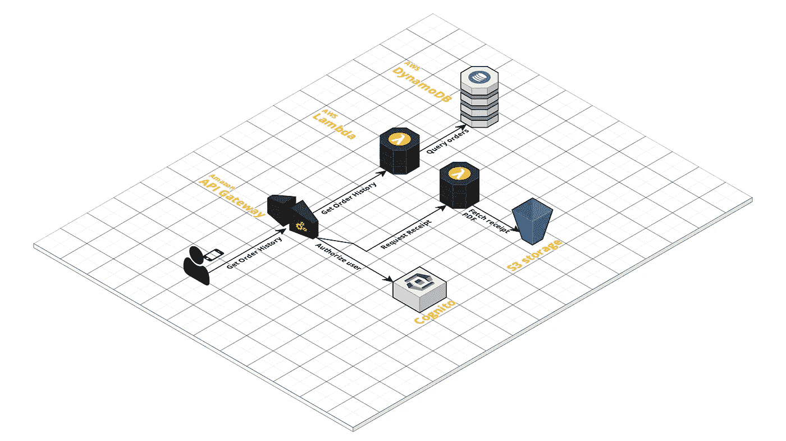

# 创业公司无需服务器——这是打造你的技术创意的最快方式

> 原文：<https://medium.com/swlh/serverless-for-startups-its-the-fastest-way-to-build-your-technology-idea-a0f0b5efe2f3>

## 无服务器就是乐高。找到您需要的零件，快速构建并尽快上市。

Original photo by [Rick Mason](https://unsplash.com/photos/2FaCKyEEtis?utm_source=unsplash&utm_medium=referral&utm_content=creditCopyText) on [Unsplash](https://unsplash.com/search/photos/lego?utm_source=unsplash&utm_medium=referral&utm_content=creditCopyText).

对于科技创业公司来说，现在是开发产品的最佳时机。对于真正的自举和不花一分钱建立基础设施的能力来说，现在是时候了。虽然云允许我们租用模拟本地的部分，但无服务器现在让我们只需运行代码，根本不用担心这是如何发生的。这对创业公司来说非常强大，但许多人还不明白为什么。

云让我们能够*而不是*拥有基础设施。我们可以像租赁办公室一样轻松地租赁服务器、存储和网络，并根据需要打开或关闭它。这种随需应变的方法可以快速、廉价地测试创意，如果创意成功，就可以“扩大规模”。聪明的创业公司是第一批意识到这个想法的巨大的公司之一。但是云仍然是复杂的，你真的必须知道你在做什么来成功地协调所有移动的部分。

无服务器在 4 年前加入竞争，并大大改变了这一模式。它着眼于你需要什么样的代码和服务来使一个平台工作，并代表你运行它们。在后台，仍然有服务器在运行，但您不再需要自己管理、修补和维护任何东西。这是云的下一次迭代，让您可以专注于产品的差异化部分，而不是底层堆栈的繁重工作。

在很大程度上，云提供商没有很好地向世界解释这一点。文档很少，例子也很少，而且在这些系统上建立所需要的思维模式也发生了转变。在无服务器的最初几年，它主要用于小规模的特定任务，如调整图像大小、运行报告或执行小型基础架构流程。但是在过去的 12 个月中，无服务器特性已经成熟，你可以使用无服务器方法构建数量惊人的应用程序——有时是全部。

# 创业公司无需服务器的优势

作为一家初创公司，有几件重要的事情是你应该关心的。首先，成本——运行无服务器应用程序真的非常便宜。虽然云绝对不贵，但您仍然要为未满负荷运行的虚拟服务器、可能没有发挥多大作用的负载平衡器以及未充分利用的存储块买单。你还必须花钱请人来管理这一切。

在无服务器模式下，你需要付费使用。这意味着您在代码运行时会产生成本，您要为实际使用的每字节存储付费，并且这些数字中内置了对扩展所有这一切的隐藏基础架构支持。这是真正的计量服务。例如，在 AWS Lambda 上，当代码被执行时，你需要为每百万个请求支付 0.20 美元。在实践中，我发现这通常意味着，与同等的云相比，您可以节省 70–90%的基础架构费用。

规模化也是创业公司的天赋。通常最小可行产品和“生产就绪”之间的差距意味着重写和重新设计应用程序。这是因为你在测试一个想法时建立了绝对最小值，这对于生产来说是不够的。由于这种差距，大多数 MVP 主要由一次性工作组成。

在无服务器中，设计被分解成由功能连接的更小的单元。这些代码通常不需要任何返工，因为应用程序接收到更多的流量，因为这些功能非常小且非常具体。他们可能会查找用户资料、对视频进行代码转换或发送短信通知——在这些情况下，MVP 和生产之间的区别纯粹是规模。无服务器的主要优势是可为您处理扩展—无论一项功能是每天运行一次还是每分钟运行数千次，云提供商都会确保实现这一点。

最后，还有敏捷性。在我参与的每一个创业想法中，概念都会发生实质性的变化，功能也会快速变化。我见过创意从桌面开始，到移动设备结束，而功能每天都在添加和删除。这往往会对传统的应用程序造成巨大的破坏，随着概念的转变，传统的应用程序需要不断地进行重构，并且可能会导致意想不到的设计问题。

在无服务器模式下，保持这种速度相对简单，因为应用程序由几十个非常小的单元组成。你可以在不影响整体应用的情况下升级和改变这些单元，这种灵活的结构使它非常适合那些经常在飞行途中改变飞机引擎的初创公司。

# 商品化向上层移动

技术的故事一直是存储、计算和网络的稳步商品化，作为这三者的副产品变得更快或更便宜。这一切发生得如此之快，以至于现在人们很容易忽视一个明显的流行趋势，或者在处理没有实际价值的技术问题时没有注意到。

云清楚地表明，运行数据中心只有在大规模下才有意义，即使是选择运行自己的数据中心的大公司也没有很好地分配资源。随着这些提供商完善了虚拟机的自动化和配置，现在很明显，即使是管理虚拟机也是一项最适合大规模执行的任务。

对于初创公司来说，这意味着你不应该把任何稀缺资源用在可以为你处理的技术问题上。无服务器思维允许您将所有工程师投入到解决业务问题中，并且将 0%的时间花在服务器管理和基础设施上。

虽然亚马逊和其他公司将继续推高堆栈，但如果你专注于你的差异化功能，这个过程将对你有利。简而言之，现在不是从事基础设施管理的好时机，但却是构建解决业务需求的解决方案的好时机。

# 采用无服务器思维

无服务器正在快速发展，它已经成为不同托管服务的联盟。通常这包括功能即服务(您运行的代码)、对象存储和交付、数据库、网络和安全性。在 AWS 领域，这等同于 Lambda、S3、CloudFront、DynamoDB、Route53 和 IAM，但类似的服务也存在于微软 Azure 和谷歌云中。

这些服务就像乐高。如果你把你的技术产品分解成一个流程图，你就可以计算出每一步你需要用哪块乐高积木来完成。例如，一个检索用户订单和收据的非常简单的服务可能如下所示:

将这些步骤映射到 AWS 工具可以这样建模:

识别引发事情发生的事件，以及信息存储或管理的位置，是分解任务的第一步。在大多数早期的图中，步骤往往过于粗糙(例如“查找用户推荐”)，但是后续的迭代可以分解精确的功能，使其更容易转化为无服务器。

现在有很多反对者会在考虑这种模式会带来什么之前就抛出它的局限性。对于延迟敏感型应用程序或计算密集型活动，无服务器可能不是答案。但在我见过的每一个创业产品中，甚至这些服务都有贯穿设计的用户界面、网站和异步元素，可以用这种方式完美处理。

# 一切都是为了商业利益

一个很好的创业案例是 Cloud Guru，这是一个很受欢迎的工程师培训网站，目前在全球拥有 60 万客户。这个平台从一开始就是使用无服务器工具开发的，并且已经扩展到可以向快速增长的用户群提供大量的媒体。

这个 web 应用程序由 287 个 Lambda 函数组成，在 S3 中存储了近 4tb 的数据。这些功能每天被使用超过 600 万次。在任何其他系统设计中，这将需要大量的基础设施来建设、监测和维护。然而，在 2018 年 8 月，一位云专家的 Lambda 账单仅为每月 580 美元。

在这种情况下，企业将精力集中在用户获得最大价值的地方，即培训的质量，而不是交付基础设施。在许多方面，这些视频的转码和流媒体机制都很普通，而且已经商品化，因此该公司明智地将这些过程交给了 AWS。

我真的很兴奋无服务器对创业公司意味着什么。正如鲁珀特·默多克所说，“世界变化非常快。大的不会再打败小的了。这将是快的打败慢的。”无服务器让我们有最好的机会快速交付，利用我们有限的资源专注于我们的产品，并利用我们的优势速度和灵活性。

## 这篇文章发表在 [The Startup](https://medium.com/swlh) 上，这是 Medium 最大的创业刊物，有+388，268 人关注。

## 订阅接收[我们的头条新闻](http://growthsupply.com/the-startup-newsletter/)。

