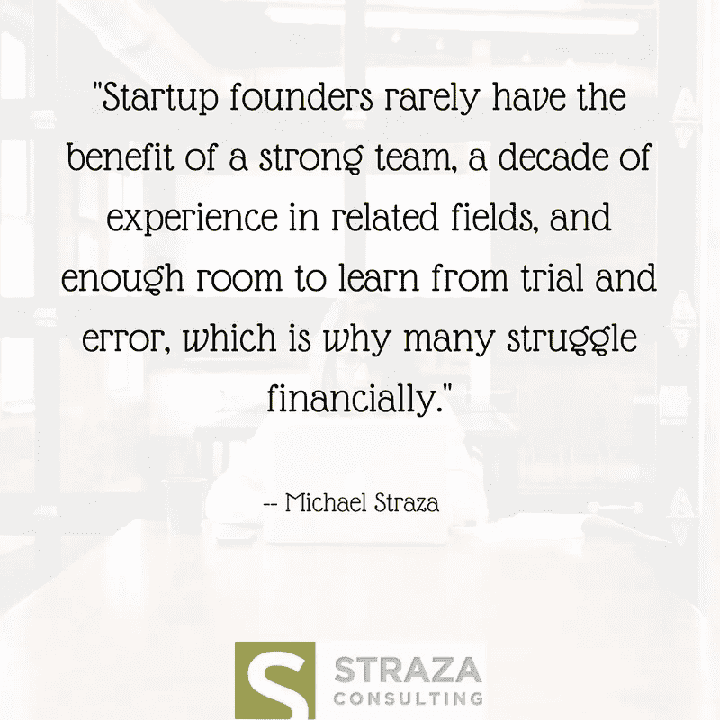

# 放火烧基金:大多数创业公司如何以及为什么浪费他们的第一轮投资

> 原文：<https://medium.com/swlh/setting-funds-on-fire-how-and-why-most-startups-waste-their-first-round-of-investment-88a7c15093cb>

[*这里先发表在*的请教 Straza 博客上](http://www.consultstraza.com/setting-funds-on-fire-how-and-why-most-startups-waste-their-first-round-of-investment/)

你还记得你第一次从父母手里接过 20 美元，或者在高中时从兼职工作中拿到第一份薪水吗？你很可能不知道，也可能不记得你把钱花在了什么地方。我不认为我假设你没有把它放入共同基金或者把它的一部分捐给慈善机构是在冒险。明智地使用金钱并不总是自然而然的，但对于创业公司的创始人来说是必要的。

在共同创办科技公司 [Zdi](http://zdiinc.net/) 之前，我做了十多年的分析师、项目经理和运营总监。我也被一个团队包围着，并被给予了实验和学习的空间——这就像一个金融实验室。创业公司的创始人很少有强大的团队，十年的相关领域经验，以及足够的空间从试错中学习，这就是为什么许多人在财务上挣扎。没有财务管理技能的创始人经常会看到第一轮投资付之一炬(不是字面意思)。

# 它是如何发生的

值得注意的是，没有一种产品、服务或资金雄厚、前景光明的初创企业会因为财务失误而失败。像创业公司一样，备受尊敬的大公司经常烧钱，犯巨大的错误——然而，大公司更容易恢复。凭借 48 亿美元的债务，网飞在 2017 年已经在新内容上花费了大约 60 亿美元。会有回报吗？对于像网飞这样规模的公司来说可能是这样，但是这种类型的赌博对于创业公司来说就不太可能了。

这里有一个例子，说明初创公司通常在第一轮投资中一无所获:

X 公司对基于产品的业务有一个奇妙的想法，他们对筹资感兴趣。有了一个年轻但坚实的团队来建造第一个原型，他们能够说服其他人这个想法值得投资，他们获得了几十万美元的投资。他们现在有了他们认为需要的资金来生产他们的产品，他们确信这将会受到未来客户的欢迎。什么会出错？

答案是一切——一切都可能出错。创业公司中有几个常见的错误是无法通过向他们投入额外的资金来避免的。没有一大笔钱可以克服以下灾难性的影响:

*   **糟糕的决策**

你总是会做出不成功的决定，但是理解并从错误的决定中学习对你和你的公司来说比一个好的或坏的决定更重要。

例如，你可能购买了一个软件或在线订阅，但在第一周之后就再也没有使用过，或者只是不适合你想用它来完成的任务。了解你的决策失败的原因将为你的公司节省时间和金钱，并让你的团队专注于重要的任务，而不是浪费时间去实现不会给你的创业公司带来价值的软件。

*   **缺乏规划或规划不当**

你对公司的计划将指导你的决策，无论是好是坏。如果没有计划，你就没有理由拒绝一个看似不错的交易或机会。例如，假设您刚刚获得了一个 40%的折扣，您的下一个 10，000 美元的 AdWords 广告。虽然这可能是一笔大交易，但如果你已经超出了这个月的营销预算，你应该通过。但是，如果你没有一个合适的营销计划，并且你是根据直觉或一笔交易有多好来做决定，你很可能会接受一笔“好交易”，直到后来才知道你在营销上超支了。

*   **一个不想要你创造的东西的市场**

如果没有一个市场愿意购买你卖的东西，惊人的想法和辉煌的发明仍然会失败。谷歌眼镜和赛格威只是数以百万计的产品中的两个例子，这些产品没有市场准备将其应用到日常生活中。如果你没有合适的产品/市场，你花在广告、营销和销售上的每一美元都可能是完全的浪费。确保你的产品或服务的目标客户是被强迫的，并准备向你购买。

*   **无法在正确的时间找到并招募到正确的帮手**

除非你的初创公司正在创造一个全新的市场，否则你就是在和有才华、有经验的公司争夺同样的客户。要想成功，你的初创公司必须有一个高效的团队，配备合适的员工、优秀的导师，并有能力在成长过程中发现和招募人才。一个糟糕的招聘对你的公司造成的损害不仅仅是浪费金钱——它会减缓或阻碍你的发展，而一个优秀的招聘可以加速你的发展，增加你整体成功的机会。

如果你想避免第一轮投资就告吹，就需要进行广泛的计划和执行，同时避免上面提到的常见错误和潜在障碍。

# 推荐阅读

这里有几篇我推荐阅读的文章，它们与筹集第一轮投资、预算以及如何避免常见陷阱有关。

*   [启动资金:我们如何花掉第一笔 25 万美元——旁注](https://slidebean.com/blog/startups/startup-funding-how-we-spent-250000)
*   [创业公司如何避免首轮融资危机——快速公司](https://www.fastcompany.com/3004817/how-startups-can-avoid-series-crunch)
*   [种子资金筹集指南——Y Combinator](https://blog.ycombinator.com/how-to-raise-a-seed-round/)
*   [用这 8 条建议避开种子资金激增陷阱——企业家](https://www.entrepreneur.com/article/243937)
*   [首次推介成功:风投希望你的初创企业推介什么——福布斯](https://www.forbes.com/sites/edwardzimmerman/2016/01/04/success-at-first-pitch-what-vcs-want-in-your-startups-pitch/#b68247f67b3f)

Michael Straza 热衷于帮助小企业繁荣发展。Straza 毕业于伊利诺伊州立大学商学院，主修经济学，是一名经验丰富的企业家、初创企业投资者和伊利诺伊州布鲁明顿/诺尔曼的企业管理专家。通过 [Twitter](https://twitter.com/consultstraza) 、 [LinkedIn](https://www.linkedin.com/in/michaelstraza/) 与迈克尔联系，并通过[Michael@ConsultStraza.com](mailto:Michael@ConsultStraza.com)发送电子邮件。

## 这个故事发表在 [The Startup](https://medium.com/swlh) 上，这是 Medium 最大的创业刊物，拥有 295，232+人关注。

## 在这里订阅接收[我们的头条新闻](http://growthsupply.com/the-startup-newsletter/)。

