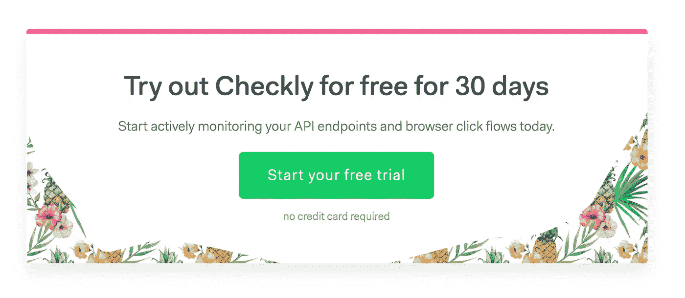

# 从 beta 版到 g a 版的独立创业经历了七个明显的阶段

> 原文：<https://medium.com/swlh/seven-discernible-stages-in-taking-a-solo-startup-from-beta-to-ga-c48baebc8929>

“Crossing the River Styx” by Joachim Patinir (circa 1480–1524) — Museo Nacional del Prado. Licensed under Public Domain via Wikimedia Commons

上周,“测试版”标签正式从 Checkly 上移除🍾🎉！在[发布私人测试版](https://hackernoon.com/things-i-learned-from-my-saas-projects-private-beta-period-cd69a11d9e58)和敲定所有功能并撕掉 nav.navbar 的测试版通知之间的这段时间里，我遇到了许多事情。在这篇文章中，我试图将这些学习整理成某种逻辑顺序，因为它们就像铁环一样倒下，我必须跳过才能到达下一个铁环。

> *注意:不要把这些当成真理。每个情况都不一样。保持批判。*

# 1.接受带条纹的付款

一旦你要钱，它就变成真的了。如果你没有办法得到钱，它永远不会成为现实。不用动脑筋，但这就是开始。而“是的”，你可以在测试版里要一个产品的钱。我做了，人们付了钱。

实际上，在我积极引导用户使用付费计划之前的几个月，我添加了一个定价页面和一种付费方式。Stripe get 因其开发人员友好性而受到好评，但集成比我预期的更麻烦。

1.  只有在用户注册订阅后**才能享受折扣。从客户的角度来看，这很奇怪。此外，他们的小工具没有优惠券输入框。**
2.  Stripe 将计费作为一个独立的产品引入，将订阅合并到其中，并将每个人都放在一些奇怪的启动计划中。没人懂。首席执行官不得不跳进黑客新闻线程。
3.  没有真正的业务指标，因为没有。现在，我了解了 Chargebee、Chargify、Baremetrics 等服务的市场。

就这一点而言，Stripe 测试沙箱非常棒。

# 2.获得启动客户

一旦我有了收钱的手段，我就以免费 x 个月的形式给一些早期用户提供折扣。基本原理是没有现金支出，而且最低限度的基础设施已经在运行:不妨使用它。我强迫自己坚持的三条规则:

1.  不要提供给每个人，也不要直接提供给球棒。应该不是首要驱动。
2.  新顾客必须用有效的信用卡与**签约。折扣在之后应用。**
3.  作为折扣的交换，客户同意我在登录页面上使用一份**证明**。

我为在一次拙劣的 UI 更新中完全破坏了支付流程而感到羞耻。对一位早期顾客的赞美，他优雅地等待了几个小时，没有逃离现场！😅

# 3.“但是他们有那个”兔子洞

很快，早期用户开始比较各种服务的功能和价格。从免费到价格翻四倍。从非常基础到超级高级。

现在，Checkly 仍然处于测试阶段，有些部分甚至可能是 alpha 版本，因此有一些空间来扩展功能或向现有功能添加选项。我添加了每周状态邮件、SSL 证书到期监控和短信提醒，部分是基于早期用户所做的这些比较。

在这样的早期阶段，这种清单心态有时很难平衡，但我告诉自己，如果去掉一个简单的异议，增加一个新的发布客户，并且该功能符合值得追求的产品策略。

# 4.“多一个功能”陷阱

这个“但他们有那个”兔子洞整整齐齐地把 segs 拖入了“多一个功能”的陷阱，尽管它们略有不同。一个是外部的，来自指向其他服务的用户，而另一个是内部的，主要来自我对价格和功能平衡的论证。

“多一个功能”陷阱是创业行业一个非常有名的比喻，所以我对此有所准备。事实证明我准备得不够充分，因为我添加了一些主要的新东西，如[双重检查](https://checklyhq.com/docs/alerting/settings/#double-checking)、[触发](https://checklyhq.com/docs/browser-checks/triggers/)和[团队](https://checklyhq.com/docs/teams/)。抱歉，这次完全失败了。

# 5.购买与构建的困境

如果你开始创作 SaaS，那么你的下一个爱好将是收集其他 SaaS 作品。托管、电子邮件、支付、数据库等等。这是我现在支付的金额，直接来自信用卡账单:

1.  Heroku ~$75。完全值得。
2.  **Github**【7 美元用于私人回购。我太习惯 Github 的流程了，以至于我懒得去 Gitlab 或 Bitbucker 进行免费的私人回购。
3.  **7 美元用于私人回购。这就行了。我试过的所有其他产品要么更贵，要么更笨重。**
4.  **谷歌 Gsuite** 邮件和其他工具 5 美元。
5.  **Solarwinds** $7 用于图形&监控。
6.  亚马逊网络服务。由于 [AWS 激活计划](https://aws.amazon.com/activate/)的 1000 美元信用。这种情况将会改变，并在未来成为更重要的成本中心。

我排除了那些我仍在免费计划中或没有付费等级的服务，如 Twitter、Trello、Mailchimp、Google Analytics、Hotjar 和 Heap(T21)。这些我都用，有些是每天用，有些是两周用。

现在，我可能已经用*仅仅*一些 EC2 实例和大约 8 年扎实的工程时间构建了这些服务所提供的一些相当蹩脚的版本。我真傻，我选择不要！

# 6.获得注意力分散

什么😱！！是的，我花了一些时间与一家大型科技公司的友好人士会面，讨论收购我和 Checkly 的可能性。这是另一个帖子的足够材料，足以说我们最终没有达成协议，并在良好的条件下分道扬镳。而且，这并没有让我偏离太多。以后再说。

# 7.80/20-工程师/销售部门。

beta 期间，我大致把时间分成 80%工程，20%营销和销售。现在我把它翻过来。我将花 80%的时间发邮件、发微博、写博客、打电话和与用户交谈，以获得更多的新客户。

请注意，上面列出的支出和每月成本不包括任何营销费用。这并不完全公平，因为我花了大约 250 美元在 Twitter 和 Betalist 上获得 beta 用户，我在这里写了关于 T2 的文章

然而，我可能会推迟任何严肃的付费营销，直到通过我的网络和有机的非付费流量获得一定数量的客户。在这一早期阶段，没有真正的替代品可以替代过度劳累。

【checklyhq.com】最初发表于**。**

*附:如果你喜欢这篇文章，请用**鼓掌**来表达你的欣赏👏下面还有 [**在 Twitter 上关注我**](https://twitter.com/tim_nolet) **！**但是等等，还有更多！*

****

## *这篇文章发表在 [The Startup](https://medium.com/swlh) 上，这是 Medium 最大的创业刊物，拥有 358，974+读者。*

## *在这里订阅接收[我们的头条新闻](http://growthsupply.com/the-startup-newsletter/)。*

**